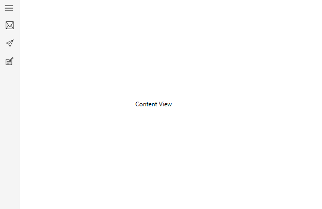

# Different Display Modes in WPF Navigation Drawer (SfNavigationDrawer)

The WPF Navigation Drawer provides default, compact, and expanded [display modes](https://help.syncfusion.com/cr/wpf/Syncfusion.UI.Xaml.NavigationDrawer.SfNavigationDrawer.html#Syncfusion_UI_Xaml_NavigationDrawer_SfNavigationDrawer_DisplayMode) to create a navigation menu for applications. Compact and expanded display modes support the population of the navigation menu using built-in items with various types.

See also [different item types](https://help.syncfusion.com/wpf/navigation-drawer/populating-data#different-item-types) in Navigation Drawer.

## Compact Display Mode

The navigation sidebar is shown as a narrow bar with width set by the [CompactModeWidth](https://help.syncfusion.com/cr/wpf/Syncfusion.UI.Xaml.NavigationDrawer.SfNavigationDrawer.html#Syncfusion_UI_Xaml_NavigationDrawer_SfNavigationDrawer_CompactModeWidth) property. The navigation menu expands on clicking the built-in toggle button and appears as an overlay above the main content to the width set by the [ExpandedModeWidth](https://help.syncfusion.com/cr/wpf/Syncfusion.UI.Xaml.NavigationDrawer.SfNavigationDrawer.html#Syncfusion_UI_Xaml_NavigationDrawer_SfNavigationDrawer_ExpandedModeWidth) property.

> **Note:** The navigation menu will toggle back to compact width when any interaction is performed on the main content area.




<syncfusion:SfNavigationDrawer x:Name="navigationDrawer" DisplayMode="Compact">
        <syncfusion:NavigationItem Header="Inbox">
            <syncfusion:NavigationItem.Icon>
                <Path Data="M32.032381, 16.445429 L25.410999,... />
            </syncfusion:NavigationItem.Icon>
        </syncfusion:NavigationItem>
        <syncfusion:NavigationItem Header="Sent mail">
            <syncfusion:NavigationItem.Icon>
                <Path Data="M42.128046,6.7269681 L18.53705,...../>
            </syncfusion:NavigationItem.Icon>
        </syncfusion:NavigationItem>
        <syncfusion:NavigationItem Header="Drafts">
            <syncfusion:NavigationItem.Icon>
                <Path Data="M6.9999996,48.353 L19,...../>
            </syncfusion:NavigationItem.Icon>
        </syncfusion:NavigationItem>
        <syncfusion:SfNavigationDrawer.ContentView>
            <Label
                Content="Content View" .../>
        </syncfusion:SfNavigationDrawer.ContentView>
    </syncfusion:SfNavigationDrawer>





            SfNavigationDrawer navigationDrawer = new SfNavigationDrawer();
            navigationDrawer.DisplayMode = DisplayMode.Compact;
            navigationDrawer.Items.Add(new NavigationItem()
            {
                Header = "Inbox",
                Icon = new Path()
                {
                    Data = Geometry.Parse("M32.032381, 16.445429 L25.410999,.....), 
                    .....
                }            
            });
            navigationDrawer.Items.Add(new NavigationItem()
            {
                Header = "Sent mail",
                Icon = new Path()
                {
                    Data = Geometry.Parse("M42.128046,6.7269681 L18.53705,......),
                    ........
                }
            });
            navigationDrawer.Items.Add(new NavigationItem()
            {
                Header = "Drafts",
                Icon = new Path()
                {
                    Data = Geometry.Parse("M6.9999996,48.353 L19,.......),
                    .....
                }
            });
            Label label = new Label();
            label.Content = "Content View";
            label.HorizontalAlignment = HorizontalAlignment.Center;
            label.VerticalAlignment = VerticalAlignment.Center;
            label.Height = 30;
            label.Width = 150;
            navigationDrawer.ContentView = label;
            this.Content = navigationDrawer;





## Expanded Display Mode

The navigation sidebar stays open to the left or right of the window, based on the [Position](https://help.syncfusion.com/cr/wpf/Syncfusion.UI.Xaml.NavigationDrawer.SfNavigationDrawer.html#Syncfusion_UI_Xaml_NavigationDrawer_SfNavigationDrawer_Position) property, and pushes the main content alongside. The width of the drawer is defined by the [ExpandedModeWidth](https://help.syncfusion.com/cr/wpf/Syncfusion.UI.Xaml.NavigationDrawer.SfNavigationDrawer.html#Syncfusion_UI_Xaml_NavigationDrawer_SfNavigationDrawer_ExpandedModeWidth) property.

When toggled using the built-in toggle button, the drawer menu collapses and displays as a narrow bar with width set by the [CompactModeWidth](https://help.syncfusion.com/cr/wpf/Syncfusion.UI.Xaml.NavigationDrawer.SfNavigationDrawer.html#Syncfusion_UI_Xaml_NavigationDrawer_SfNavigationDrawer_CompactModeWidth) property.




    <syncfusion:SfNavigationDrawer x:Name="navigationDrawer" DisplayMode="Expanded">
        <syncfusion:NavigationItem Header="Inbox">
            <syncfusion:NavigationItem.Icon>
                <Path Data="M32.032381, 16.445429 L25.410999,..../>
            </syncfusion:NavigationItem.Icon>
        </syncfusion:NavigationItem>
        <syncfusion:NavigationItem Header="Sent mail">
            <syncfusion:NavigationItem.Icon>
                <Path Data="M42.128046,6.7269681 L18.53705,.../>
            </syncfusion:NavigationItem.Icon>
        </syncfusion:NavigationItem>
        <syncfusion:NavigationItem Header="Drafts">
            <syncfusion:NavigationItem.Icon>
                <Path Data="M6.9999996,48.353 L19,...../>
            </syncfusion:NavigationItem.Icon>
        </syncfusion:NavigationItem>
        <syncfusion:SfNavigationDrawer.ContentView>
            <Label
                Content="Content View" ....../>
        </syncfusion:SfNavigationDrawer.ContentView>
    </syncfusion:SfNavigationDrawer>





            SfNavigationDrawer navigationDrawer = new SfNavigationDrawer();
            navigationDrawer.DisplayMode = DisplayMode.Expanded;
            navigationDrawer.Items.Add(new NavigationItem()
            {
                Header = "Inbox",
                Icon = new Path()
                {
                    Data = Geometry.Parse("M32.032381, 16.445429 L25.410999,.........),
                    ..............
                }            
            });
            navigationDrawer.Items.Add(new NavigationItem()
            {
                Header = "Sent mail",
                Icon = new Path()
                {
                    Data = Geometry.Parse("M42.128046,6.7269681 L18.53705,..........),
                    ..........
                }
            });
            navigationDrawer.Items.Add(new NavigationItem()
            {
                Header = "Drafts",
                Icon = new Path()
                {
                    Data = Geometry.Parse("M6.9999996,48.353 L19,48.353 19,..........),
                    ...............
                }
            });
            Label label = new Label();
            label.Content = "Content View";
            label.HorizontalAlignment = HorizontalAlignment.Center;
            label.VerticalAlignment = VerticalAlignment.Center;
            label.Height = 30;
            label.Width = 150;
            navigationDrawer.ContentView = label;
            this.Content = navigationDrawer;





## Auto Display Mode Change

The Navigation Drawer automatically changes its display mode according to the size of the application window. This behavior is controlled by setting the [AutoChangeDisplayMode](https://help.syncfusion.com/cr/wpf/Syncfusion.UI.Xaml.NavigationDrawer.SfNavigationDrawer.html#Syncfusion_UI_Xaml_NavigationDrawer_SfNavigationDrawer_AutoChangeDisplayMode) property to `True`, and is based on the values set for the [ExpandedModeThresholdWidth](https://help.syncfusion.com/cr/wpf/Syncfusion.UI.Xaml.NavigationDrawer.SfNavigationDrawer.html#Syncfusion_UI_Xaml_NavigationDrawer_SfNavigationDrawer_ExpandedModeThresholdWidth) property.

The display mode switches to compact when the application window size is less than `ExpandedModeThresholdWidth`, and switches to expanded mode when the window size exceeds this threshold.



<syncfusion:SfNavigationDrawer x:Name="navigationDrawer" DisplayMode="Expanded" AutoChangeDisplayMode="True" ExpandedModeThresholdWidth="600">
        <syncfusion:NavigationItem Header="Inbox">
            <syncfusion:NavigationItem.Icon>
                <Path
                    Data="M32.032381, 16.445429 L25.410999,...... />
            </syncfusion:NavigationItem.Icon>
        </syncfusion:NavigationItem>
        <syncfusion:NavigationItem Header="Sent mail">
            <syncfusion:NavigationItem.Icon>
                <Path
                    Data="M42.128046,6.7269681 L18.53705,.../>
            </syncfusion:NavigationItem.Icon>
        </syncfusion:NavigationItem>
        <syncfusion:NavigationItem Header="Drafts">
            <syncfusion:NavigationItem.Icon>
                <Path Data="M6.9999996,48.353 L19,.../>
            </syncfusion:NavigationItem.Icon>
        </syncfusion:NavigationItem>
        <syncfusion:SfNavigationDrawer.ContentView>
            <Label
                Content="Content View" ....../>
        </syncfusion:SfNavigationDrawer.ContentView>
    </syncfusion:SfNavigationDrawer>





            SfNavigationDrawer navigationDrawer = new SfNavigationDrawer();
            navigationDrawer.DisplayMode = DisplayMode.Expanded;
            navigationDrawer.AutoChangeDisplayMode = true;
            navigationDrawer.ExpandedModeThresholdWidth = 600;
            navigationDrawer.Items.Add(new NavigationItem()
            {
                Header = "Inbox",
                Icon = new Path()
                {
                    Data = Geometry.Parse("M32.032381, 16.445429 L25.410999,.....),
                    .............
                }            
            });
            navigationDrawer.Items.Add(new NavigationItem()
            {
                Header = "Sent mail",
                Icon = new Path()
                {
                    Data = Geometry.Parse("M42.128046,6.7269681 L18.53705,....),
                    .....
                }
            });
            navigationDrawer.Items.Add(new NavigationItem()
            {
                Header = "Drafts",
                Icon = new Path()
                {
                    Data = Geometry.Parse("M6.9999996,48.353 L19,......),
                    ........
                }
            });
            Label label = new Label();
            label.Content = "Content View";
            label.HorizontalAlignment = HorizontalAlignment.Center;
            label.VerticalAlignment = VerticalAlignment.Center;
            label.Height = 30;
            label.Width = 150;
            navigationDrawer.ContentView = label;
            this.Content = navigationDrawer;





> **Note:** View [sample](https://github.com/SyncfusionExamples/wpf-sfnavigationdrawer-samples/tree/main/Display_Mode) in GitHub.

## Collapsible Drawer Mode

A collapsible drawer can be achieved by setting the display mode to [Default mode](https://help.syncfusion.com/cr/wpf/Syncfusion.UI.Xaml.NavigationDrawer.DisplayMode.html). In this display mode, the drawer menu is populated using [custom views](https://help.syncfusion.com/wpf/navigation-drawer/custom-views).

See also the [Custom Views](https://help.syncfusion.com/wpf/navigation-drawer/custom-views) topic in Navigation Drawer.




	<Window x:Class="NavigationDrawerWPF.MainWindow"
        xmlns="http://schemas.microsoft.com/winfx/2006/xaml/presentation"
        xmlns:x="http://schemas.microsoft.com/winfx/2006/xaml"
        xmlns:d="http://schemas.microsoft.com/expression/blend/2008"
        xmlns:mc="http://schemas.openxmlformats.org/markup-compatibility/2006"
        xmlns:syncfusion="http://schemas.syncfusion.com/wpf"
        xmlns:local="clr-namespace:NavigationDrawerWPF"
        mc:Ignorable="d"
        Title="MainWindow" Height="450" Width="800">
    <Window.DataContext>
        <local:ViewModel/>
    </Window.DataContext>
    <syncfusion:SfNavigationDrawer x:Name="navigationDrawer" DrawerWidth="300">
        <syncfusion:SfNavigationDrawer.ContentView>
            <Grid x:Name="mainContentView" 
                  Background="White">
                <Grid.RowDefinitions>
                    <RowDefinition Height="auto"/>
                    <RowDefinition/>
                </Grid.RowDefinitions>
                <StackPanel Background="#1aa1d6" 
                            Orientation="Horizontal">
                    <Button x:Name="hamburgerButton" 
                            Height="50" Width="50" 
                            HorizontalAlignment="Left"  
                            Click="HamburgerButton_Click">
                        <Image Source="hamburger_icon.png" 
                               Height="20" 
                               Width="20" />
                    </Button>
                    <Label x:Name="headerLabel" 
                           Height="50" 
                           Content="Home" 
                           Background="#1aa1d6"/>
                </StackPanel>
                <Label Grid.Row="1" 
                       x:Name="contentLabel" 
                       Content="Content View" 
                       Foreground="Black"/>
            </Grid>
        </syncfusion:SfNavigationDrawer.ContentView>
        <syncfusion:SfNavigationDrawer.DrawerHeaderView>
            <Grid Background="#31ade9">
                <Label Content="Header View" />
            </Grid>
        </syncfusion:SfNavigationDrawer.DrawerHeaderView>
        <syncfusion:SfNavigationDrawer.DrawerContentView>
            <Grid>
                <ListBox x:Name="list" 
                         ItemsSource="{Binding Contents}">
                    <ListBox.ItemTemplate>
                        <DataTemplate>
                            <TextBlock  Text="{Binding Name}" 
                                        Foreground="Black"/>
                        </DataTemplate>
                    </ListBox.ItemTemplate>
                </ListBox>
            </Grid>
        </syncfusion:SfNavigationDrawer.DrawerContentView>
        <syncfusion:SfNavigationDrawer.DrawerFooterView>
            <Grid Background="#31ade9">
                <Label Content="Footer View" />
            </Grid>
        </syncfusion:SfNavigationDrawer.DrawerFooterView>
    </syncfusion:SfNavigationDrawer>
</Window>
    




using System.Collections.Generic;
using System.Windows;

namespace NavigationDrawerWPF
{
    public partial class MainWindow : Window
    {
        public MainWindow()
        {
            InitializeComponent();
        }

        private void HamburgerButton_Click(object sender, RoutedEventArgs e)
        {
            navigationDrawer.ToggleDrawer();
        }
    }

    public class ViewModel
    {
        public ViewModel()
        {
            Contents = new List<Model>();

            Contents.Add(new Model() { Name = "Home" });
            Contents.Add(new Model() { Name = "Profile" });
            Contents.Add(new Model() { Name = "Inbox" });
            Contents.Add(new Model() { Name = "Outbox" });
            Contents.Add(new Model() { Name = "Sent" });
            Contents.Add(new Model() { Name = "Trash" });
            Contents.Add(new Model() { Name = "Sign Out" });
        }

        public List<Model> Contents { get; set; }
    }

    public class Model
    {
        public string Name { get; set; }
    }
}




