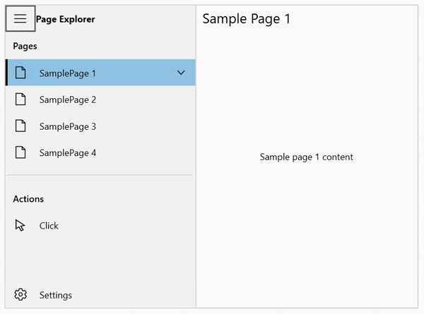

#  Keyboard Support in WPF NavigationDrawer (SfNavigationDrawer)

This section describes the keyboard support in SfNavigationDrawer.

* **Tab** - When pressing the tab key, Navigation will be started from the toggle button in the drawer.   
* **Up** - This key is used to Navigate to the previous NavigationItem.
* **Down** - This key is used to Navigate to the next NavigationItem. 
* **Enter** - This key is used to select the currently focused item.
* **Space** - This key is also used to select the currently focused item.

