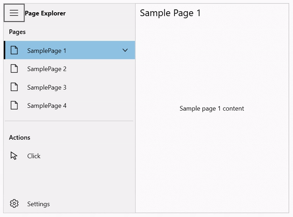

---
layout: post
title: Keyboard Support in WPF Navigation Drawer | Syncfusion®
description: Navigate, focus, and select navigation items efficiently using built-in keyboard shortcuts and accessibility support.
platform: wpf
control: Navigation Drawer
documentation: ug
---

#  Keyboard Support in WPF Navigation Drawer (SfNavigationDrawer)

This section describes the keyboard support in SfNavigationDrawer.

* **Tab** - This key can be used to navigate between the toggle button, navigation items and footer items and the main content view.   
* **Up** - This key is used to Navigate to the previous NavigationItem.
* **Down** - This key is used to Navigate to the next NavigationItem. 
* **Enter and Space** - This key is used to select the currently focused item.

N> View [sample](https://github.com/SyncfusionExamples/wpf-sfnavigationdrawer-samples/tree/main/KeyboardSupportSample) in GitHub