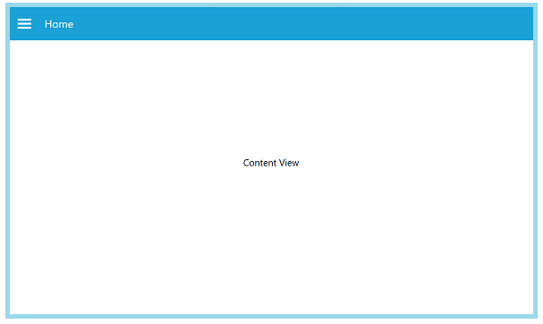

# Main Content

## Adding content view to the NavigationDrawer

The ContentView is the main view of the NavigationDrawer where the desired items can be placed.





	<Window x:Class="NavigationDrawerWPF.MainWindow"
        xmlns="http://schemas.microsoft.com/winfx/2006/xaml/presentation"
        xmlns:x="http://schemas.microsoft.com/winfx/2006/xaml"
        xmlns:d="http://schemas.microsoft.com/expression/blend/2008"
        xmlns:mc="http://schemas.openxmlformats.org/markup-compatibility/2006"
        xmlns:syncfusion="http://schemas.syncfusion.com/wpf"
        xmlns:local="clr-namespace:NavigationDrawerWPF"
        mc:Ignorable="d"
        Title="MainWindow" Height="450" Width="800">
    <syncfusion:SfNavigationDrawer x:Name="navigationDrawer">
        <syncfusion:SfNavigationDrawer.ContentView>
            <Grid x:Name="mainContentView" 
                  Background="White">
                <Grid.RowDefinitions>
                    <RowDefinition Height="auto"/>
                    <RowDefinition/>
                </Grid.RowDefinitions>
                <StackPanel Background="#1aa1d6" 
                            Orientation="Horizontal">
                    <Button x:Name="hamburgerButton" 
                            BorderBrush="Transparent" 
                            Height="50" Width="50" 
                            HorizontalAlignment="Left"  
                            FontSize="16" 
                            Background="#1aa1d6" 
                            Foreground="White" 
                            Click="HamburgerButton_Click">
                        <Image Source="hamburger_icon.png" 
                               Height="20" 
                               Width="20" 
                               HorizontalAlignment="Center" 
                               VerticalAlignment="Center"/>
                    </Button>
                    <Label x:Name="headerLabel" 
                           Height="50" 
                           HorizontalContentAlignment="Center" 
                           VerticalContentAlignment="Center" 
                           Content="Home" 
                           FontSize="16" 
                           Foreground="White" 
                           Background="#1aa1d6"/>
                </StackPanel>
                <Label Grid.Row="1" 
                       x:Name="contentLabel" 
                       VerticalContentAlignment="Center" 
                       HorizontalContentAlignment="Center" 
                       Content="Content View" 
                       FontSize="14" Foreground="Black"/>
            </Grid>
        </syncfusion:SfNavigationDrawer.ContentView>
    </syncfusion:SfNavigationDrawer>
</Window>





  

                   

