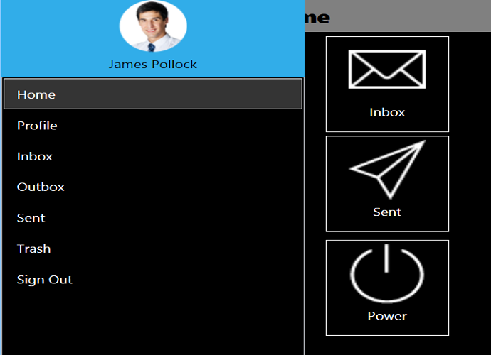
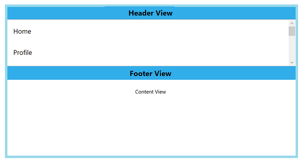
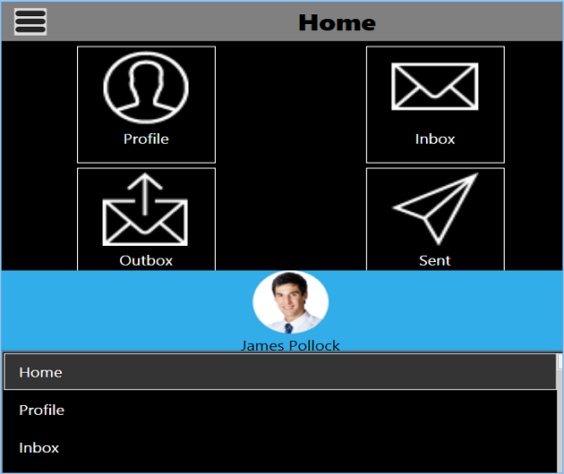

# Navigation Pane Sides

The supplemental pane can be drawn in and out from all the four sides. The `Position` property is used to change the side of pane and the values are:

* Left
* Right
* Top
* Bottom

The default position is Left.  





<Window x:Class="NavigationDrawerWPF.MainWindow"
        xmlns="http://schemas.microsoft.com/winfx/2006/xaml/presentation"
        xmlns:x="http://schemas.microsoft.com/winfx/2006/xaml"
        xmlns:d="http://schemas.microsoft.com/expression/blend/2008"
        xmlns:mc="http://schemas.openxmlformats.org/markup-compatibility/2006"
        xmlns:syncfusion="http://schemas.syncfusion.com/wpf"
        xmlns:local="clr-namespace:NavigationDrawerWPF"
        mc:Ignorable="d"
        Title="MainWindow" Height="450" Width="800">
    <Window.DataContext>
        <local:ViewModel/>
    </Window.DataContext>
    <syncfusion:SfNavigationDrawer x:Name="navigationDrawer" 
                                   DrawerWidth="300"
                                   Position="Left">
        <syncfusion:SfNavigationDrawer.ContentView>
            <Grid x:Name="mainContentView" 
                  Background="White">
                <Grid.RowDefinitions>
                    <RowDefinition Height="auto"/>
                    <RowDefinition/>
                </Grid.RowDefinitions>
                <StackPanel Background="#1aa1d6" 
                            Orientation="Horizontal">
                    <Button x:Name="hamburgerButton" 
                            BorderBrush="Transparent" 
                            Height="50" Width="50" 
                            HorizontalAlignment="Left"  
                            FontSize="16" 
                            Background="#1aa1d6" Foreground="White" 
                            Click="HamburgerButton_Click">
                        <Image Source="hamburger_icon.png" 
                               Height="20" 
                               Width="20" 
                               HorizontalAlignment="Center" 
                               VerticalAlignment="Center"/>
                    </Button>
                    <Label x:Name="headerLabel" 
                           Height="50" 
                           HorizontalContentAlignment="Center" 
                           VerticalContentAlignment="Center" 
                           Content="Home" 
                           FontSize="16" 
                           Foreground="White" 
                           Background="#1aa1d6"/>
                </StackPanel>
                <Label Grid.Row="1" 
                       x:Name="contentLabel" 
                       VerticalContentAlignment="Center" 
                       HorizontalContentAlignment="Center" 
                       Content="Content View" 
                       FontSize="14" Foreground="Black"/>
            </Grid>
        </syncfusion:SfNavigationDrawer.ContentView>
        <syncfusion:SfNavigationDrawer.DrawerHeaderView>
            <Grid Background="#31ade9">
                <Label Content="Header View" 
                       FontSize="20" 
                       FontWeight="Bold" 
                       HorizontalContentAlignment="Center" 
                       VerticalContentAlignment="Center"/>
            </Grid>
        </syncfusion:SfNavigationDrawer.DrawerHeaderView>
        <syncfusion:SfNavigationDrawer.DrawerContentView>
            <Grid>
                <ListBox x:Name="list" 
                         ItemsSource="{Binding Contents}">
                    <ListBox.ItemTemplate>
                        <DataTemplate>
                            <TextBlock  Text="{Binding Name}" 
                                        Padding="15" 
                                        TextAlignment="Center" 
                                        FontSize="18" 
                                        Foreground="Black"/>
                        </DataTemplate>
                    </ListBox.ItemTemplate>
                </ListBox>
            </Grid>
        </syncfusion:SfNavigationDrawer.DrawerContentView>
        <syncfusion:SfNavigationDrawer.DrawerFooterView>
            <Grid Background="#31ade9">
                <Label Content="Footer View" 
                       FontSize="20" 
                       FontWeight="Bold" 
                       HorizontalContentAlignment="Center" 
                       VerticalContentAlignment="Center"/>
            </Grid>
        </syncfusion:SfNavigationDrawer.DrawerFooterView>
    </syncfusion:SfNavigationDrawer>
</Window>





using System.Collections.Generic;
using System.Windows;

namespace NavigationDrawerWPF
{
    /// 

    /// Interaction logic for MainWindow.xaml
    /// 

    public partial class MainWindow : Window
    {
        public MainWindow()
        {
            InitializeComponent();
            navigationDrawer.Position = Syncfusion.UI.Xaml.NavigationDrawer.Position.Left;
        }

        private void HamburgerButton_Click(object sender, RoutedEventArgs e)
        {
            navigationDrawer.ToggleDrawer();
        }
    }

    public class ViewModel
    {
        public ViewModel()
        {
            Contents = new List<Model>();

            Contents.Add(new Model() { Name = "Home" });
            Contents.Add(new Model() { Name = "Profile" });
            Contents.Add(new Model() { Name = "Inbox" });
            Contents.Add(new Model() { Name = "Outbox" });
            Contents.Add(new Model() { Name = "Sent" });
            Contents.Add(new Model() { Name = "Trash" });
            Contents.Add(new Model() { Name = "Sign Out" });
        }

        public List<Model> Contents { get; set; }
    }

    public class Model
    {
        public string Name { get; set; }
    }
}





                                            

The following code example shows how to set the SfNavigationDrawer to the right.  




<Window x:Class="NavigationDrawerWPF.MainWindow"
        xmlns="http://schemas.microsoft.com/winfx/2006/xaml/presentation"
        xmlns:x="http://schemas.microsoft.com/winfx/2006/xaml"
        xmlns:d="http://schemas.microsoft.com/expression/blend/2008"
        xmlns:mc="http://schemas.openxmlformats.org/markup-compatibility/2006"
        xmlns:syncfusion="http://schemas.syncfusion.com/wpf"
        xmlns:local="clr-namespace:NavigationDrawerWPF"
        mc:Ignorable="d"
        Title="MainWindow" Height="450" Width="800">
    <Window.DataContext>
        <local:ViewModel/>
    </Window.DataContext>
    <syncfusion:SfNavigationDrawer x:Name="navigationDrawer" 
                                   DrawerWidth="300"
                                   Position="Right">
        <syncfusion:SfNavigationDrawer.ContentView>
            <Grid x:Name="mainContentView" 
                  Background="White">
                <Grid.RowDefinitions>
                    <RowDefinition Height="auto"/>
                    <RowDefinition/>
                </Grid.RowDefinitions>
                <StackPanel Background="#1aa1d6" 
                            Orientation="Horizontal">
                    <Button x:Name="hamburgerButton" 
                            BorderBrush="Transparent" 
                            Height="50" Width="50" 
                            HorizontalAlignment="Left"  
                            FontSize="16" 
                            Background="#1aa1d6" Foreground="White" 
                            Click="HamburgerButton_Click">
                        <Image Source="hamburger_icon.png" 
                               Height="20" 
                               Width="20" 
                               HorizontalAlignment="Center" 
                               VerticalAlignment="Center"/>
                    </Button>
                    <Label x:Name="headerLabel" 
                           Height="50" 
                           HorizontalContentAlignment="Center" 
                           VerticalContentAlignment="Center" 
                           Content="Home" 
                           FontSize="16" 
                           Foreground="White" 
                           Background="#1aa1d6"/>
                </StackPanel>
                <Label Grid.Row="1" 
                       x:Name="contentLabel" 
                       VerticalContentAlignment="Center" 
                       HorizontalContentAlignment="Center" 
                       Content="Content View" 
                       FontSize="14" Foreground="Black"/>
            </Grid>
        </syncfusion:SfNavigationDrawer.ContentView>
        <syncfusion:SfNavigationDrawer.DrawerHeaderView>
            <Grid Background="#31ade9">
                <Label Content="Header View" 
                       FontSize="20" 
                       FontWeight="Bold" 
                       HorizontalContentAlignment="Center" 
                       VerticalContentAlignment="Center"/>
            </Grid>
        </syncfusion:SfNavigationDrawer.DrawerHeaderView>
        <syncfusion:SfNavigationDrawer.DrawerContentView>
            <Grid>
                <ListBox x:Name="list" 
                         ItemsSource="{Binding Contents}">
                    <ListBox.ItemTemplate>
                        <DataTemplate>
                            <TextBlock  Text="{Binding Name}" 
                                        Padding="15" 
                                        TextAlignment="Center" 
                                        FontSize="18" 
                                        Foreground="Black"/>
                        </DataTemplate>
                    </ListBox.ItemTemplate>
                </ListBox>
            </Grid>
        </syncfusion:SfNavigationDrawer.DrawerContentView>
        <syncfusion:SfNavigationDrawer.DrawerFooterView>
            <Grid Background="#31ade9">
                <Label Content="Footer View" 
                       FontSize="20" 
                       FontWeight="Bold" 
                       HorizontalContentAlignment="Center" 
                       VerticalContentAlignment="Center"/>
            </Grid>
        </syncfusion:SfNavigationDrawer.DrawerFooterView>
    </syncfusion:SfNavigationDrawer>
</Window>





using System.Collections.Generic;
using System.Windows;

namespace NavigationDrawerWPF
{
    /// 

    /// Interaction logic for MainWindow.xaml
    /// 

    public partial class MainWindow : Window
    {
        public MainWindow()
        {
            InitializeComponent();
            navigationDrawer.Position = Syncfusion.UI.Xaml.NavigationDrawer.Position.Right;
        }

        private void HamburgerButton_Click(object sender, RoutedEventArgs e)
        {
            navigationDrawer.ToggleDrawer();
        }
    }

    public class ViewModel
    {
        public ViewModel()
        {
            Contents = new List<Model>();

            Contents.Add(new Model() { Name = "Home" });
            Contents.Add(new Model() { Name = "Profile" });
            Contents.Add(new Model() { Name = "Inbox" });
            Contents.Add(new Model() { Name = "Outbox" });
            Contents.Add(new Model() { Name = "Sent" });
            Contents.Add(new Model() { Name = "Trash" });
            Contents.Add(new Model() { Name = "Sign Out" });
        }

        public List<Model> Contents { get; set; }
    }

    public class Model
    {
        public string Name { get; set; }
    }
}





The following code example shows how to set the SfNavigationDrawer at the top.  




<Window x:Class="NavigationDrawerWPF.MainWindow"
        xmlns="http://schemas.microsoft.com/winfx/2006/xaml/presentation"
        xmlns:x="http://schemas.microsoft.com/winfx/2006/xaml"
        xmlns:d="http://schemas.microsoft.com/expression/blend/2008"
        xmlns:mc="http://schemas.openxmlformats.org/markup-compatibility/2006"
        xmlns:syncfusion="http://schemas.syncfusion.com/wpf"
        xmlns:local="clr-namespace:NavigationDrawerWPF"
        mc:Ignorable="d"
        Title="MainWindow" Height="450" Width="800">
    <Window.DataContext>
        <local:ViewModel/>
    </Window.DataContext>
    <syncfusion:SfNavigationDrawer x:Name="navigationDrawer" 
                                   DrawerHeight="200"
                                   Position="Top">
        <syncfusion:SfNavigationDrawer.ContentView>
            <Grid x:Name="mainContentView" 
                  Background="White">
                <Grid.RowDefinitions>
                    <RowDefinition Height="auto"/>
                    <RowDefinition/>
                </Grid.RowDefinitions>
                <StackPanel Background="#1aa1d6" 
                            Orientation="Horizontal">
                    <Button x:Name="hamburgerButton" 
                            BorderBrush="Transparent" 
                            Height="50" Width="50" 
                            HorizontalAlignment="Left"  
                            FontSize="16" 
                            Background="#1aa1d6" Foreground="White" 
                            Click="HamburgerButton_Click">
                        <Image Source="hamburger_icon.png" 
                               Height="20" 
                               Width="20" 
                               HorizontalAlignment="Center" 
                               VerticalAlignment="Center"/>
                    </Button>
                    <Label x:Name="headerLabel" 
                           Height="50" 
                           HorizontalContentAlignment="Center" 
                           VerticalContentAlignment="Center" 
                           Content="Home" 
                           FontSize="16" 
                           Foreground="White" 
                           Background="#1aa1d6"/>
                </StackPanel>
                <Label Grid.Row="1" 
                       x:Name="contentLabel" 
                       VerticalContentAlignment="Center" 
                       HorizontalContentAlignment="Center" 
                       Content="Content View" 
                       FontSize="14" Foreground="Black"/>
            </Grid>
        </syncfusion:SfNavigationDrawer.ContentView>
        <syncfusion:SfNavigationDrawer.DrawerHeaderView>
            <Grid Background="#31ade9">
                <Label Content="Header View" 
                       FontSize="20" 
                       FontWeight="Bold" 
                       HorizontalContentAlignment="Center" 
                       VerticalContentAlignment="Center"/>
            </Grid>
        </syncfusion:SfNavigationDrawer.DrawerHeaderView>
        <syncfusion:SfNavigationDrawer.DrawerContentView>
            <Grid>
                <ListBox x:Name="list" 
                         ItemsSource="{Binding Contents}">
                    <ListBox.ItemTemplate>
                        <DataTemplate>
                            <TextBlock  Text="{Binding Name}" 
                                        Padding="15" 
                                        TextAlignment="Center" 
                                        FontSize="18" 
                                        Foreground="Black"/>
                        </DataTemplate>
                    </ListBox.ItemTemplate>
                </ListBox>
            </Grid>
        </syncfusion:SfNavigationDrawer.DrawerContentView>
        <syncfusion:SfNavigationDrawer.DrawerFooterView>
            <Grid Background="#31ade9">
                <Label Content="Footer View" 
                       FontSize="20" 
                       FontWeight="Bold" 
                       HorizontalContentAlignment="Center" 
                       VerticalContentAlignment="Center"/>
            </Grid>
        </syncfusion:SfNavigationDrawer.DrawerFooterView>
    </syncfusion:SfNavigationDrawer>
</Window>





using System.Collections.Generic;
using System.Windows;

namespace NavigationDrawerWPF
{
    /// 

    /// Interaction logic for MainWindow.xaml
    /// 

    public partial class MainWindow : Window
    {
        public MainWindow()
        {
            InitializeComponent();
            navigationDrawer.Position = Syncfusion.UI.Xaml.NavigationDrawer.Position.Top;
        }

        private void HamburgerButton_Click(object sender, RoutedEventArgs e)
        {
            navigationDrawer.ToggleDrawer();
        }
    }

    public class ViewModel
    {
        public ViewModel()
        {
            Contents = new List<Model>();

            Contents.Add(new Model() { Name = "Home" });
            Contents.Add(new Model() { Name = "Profile" });
            Contents.Add(new Model() { Name = "Inbox" });
            Contents.Add(new Model() { Name = "Outbox" });
            Contents.Add(new Model() { Name = "Sent" });
            Contents.Add(new Model() { Name = "Trash" });
            Contents.Add(new Model() { Name = "Sign Out" });
        }

        public List<Model> Contents { get; set; }
    }

    public class Model
    {
        public string Name { get; set; }
    }
}





   

The following code example shows how to set the SfNavigationDrawer at the bottom.  




<Window x:Class="NavigationDrawerWPF.MainWindow"
        xmlns="http://schemas.microsoft.com/winfx/2006/xaml/presentation"
        xmlns:x="http://schemas.microsoft.com/winfx/2006/xaml"
        xmlns:d="http://schemas.microsoft.com/expression/blend/2008"
        xmlns:mc="http://schemas.openxmlformats.org/markup-compatibility/2006"
        xmlns:syncfusion="http://schemas.syncfusion.com/wpf"
        xmlns:local="clr-namespace:NavigationDrawerWPF"
        mc:Ignorable="d"
        Title="MainWindow" Height="450" Width="800">
    <Window.DataContext>
        <local:ViewModel/>
    </Window.DataContext>
    <syncfusion:SfNavigationDrawer x:Name="navigationDrawer" 
                                   DrawerHeight="150"
                                   Position="Bottom">
        <syncfusion:SfNavigationDrawer.ContentView>
            <Grid x:Name="mainContentView" 
                  Background="White">
                <Grid.RowDefinitions>
                    <RowDefinition Height="auto"/>
                    <RowDefinition/>
                </Grid.RowDefinitions>
                <StackPanel Background="#1aa1d6" 
                            Orientation="Horizontal">
                    <Button x:Name="hamburgerButton" 
                            BorderBrush="Transparent" 
                            Height="50" Width="50" 
                            HorizontalAlignment="Left"  
                            FontSize="16" 
                            Background="#1aa1d6" Foreground="White" 
                            Click="HamburgerButton_Click">
                        <Image Source="hamburger_icon.png" 
                               Height="20" 
                               Width="20" 
                               HorizontalAlignment="Center" 
                               VerticalAlignment="Center"/>
                    </Button>
                    <Label x:Name="headerLabel" 
                           Height="50" 
                           HorizontalContentAlignment="Center" 
                           VerticalContentAlignment="Center" 
                           Content="Home" 
                           FontSize="16" 
                           Foreground="White" 
                           Background="#1aa1d6"/>
                </StackPanel>
                <Label Grid.Row="1" 
                       x:Name="contentLabel" 
                       VerticalContentAlignment="Center" 
                       HorizontalContentAlignment="Center" 
                       Content="Content View" 
                       FontSize="14" Foreground="Black"/>
            </Grid>
        </syncfusion:SfNavigationDrawer.ContentView>
        <syncfusion:SfNavigationDrawer.DrawerHeaderView>
            <Grid Background="#31ade9">
                <Label Content="Header View" 
                       FontSize="20" 
                       FontWeight="Bold" 
                       HorizontalContentAlignment="Center" 
                       VerticalContentAlignment="Center"/>
            </Grid>
        </syncfusion:SfNavigationDrawer.DrawerHeaderView>
        <syncfusion:SfNavigationDrawer.DrawerContentView>
            <Grid>
                <ListBox x:Name="list" 
                         ItemsSource="{Binding Contents}">
                    <ListBox.ItemTemplate>
                        <DataTemplate>
                            <TextBlock  Text="{Binding Name}" 
                                        Padding="15" 
                                        TextAlignment="Center" 
                                        FontSize="18" 
                                        Foreground="Black"/>
                        </DataTemplate>
                    </ListBox.ItemTemplate>
                </ListBox>
            </Grid>
        </syncfusion:SfNavigationDrawer.DrawerContentView>
        <syncfusion:SfNavigationDrawer.DrawerFooterView>
            <Grid Background="#31ade9">
                <Label Content="Footer View" 
                       FontSize="20" 
                       FontWeight="Bold" 
                       HorizontalContentAlignment="Center" 
                       VerticalContentAlignment="Center"/>
            </Grid>
        </syncfusion:SfNavigationDrawer.DrawerFooterView>
    </syncfusion:SfNavigationDrawer>
</Window>





using System.Collections.Generic;
using System.Windows;

namespace NavigationDrawerWPF
{
    /// 

    /// Interaction logic for MainWindow.xaml
    /// 

    public partial class MainWindow : Window
    {
        public MainWindow()
        {
            InitializeComponent();
            navigationDrawer.Position = Syncfusion.UI.Xaml.NavigationDrawer.Position.Bottom;
        }

        private void HamburgerButton_Click(object sender, RoutedEventArgs e)
        {
            navigationDrawer.ToggleDrawer();
        }
    }

    public class ViewModel
    {
        public ViewModel()
        {
            Contents = new List<Model>();

            Contents.Add(new Model() { Name = "Home" });
            Contents.Add(new Model() { Name = "Profile" });
            Contents.Add(new Model() { Name = "Inbox" });
            Contents.Add(new Model() { Name = "Outbox" });
            Contents.Add(new Model() { Name = "Sent" });
            Contents.Add(new Model() { Name = "Trash" });
            Contents.Add(new Model() { Name = "Sign Out" });
        }

        public List<Model> Contents { get; set; }
    }

    public class Model
    {
        public string Name { get; set; }
    }
}





                                    
