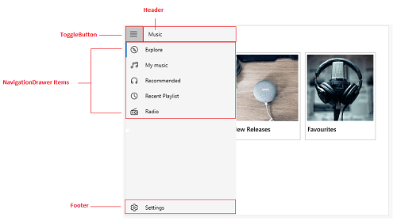

# WPF NavigationDrawer (SfNavigationDrawer) Overview

The NavigationDrawer is a sliding panel menu that allows you to navigate between major application modules. It is usually in hidden state, and appears when you drag the screen from any of the four edges or tap the app icon, if available.

 
                                              
SfNavigationDrawer
{:.caption}

### Use case scenarios

The Navigation Drawers are used in applications where navigating to the major module or page is a basic requirement. The Navigation Drawer is available in the following apps that signify the importance of navigating through pages:

1. Facebook
2. Play Store
3. e-Commerce Apps
4. Banking Apps

### Key features

* Pane positions: Supports pane position in all four directions such as Left, Right, Top, and Bottom. 

* Animated transitions: Supports opening/closing of pane due to the transition SlideOnTop, Push, and Reveal.

* Changeable swipe sensitivity: Flexible for the users to update touch threshold based on their device screen size.

* Providing a consistent navigational experience throughout your app

* Preserving screen real estate on smaller windows.

* Organizing access to many navigation categories.

### Visual Structure

This section describes the visual elements of the NavigationDrawer control and defines terms and concepts used in the DisplayMode.

* **Header** —  Represent the header of the drawer. It has shown nearby toggle button. 
* **Footer** — Represent the footer of the drawer. It has shown bottom of the drawer. 
* **NavigationDrawer Items** — Used this and populate the items in drawer content view.
* **ToggleButton** — It can be used for the drawer closing and opening. 