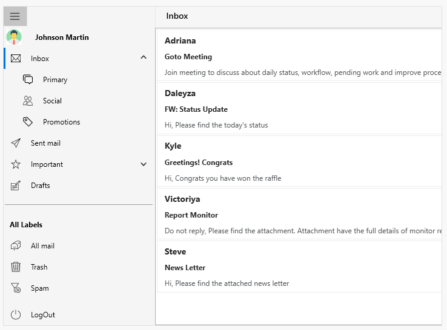
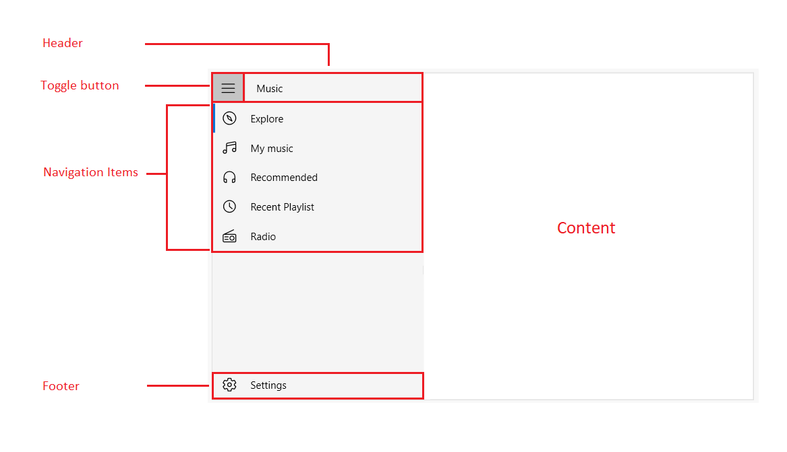

# WPF Navigation Drawer (SfNavigationDrawer) Overview

The WPF Navigation Drawer control is a sidebar navigation view that is used to create a navigation menu for easy navigation. It provides compact and extended display modes with built-in navigation view items with ability to switch between both modes based on available size. It also provides default mode which allows to have a custom pane view.

 
                                              
SfNavigationDrawer
{:.caption}

### Use case scenarios

The Navigation Drawers are used in applications where navigating to the major module or page is a basic requirement. The Navigation Drawer is available in the following apps that signify the importance of navigating through pages:

1. Facebook
2. Play Store
3. e-Commerce Apps
4. Banking Apps

### Key features

* A sidebar menu to provide Modern UI navigation for application. 
* Navigation menu can be placed on any side of the screen.
* Compact and extended display modes with support to best fit the content based on available size. 
* Built-in navigation menu items: tab, button, header, multi-level hierarchal items and footer items. 
* Custom views also can be added as the header and footer of the drawer.

### Visual Structure

This section describes the visual elements of the NavigationDrawer control and defines terms and concepts used in the DisplayMode.

* **Header** —  Represents the header of the drawer 
* **Footer** — Represents the footer of the drawer. 
* **NavigationDrawer Items** — Built-in items used to populate the items in the drawer pane body and footer.
* **ToggleButton** — Built-in toggle button used to collapse and expand the drawer menu. 