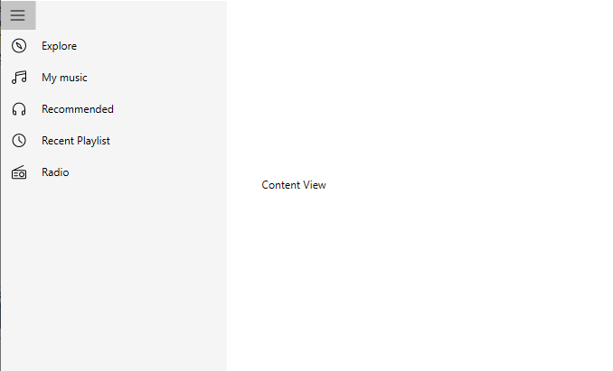

# Populating with Data

This section explains how to show the drawer view. 

## Setting Panel content in default mode

The DrawerView is a panel that is the hidden content, brought to the view by manipulations like panning or swiping through the edges. The DrawerView has three sections namely:

   * DrawerHeaderView: Gets or sets the [DrawerHeaderView](https://help.syncfusion.com/cr/wpf/Syncfusion.UI.Xaml.NavigationDrawer.SfNavigationDrawer.html#Syncfusion_UI_Xaml_NavigationDrawer_SfNavigationDrawer_DrawerHeaderView) of the DrawerView panel in the SfNavigationDrawer control.
   
   * DrawerContentView: The SfNavigationDrawer control contains the [DrawerContentView](https://help.syncfusion.com/cr/wpf/Syncfusion.UI.Xaml.NavigationDrawer.SfNavigationDrawer.html#Syncfusion_UI_Xaml_NavigationDrawer_SfNavigationDrawer_DrawerContentView), a part of the DrawerView panel. The `DrawerContentView` displays the navigation items that needs to jump to.
   
   * DrawerFooterView: Gets or sets the footer for the DrawerView panel in the SfNavigationDrawer control.  




	<Window x:Class="NavigationDrawerWPF.MainWindow"
        xmlns="http://schemas.microsoft.com/winfx/2006/xaml/presentation"
        xmlns:x="http://schemas.microsoft.com/winfx/2006/xaml"
        xmlns:d="http://schemas.microsoft.com/expression/blend/2008"
        xmlns:mc="http://schemas.openxmlformats.org/markup-compatibility/2006"
        xmlns:syncfusion="http://schemas.syncfusion.com/wpf"
        xmlns:local="clr-namespace:NavigationDrawerWPF"
        mc:Ignorable="d"
        Title="MainWindow" Height="450" Width="800">
    <Window.DataContext>
        <local:ViewModel/>
    </Window.DataContext>
    <syncfusion:SfNavigationDrawer x:Name="navigationDrawer" DrawerWidth="300">
        <syncfusion:SfNavigationDrawer.ContentView>
            <Grid x:Name="mainContentView" 
                  Background="White">
                <Grid.RowDefinitions>
                    <RowDefinition Height="auto"/>
                    <RowDefinition/>
                </Grid.RowDefinitions>
                <StackPanel Background="#1aa1d6" 
                            Orientation="Horizontal">
                    <Button x:Name="hamburgerButton" 
                            BorderBrush="Transparent" 
                            Height="50" Width="50" 
                            HorizontalAlignment="Left"  
                            FontSize="16" 
                            Background="#1aa1d6" Foreground="White" 
                            Click="HamburgerButton_Click">
                        <Image Source="hamburger_icon.png" 
                               Height="20" 
                               Width="20" 
                               HorizontalAlignment="Center" 
                               VerticalAlignment="Center"/>
                    </Button>
                    <Label x:Name="headerLabel" 
                           Height="50" 
                           HorizontalContentAlignment="Center" 
                           VerticalContentAlignment="Center" 
                           Content="Home" 
                           FontSize="16" 
                           Foreground="White" 
                           Background="#1aa1d6"/>
                </StackPanel>
                <Label Grid.Row="1" 
                       x:Name="contentLabel" 
                       VerticalContentAlignment="Center" 
                       HorizontalContentAlignment="Center" 
                       Content="Content View" 
                       FontSize="14" Foreground="Black"/>
            </Grid>
        </syncfusion:SfNavigationDrawer.ContentView>
        <syncfusion:SfNavigationDrawer.DrawerHeaderView>
            <Grid Background="#31ade9">
                <Label Content="Header View" 
                       FontSize="20" 
                       FontWeight="Bold" 
                       HorizontalContentAlignment="Center" 
                       VerticalContentAlignment="Center"/>
            </Grid>
        </syncfusion:SfNavigationDrawer.DrawerHeaderView>
        <syncfusion:SfNavigationDrawer.DrawerContentView>
            <Grid>
                <ListBox x:Name="list" 
                         ItemsSource="{Binding Contents}">
                    <ListBox.ItemTemplate>
                        <DataTemplate>
                            <TextBlock  Text="{Binding Name}" 
                                        Padding="15" 
                                        TextAlignment="Center" 
                                        FontSize="18" 
                                        Foreground="Black"/>
                        </DataTemplate>
                    </ListBox.ItemTemplate>
                </ListBox>
            </Grid>
        </syncfusion:SfNavigationDrawer.DrawerContentView>
        <syncfusion:SfNavigationDrawer.DrawerFooterView>
            <Grid Background="#31ade9">
                <Label Content="Footer View" 
                       FontSize="20" 
                       FontWeight="Bold" 
                       HorizontalContentAlignment="Center" 
                       VerticalContentAlignment="Center"/>
            </Grid>
        </syncfusion:SfNavigationDrawer.DrawerFooterView>
    </syncfusion:SfNavigationDrawer>
</Window>
    




using System.Collections.Generic;
using System.Windows;

namespace NavigationDrawerWPF
{
    /// 

    /// Interaction logic for MainWindow.xaml
    /// 

    public partial class MainWindow : Window
    {
        public MainWindow()
        {
            InitializeComponent();
        }

        private void HamburgerButton_Click(object sender, RoutedEventArgs e)
        {
            navigationDrawer.ToggleDrawer();
        }
    }

    public class ViewModel
    {
        public ViewModel()
        {
            Contents = new List<Model>();

            Contents.Add(new Model() { Name = "Home" });
            Contents.Add(new Model() { Name = "Profile" });
            Contents.Add(new Model() { Name = "Inbox" });
            Contents.Add(new Model() { Name = "Outbox" });
            Contents.Add(new Model() { Name = "Sent" });
            Contents.Add(new Model() { Name = "Trash" });
            Contents.Add(new Model() { Name = "Sign Out" });
        }

        public List<Model> Contents { get; set; }
    }

    public class Model
    {
        public string Name { get; set; }
    }
}





   

## Data Binding

The drawer content view can be populated by [ItemsSource](https://help.syncfusion.com/cr/wpf/Syncfusion.UI.Xaml.NavigationDrawer.SfNavigationDrawer.html#Syncfusion_UI_Xaml_NavigationDrawer_SfNavigationDrawer_ItemsSource) property. It can support, bound collection of objects through the `ItemsSource`. 

### Model




    public class Model
    {
        private string item;
        public string Item
        {
            get { return item; }
            set { item = value; }
        }

        private object icon;
        public object Icon
        {
            get { return icon; }
            set { icon = value; }
        }
    }




### ViewModel




    public class ViewModel
    {
        public ObservableCollection<Model> Items { get; set; }
        public ViewModel()
        {
            Items = new ObservableCollection<Model>();
            Items.Add(new Model()
            {
                Item = "Explore",
                Icon = new Path()
                {
                    Width = 16,
                    Height = 16,
                    HorizontalAlignment = HorizontalAlignment.Center,
                    VerticalAlignment = VerticalAlignment.Center,
                    Data = Geometry.Parse("M6.0033803,5.705333 L7.0853577,8.4971852 9.9112849,10.241092 8.6573143,7.3392491 z M5.0022244,4.0000064 C5.0918167,4.0004316 5.1818919,4.0249844 5.2623992,4.0744188 L9.3152895,6.5702889 C9.4033003,6.6242869 9.4722991,6.7032812 9.5132833,6.7982774 L11.459255,11.302037 C11.545252,11.502027 11.492244,11.735016 11.327239,11.879006 11.233247,11.959003 11.117252,12.000002 11.00025,12.000002 10.909249,12.000002 10.818278,11.976001 10.737256,11.926004 L6.4163659,9.2601452 C6.3233503,9.2021494 6.252368,9.1161518 6.2133675,9.0151591 L4.5334113,4.6813889 C4.4563866,4.4803993 4.5154063,4.2534102 4.6804113,4.1164165 4.7726429,4.0387974 4.8870345,3.9994598 5.0022244,4.0000064 z M8,1 C4.14,1 1,4.1409999 1,8 1,11.86 4.14,15 8,15 11.859,15 15,11.86 15,8 15,4.1409999 11.859,1 8,1 z M8,0 C12.411,0 16,3.5889999 16,8 16,12.411 12.411,16 8,16 3.589,16 0,12.411 0,8 0,3.5889999 3.589,0 8,0 z"),
                    Fill = new SolidColorBrush(Colors.Black),
                    Stretch = Stretch.Fill,
                }
            });
            Items.Add(new Model()
            {
                Item = "My music",
                Icon = new Path()
                {
                    Width = 16,
                    Height = 14.7,
                    HorizontalAlignment = HorizontalAlignment.Center,
                    VerticalAlignment = VerticalAlignment.Center,
                    Data = Geometry.Parse("M2.5,10.701 C1.6729736,10.701 1,11.373997 1.0000001,12.201 1,13.027996 1.6729736,13.701 2.5,13.701 3.3269958,13.701 4,13.027996 4,12.201 L3.9999866,12.200474 3.9980443,12.123936 C3.9577868,11.332592 3.3011522,10.701 2.5,10.701 z M13.499987,8.7009979 C12.672987,8.7009979 11.999987,9.373998 11.999987,10.200998 11.999987,11.027998 12.672987,11.700998 13.499987,11.700998 14.326986,11.700998 14.999987,11.027998 14.999987,10.200998 14.999987,9.373998 14.326986,8.7009979 13.499987,8.7009979 z M14.515357,1.0003309 C14.481983,0.99951458 14.446487,1.0020571 14.408987,1.0089951 L5.4099865,2.6579952 C5.1719866,2.700995 4.9999866,2.9079952 4.9999866,3.1489954 L4.9999866,4.7396889 14.999987,2.9069619 14.999987,1.5009947 C14.999987,1.2969952 14.886987,1.1729946 14.819986,1.1159945 14.764736,1.0704947 14.659975,1.0038691 14.515357,1.0003309 z M14.477699,0.00021648407 C14.835276,-0.0058488846 15.181299,0.11561966 15.459987,0.3479948 15.802987,0.63499451 15.999987,1.0549946 15.999987,1.5009947 L15.999987,10.200997 C15.999987,11.579998 14.877987,12.700998 13.499987,12.700998 12.120987,12.700998 10.999987,11.579998 10.999987,10.200998 10.999987,8.822998 12.120987,7.7009981 13.499987,7.7009981 14.059799,7.7009981 14.577362,7.8861719 14.994612,8.1984568 L14.999987,8.2026836 14.999987,3.9231343 4.9999866,5.755861 4.9999866,12.200465 5,12.201 C5,13.579998 3.8779907,14.701 2.5,14.701 1.1209717,14.701 0,13.579998 0,12.201 0,10.822994 1.1209717,9.7010002 2.5,9.7010002 3.0598087,9.7010002 3.5773706,9.8861731 3.9946208,10.198457 L3.9999866,10.202677 3.9999866,3.1489954 C3.9999866,2.4249949 4.5169868,1.8049951 5.2289867,1.6749945 L14.228987,0.02499485 C14.312049,0.0098075867 14.395182,0.0016155243 14.477699,0.00021648407 z"),
                    Fill = new SolidColorBrush(Colors.Black),
                    Stretch = Stretch.Fill,
                }
            });
            Items.Add(new Model()
            {
                Item = "Recommended",
                Icon = new Path()
                {
                    Width = 14,
                    Height = 14,
                    HorizontalAlignment = HorizontalAlignment.Center,
                    VerticalAlignment = VerticalAlignment.Center,
                    Data = Geometry.Parse("M11.5,10 C11.224,10 11,10.225 11,10.5 L11,13 11.5,13 C12.327,13 13,12.327 13,11.5 L13,10 z M1.0000133,9.9999933 L1.0000133,11.499993 C1.0000133,12.327004 1.672987,12.999993 2.5000133,12.999993 L3.0000133,12.999993 3.0000133,10.499993 C3.0000133,10.224999 2.7750072,9.9999933 2.5000133,9.9999933 z M7,0 C10.859,0 14,3.1409998 14,7 L14,9.4999999 14,10 14,11.5 C14,12.879 12.878,14 11.5,14 L10.5,14 C10.224,14 10,13.776 10,13.5 L10,10.5 C10,9.6729999 10.673,8.9999999 11.5,8.9999999 L13,8.9999999 13,7 C13,3.691 10.309,1 7,1 3.691,1 0.99999999,3.691 0.99999993,7 L0.99999993,8.9999934 2.5000133,8.9999934 C3.3270092,8.9999933 4.0000133,9.6729975 4.0000133,10.499993 L4.0000133,13.499993 C4.0000133,13.775994 3.7760143,13.999993 3.5000133,13.999993 L2.5000133,13.999993 C1.120985,13.999993 1.3340759E-05,12.879006 1.335144E-05,11.499993 L1.335144E-05,10 0,7 C1.0681106E-08,3.1409998 3.1400001,0 7,0 z"),
                    Fill = new SolidColorBrush(Colors.Black),
                    Stretch = Stretch.Fill,
                }
            });
            Items.Add(new Model()
            {
                Item = "Recent Playlist",
                Icon = new Path()
                {
                    Width = 15,
                    Height = 15,
                    HorizontalAlignment = HorizontalAlignment.Center,
                    VerticalAlignment = VerticalAlignment.Center,
                    Data = Geometry.Parse("M6.9990103,3.0000041 L7.9990076,3.0000041 7.9990076,7.270998 11.32401,10.121002 10.674018,10.880004 6.9990103,7.7310042 z M7.5,1 C3.9160001,1 1,3.916 1,7.5 1,11.084 3.9160001,14 7.5,14 11.084,14 14,11.084 14,7.5 14,3.916 11.084,1 7.5,1 z M7.5,0 C11.636,0 15,3.3640001 15,7.5 15,11.636 11.636,15 7.5,15 3.3640001,15 0,11.636 0,7.5 0,3.3640001 3.3640001,0 7.5,0 z"),
                    Fill = new SolidColorBrush(Colors.Black),
                    Stretch = Stretch.Fill,
                }
            });
            Items.Add(new Model()
            {
                Item = "Radio",
                Icon = new Path()
                {
                    Width = 16,
                    Height = 15.4,
                    HorizontalAlignment = HorizontalAlignment.Center,
                    VerticalAlignment = VerticalAlignment.Center,
                    Data = Geometry.Parse("M2.5,11.472009 L6.5,11.472009 C6.776,11.472009 7,11.696009 7,11.972009 7,12.248009 6.776,12.472009 6.5,12.472009 L2.5,12.472009 C2.224,12.472009 2,12.248009 2,11.972009 2,11.696009 2.224,11.472009 2.5,11.472009 z M2.5,8.4720092 L6.5,8.4720092 C6.776,8.4720092 7,8.6960092 7,8.9720092 7,9.2480091 6.776,9.4720092 6.5,9.4720092 L2.5,9.4720092 C2.224,9.4720092 2,9.2480091 2,8.9720092 2,8.6960092 2.224,8.4720092 2.5,8.4720092 z M11.000013,8.4720025 C9.8960094,8.4720025 9.0000134,9.3690057 9.0000134,10.472003 9.0000134,11.576006 9.8960094,12.472003 11.000013,12.472003 12.10301,12.472003 13.000013,11.576006 13.000013,10.472003 13.000013,9.3690057 12.10301,8.4720025 11.000013,8.4720025 z M11.000013,7.4720025 C12.654005,7.4720025 14.000013,8.8180108 14.000013,10.472003 14.000013,12.126009 12.654005,13.472003 11.000013,13.472003 9.3459911,13.472003 8.0000134,12.126009 8.0000134,10.472003 8.0000134,8.8180108 9.3459911,7.4720025 11.000013,7.4720025 z M1.5,6.4720092 C1.2290001,6.4720091 1,6.6560091 1,6.872009 L1,14.073009 C1,14.289009 1.2290001,14.472009 1.5,14.472009 L14.5,14.472009 C14.771,14.472009 15,14.289009 15,14.073009 L15,6.872009 C15,6.6560091 14.771,6.4720091 14.5,6.4720092 z M12.877348,0.00054502487 C13.071978,-0.0085949898 13.261545,0.097710133 13.351547,0.28444672 13.47155,0.53342915 13.365548,0.83140802 13.116541,0.9513998 L3.6977077,5.4720092 14.5,5.4720092 C15.327,5.4720092 16,6.1000091 16,6.872009 L16,14.073009 C16,14.844009 15.327,15.472009 14.5,15.472009 L1.5,15.472009 C0.67299986,15.472009 0,14.844009 0,14.073009 L0,6.872009 C0,6.148259 0.59150362,5.5510716 1.346869,5.4792504 L1.3769317,5.4771099 12.684531,0.049463272 C12.747032,0.019465446 12.812471,0.0035915375 12.877348,0.00054502487 z"),
                    Fill = new SolidColorBrush(Colors.Black),
                    Stretch = Stretch.Fill,
                }
            });
        }
    }







    <Window.DataContext>
        <local:ViewModel/>
    </Window.DataContext>
    <syncfusion:SfNavigationDrawer
            x:Name="navigationDrawer"
            DisplayMemberPath="Item"
            DisplayMode="Compact"
            IconMemberPath="Icon"
            ItemsSource="{Binding Items}">
        <syncfusion:SfNavigationDrawer.ContentView>
            <Label
                Width="150"
                Height="30"
                HorizontalAlignment="Center"
                VerticalAlignment="Center"
                Content="Content View" />
        </syncfusion:SfNavigationDrawer.ContentView>
    </syncfusion:SfNavigationDrawer>





            ViewModel viewModel = new ViewModel();
            this.DataContext = viewModel;
            SfNavigationDrawer navigationDrawer = new SfNavigationDrawer();
            navigationDrawer.DisplayMode = DisplayMode.Compact;
            navigationDrawer.DisplayMemberPath = "Item";
            navigationDrawer.IconMemberPath = "Icon";
            navigationDrawer.ItemsSource = viewModel.Items;
            Label label = new Label();
            label.Content = "Content View";
            label.HorizontalAlignment = HorizontalAlignment.Center;
            label.VerticalAlignment = VerticalAlignment.Center;
            label.Height = 30;
            label.Width = 150;
            navigationDrawer.ContentView = label;
            this.Content = navigationDrawer;





## Hierarchical Data Binding

The control populates the items using the [ItemsSource](https://help.syncfusion.com/cr/wpf/Syncfusion.UI.Xaml.NavigationDrawer.SfNavigationDrawer.html#Syncfusion_UI_Xaml_NavigationDrawer_SfNavigationDrawer_ItemsSource), also it allows the sub items. It can be achieved by using the [DisplayMemberPath](https://help.syncfusion.com/cr/wpf/Syncfusion.UI.Xaml.NavigationDrawer.SfNavigationDrawer.html#Syncfusion_UI_Xaml_NavigationDrawer_SfNavigationDrawer_DisplayMemberPath), [IconMemberPath](https://help.syncfusion.com/cr/wpf/Syncfusion.UI.Xaml.NavigationDrawer.SfNavigationDrawer.html#Syncfusion_UI_Xaml_NavigationDrawer_SfNavigationDrawer_IconMemberPath) and [ItemsContainerStyle](https://help.syncfusion.com/cr/wpf/Syncfusion.UI.Xaml.NavigationDrawer.SfNavigationDrawer.html#Syncfusion_UI_Xaml_NavigationDrawer_SfNavigationDrawer_ItemContainerStyle). 

                                   
### Model




    public class Model
    {
        public ObservableCollection<Model> SubItems { get; set; }

        private string item;
        public string Item
        {
            get { return item; }
            set { item = value; }
        }

        private object icon;
        public object Icon
        {
            get { return icon; }
            set { icon = value; }
        }
    }




### ViewModel




     public class ViewModel
    {
        public ObservableCollection<Model> Items { get; set; }
        ObservableCollection<Model> SubItems = new ObservableCollection<Model>();
      
        public ViewModel()
        {
            Items = new ObservableCollection<Model>();
            SubItems.Add(new Model()
            {
                Item = "Item1",
            });
            SubItems.Add(new Model()
            {
                Item = "Item2",
            }); SubItems.Add(new Model()
            {
                Item = "Item3",
            });
            Items.Add(new Model()
            {
                Item = "Explore",
                Icon = new Path()
                {
                    Width = 16,
                    Height = 16,
                    HorizontalAlignment = HorizontalAlignment.Center,
                    VerticalAlignment = VerticalAlignment.Center,
                    Data = Geometry.Parse("M6.0033803,5.705333 L7.0853577,8.4971852 9.9112849,10.241092 8.6573143,7.3392491 z M5.0022244,4.0000064 C5.0918167,4.0004316 5.1818919,4.0249844 5.2623992,4.0744188 L9.3152895,6.5702889 C9.4033003,6.6242869 9.4722991,6.7032812 9.5132833,6.7982774 L11.459255,11.302037 C11.545252,11.502027 11.492244,11.735016 11.327239,11.879006 11.233247,11.959003 11.117252,12.000002 11.00025,12.000002 10.909249,12.000002 10.818278,11.976001 10.737256,11.926004 L6.4163659,9.2601452 C6.3233503,9.2021494 6.252368,9.1161518 6.2133675,9.0151591 L4.5334113,4.6813889 C4.4563866,4.4803993 4.5154063,4.2534102 4.6804113,4.1164165 4.7726429,4.0387974 4.8870345,3.9994598 5.0022244,4.0000064 z M8,1 C4.14,1 1,4.1409999 1,8 1,11.86 4.14,15 8,15 11.859,15 15,11.86 15,8 15,4.1409999 11.859,1 8,1 z M8,0 C12.411,0 16,3.5889999 16,8 16,12.411 12.411,16 8,16 3.589,16 0,12.411 0,8 0,3.5889999 3.589,0 8,0 z"),
                    Fill = new SolidColorBrush(Colors.Black),
                    Stretch = Stretch.Fill,
                },
                SubItems=SubItems
            });
            Items.Add(new Model()
            {
                Item = "My music",
                Icon = new Path()
                {
                    Width = 16,
                    Height = 14.7,
                    HorizontalAlignment = HorizontalAlignment.Center,
                    VerticalAlignment = VerticalAlignment.Center,
                    Data = Geometry.Parse("M2.5,10.701 C1.6729736,10.701 1,11.373997 1.0000001,12.201 1,13.027996 1.6729736,13.701 2.5,13.701 3.3269958,13.701 4,13.027996 4,12.201 L3.9999866,12.200474 3.9980443,12.123936 C3.9577868,11.332592 3.3011522,10.701 2.5,10.701 z M13.499987,8.7009979 C12.672987,8.7009979 11.999987,9.373998 11.999987,10.200998 11.999987,11.027998 12.672987,11.700998 13.499987,11.700998 14.326986,11.700998 14.999987,11.027998 14.999987,10.200998 14.999987,9.373998 14.326986,8.7009979 13.499987,8.7009979 z M14.515357,1.0003309 C14.481983,0.99951458 14.446487,1.0020571 14.408987,1.0089951 L5.4099865,2.6579952 C5.1719866,2.700995 4.9999866,2.9079952 4.9999866,3.1489954 L4.9999866,4.7396889 14.999987,2.9069619 14.999987,1.5009947 C14.999987,1.2969952 14.886987,1.1729946 14.819986,1.1159945 14.764736,1.0704947 14.659975,1.0038691 14.515357,1.0003309 z M14.477699,0.00021648407 C14.835276,-0.0058488846 15.181299,0.11561966 15.459987,0.3479948 15.802987,0.63499451 15.999987,1.0549946 15.999987,1.5009947 L15.999987,10.200997 C15.999987,11.579998 14.877987,12.700998 13.499987,12.700998 12.120987,12.700998 10.999987,11.579998 10.999987,10.200998 10.999987,8.822998 12.120987,7.7009981 13.499987,7.7009981 14.059799,7.7009981 14.577362,7.8861719 14.994612,8.1984568 L14.999987,8.2026836 14.999987,3.9231343 4.9999866,5.755861 4.9999866,12.200465 5,12.201 C5,13.579998 3.8779907,14.701 2.5,14.701 1.1209717,14.701 0,13.579998 0,12.201 0,10.822994 1.1209717,9.7010002 2.5,9.7010002 3.0598087,9.7010002 3.5773706,9.8861731 3.9946208,10.198457 L3.9999866,10.202677 3.9999866,3.1489954 C3.9999866,2.4249949 4.5169868,1.8049951 5.2289867,1.6749945 L14.228987,0.02499485 C14.312049,0.0098075867 14.395182,0.0016155243 14.477699,0.00021648407 z"),
                    Fill = new SolidColorBrush(Colors.Black),
                    Stretch = Stretch.Fill,
                }
            });
            Items.Add(new Model()
            {
                Item = "Recommended",
                Icon = new Path()
                {
                    Width = 14,
                    Height = 14,
                    HorizontalAlignment = HorizontalAlignment.Center,
                    VerticalAlignment = VerticalAlignment.Center,
                    Data = Geometry.Parse("M11.5,10 C11.224,10 11,10.225 11,10.5 L11,13 11.5,13 C12.327,13 13,12.327 13,11.5 L13,10 z M1.0000133,9.9999933 L1.0000133,11.499993 C1.0000133,12.327004 1.672987,12.999993 2.5000133,12.999993 L3.0000133,12.999993 3.0000133,10.499993 C3.0000133,10.224999 2.7750072,9.9999933 2.5000133,9.9999933 z M7,0 C10.859,0 14,3.1409998 14,7 L14,9.4999999 14,10 14,11.5 C14,12.879 12.878,14 11.5,14 L10.5,14 C10.224,14 10,13.776 10,13.5 L10,10.5 C10,9.6729999 10.673,8.9999999 11.5,8.9999999 L13,8.9999999 13,7 C13,3.691 10.309,1 7,1 3.691,1 0.99999999,3.691 0.99999993,7 L0.99999993,8.9999934 2.5000133,8.9999934 C3.3270092,8.9999933 4.0000133,9.6729975 4.0000133,10.499993 L4.0000133,13.499993 C4.0000133,13.775994 3.7760143,13.999993 3.5000133,13.999993 L2.5000133,13.999993 C1.120985,13.999993 1.3340759E-05,12.879006 1.335144E-05,11.499993 L1.335144E-05,10 0,7 C1.0681106E-08,3.1409998 3.1400001,0 7,0 z"),
                    Fill = new SolidColorBrush(Colors.Black),
                    Stretch = Stretch.Fill,
                }
            });
            Items.Add(new Model()
            {
                Item = "Recent Playlist",
                Icon = new Path()
                {
                    Width = 15,
                    Height = 15,
                    HorizontalAlignment = HorizontalAlignment.Center,
                    VerticalAlignment = VerticalAlignment.Center,
                    Data = Geometry.Parse("M6.9990103,3.0000041 L7.9990076,3.0000041 7.9990076,7.270998 11.32401,10.121002 10.674018,10.880004 6.9990103,7.7310042 z M7.5,1 C3.9160001,1 1,3.916 1,7.5 1,11.084 3.9160001,14 7.5,14 11.084,14 14,11.084 14,7.5 14,3.916 11.084,1 7.5,1 z M7.5,0 C11.636,0 15,3.3640001 15,7.5 15,11.636 11.636,15 7.5,15 3.3640001,15 0,11.636 0,7.5 0,3.3640001 3.3640001,0 7.5,0 z"),
                    Fill = new SolidColorBrush(Colors.Black),
                    Stretch = Stretch.Fill,
                }
            });
            Items.Add(new Model()
            {
                Item = "Radio",
                Icon = new Path()
                {
                    Width = 16,
                    Height = 15.4,
                    HorizontalAlignment = HorizontalAlignment.Center,
                    VerticalAlignment = VerticalAlignment.Center,
                    Data = Geometry.Parse("M2.5,11.472009 L6.5,11.472009 C6.776,11.472009 7,11.696009 7,11.972009 7,12.248009 6.776,12.472009 6.5,12.472009 L2.5,12.472009 C2.224,12.472009 2,12.248009 2,11.972009 2,11.696009 2.224,11.472009 2.5,11.472009 z M2.5,8.4720092 L6.5,8.4720092 C6.776,8.4720092 7,8.6960092 7,8.9720092 7,9.2480091 6.776,9.4720092 6.5,9.4720092 L2.5,9.4720092 C2.224,9.4720092 2,9.2480091 2,8.9720092 2,8.6960092 2.224,8.4720092 2.5,8.4720092 z M11.000013,8.4720025 C9.8960094,8.4720025 9.0000134,9.3690057 9.0000134,10.472003 9.0000134,11.576006 9.8960094,12.472003 11.000013,12.472003 12.10301,12.472003 13.000013,11.576006 13.000013,10.472003 13.000013,9.3690057 12.10301,8.4720025 11.000013,8.4720025 z M11.000013,7.4720025 C12.654005,7.4720025 14.000013,8.8180108 14.000013,10.472003 14.000013,12.126009 12.654005,13.472003 11.000013,13.472003 9.3459911,13.472003 8.0000134,12.126009 8.0000134,10.472003 8.0000134,8.8180108 9.3459911,7.4720025 11.000013,7.4720025 z M1.5,6.4720092 C1.2290001,6.4720091 1,6.6560091 1,6.872009 L1,14.073009 C1,14.289009 1.2290001,14.472009 1.5,14.472009 L14.5,14.472009 C14.771,14.472009 15,14.289009 15,14.073009 L15,6.872009 C15,6.6560091 14.771,6.4720091 14.5,6.4720092 z M12.877348,0.00054502487 C13.071978,-0.0085949898 13.261545,0.097710133 13.351547,0.28444672 13.47155,0.53342915 13.365548,0.83140802 13.116541,0.9513998 L3.6977077,5.4720092 14.5,5.4720092 C15.327,5.4720092 16,6.1000091 16,6.872009 L16,14.073009 C16,14.844009 15.327,15.472009 14.5,15.472009 L1.5,15.472009 C0.67299986,15.472009 0,14.844009 0,14.073009 L0,6.872009 C0,6.148259 0.59150362,5.5510716 1.346869,5.4792504 L1.3769317,5.4771099 12.684531,0.049463272 C12.747032,0.019465446 12.812471,0.0035915375 12.877348,0.00054502487 z"),
                    Fill = new SolidColorBrush(Colors.Black),
                    Stretch = Stretch.Fill,
                }
            });
        }
    }







    <Window.DataContext>
        <local:ViewModel />
    </Window.DataContext>
    <Window.Resources>
        
    </Window.Resources>
    <syncfusion:SfNavigationDrawer
        x:Name="navigationDrawer"
        DisplayMemberPath="Item"
        DisplayMode="Expanded"
        ItemContainerStyle="{StaticResource ItemStyle}"
        ItemsSource="{Binding Items}">
        <syncfusion:SfNavigationDrawer.ContentView>
            <Label
                Width="150"
                Height="30"
                HorizontalAlignment="Center"
                VerticalAlignment="Center"
                Content="Content View" />
        </syncfusion:SfNavigationDrawer.ContentView>
    </syncfusion:SfNavigationDrawer>





## NavigationItem 

[NavigationItem](https://help.syncfusion.com/cr/wpf/Syncfusion.UI.Xaml.NavigationDrawer.NavigationItem.html) below properties used to representation of each item, selection and population of sub items. 

* **Header** — Represent the content of the `NavigationItem`.
* **Icon** — Represent the icon in the `NavigationItem`.
* **IconMemberPath** — Used to display the icon for sub items, while providing the `ItemsSource`. 
* **ExpanderTemplate** — It can be used to provide the different view for expander in both collapsed and expanded state.
* **Command** — It will execute while items have been clicked.  NavigationDrawer have four `NavigationItemType`. In this only Tab and Button types supports the [Command](https://help.syncfusion.com/cr/wpf/Syncfusion.UI.Xaml.NavigationDrawer.NavigationItem.html#Syncfusion_UI_Xaml_NavigationDrawer_NavigationItem_Command). When using the tab [ItemType](https://help.syncfusion.com/cr/wpf/Syncfusion.UI.Xaml.NavigationDrawer.NavigationItem.html#Syncfusion_UI_Xaml_NavigationDrawer_NavigationItem_ItemType) and command binds into `NavigationItem` the item behave like button. 
* **CommandParameter** — [CommandParameter](https://help.syncfusion.com/cr/wpf/Syncfusion.UI.Xaml.NavigationDrawer.NavigationItem.html#Syncfusion_UI_Xaml_NavigationDrawer_NavigationItem_CommandParameter) is user defined data value that can be passed to the `Command` when it is executed.
* **IsChildSelected** — It can be used to find the sub item is whether selected or not. 
* **ItemType** — It can be used for defining the `NavigationItem` representation. It has the four type like `Tab`, `Button`, `Header` and `Seperator`. `Tab` and `Button` have the interaction support. 
* **IsExpanded** — It can be used to find the sub items in whether expanded or collapsed state.
* **IsSelected** — It can be used to whether the item has selected or not.
* **SelectionBackground** — It can be used customize the selection strip in`NavigationItem`.
* **Items** — It can be used to populate the sub items.




    <syncfusion:SfNavigationDrawer
        x:Name="navigationDrawer"
        DisplayMode="Expanded">
        <syncfusion:NavigationItem
                Header="Inbox"
                IsExpanded="True"
                IsSelected="True">
            <syncfusion:NavigationItem.Icon>
                <Path
                        Width="16"
                        Height="13"
                        HorizontalAlignment="Center"
                        VerticalAlignment="Center"
                        Data="M32.032381, 16.445429 L25.410999, 23 22.598995, 23 15.853724, 16.561278 3.4150009, 29 44.586115, 29z M2.0000003, 3.3371553 L2.0000003, 27.587 14.406845, 15.180154z M46.000002, 2.6187388 L33.45355, 15.038597 46.000002, 27.585888z M3.4950623, 2.0000003 L23.399998, 21 24.589001, 21 43.782564, 2.0000003z M0, 0 L48.000002, 0 48.000002, 31 0, 31z"
                        Fill="Black"
                        Stretch="Fill" />
            </syncfusion:NavigationItem.Icon>
            <syncfusion:NavigationItem Header="Primary">
                <syncfusion:NavigationItem.Icon>
                    <Path
                            Width="16"
                            Height="16"
                            HorizontalAlignment="Center"
                            VerticalAlignment="Center"
                            Data="M9.5189972,7.3780194C8.3389893,7.3780194,7.3779907,8.339018,7.3779907,9.5190097L7.3779907,22.499019C7.3779907,23.680017,8.3389893,24.641015,9.5189972,24.641015L18.442001,24.641015 21.362,27.78399 24.506989,24.641015 27.718002,24.641015C28.899002,24.641015,29.858994,23.680017,29.858994,22.499019L29.858994,9.5190097C29.858994,8.339018,28.899002,7.3780194,27.718002,7.3780194z M9.5189972,5.2380052L27.718002,5.2380052C30.082993,5.2380052,32,7.1540204,32,9.5190097L32,22.499019C32,24.864007,30.082993,26.780999,27.718002,26.780999L25.987991,26.780999 21.562988,31.264001 17.138992,26.780999 9.5189972,26.780999C7.1539917,26.780999,5.2369995,24.864007,5.2369995,22.499019L5.2369995,9.5190097C5.2369995,7.1540204,7.1539917,5.2380052,9.5189972,5.2380052z M4.2819977,0L22.65799,0C24.315994,-8.5328793E-08,25.748993,0.94302335,26.46199,2.3189999L4.5499878,2.3189999C3.2200012,2.3189996,2.1409912,3.3970023,2.1409912,4.7290026L2.1409912,21.010005C0.86199951,20.270015,0,18.891017,0,17.307002L0,4.2820121C0,1.9170222,1.9169922,-8.5328793E-08,4.2819977,0z"
                            Fill="Black"
                            Stretch="Fill" />
                </syncfusion:NavigationItem.Icon>
            </syncfusion:NavigationItem>
            <syncfusion:NavigationItem Header="Social">
                <syncfusion:NavigationItem.Icon>
                    <Path
                            Width="16"
                            Height="16"
                            HorizontalAlignment="Center"
                            VerticalAlignment="Center"
                            Data="M22.133972,14.194015C17.582977,14.194015,13.821991,17.641011,13.323975,22.060998L30.944,22.060998C30.445984,17.641011,26.682983,14.194015,22.133972,14.194015z M22.133972,13.194014C27.582977,13.194014,32,17.61101,32,23.061L12.266998,23.061C12.266998,17.61101,16.68399,13.194014,22.133972,13.194014z M9.8659973,13.194014C5.3149719,13.194014,1.5529785,16.642016,1.0549927,21.060996L9.2409973,21.060996C9.8039856,18.306996 11.25,15.792009 13.338989,13.909012 12.242981,13.438002 11.063995,13.194014 9.8659973,13.194014z M9.8659973,12.194014C10.109119,12.194014,10.350148,12.202967,10.588797,12.220533L10.887621,12.248026 10.969,12.248026 10.969,12.256401 11.297313,12.298732C12.698914,12.50545 14.004478,13.010009 15.151978,13.738998 12.440979,15.646013 10.548981,18.628011 10.084991,22.060998L0,22.060998C0,16.61101,4.4169922,12.194014,9.8659973,12.194014z M22.133972,2.6329984C19.823975,2.6329986 17.944977,4.5130056 17.944977,6.8219985 17.944977,9.1330051 19.823975,11.012006 22.133972,11.012006 24.444,11.012006 26.322998,9.1330051 26.322998,6.8219985 26.322998,4.5130056 24.444,2.6329986 22.133972,2.6329984z M22.133972,1.6329975C25,1.6329974 27.322998,3.9570052 27.322998,6.8219985 27.322998,9.6879987 25,12.012007 22.133972,12.012007 19.266998,12.012007 16.944977,9.6879987 16.944977,6.8219985 16.944977,3.9570052 19.266998,1.6329974 22.133972,1.6329975z M9.8649902,1.0000009C7.5539856,1.0000012 5.6759949,2.8790011 5.6759949,5.189001 5.6759949,7.4990009 7.5539856,9.3780011 9.8649902,9.3780011 12.174988,9.3780011 14.052979,7.4990009 14.052979,5.189001 14.052979,2.8790011 12.174988,1.0000012 9.8649902,1.0000009z M9.8649902,0C12.730988,8.6762157E-08 15.052979,2.3230006 15.052979,5.189001 15.052979,8.0560083 12.730988,10.378002 9.8649902,10.378002 6.9989929,10.378002 4.6759949,8.0560083 4.6759949,5.189001 4.6759949,2.3230006 6.9989929,8.6762157E-08 9.8649902,0z"
                            Fill="Black"
                            Stretch="Fill" />
                </syncfusion:NavigationItem.Icon>
            </syncfusion:NavigationItem>
            <syncfusion:NavigationItem Header="Promotions">
                <syncfusion:NavigationItem.Icon>
                    <Path
                            Width="16"
                            Height="16"
                            HorizontalAlignment="Center"
                            VerticalAlignment="Center"
                            Data="M9.4614787,7.2521966C8.897512,7.2521966 8.3335462,7.4671911 7.9035716,7.8961795 7.0456223,8.7541569 7.0456223,10.15112 7.9035716,11.010097 8.7355218,11.842075 10.186436,11.842075 11.018386,11.010097 11.876336,10.15112 11.876336,8.7541569 11.018386,7.8961795 10.588412,7.4671911 10.024445,7.2521966 9.4614787,7.2521966z M9.4617286,5.2529996C10.537916,5.2529991 11.613851,5.6627386 12.432303,6.4822172 14.069206,8.1201742 14.069206,10.786103 12.432303,12.424061 11.639349,13.217039 10.583413,13.655028 9.4614787,13.655028 8.3395457,13.655028 7.283608,13.217039 6.4896555,12.424061 4.8527527,10.786103 4.8527527,8.1201742 6.4896555,6.4822172 7.3091063,5.6627386 8.3855424,5.2529991 9.4617286,5.2529996z M12.752985,2.0839849L3.0529771,3.0440679 2.0839834,12.737062 18.512992,29.166996 29.173999,18.505007z M13.497004,0L32.002,18.505007 18.512992,31.994999 0,13.481081 1.2249749,1.2160647z"
                            Fill="Black"
                            Stretch="Fill" />
                </syncfusion:NavigationItem.Icon>
            </syncfusion:NavigationItem>
        </syncfusion:NavigationItem>
        <syncfusion:NavigationItem Header="Sent mail">
            <syncfusion:NavigationItem.Icon>
                <Path
                        Width="16"
                        Height="16"
                        HorizontalAlignment="Center"
                        VerticalAlignment="Center"
                        Data="M42.128046,6.7269681 L18.53705,30.317964 25.278003,43.798z M40.380997,5.6460154 L4.6410007,23.1 17.108567,28.918443z M47.383005,0 L25.364002,48.443 16.582001,30.878999 0,23.141z"
                        Fill="Black"
                        Stretch="Fill" />
            </syncfusion:NavigationItem.Icon>
        </syncfusion:NavigationItem>
        <syncfusion:NavigationItem Header="Important">
            <syncfusion:NavigationItem.Icon>
                <Path
                        Width="16"
                        Height="16"
                        HorizontalAlignment="Center"
                        VerticalAlignment="Center"
                        Data="M25.085007,5.9780004 L20.577011,18.675001 6.3710022,18.675001 17.92601,26.723001 13.423004,40.314001 25.085007,32.191999 36.977005,40.473997 33.332001,26.723001 43.999008,18.675001 29.593002,18.675001z M25.085007,0 L31.005005,16.675001 49.970001,16.675001 35.609009,27.51 40.307007,45.230001 25.085007,34.629999 9.6340027,45.389997 15.559006,27.51 0,16.675001 19.165009,16.675001z"
                        Fill="Black"
                        Stretch="Fill" />
            </syncfusion:NavigationItem.Icon>
        </syncfusion:NavigationItem>
        <syncfusion:NavigationItem Header="Drafts">
            <syncfusion:NavigationItem.Icon>
                <Path
                        Width="16"
                        Height="16"
                        HorizontalAlignment="Center"
                        VerticalAlignment="Center"
                        Data="M6.9999996,48.353 L19,48.353 19,50.353 6.9999996,50.353z M6.9999996,42.353 L32,42.353 32,44.353 6.9999996,44.353z M6.9999996,36.353 L32,36.353 32,38.353 6.9999996,38.353z M6.4999996,30.353 L31.5,30.353 31.5,32.353 6.4999996,32.353z M25.523109,22.610376 L24.94,25.014999 27.461736,24.549429z M0,15.853 L23,15.853 23,17.853 1.9999989,17.853 1.9999989,54.853 37,54.853 37,21.853 39,21.853 39,56.853 0,56.853z M40.953857,5.9638548 L26.382576,20.641725 29.510826,23.770661 44.083183,9.0931849z M44.058998,2.8360004 L42.362705,4.5447035 45.492099,7.6741037 47.184002,5.9699993 z M44.055,0 L50.004001,5.9659996 30.003,26.115 22.271,27.542999 24.065,20.137z"
                        Fill="Black"
                        Stretch="Fill" />
            </syncfusion:NavigationItem.Icon>
        </syncfusion:NavigationItem>
        <syncfusion:NavigationItem ItemType="Separator" />
        <syncfusion:NavigationItem Header="All Labels" ItemType="Header" />
        <syncfusion:NavigationItem Header="Starred">
            <syncfusion:NavigationItem.Icon>
                <Path
                        Width="16"
                        Height="16"
                        HorizontalAlignment="Center"
                        VerticalAlignment="Center"
                        Data="M25.085007,5.9780004 L20.577011,18.675001 6.3710022,18.675001 17.92601,26.723001 13.423004,40.314001 25.085007,32.191999 36.977005,40.473997 33.332001,26.723001 43.999008,18.675001 29.593002,18.675001z M25.085007,0 L31.005005,16.675001 49.970001,16.675001 35.609009,27.51 40.307007,45.230001 25.085007,34.629999 9.6340027,45.389997 15.559006,27.51 0,16.675001 19.165009,16.675001z"
                        Fill="Black"
                        Stretch="Fill" />
            </syncfusion:NavigationItem.Icon>
        </syncfusion:NavigationItem>
        <syncfusion:NavigationItem Header="All mail">
            <syncfusion:NavigationItem.Icon>
                <Path
                        Width="16"
                        Height="16"
                        HorizontalAlignment="Center"
                        VerticalAlignment="Center"
                        Data="M12,32.999999 L26,32.999999 26,34.999999 12,34.999999z M14,14.999999 C7.3830004,14.999999 2.0000005,20.382998 2.0000005,26.999999 L2.0000005,41.999999 34,41.999999 34,26.999999 C34,20.382998 28.617001,14.999999 22,14.999999z M45.499996,7.9999983 L45.499996,14.999998 43.499996,14.999998 43.499996,11.999999 37.099997,16.799998 35.900997,15.199999z M33.739992,1.9999998 C31.497988,1.9999998 29.336,2.6739995 27.489992,3.9479995 L14.382671,12.999999 22,12.999999 C29.720001,12.999999 36,19.279999 36,26.999999 L36,40.808894 48.999996,29.543002 48.999996,9.0000007 C48.999996,5.1409991 45.859009,1.9999998 42,1.9999998z M33.739992,2.2737368E-13 L42,2.2737368E-13 C46.962978,-4.79037E-07 50.999996,4.036999 50.999996,9.0000007 L50.999996,30.457003 36,43.457003 36,43.999999 19,43.999999 19,51.999999 17.000001,51.999999 17.000001,43.999999 0,43.999999 0,26.999999 C0,20.7275 4.1457815,15.405624 9.8412797,13.630439 L10.028968,13.574487 26.352999,2.302 C28.535982,0.79599917 31.089998,-4.79037E-07 33.739992,2.2737368E-13z"
                        Fill="Black"
                        Stretch="Fill" />
            </syncfusion:NavigationItem.Icon>
        </syncfusion:NavigationItem>
        <syncfusion:NavigationItem Header="Trash">
            <syncfusion:NavigationItem.Icon>
                <Path
                        Width="16"
                        Height="16"
                        HorizontalAlignment="Center"
                        VerticalAlignment="Center"
                        Data="M17,12 L19,12 19,42 17,42z M10.998,11.933997 L12.998014,41.934002 11.002,42.067001 9.0019855,12.066998z M25.002001,10.935999 L26.998014,11.064999 24.997999,42.065002 23.001986,41.936001z M4.0514956,7.9999995 L5.9510078,46 30.048996,46 31.948509,7.9999995z M13,2.0000002 C11.897,2 11,2.8959999 11,3.9999998 L11,6 25,6 25,3.9999998 C25,2.8959999 24.103001,2 23,2.0000002z M13,0 L23,0 C25.205999,0 27,1.7950001 27,3.9999998 L27,6 36,6 36,7.9999995 33.951481,7.9999995 31.950994,48 4.0490093,48 2.048521,7.9999995 0,7.9999995 0,6 9,6 9,3.9999998 C9,1.7950001 10.794,0 13,0z"
                        Fill="Black"
                        Stretch="Fill" />
            </syncfusion:NavigationItem.Icon>
        </syncfusion:NavigationItem>
        <syncfusion:NavigationItem Header="Spam">
            <syncfusion:NavigationItem.Icon>
                <Path
                        Width="16"
                        Height="16"
                        HorizontalAlignment="Center"
                        VerticalAlignment="Center"
                        Data="M33.671003,29.293001 L39.214003,34.835998 44.757002,29.293001 46.171,30.707 40.628,36.25 46.171,41.792999 44.757002,43.207 39.214003,37.664001 33.671003,43.207 32.257002,41.792999 37.800001,36.25 32.257002,30.707z M38.964003,24 C32.347002,24 26.964003,29.382999 26.964003,36 26.964003,42.617 32.347002,48 38.964003,48 45.581003,48 50.964003,42.617 50.964003,36 50.964003,29.382999 45.581003,24 38.964003,24z M38.964003,22 C46.684,22 52.964003,28.28 52.964003,36 52.964003,43.720001 46.684,50 38.964003,50 31.244001,50 24.964003,43.720001 24.964003,36 24.964003,28.28 31.244001,22 38.964003,22z M3.9279995,2 L18.473,22 25.454998,22 39.999994,2z M0,0 L43.927996,0 26.964003,23.324888 26.964003,25.452001 C26.203001,26.317001 25.527002,27.257 24.964003,28.271002 L24.964003,24 18.964003,24 18.964003,41.446003 24.964003,45.196003 24.964003,43.729004 C25.526001,44.744003 26.203001,45.683002 26.964003,46.548004 L26.964003,48.805004 16.964003,42.555004 16.964003,23.324899z"
                        Fill="Black"
                        Stretch="Fill" />
            </syncfusion:NavigationItem.Icon>
        </syncfusion:NavigationItem>
        <syncfusion:SfNavigationDrawer.ContentView>
            <Label
                Width="150"
                Height="30"
                HorizontalAlignment="Center"
                VerticalAlignment="Center"
                Content="Content View" />
        </syncfusion:SfNavigationDrawer.ContentView>
    </syncfusion:SfNavigationDrawer>





            SfNavigationDrawer navigationDrawer = new SfNavigationDrawer();
            navigationDrawer.DisplayMode = DisplayMode.Expanded;
            NavigationItemsCollection navigationSubItems = new NavigationItemsCollection();
            navigationSubItems.Add(new NavigationItem()
            {
                Header = "Primary",
                Icon = new Path()
                {
                    Width = 15,
                    Height = 15,
                    HorizontalAlignment = HorizontalAlignment.Center,
                    VerticalAlignment = VerticalAlignment.Center,
                    Data = Geometry.Parse("M9.5189972,7.3780194C8.3389893,7.3780194,7.3779907,8.339018,7.3779907,9.5190097L7.3779907,22.499019C7.3779907,23.680017,8.3389893,24.641015,9.5189972,24.641015L18.442001,24.641015 21.362,27.78399 24.506989,24.641015 27.718002,24.641015C28.899002,24.641015,29.858994,23.680017,29.858994,22.499019L29.858994,9.5190097C29.858994,8.339018,28.899002,7.3780194,27.718002,7.3780194z M9.5189972,5.2380052L27.718002,5.2380052C30.082993,5.2380052,32,7.1540204,32,9.5190097L32,22.499019C32,24.864007,30.082993,26.780999,27.718002,26.780999L25.987991,26.780999 21.562988,31.264001 17.138992,26.780999 9.5189972,26.780999C7.1539917,26.780999,5.2369995,24.864007,5.2369995,22.499019L5.2369995,9.5190097C5.2369995,7.1540204,7.1539917,5.2380052,9.5189972,5.2380052z M4.2819977,0L22.65799,0C24.315994,-8.5328793E-08,25.748993,0.94302335,26.46199,2.3189999L4.5499878,2.3189999C3.2200012,2.3189996,2.1409912,3.3970023,2.1409912,4.7290026L2.1409912,21.010005C0.86199951,20.270015,0,18.891017,0,17.307002L0,4.2820121C0,1.9170222,1.9169922,-8.5328793E-08,4.2819977,0z"),
                    Fill = new SolidColorBrush(Colors.Black),
                    Stretch = Stretch.Fill,
                },

            });
            navigationSubItems.Add(new NavigationItem()
            {
                Header = "Social",
                Icon = new Path()
                {
                    Width = 15,
                    Height = 15,
                    HorizontalAlignment = HorizontalAlignment.Center,
                    VerticalAlignment = VerticalAlignment.Center,
                    Data = Geometry.Parse("M22.133972,14.194015C17.582977,14.194015,13.821991,17.641011,13.323975,22.060998L30.944,22.060998C30.445984,17.641011,26.682983,14.194015,22.133972,14.194015z M22.133972,13.194014C27.582977,13.194014,32,17.61101,32,23.061L12.266998,23.061C12.266998,17.61101,16.68399,13.194014,22.133972,13.194014z M9.8659973,13.194014C5.3149719,13.194014,1.5529785,16.642016,1.0549927,21.060996L9.2409973,21.060996C9.8039856,18.306996 11.25,15.792009 13.338989,13.909012 12.242981,13.438002 11.063995,13.194014 9.8659973,13.194014z M9.8659973,12.194014C10.109119,12.194014,10.350148,12.202967,10.588797,12.220533L10.887621,12.248026 10.969,12.248026 10.969,12.256401 11.297313,12.298732C12.698914,12.50545 14.004478,13.010009 15.151978,13.738998 12.440979,15.646013 10.548981,18.628011 10.084991,22.060998L0,22.060998C0,16.61101,4.4169922,12.194014,9.8659973,12.194014z M22.133972,2.6329984C19.823975,2.6329986 17.944977,4.5130056 17.944977,6.8219985 17.944977,9.1330051 19.823975,11.012006 22.133972,11.012006 24.444,11.012006 26.322998,9.1330051 26.322998,6.8219985 26.322998,4.5130056 24.444,2.6329986 22.133972,2.6329984z M22.133972,1.6329975C25,1.6329974 27.322998,3.9570052 27.322998,6.8219985 27.322998,9.6879987 25,12.012007 22.133972,12.012007 19.266998,12.012007 16.944977,9.6879987 16.944977,6.8219985 16.944977,3.9570052 19.266998,1.6329974 22.133972,1.6329975z M9.8649902,1.0000009C7.5539856,1.0000012 5.6759949,2.8790011 5.6759949,5.189001 5.6759949,7.4990009 7.5539856,9.3780011 9.8649902,9.3780011 12.174988,9.3780011 14.052979,7.4990009 14.052979,5.189001 14.052979,2.8790011 12.174988,1.0000012 9.8649902,1.0000009z M9.8649902,0C12.730988,8.6762157E-08 15.052979,2.3230006 15.052979,5.189001 15.052979,8.0560083 12.730988,10.378002 9.8649902,10.378002 6.9989929,10.378002 4.6759949,8.0560083 4.6759949,5.189001 4.6759949,2.3230006 6.9989929,8.6762157E-08 9.8649902,0z"),
                    Fill = new SolidColorBrush(Colors.Black),
                    Stretch = Stretch.Fill,
                },

            });
            navigationSubItems.Add(new NavigationItem()
            {
                Header = "Promotions",
                Icon = new Path()
                {
                    Width = 15,
                    Height = 15,
                    HorizontalAlignment = HorizontalAlignment.Center,
                    VerticalAlignment = VerticalAlignment.Center,
                    Data = Geometry.Parse("M9.4614787,7.2521966C8.897512,7.2521966 8.3335462,7.4671911 7.9035716,7.8961795 7.0456223,8.7541569 7.0456223,10.15112 7.9035716,11.010097 8.7355218,11.842075 10.186436,11.842075 11.018386,11.010097 11.876336,10.15112 11.876336,8.7541569 11.018386,7.8961795 10.588412,7.4671911 10.024445,7.2521966 9.4614787,7.2521966z M9.4617286,5.2529996C10.537916,5.2529991 11.613851,5.6627386 12.432303,6.4822172 14.069206,8.1201742 14.069206,10.786103 12.432303,12.424061 11.639349,13.217039 10.583413,13.655028 9.4614787,13.655028 8.3395457,13.655028 7.283608,13.217039 6.4896555,12.424061 4.8527527,10.786103 4.8527527,8.1201742 6.4896555,6.4822172 7.3091063,5.6627386 8.3855424,5.2529991 9.4617286,5.2529996z M12.752985,2.0839849L3.0529771,3.0440679 2.0839834,12.737062 18.512992,29.166996 29.173999,18.505007z M13.497004,0L32.002,18.505007 18.512992,31.994999 0,13.481081 1.2249749,1.2160647z"),
                    Fill = new SolidColorBrush(Colors.Black),
                    Stretch = Stretch.Fill,
                },

            });
            navigationDrawer.Items.Add(new NavigationItem()
            {
                Header = "Inbox",
                Icon = new Path()
                {
                    Width = 15,
                    Height = 15,
                    HorizontalAlignment = HorizontalAlignment.Center,
                    VerticalAlignment = VerticalAlignment.Center,
                    Data = Geometry.Parse("M32.032381, 16.445429 L25.410999, 23 22.598995, 23 15.853724, 16.561278 3.4150009, 29 44.586115, 29z M2.0000003, 3.3371553 L2.0000003, 27.587 14.406845, 15.180154z M46.000002, 2.6187388 L33.45355, 15.038597 46.000002, 27.585888z M3.4950623, 2.0000003 L23.399998, 21 24.589001, 21 43.782564, 2.0000003z M0, 0 L48.000002, 0 48.000002, 31 0, 31z"),
                    Fill = new SolidColorBrush(Colors.Black),
                    Stretch = Stretch.Fill,
                },
                Items = navigationSubItems,
                IsExpanded = true,
                IsSelected=true
            });
            navigationDrawer.Items.Add(new NavigationItem()
            {
                Header = "Sent mail",
                Icon = new Path()
                {
                    Width = 15,
                    Height = 15,
                    HorizontalAlignment = HorizontalAlignment.Center,
                    VerticalAlignment = VerticalAlignment.Center,
                    Data = Geometry.Parse("M42.128046,6.7269681 L18.53705,30.317964 25.278003,43.798z M40.380997,5.6460154 L4.6410007,23.1 17.108567,28.918443z M47.383005,0 L25.364002,48.443 16.582001,30.878999 0,23.141z"),
                    Fill = new SolidColorBrush(Colors.Black),
                    Stretch = Stretch.Fill,
                }
            });
            navigationDrawer.Items.Add(new NavigationItem()
            {
                Header = "Drafts",
                Icon = new Path()
                {
                    Width = 15,
                    Height = 15,
                    HorizontalAlignment = HorizontalAlignment.Center,
                    VerticalAlignment = VerticalAlignment.Center,
                    Data = Geometry.Parse("M6.9999996,48.353 L19,48.353 19,50.353 6.9999996,50.353z M6.9999996,42.353 L32,42.353 32,44.353 6.9999996,44.353z M6.9999996,36.353 L32,36.353 32,38.353 6.9999996,38.353z M6.4999996,30.353 L31.5,30.353 31.5,32.353 6.4999996,32.353z M25.523109,22.610376 L24.94,25.014999 27.461736,24.549429z M0,15.853 L23,15.853 23,17.853 1.9999989,17.853 1.9999989,54.853 37,54.853 37,21.853 39,21.853 39,56.853 0,56.853z M40.953857,5.9638548 L26.382576,20.641725 29.510826,23.770661 44.083183,9.0931849z M44.058998,2.8360004 L42.362705,4.5447035 45.492099,7.6741037 47.184002,5.9699993 z M44.055,0 L50.004001,5.9659996 30.003,26.115 22.271,27.542999 24.065,20.137z"),
                    Fill = new SolidColorBrush(Colors.Black),
                    Stretch = Stretch.Fill,
                }
            });
            navigationDrawer.Items.Add(new NavigationItem()
            {
                ItemType = ItemType.Separator
            });
            navigationDrawer.Items.Add(new NavigationItem()
            {
                ItemType = ItemType.Header,
                Header= "All Labels"
            });
            navigationDrawer.Items.Add(new NavigationItem()
            {
                Header = "Starred",
                Icon = new Path()
                {
                    Width = 15,
                    Height = 15,
                    HorizontalAlignment = HorizontalAlignment.Center,
                    VerticalAlignment = VerticalAlignment.Center,
                    Data = Geometry.Parse("M25.085007,5.9780004 L20.577011,18.675001 6.3710022,18.675001 17.92601,26.723001 13.423004,40.314001 25.085007,32.191999 36.977005,40.473997 33.332001,26.723001 43.999008,18.675001 29.593002,18.675001z M25.085007,0 L31.005005,16.675001 49.970001,16.675001 35.609009,27.51 40.307007,45.230001 25.085007,34.629999 9.6340027,45.389997 15.559006,27.51 0,16.675001 19.165009,16.675001z"),
                    Fill = new SolidColorBrush(Colors.Black),
                    Stretch = Stretch.Fill,
                }
            });
            navigationDrawer.Items.Add(new NavigationItem()
            {
                Header = "All mail",
                Icon = new Path()
                {
                    Width = 15,
                    Height = 15,
                    HorizontalAlignment = HorizontalAlignment.Center,
                    VerticalAlignment = VerticalAlignment.Center,
                    Data = Geometry.Parse("M12,32.999999 L26,32.999999 26,34.999999 12,34.999999z M14,14.999999 C7.3830004,14.999999 2.0000005,20.382998 2.0000005,26.999999 L2.0000005,41.999999 34,41.999999 34,26.999999 C34,20.382998 28.617001,14.999999 22,14.999999z M45.499996,7.9999983 L45.499996,14.999998 43.499996,14.999998 43.499996,11.999999 37.099997,16.799998 35.900997,15.199999z M33.739992,1.9999998 C31.497988,1.9999998 29.336,2.6739995 27.489992,3.9479995 L14.382671,12.999999 22,12.999999 C29.720001,12.999999 36,19.279999 36,26.999999 L36,40.808894 48.999996,29.543002 48.999996,9.0000007 C48.999996,5.1409991 45.859009,1.9999998 42,1.9999998z M33.739992,2.2737368E-13 L42,2.2737368E-13 C46.962978,-4.79037E-07 50.999996,4.036999 50.999996,9.0000007 L50.999996,30.457003 36,43.457003 36,43.999999 19,43.999999 19,51.999999 17.000001,51.999999 17.000001,43.999999 0,43.999999 0,26.999999 C0,20.7275 4.1457815,15.405624 9.8412797,13.630439 L10.028968,13.574487 26.352999,2.302 C28.535982,0.79599917 31.089998,-4.79037E-07 33.739992,2.2737368E-13z"),
                    Fill = new SolidColorBrush(Colors.Black),
                    Stretch = Stretch.Fill,
                }
            });
            navigationDrawer.Items.Add(new NavigationItem()
            {
                Header = "Trash",
                Icon = new Path()
                {
                    Width = 15,
                    Height = 15,
                    HorizontalAlignment = HorizontalAlignment.Center,
                    VerticalAlignment = VerticalAlignment.Center,
                    Data = Geometry.Parse("M17,12 L19,12 19,42 17,42z M10.998,11.933997 L12.998014,41.934002 11.002,42.067001 9.0019855,12.066998z M25.002001,10.935999 L26.998014,11.064999 24.997999,42.065002 23.001986,41.936001z M4.0514956,7.9999995 L5.9510078,46 30.048996,46 31.948509,7.9999995z M13,2.0000002 C11.897,2 11,2.8959999 11,3.9999998 L11,6 25,6 25,3.9999998 C25,2.8959999 24.103001,2 23,2.0000002z M13,0 L23,0 C25.205999,0 27,1.7950001 27,3.9999998 L27,6 36,6 36,7.9999995 33.951481,7.9999995 31.950994,48 4.0490093,48 2.048521,7.9999995 0,7.9999995 0,6 9,6 9,3.9999998 C9,1.7950001 10.794,0 13,0z"),
                    Fill = new SolidColorBrush(Colors.Black),
                    Stretch = Stretch.Fill,
                }
            });
            navigationDrawer.Items.Add(new NavigationItem()
            {
                Header = "Spam",
                Icon = new Path()
                {
                    Width = 15,
                    Height = 15,
                    HorizontalAlignment = HorizontalAlignment.Center,
                    VerticalAlignment = VerticalAlignment.Center,
                    Data = Geometry.Parse("M33.671003,29.293001 L39.214003,34.835998 44.757002,29.293001 46.171,30.707 40.628,36.25 46.171,41.792999 44.757002,43.207 39.214003,37.664001 33.671003,43.207 32.257002,41.792999 37.800001,36.25 32.257002,30.707z M38.964003,24 C32.347002,24 26.964003,29.382999 26.964003,36 26.964003,42.617 32.347002,48 38.964003,48 45.581003,48 50.964003,42.617 50.964003,36 50.964003,29.382999 45.581003,24 38.964003,24z M38.964003,22 C46.684,22 52.964003,28.28 52.964003,36 52.964003,43.720001 46.684,50 38.964003,50 31.244001,50 24.964003,43.720001 24.964003,36 24.964003,28.28 31.244001,22 38.964003,22z M3.9279995,2 L18.473,22 25.454998,22 39.999994,2z M0,0 L43.927996,0 26.964003,23.324888 26.964003,25.452001 C26.203001,26.317001 25.527002,27.257 24.964003,28.271002 L24.964003,24 18.964003,24 18.964003,41.446003 24.964003,45.196003 24.964003,43.729004 C25.526001,44.744003 26.203001,45.683002 26.964003,46.548004 L26.964003,48.805004 16.964003,42.555004 16.964003,23.324899z"),
                    Fill = new SolidColorBrush(Colors.Black),
                    Stretch = Stretch.Fill,
                }
            });
            Label label = new Label();
            label.Content = "Content View";
            label.HorizontalAlignment = HorizontalAlignment.Center;
            label.VerticalAlignment = VerticalAlignment.Center;
            label.Height = 30;
            label.Width = 150;
            navigationDrawer.ContentView = label;
            this.Content = navigationDrawer;





## IndentationWidth

This property used to change the horizontal position of sub items. Left margin of the sub items depends on the [IndentationWidth](https://help.syncfusion.com/cr/wpf/Syncfusion.UI.Xaml.NavigationDrawer.SfNavigationDrawer.html#Syncfusion_UI_Xaml_NavigationDrawer_SfNavigationDrawer_IndentationWidth) property.




   <syncfusion:SfNavigationDrawer
        x:Name="navigationDrawer"
        DisplayMode="Compact"
        IndentationWidth="40">
        <syncfusion:NavigationItem Header="Inbox">
            <syncfusion:NavigationItem.Icon>
                <Path
                    Width="15"
                    Height="15"
                    HorizontalAlignment="Center"
                    VerticalAlignment="Center"
                    Data="M32.032381, 16.445429 L25.410999, 23 22.598995, 23 15.853724, 16.561278 3.4150009, 29 44.586115, 29z M2.0000003, 3.3371553 L2.0000003, 27.587 14.406845, 15.180154z M46.000002, 2.6187388 L33.45355, 15.038597 46.000002, 27.585888z M3.4950623, 2.0000003 L23.399998, 21 24.589001, 21 43.782564, 2.0000003z M0, 0 L48.000002, 0 48.000002, 31 0, 31z"
                    Fill="#FF262626"
                    Stretch="Fill" />
            </syncfusion:NavigationItem.Icon>
            <syncfusion:NavigationItem Header="Primary">
                <syncfusion:NavigationItem.Icon>
                    <Path
                        Width="16"
                        Height="16"
                        HorizontalAlignment="Center"
                        VerticalAlignment="Center"
                        Data="M9.5189972,7.3780194C8.3389893,7.3780194,7.3779907,8.339018,7.3779907,9.5190097L7.3779907,22.499019C7.3779907,23.680017,8.3389893,24.641015,9.5189972,24.641015L18.442001,24.641015 21.362,27.78399 24.506989,24.641015 27.718002,24.641015C28.899002,24.641015,29.858994,23.680017,29.858994,22.499019L29.858994,9.5190097C29.858994,8.339018,28.899002,7.3780194,27.718002,7.3780194z M9.5189972,5.2380052L27.718002,5.2380052C30.082993,5.2380052,32,7.1540204,32,9.5190097L32,22.499019C32,24.864007,30.082993,26.780999,27.718002,26.780999L25.987991,26.780999 21.562988,31.264001 17.138992,26.780999 9.5189972,26.780999C7.1539917,26.780999,5.2369995,24.864007,5.2369995,22.499019L5.2369995,9.5190097C5.2369995,7.1540204,7.1539917,5.2380052,9.5189972,5.2380052z M4.2819977,0L22.65799,0C24.315994,-8.5328793E-08,25.748993,0.94302335,26.46199,2.3189999L4.5499878,2.3189999C3.2200012,2.3189996,2.1409912,3.3970023,2.1409912,4.7290026L2.1409912,21.010005C0.86199951,20.270015,0,18.891017,0,17.307002L0,4.2820121C0,1.9170222,1.9169922,-8.5328793E-08,4.2819977,0z"
                        Fill="Black"
                        Stretch="Fill" />
                </syncfusion:NavigationItem.Icon>
            </syncfusion:NavigationItem>
            <syncfusion:NavigationItem Header="Social">
                <syncfusion:NavigationItem.Icon>
                    <Path
                        Width="16"
                        Height="16"
                        HorizontalAlignment="Center"
                        VerticalAlignment="Center"
                        Data="M22.133972,14.194015C17.582977,14.194015,13.821991,17.641011,13.323975,22.060998L30.944,22.060998C30.445984,17.641011,26.682983,14.194015,22.133972,14.194015z M22.133972,13.194014C27.582977,13.194014,32,17.61101,32,23.061L12.266998,23.061C12.266998,17.61101,16.68399,13.194014,22.133972,13.194014z M9.8659973,13.194014C5.3149719,13.194014,1.5529785,16.642016,1.0549927,21.060996L9.2409973,21.060996C9.8039856,18.306996 11.25,15.792009 13.338989,13.909012 12.242981,13.438002 11.063995,13.194014 9.8659973,13.194014z M9.8659973,12.194014C10.109119,12.194014,10.350148,12.202967,10.588797,12.220533L10.887621,12.248026 10.969,12.248026 10.969,12.256401 11.297313,12.298732C12.698914,12.50545 14.004478,13.010009 15.151978,13.738998 12.440979,15.646013 10.548981,18.628011 10.084991,22.060998L0,22.060998C0,16.61101,4.4169922,12.194014,9.8659973,12.194014z M22.133972,2.6329984C19.823975,2.6329986 17.944977,4.5130056 17.944977,6.8219985 17.944977,9.1330051 19.823975,11.012006 22.133972,11.012006 24.444,11.012006 26.322998,9.1330051 26.322998,6.8219985 26.322998,4.5130056 24.444,2.6329986 22.133972,2.6329984z M22.133972,1.6329975C25,1.6329974 27.322998,3.9570052 27.322998,6.8219985 27.322998,9.6879987 25,12.012007 22.133972,12.012007 19.266998,12.012007 16.944977,9.6879987 16.944977,6.8219985 16.944977,3.9570052 19.266998,1.6329974 22.133972,1.6329975z M9.8649902,1.0000009C7.5539856,1.0000012 5.6759949,2.8790011 5.6759949,5.189001 5.6759949,7.4990009 7.5539856,9.3780011 9.8649902,9.3780011 12.174988,9.3780011 14.052979,7.4990009 14.052979,5.189001 14.052979,2.8790011 12.174988,1.0000012 9.8649902,1.0000009z M9.8649902,0C12.730988,8.6762157E-08 15.052979,2.3230006 15.052979,5.189001 15.052979,8.0560083 12.730988,10.378002 9.8649902,10.378002 6.9989929,10.378002 4.6759949,8.0560083 4.6759949,5.189001 4.6759949,2.3230006 6.9989929,8.6762157E-08 9.8649902,0z"
                        Fill="Black"
                        Stretch="Fill" />
                </syncfusion:NavigationItem.Icon>
            </syncfusion:NavigationItem>
            <syncfusion:NavigationItem Header="Promotions">
                <syncfusion:NavigationItem.Icon>
                    <Path
                        Width="16"
                        Height="16"
                        HorizontalAlignment="Center"
                        VerticalAlignment="Center"
                        Data="M9.4614787,7.2521966C8.897512,7.2521966 8.3335462,7.4671911 7.9035716,7.8961795 7.0456223,8.7541569 7.0456223,10.15112 7.9035716,11.010097 8.7355218,11.842075 10.186436,11.842075 11.018386,11.010097 11.876336,10.15112 11.876336,8.7541569 11.018386,7.8961795 10.588412,7.4671911 10.024445,7.2521966 9.4614787,7.2521966z M9.4617286,5.2529996C10.537916,5.2529991 11.613851,5.6627386 12.432303,6.4822172 14.069206,8.1201742 14.069206,10.786103 12.432303,12.424061 11.639349,13.217039 10.583413,13.655028 9.4614787,13.655028 8.3395457,13.655028 7.283608,13.217039 6.4896555,12.424061 4.8527527,10.786103 4.8527527,8.1201742 6.4896555,6.4822172 7.3091063,5.6627386 8.3855424,5.2529991 9.4617286,5.2529996z M12.752985,2.0839849L3.0529771,3.0440679 2.0839834,12.737062 18.512992,29.166996 29.173999,18.505007z M13.497004,0L32.002,18.505007 18.512992,31.994999 0,13.481081 1.2249749,1.2160647z"
                        Fill="Black"
                        Stretch="Fill" />
                </syncfusion:NavigationItem.Icon>
            </syncfusion:NavigationItem>
        </syncfusion:NavigationItem>
        <syncfusion:NavigationItem Header="Sent mail">
            <syncfusion:NavigationItem.Icon>
                <Path
                    Width="15"
                    Height="15"
                    HorizontalAlignment="Center"
                    VerticalAlignment="Center"
                    Data="M42.128046,6.7269681 L18.53705,30.317964 25.278003,43.798z M40.380997,5.6460154 L4.6410007,23.1 17.108567,28.918443z M47.383005,0 L25.364002,48.443 16.582001,30.878999 0,23.141z"
                    Fill="#FF262626"
                    Stretch="Fill" />
            </syncfusion:NavigationItem.Icon>
        </syncfusion:NavigationItem>
        <syncfusion:NavigationItem Header="Drafts">
            <syncfusion:NavigationItem.Icon>
                <Path
                    Width="15"
                    Height="15"
                    HorizontalAlignment="Center"
                    VerticalAlignment="Center"
                    Data="M6.9999996,48.353 L19,48.353 19,50.353 6.9999996,50.353z M6.9999996,42.353 L32,42.353 32,44.353 6.9999996,44.353z M6.9999996,36.353 L32,36.353 32,38.353 6.9999996,38.353z M6.4999996,30.353 L31.5,30.353 31.5,32.353 6.4999996,32.353z M25.523109,22.610376 L24.94,25.014999 27.461736,24.549429z M0,15.853 L23,15.853 23,17.853 1.9999989,17.853 1.9999989,54.853 37,54.853 37,21.853 39,21.853 39,56.853 0,56.853z M40.953857,5.9638548 L26.382576,20.641725 29.510826,23.770661 44.083183,9.0931849z M44.058998,2.8360004 L42.362705,4.5447035 45.492099,7.6741037 47.184002,5.9699993 z M44.055,0 L50.004001,5.9659996 30.003,26.115 22.271,27.542999 24.065,20.137z"
                    Fill="#FF262626"
                    Stretch="Fill" />
            </syncfusion:NavigationItem.Icon>
        </syncfusion:NavigationItem>
        <syncfusion:SfNavigationDrawer.ContentView>
            <Label
                Width="150"
                Height="30"
                HorizontalAlignment="Center"
                VerticalAlignment="Center"
                Content="Content View" />
        </syncfusion:SfNavigationDrawer.ContentView>
    </syncfusion:SfNavigationDrawer>





            SfNavigationDrawer navigationDrawer = new SfNavigationDrawer();
            navigationDrawer.DisplayMode = DisplayMode.Compact;
            navigationDrawer.IndentationWidth = 40;
            NavigationItemsCollection navigationSubItems = new NavigationItemsCollection();
            navigationSubItems.Add(new NavigationItem()
            {
                Header = "Primary",
                Icon = new Path()
                {
                    Width = 15,
                    Height = 15,
                    HorizontalAlignment = HorizontalAlignment.Center,
                    VerticalAlignment = VerticalAlignment.Center,
                    Data = Geometry.Parse("M9.5189972,7.3780194C8.3389893,7.3780194,7.3779907,8.339018,7.3779907,9.5190097L7.3779907,22.499019C7.3779907,23.680017,8.3389893,24.641015,9.5189972,24.641015L18.442001,24.641015 21.362,27.78399 24.506989,24.641015 27.718002,24.641015C28.899002,24.641015,29.858994,23.680017,29.858994,22.499019L29.858994,9.5190097C29.858994,8.339018,28.899002,7.3780194,27.718002,7.3780194z M9.5189972,5.2380052L27.718002,5.2380052C30.082993,5.2380052,32,7.1540204,32,9.5190097L32,22.499019C32,24.864007,30.082993,26.780999,27.718002,26.780999L25.987991,26.780999 21.562988,31.264001 17.138992,26.780999 9.5189972,26.780999C7.1539917,26.780999,5.2369995,24.864007,5.2369995,22.499019L5.2369995,9.5190097C5.2369995,7.1540204,7.1539917,5.2380052,9.5189972,5.2380052z M4.2819977,0L22.65799,0C24.315994,-8.5328793E-08,25.748993,0.94302335,26.46199,2.3189999L4.5499878,2.3189999C3.2200012,2.3189996,2.1409912,3.3970023,2.1409912,4.7290026L2.1409912,21.010005C0.86199951,20.270015,0,18.891017,0,17.307002L0,4.2820121C0,1.9170222,1.9169922,-8.5328793E-08,4.2819977,0z"),
                    Fill = new SolidColorBrush(Colors.Black),
                    Stretch = Stretch.Fill,
                },

            });
            navigationSubItems.Add(new NavigationItem()
            {
                Header = "Social",
                Icon = new Path()
                {
                    Width = 15,
                    Height = 15,
                    HorizontalAlignment = HorizontalAlignment.Center,
                    VerticalAlignment = VerticalAlignment.Center,
                    Data = Geometry.Parse("M22.133972,14.194015C17.582977,14.194015,13.821991,17.641011,13.323975,22.060998L30.944,22.060998C30.445984,17.641011,26.682983,14.194015,22.133972,14.194015z M22.133972,13.194014C27.582977,13.194014,32,17.61101,32,23.061L12.266998,23.061C12.266998,17.61101,16.68399,13.194014,22.133972,13.194014z M9.8659973,13.194014C5.3149719,13.194014,1.5529785,16.642016,1.0549927,21.060996L9.2409973,21.060996C9.8039856,18.306996 11.25,15.792009 13.338989,13.909012 12.242981,13.438002 11.063995,13.194014 9.8659973,13.194014z M9.8659973,12.194014C10.109119,12.194014,10.350148,12.202967,10.588797,12.220533L10.887621,12.248026 10.969,12.248026 10.969,12.256401 11.297313,12.298732C12.698914,12.50545 14.004478,13.010009 15.151978,13.738998 12.440979,15.646013 10.548981,18.628011 10.084991,22.060998L0,22.060998C0,16.61101,4.4169922,12.194014,9.8659973,12.194014z M22.133972,2.6329984C19.823975,2.6329986 17.944977,4.5130056 17.944977,6.8219985 17.944977,9.1330051 19.823975,11.012006 22.133972,11.012006 24.444,11.012006 26.322998,9.1330051 26.322998,6.8219985 26.322998,4.5130056 24.444,2.6329986 22.133972,2.6329984z M22.133972,1.6329975C25,1.6329974 27.322998,3.9570052 27.322998,6.8219985 27.322998,9.6879987 25,12.012007 22.133972,12.012007 19.266998,12.012007 16.944977,9.6879987 16.944977,6.8219985 16.944977,3.9570052 19.266998,1.6329974 22.133972,1.6329975z M9.8649902,1.0000009C7.5539856,1.0000012 5.6759949,2.8790011 5.6759949,5.189001 5.6759949,7.4990009 7.5539856,9.3780011 9.8649902,9.3780011 12.174988,9.3780011 14.052979,7.4990009 14.052979,5.189001 14.052979,2.8790011 12.174988,1.0000012 9.8649902,1.0000009z M9.8649902,0C12.730988,8.6762157E-08 15.052979,2.3230006 15.052979,5.189001 15.052979,8.0560083 12.730988,10.378002 9.8649902,10.378002 6.9989929,10.378002 4.6759949,8.0560083 4.6759949,5.189001 4.6759949,2.3230006 6.9989929,8.6762157E-08 9.8649902,0z"),
                    Fill = new SolidColorBrush(Colors.Black),
                    Stretch = Stretch.Fill,
                },

            });
            navigationSubItems.Add(new NavigationItem()
            {
                Header = "Promotions",
                Icon = new Path()
                {
                    Width = 15,
                    Height = 15,
                    HorizontalAlignment = HorizontalAlignment.Center,
                    VerticalAlignment = VerticalAlignment.Center,
                    Data = Geometry.Parse("M9.4614787,7.2521966C8.897512,7.2521966 8.3335462,7.4671911 7.9035716,7.8961795 7.0456223,8.7541569 7.0456223,10.15112 7.9035716,11.010097 8.7355218,11.842075 10.186436,11.842075 11.018386,11.010097 11.876336,10.15112 11.876336,8.7541569 11.018386,7.8961795 10.588412,7.4671911 10.024445,7.2521966 9.4614787,7.2521966z M9.4617286,5.2529996C10.537916,5.2529991 11.613851,5.6627386 12.432303,6.4822172 14.069206,8.1201742 14.069206,10.786103 12.432303,12.424061 11.639349,13.217039 10.583413,13.655028 9.4614787,13.655028 8.3395457,13.655028 7.283608,13.217039 6.4896555,12.424061 4.8527527,10.786103 4.8527527,8.1201742 6.4896555,6.4822172 7.3091063,5.6627386 8.3855424,5.2529991 9.4617286,5.2529996z M12.752985,2.0839849L3.0529771,3.0440679 2.0839834,12.737062 18.512992,29.166996 29.173999,18.505007z M13.497004,0L32.002,18.505007 18.512992,31.994999 0,13.481081 1.2249749,1.2160647z"),
                    Fill = new SolidColorBrush(Colors.Black),
                    Stretch = Stretch.Fill,
                },

            });
            navigationDrawer.Items.Add(new NavigationItem()
            {
                Header = "Inbox",
                Icon = new Path()
                {
                    Width = 15,
                    Height = 15,
                    HorizontalAlignment = HorizontalAlignment.Center,
                    VerticalAlignment = VerticalAlignment.Center,
                    Data = Geometry.Parse("M32.032381, 16.445429 L25.410999, 23 22.598995, 23 15.853724, 16.561278 3.4150009, 29 44.586115, 29z M2.0000003, 3.3371553 L2.0000003, 27.587 14.406845, 15.180154z M46.000002, 2.6187388 L33.45355, 15.038597 46.000002, 27.585888z M3.4950623, 2.0000003 L23.399998, 21 24.589001, 21 43.782564, 2.0000003z M0, 0 L48.000002, 0 48.000002, 31 0, 31z"),
                    Fill = new SolidColorBrush(Colors.Black),
                    Stretch = Stretch.Fill,
                },
                Items = navigationSubItems
            });
            navigationDrawer.Items.Add(new NavigationItem()
            {
                Header = "Sent mail",
                Icon = new Path()
                {
                    Width = 15,
                    Height = 15,
                    HorizontalAlignment = HorizontalAlignment.Center,
                    VerticalAlignment = VerticalAlignment.Center,
                    Data = Geometry.Parse("M42.128046,6.7269681 L18.53705,30.317964 25.278003,43.798z M40.380997,5.6460154 L4.6410007,23.1 17.108567,28.918443z M47.383005,0 L25.364002,48.443 16.582001,30.878999 0,23.141z"),
                    Fill = new SolidColorBrush(Colors.Black),
                    Stretch = Stretch.Fill,
                }
            });
            navigationDrawer.Items.Add(new NavigationItem()
            {
                Header = "Drafts",
                Icon = new Path()
                {
                    Width = 15,
                    Height = 15,
                    HorizontalAlignment = HorizontalAlignment.Center,
                    VerticalAlignment = VerticalAlignment.Center,
                    Data = Geometry.Parse("M6.9999996,48.353 L19,48.353 19,50.353 6.9999996,50.353z M6.9999996,42.353 L32,42.353 32,44.353 6.9999996,44.353z M6.9999996,36.353 L32,36.353 32,38.353 6.9999996,38.353z M6.4999996,30.353 L31.5,30.353 31.5,32.353 6.4999996,32.353z M25.523109,22.610376 L24.94,25.014999 27.461736,24.549429z M0,15.853 L23,15.853 23,17.853 1.9999989,17.853 1.9999989,54.853 37,54.853 37,21.853 39,21.853 39,56.853 0,56.853z M40.953857,5.9638548 L26.382576,20.641725 29.510826,23.770661 44.083183,9.0931849z M44.058998,2.8360004 L42.362705,4.5447035 45.492099,7.6741037 47.184002,5.9699993 z M44.055,0 L50.004001,5.9659996 30.003,26.115 22.271,27.542999 24.065,20.137z"),
                    Fill = new SolidColorBrush(Colors.Black),
                    Stretch = Stretch.Fill,
                }
            });
            Label label = new Label();
            label.Content = "Content View";
            label.HorizontalAlignment = HorizontalAlignment.Center;
            label.VerticalAlignment = VerticalAlignment.Center;
            label.Height = 30;
            label.Width = 150;
            navigationDrawer.ContentView = label;
            this.Content = navigationDrawer;





