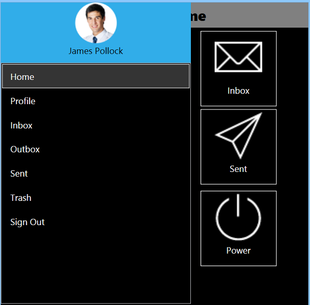
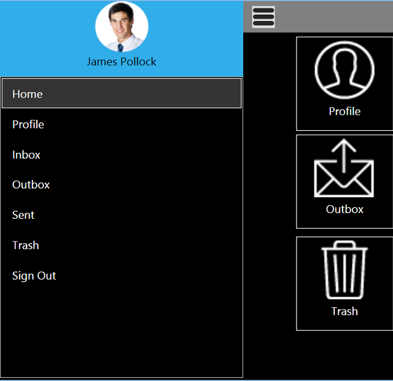
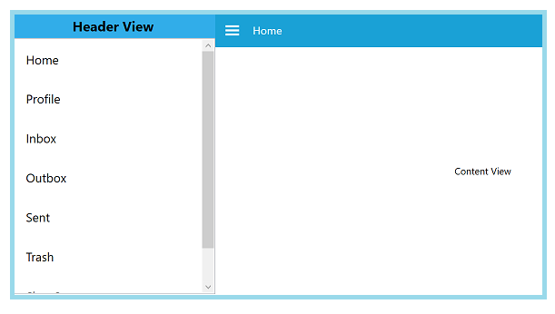

## Transition

The Transition property specifies the animations for the DrawerView panel. The Transition property has the following options:

* SlideOnTop
* Push
* Reveal

The default transition is SlideOnTop that draws the DrawerContent on top of the main content.




<Window x:Class="NavigationDrawerWPF.MainWindow"
        xmlns="http://schemas.microsoft.com/winfx/2006/xaml/presentation"
        xmlns:x="http://schemas.microsoft.com/winfx/2006/xaml"
        xmlns:d="http://schemas.microsoft.com/expression/blend/2008"
        xmlns:mc="http://schemas.openxmlformats.org/markup-compatibility/2006"
        xmlns:syncfusion="http://schemas.syncfusion.com/wpf"
        xmlns:local="clr-namespace:NavigationDrawerWPF"
        mc:Ignorable="d"
        Title="MainWindow" Height="450" Width="800">
    <Window.DataContext>
        <local:ViewModel/>
    </Window.DataContext>
    <syncfusion:SfNavigationDrawer x:Name="navigationDrawer" 
                                   Transition="SlideOnTop"
                                   DrawerWidth="300"
                                   IsOpen="True">
        <syncfusion:SfNavigationDrawer.ContentView>
            <Grid x:Name="mainContentView" 
                  Background="White">
                <Grid.RowDefinitions>
                    <RowDefinition Height="auto"/>
                    <RowDefinition/>
                </Grid.RowDefinitions>
                <StackPanel Background="#1aa1d6" 
                            Orientation="Horizontal">
                    <Button x:Name="hamburgerButton" 
                            BorderBrush="Transparent" 
                            Height="50" Width="50" 
                            HorizontalAlignment="Left"  
                            FontSize="16" 
                            Background="#1aa1d6" Foreground="White" 
                            Click="HamburgerButton_Click">
                        <Image Source="hamburger_icon.png" 
                               Height="20" 
                               Width="20" 
                               HorizontalAlignment="Center" 
                               VerticalAlignment="Center"/>
                    </Button>
                    <Label x:Name="headerLabel" 
                           Height="50" 
                           HorizontalContentAlignment="Center" 
                           VerticalContentAlignment="Center" 
                           Content="Home" 
                           FontSize="16" 
                           Foreground="White" 
                           Background="#1aa1d6"/>
                </StackPanel>
                <Label Grid.Row="1" 
                       x:Name="contentLabel" 
                       VerticalContentAlignment="Center" 
                       HorizontalContentAlignment="Center" 
                       Content="Content View" 
                       FontSize="14" Foreground="Black"/>
            </Grid>
        </syncfusion:SfNavigationDrawer.ContentView>
        <syncfusion:SfNavigationDrawer.DrawerHeaderView>
            <Grid Background="#31ade9">
                <Label Content="Header View" 
                       FontSize="20" 
                       FontWeight="Bold" 
                       HorizontalContentAlignment="Center" 
                       VerticalContentAlignment="Center"/>
            </Grid>
        </syncfusion:SfNavigationDrawer.DrawerHeaderView>
        <syncfusion:SfNavigationDrawer.DrawerContentView>
            <Grid>
                <ListBox x:Name="list" 
                         ItemsSource="{Binding Contents}">
                    <ListBox.ItemTemplate>
                        <DataTemplate>
                            <TextBlock  Text="{Binding Name}" 
                                        Padding="15" 
                                        TextAlignment="Center" 
                                        FontSize="18" 
                                        Foreground="Black"/>
                        </DataTemplate>
                    </ListBox.ItemTemplate>
                </ListBox>
            </Grid>
        </syncfusion:SfNavigationDrawer.DrawerContentView>
    </syncfusion:SfNavigationDrawer>
</Window>





using Syncfusion.UI.Xaml.NavigationDrawer;
using System.Collections.Generic;
using System.Windows;
using System.Windows.Controls;
using System.Windows.Media;

namespace NavigationDrawerWPF
{
    /// 

    /// Interaction logic for MainWindow.xaml
    /// 

    public partial class MainWindow : Window
    {
        public MainWindow()
        {
            InitializeComponent();
            navigationDrawer.Transition = Transition.SlideOnTop;
        }

        private void HamburgerButton_Click(object sender, RoutedEventArgs e)
        {
            navigationDrawer.ToggleDrawer();
        }
    }

    public class ViewModel
    {
        public ViewModel()
        {
            Contents = new List<Model>();

            Contents.Add(new Model() { Name = "Home" });
            Contents.Add(new Model() { Name = "Profile" });
            Contents.Add(new Model() { Name = "Inbox" });
            Contents.Add(new Model() { Name = "Outbox" });
            Contents.Add(new Model() { Name = "Sent" });
            Contents.Add(new Model() { Name = "Trash" });
            Contents.Add(new Model() { Name = "Sign Out" });
        }

        public List<Model> Contents { get; set; }
    }

    public class Model
    {
        public string Name { get; set; }
    }
}





The following code example shows how to set Transition as Push to SfNavigationDrawer. This transition moves the Drawer and main content simultaneously.




<Window x:Class="NavigationDrawerWPF.MainWindow"
        xmlns="http://schemas.microsoft.com/winfx/2006/xaml/presentation"
        xmlns:x="http://schemas.microsoft.com/winfx/2006/xaml"
        xmlns:d="http://schemas.microsoft.com/expression/blend/2008"
        xmlns:mc="http://schemas.openxmlformats.org/markup-compatibility/2006"
        xmlns:syncfusion="http://schemas.syncfusion.com/wpf"
        xmlns:local="clr-namespace:NavigationDrawerWPF"
        mc:Ignorable="d"
        Title="MainWindow" Height="450" Width="800">
    <Window.DataContext>
        <local:ViewModel/>
    </Window.DataContext>
    <syncfusion:SfNavigationDrawer x:Name="navigationDrawer" 
                                   Transition="Push"
                                   DrawerWidth="300"
                                   IsOpen="True">
        <syncfusion:SfNavigationDrawer.ContentView>
            <Grid x:Name="mainContentView" 
                  Background="White">
                <Grid.RowDefinitions>
                    <RowDefinition Height="auto"/>
                    <RowDefinition/>
                </Grid.RowDefinitions>
                <StackPanel Background="#1aa1d6" 
                            Orientation="Horizontal">
                    <Button x:Name="hamburgerButton" 
                            BorderBrush="Transparent" 
                            Height="50" Width="50" 
                            HorizontalAlignment="Left"  
                            FontSize="16" 
                            Background="#1aa1d6" Foreground="White" 
                            Click="HamburgerButton_Click">
                        <Image Source="hamburger_icon.png" 
                               Height="20" 
                               Width="20" 
                               HorizontalAlignment="Center" 
                               VerticalAlignment="Center"/>
                    </Button>
                    <Label x:Name="headerLabel" 
                           Height="50" 
                           HorizontalContentAlignment="Center" 
                           VerticalContentAlignment="Center" 
                           Content="Home" 
                           FontSize="16" 
                           Foreground="White" 
                           Background="#1aa1d6"/>
                </StackPanel>
                <Label Grid.Row="1" 
                       x:Name="contentLabel" 
                       VerticalContentAlignment="Center" 
                       HorizontalContentAlignment="Center" 
                       Content="Content View" 
                       FontSize="14" Foreground="Black"/>
            </Grid>
        </syncfusion:SfNavigationDrawer.ContentView>
        <syncfusion:SfNavigationDrawer.DrawerHeaderView>
            <Grid Background="#31ade9">
                <Label Content="Header View" 
                       FontSize="20" 
                       FontWeight="Bold" 
                       HorizontalContentAlignment="Center" 
                       VerticalContentAlignment="Center"/>
            </Grid>
        </syncfusion:SfNavigationDrawer.DrawerHeaderView>
        <syncfusion:SfNavigationDrawer.DrawerContentView>
            <Grid>
                <ListBox x:Name="list" 
                         ItemsSource="{Binding Contents}">
                    <ListBox.ItemTemplate>
                        <DataTemplate>
                            <TextBlock  Text="{Binding Name}" 
                                        Padding="15" 
                                        TextAlignment="Center" 
                                        FontSize="18" 
                                        Foreground="Black"/>
                        </DataTemplate>
                    </ListBox.ItemTemplate>
                </ListBox>
            </Grid>
        </syncfusion:SfNavigationDrawer.DrawerContentView>
    </syncfusion:SfNavigationDrawer>
</Window>





using Syncfusion.UI.Xaml.NavigationDrawer;
using System.Collections.Generic;
using System.Windows;
using System.Windows.Controls;
using System.Windows.Media;

namespace NavigationDrawerWPF
{
    /// 

    /// Interaction logic for MainWindow.xaml
    /// 

    public partial class MainWindow : Window
    {
        public MainWindow()
        {
            InitializeComponent();
            navigationDrawer.Transition = Transition.Push;
        }

        private void HamburgerButton_Click(object sender, RoutedEventArgs e)
        {
            navigationDrawer.ToggleDrawer();
        }
    }

    public class ViewModel
    {
        public ViewModel()
        {
            Contents = new List<Model>();

            Contents.Add(new Model() { Name = "Home" });
            Contents.Add(new Model() { Name = "Profile" });
            Contents.Add(new Model() { Name = "Inbox" });
            Contents.Add(new Model() { Name = "Outbox" });
            Contents.Add(new Model() { Name = "Sent" });
            Contents.Add(new Model() { Name = "Trash" });
            Contents.Add(new Model() { Name = "Sign Out" });
        }

        public List<Model> Contents { get; set; }
    }

    public class Model
    {
        public string Name { get; set; }
    }
}





                                              

The following code example shows how to set Transition as Reveal to SfNavigationDrawer. In this transition, the Drawer content is stable and the main content is moved to reveal the drawer content.




<Window x:Class="NavigationDrawerWPF.MainWindow"
        xmlns="http://schemas.microsoft.com/winfx/2006/xaml/presentation"
        xmlns:x="http://schemas.microsoft.com/winfx/2006/xaml"
        xmlns:d="http://schemas.microsoft.com/expression/blend/2008"
        xmlns:mc="http://schemas.openxmlformats.org/markup-compatibility/2006"
        xmlns:syncfusion="http://schemas.syncfusion.com/wpf"
        xmlns:local="clr-namespace:NavigationDrawerWPF"
        mc:Ignorable="d"
        Title="MainWindow" Height="450" Width="800">
    <Window.DataContext>
        <local:ViewModel/>
    </Window.DataContext>
    <syncfusion:SfNavigationDrawer x:Name="navigationDrawer" 
                                   Transition="Reveal"
                                   DrawerWidth="300"
                                   IsOpen="True">
        <syncfusion:SfNavigationDrawer.ContentView>
            <Grid x:Name="mainContentView" 
                  Background="White">
                <Grid.RowDefinitions>
                    <RowDefinition Height="auto"/>
                    <RowDefinition/>
                </Grid.RowDefinitions>
                <StackPanel Background="#1aa1d6" 
                            Orientation="Horizontal">
                    <Button x:Name="hamburgerButton" 
                            BorderBrush="Transparent" 
                            Height="50" Width="50" 
                            HorizontalAlignment="Left"  
                            FontSize="16" 
                            Background="#1aa1d6" Foreground="White" 
                            Click="HamburgerButton_Click">
                        <Image Source="hamburger_icon.png" 
                               Height="20" 
                               Width="20" 
                               HorizontalAlignment="Center" 
                               VerticalAlignment="Center"/>
                    </Button>
                    <Label x:Name="headerLabel" 
                           Height="50" 
                           HorizontalContentAlignment="Center" 
                           VerticalContentAlignment="Center" 
                           Content="Home" 
                           FontSize="16" 
                           Foreground="White" 
                           Background="#1aa1d6"/>
                </StackPanel>
                <Label Grid.Row="1" 
                       x:Name="contentLabel" 
                       VerticalContentAlignment="Center" 
                       HorizontalContentAlignment="Center" 
                       Content="Content View" 
                       FontSize="14" Foreground="Black"/>
            </Grid>
        </syncfusion:SfNavigationDrawer.ContentView>
        <syncfusion:SfNavigationDrawer.DrawerHeaderView>
            <Grid Background="#31ade9">
                <Label Content="Header View" 
                       FontSize="20" 
                       FontWeight="Bold" 
                       HorizontalContentAlignment="Center" 
                       VerticalContentAlignment="Center"/>
            </Grid>
        </syncfusion:SfNavigationDrawer.DrawerHeaderView>
        <syncfusion:SfNavigationDrawer.DrawerContentView>
            <Grid>
                <ListBox x:Name="list" 
                         ItemsSource="{Binding Contents}">
                    <ListBox.ItemTemplate>
                        <DataTemplate>
                            <TextBlock  Text="{Binding Name}" 
                                        Padding="15" 
                                        TextAlignment="Center" 
                                        FontSize="18" 
                                        Foreground="Black"/>
                        </DataTemplate>
                    </ListBox.ItemTemplate>
                </ListBox>
            </Grid>
        </syncfusion:SfNavigationDrawer.DrawerContentView>
    </syncfusion:SfNavigationDrawer>
</Window>





using Syncfusion.UI.Xaml.NavigationDrawer;
using System.Collections.Generic;
using System.Windows;
using System.Windows.Controls;
using System.Windows.Media;

namespace NavigationDrawerWPF
{
    /// 

    /// Interaction logic for MainWindow.xaml
    /// 

    public partial class MainWindow : Window
    {
        public MainWindow()
        {
            InitializeComponent();
            navigationDrawer.Transition = Transition.Reveal;
        }

        private void HamburgerButton_Click(object sender, RoutedEventArgs e)
        {
            navigationDrawer.ToggleDrawer();
        }
    }

    public class ViewModel
    {
        public ViewModel()
        {
            Contents = new List<Model>();

            Contents.Add(new Model() { Name = "Home" });
            Contents.Add(new Model() { Name = "Profile" });
            Contents.Add(new Model() { Name = "Inbox" });
            Contents.Add(new Model() { Name = "Outbox" });
            Contents.Add(new Model() { Name = "Sent" });
            Contents.Add(new Model() { Name = "Trash" });
            Contents.Add(new Model() { Name = "Sign Out" });
        }

        public List<Model> Contents { get; set; }
    }

    public class Model
    {
        public string Name { get; set; }
    }
}





  

## Animation duration

Gets or sets the TimeSpan value, by which the DrawerContent can be brought to view.




<Window x:Class="NavigationDrawerWPF.MainWindow"
        xmlns="http://schemas.microsoft.com/winfx/2006/xaml/presentation"
        xmlns:x="http://schemas.microsoft.com/winfx/2006/xaml"
        xmlns:d="http://schemas.microsoft.com/expression/blend/2008"
        xmlns:mc="http://schemas.openxmlformats.org/markup-compatibility/2006"
        xmlns:syncfusion="http://schemas.syncfusion.com/wpf"
        xmlns:local="clr-namespace:NavigationDrawerWPF"
        mc:Ignorable="d"
        Title="MainWindow" Height="450" Width="800">
    <syncfusion:SfNavigationDrawer x:Name="navigationDrawer"
                                   AnimationDuration="100">
        <syncfusion:SfNavigationDrawer.DrawerHeaderView>
            <Grid Background="#31ade9">
                <Label Content="Header View" 
                       FontSize="20" 
                       FontWeight="Bold" 
                       HorizontalContentAlignment="Center" 
                       VerticalContentAlignment="Center"/>
            </Grid>
        </syncfusion:SfNavigationDrawer.DrawerHeaderView>
    </syncfusion:SfNavigationDrawer>
</Window>





using Syncfusion.UI.Xaml.NavigationDrawer;
using System.Windows;
using System.Windows.Controls;
using System.Windows.Media;

namespace NavigationDrawerWPF
{
    /// 

    /// Interaction logic for MainWindow.xaml
    /// 

    public partial class MainWindow : Window
    {
        public MainWindow()
        {
            InitializeComponent();
            SfNavigationDrawer navigationDrawer = new SfNavigationDrawer()
            {
                AnimationDuration = new System.TimeSpan(100)
            };

            Grid grid = new Grid()
            {
                Background = new SolidColorBrush((Color)ColorConverter.ConvertFromString("#31ade9"))
            };

            Label label = new Label()
            {
                Content = "Header View",
                FontSize = 20,
                FontWeight = FontWeights.Bold,
                HorizontalContentAlignment = HorizontalAlignment.Center,
                VerticalContentAlignment = VerticalAlignment.Center
            };

            grid.Children.Add(label);
            navigationDrawer.DrawerHeaderView = grid;

            this.Content = navigationDrawer;
        }
    }
}



                   

