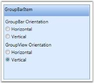

# Adding Content to GroupBar Item in WPF Navigation Pane (GroupBar)

You can add content to a GroupBar Item using a Panel or a GroupView control. Any content can be added to the GroupBar Item by adding any control inside the panel. To view the contents of a GroupBar Item in ListView mode, add the GroupView as content in the GroupBar Item.

## Adding GroupView to GroupBar Item

GroupView control can be added to the GroupBar Item by using XAML or C# code. Here is the code snippet.


 
<!-- Adding GroupBar -->
<syncfusion:GroupBar Height="200" Width="230" Name="groupBar">  
<!-- Adding GroupBarItem -->  
<syncfusion:GroupBarItem Name="groupBarItem" Header="GroupBarItem"> 
<!-- Adding GroupView to GroupBarItem -->  
<syncfusion:GroupView Name="groupView"/>  
</syncfusion:GroupBarItem>
</syncfusion:GroupBar> 
 

 
//Creating an instance of GroupBar
GroupBar groupBar = new GroupBar();
//Creating an instance of GroupBarItem
GroupBarItem groupBarItem = new GroupBarItem();
//Setting header for groupbar item
groupBarItem.Header = "GroupBarItem";
//Creating an instance of GroupView
GroupView groupView = new GroupView();
//Adding GroupView to GroupViewItem
groupBarItem.Content = groupView;
//Adding GroupBar item to GroupBar
groupBar.Items.Add(groupBarItem);
//Adding GroupBar to the windowthis.Content = groupBar;
  


## Adding GroupView Item to GroupView

GroupView Item can be added to a GroupView using XAML or C# code. Here is the code snippet.


 
<!-- Adding GroupBar -->
<syncfusion:GroupBar Height="200" Width="230" Name="groupBar">
<!-- Adding GroupBarItem --> 
<syncfusion:GroupBarItem Name="groupBarItem" Header="GroupBarItem">  
<!-- Adding GroupView to GroupBarItem -->   
<syncfusion:GroupView Name="groupView">     
<!-- Adding GroupViewItem to GroupView -->   
<syncfusion:GroupViewItem Name="groupViewItem"                 Text="GroupViewItem"/> 
</syncfusion:GroupView>  
</syncfusion:GroupBarItem>
</syncfusion:GroupBar> 
   

 
//Creating an instance of GroupBar
GroupBar groupBar = new GroupBar();
//Creating an instance of GroupBarItem
GroupBarItem groupBarItem = new GroupBarItem();
//Setting header for groupbar item
groupBarItem.Header = "GroupBarItem";
//Creating an instance of GroupView
GroupView groupView = new GroupView();
//Creating an instance of GroupViewItem
GroupViewItem groupViewItem = new GroupViewItem();
//Adding content to GroupViewItem
groupViewItem.Text = "GroupViewItem";
//Adding GroupViewItem to GroupView
groupView.Items.Add(groupViewItem);
//Adding content of GroupBarItem as GroupView;
groupBarItem.Content = groupView;
//Adding GroupBar item to GroupBar
groupBar.Items.Add(groupBarItem);
//Adding GroupBar to the window
this.Content = groupBar; 
 


## Adding Panel to GroupBar Item

You can add content to the GroupBar Item using a Panel as follows. This is achieved using the following code snippet.



<!-- Adding GroupBar -->

<syncfusion:GroupBar Height="200" Width="230" Name="groupBar">

  <!-- Adding GroupBarItem -->

  <syncfusion:GroupBarItem Name="groupBarItem" Header="GroupBarItem">

    <!-- Adding content for groupbar item using panel -->

    <StackPanel Orientation="Vertical">

      <TextBlock Text="GroupBar Orientation" Margin="4,4,2,2"/>

      <RadioButton IsChecked="True" Margin="4,2,2,2">Horizontal</RadioButton>

      <RadioButton Margin="4,2,2,2">Vertical</RadioButton>

      <TextBlock Text="GroupView Orientation" Margin="4,4,2,2"/>

      <RadioButton Margin="4,2,2,2">Horizontal</RadioButton>

      <RadioButton IsChecked="True" Margin="4,2,2,2">Vertical</RadioButton>

    </StackPanel>

  </syncfusion:GroupBarItem>

</syncfusion:GroupBar>



N> To display the GroupView Item, you must already have a GroupView control in which you are going to add the GroupView Item.

## Events to handle with GroupBar Item

The events of GroupBarItem are GroupBarItemAdded and GroupBarItemRemoved. 

* GroupBarItemAdded – which is called when GroupBarItem is added. GroupBarItem can be added either by using procedural code or by using context menu to add new item.
* GroupBarItemRemoved – which is called when GroupBarItem is removed. GroupBarItem can be removed by using procedural code or by using context menu to remove an existing item.

