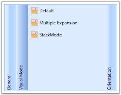
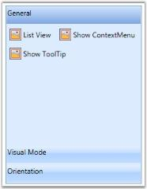

# Changing the orientations of GroupBar GroupBar itemsGroupView GroupViewItems in WPF Navigation Pane (GroupBar)

You can change the layout of the entire GroupBar. GroupBar control has the Orientation property, which lets you place the contents of GroupBar either vertically or horizontally. It provides the following options.

* **Horizontal**: the contents of the GroupBar Item in the GroupBar control are placed horizontally.
* **Vertical**: the contents of the GroupBar Item in GroupBar control are placed vertically.

Use the following code snippet to set GroupBar Orientation to Horizontal.



<!-- Adding GroupBar -->
<syncfusion:GroupBar Height="300" Width="230" Orientation="Horizontal" Name="groupBar">  
<!-- Adding GroupBarItem -->  
<syncfusion:GroupBarItem Name="groupBarItem1" Header="General"> 
   <!-- Adding content for GroupBar item using GroupView -->
   <syncfusion:GroupView>     
   <syncfusion:GroupViewItem Text="List View"/>   
   <syncfusion:GroupViewItem Text="Show ContextMenu"/>  
   <syncfusion:GroupViewItem Text="Show ToolTip"/>  
   </syncfusion:GroupView> 
   </syncfusion:GroupBarItem>  
   <!-- Adding GroupBarItem --> 
   <syncfusion:GroupBarItem Name="groupBarItem2" Header="Visual Mode"> 
   <!-- Adding content for GroupBar item using GroupView --> 
   <syncfusion:GroupView>      
   <syncfusion:GroupViewItem Text="Default"/>  
   <syncfusion:GroupViewItem Text="Multiple Expansion"/> 
   <syncfusion:GroupViewItem Text="StackMode"/>  
   </syncfusion:GroupView>  
   </syncfusion:GroupBarItem>  
   <!-- Adding GroupBarItem -->  
   <syncfusion:GroupBarItem Name="groupBarItem4" Header="Orientation"> 
   <!-- Adding content for GroupBar item using panel -->  
   <StackPanel Orientation="Vertical">     
   <TextBlock Text="GroupBar Orientation" Margin="4,4,2,2"/>   
   <RadioButton IsChecked="True" Margin="4,2,2,2">Horizontal</RadioButton>     
   <RadioButton Margin="4,2,2,2">Vertical</RadioButton>      
   <TextBlock Text="GroupView Orientation" Margin="4,4,2,2"/>    
   <RadioButton Margin="4,2,2,2">Horizontal</RadioButton>   
   <RadioButton IsChecked="True" Margin="4,2,2,2">Vertical</RadioButton>
   </StackPanel>
   </syncfusion:GroupBarItem>
   </syncfusion:GroupBar> 
    


//Setting orientation as horizontal
groupBar.Orientation = Orientation.Horizontal; 
 


Use the following code snippet to set groupbar Orientation to Vertical.



//Setting orientation as vertical

groupBar.Orientation = Orientation.Vertical;



You can also change the orientation of the GroupView alone by using the Orientation property for GroupView. There are two types of orientation in GroupView control as in GroupBar.

* Horizontal
* Vertical

Use the following code snippet to set GroupView Orientation to Horizontal.



<!-- Adding GroupBar -->
 <syncfusion:GroupBar Height="300" Width="230" Name="groupBar">
 <!-- Adding GroupBarItem -->
 <syncfusion:GroupBarItem Name="groupBarItem1" Header="General"> 
 <!-- Adding content for GroupBar item using GroupView --> 
 <syncfusion:GroupView Name="groupView" Orientation="Horizontal"> 
 <syncfusion:GroupViewItem Text="List View"/>  
 <syncfusion:GroupViewItem Text="Show ContextMenu"/>  
 <syncfusion:GroupViewItem Text="Show ToolTip"/>  
 </syncfusion:GroupView></syncfusion:GroupBarItem>
 <!-- Adding GroupBarItem -->
 <syncfusion:GroupBarItem Name="groupBarItem2" Header="Visual Mode"> 
 <!-- Adding content for GroupBar item using GroupView --> 
 <syncfusion:GroupView>    
 <syncfusion:GroupViewItem Text="Default"/> 
 <syncfusion:GroupViewItem Text="Multiple Expansion"/> 
 <syncfusion:GroupViewItem Text="StackMode"/> 
 </syncfusion:GroupView></syncfusion:GroupBarItem>
 <!-- Adding GroupBarItem -->
 <syncfusion:GroupBarItem Name="groupBarItem4" Header="Orientation"> 
 <!-- Adding content for GroupBar item using panel --> 
 <StackPanel Orientation="Vertical">   
 <TextBlock Text="GroupBar Orientation" Margin="4,4,2,2"/>    
 <RadioButton IsChecked="True" Margin="4,2,2,2">Horizontal</RadioButton>
 <RadioButton Margin="4,2,2,2">Vertical</RadioButton>  
 <TextBlock Text="GroupView Orientation" Margin="4,4,2,2"/>   
 <RadioButton Margin="4,2,2,2">Horizontal</RadioButton> 
 <RadioButton IsChecked="True" Margin="4,2,2,2">Vertical</RadioButton> 
 </StackPanel></syncfusion:GroupBarItem>
 </syncfusion:GroupBar>
  


//Setting the orientation of GroupView as Horizontal
groupView.Orientation = Orientation.Horizontal; 
 


Use the following code snippet to set GroupView Orientation to Vertical.



//Setting the orientation of GroupView as Horizontal

groupView.Orientation = Orientation.Vertical;



 

## Events to Handle Orientation of Groupbar

The events corresponding to this property are [OrientationChanged]() and [OrientationChanging]().           

## OrientationChanged Event

This event is called when the orientation of groupbar is changed and is triggered when the Orientation property is changed.

## OrientationChanging Event

This event is called when orientation of groupbar is changing and is triggered when the Orientation property is changing.

