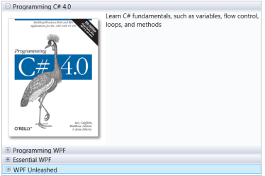

# Data-Binding in WPF Navigation Pane (GroupBar)

You can bind the custom object to the DataContext property of the GroupBar control and their corresponding elements can be binded with the children of the GroupBar control. When a DataContext is set to a window or to a GroupBar, it gets inherited to all its logical children. The OnInitialized method will get this DataContext value. As you use this DataContext in the template with DataTriggers, you need to set that property to active host tab or null.

Use the code snippet to apply a DataContext to the GroupBar control.




<Window x:Class="WpfApplication1.Window1"
    xmlns="http://schemas.microsoft.com/winfx/2006/xaml/presentation"
    xmlns:x="http://schemas.microsoft.com/winfx/2006/xaml"
    xmlns:syncfusion="http://schemas.syncfusion.com/wpf"
    xmlns:local="clr-namespace:WpfApplication1" Title="Window1" Height="300" Width="300">
    <Window.Resources>
        <!--Custom object which is defined in the code behind can be accessed through the key logic in XAML-->
        <local:GroupData x:Key="groupData" />
    </Window.Resources>
    <Grid Margin="30">
        <!-- Adding GroupBar -->
        <syncfusion:GroupBar Height="200" DataContext="{Binding groupData}" VisualMode="Default" AllowCollapse="True" Width="230" Name="groupBar">
            <!-- Adding GroupBarItem -->
            <syncfusion:GroupBarItem Name="groupBarItem" Header="{Binding Header}">
                <!-- Adding content for GroupBar item using panel -->
                <StackPanel Orientation="Vertical">
                    <TextBlock Text="GroupBar Orientation" Margin="4,4,2,2" />
                    <RadioButton IsChecked="True" Margin="4,2,2,2">Horizontal</RadioButton>
                    <RadioButton Margin="4,2,2,2">Vertical</RadioButton>
                    <TextBlock Text="GroupView Orientation" Margin="4,4,2,2" />
                    <RadioButton Margin="4,2,2,2">Horizontal</RadioButton>
                    <RadioButton IsChecked="True" Margin="4,2,2,2">Vertical</RadioButton>
                </StackPanel>
            </syncfusion:GroupBarItem>
            <!-- Adding GroupBarItem -->
            <syncfusion:GroupBarItem Name="groupBarItem1" HeaderImageSource="Label.gif" Header="General">
                <!-- Adding content for GroupBar item using GroupView -->
                <syncfusion:GroupView Name="groupView" IsListViewMode="True">
                    <syncfusion:GroupViewItem Text="{Binding ListView}" />
                    <syncfusion:GroupViewItem Text="Show ContextMenu" />
                    <syncfusion:GroupViewItem Text="Show ToolTip" />
                </syncfusion:GroupView>
            </syncfusion:GroupBarItem>
        </syncfusion:GroupBar>
    </Grid>
</Window> 




/// 
/// Interaction logic for the class GroupData/// 

public class GroupData
{    
	/// 
  
	
	/// Initializes a new instance of the <see cref="GroupData"/> class. 
	
	/// 
  
	
	public GroupData()   
	{   
    
	  this.Header = "GroupBarItem1";     
	  this.ListView = "ListViewItem";  
	  
	} 
	/// 
   
	
	/// Gets or sets the header.   
	
	/// 
 
	
	/// <value>The header.</value> 
	
	public string Header 
	{       
	
	  get;   
	  set; 
	  
	}   
	/// 
   
	
	/// Gets or sets the list view. 
	
	/// 
    
	
	/// <value>The list view.</value> 
	

	public string ListView   
	{        
	
	  get;   
	  set;  
	  
	}
}



## Data-Binding to Objects

The GroupBar control also supports binding to objects. The following example demonstrates this.

1. Create a class that acts as a model for the GroupBar control.

   ~~~csharp

	public class Model

	{

		public string Header 
		{
			get;
			set;
		}

		public string Content 
		{
			get;
			set;
		}

		public bool IsSelected 
		{
			get;
			set;
		}

	}

   ~~~

2. Create a ViewModel class and initialize the items as follows.

   
   ~~~csharp
   
	public class ViewModel

	{

		public ObservableCollection < Model > GroupItems 
		{
			get;
			set;
		}

		public ViewModel()

		{

			GroupItems = new ObservableCollection < Model > ();

			PopulateData();

		}

		private void PopulateData()

		{

			Model model1 = new Model() 
			{
			Header = "Item1", Content = "GroupBarItem1", IsSelected = true
			};

			Model model2 = new Model() 
			{
			Header = "Item2", Content = "GroupBarItem2"
			};

			Model model3 = new Model() 
			{
			Header = "Item3", Content = "GroupBarItem3"
			};

			Model model4 = new Model() 
			{
			Header = "Item4", Content = "GroupBarItem4"
			};

			GroupItems.Add(model1);

			GroupItems.Add(model2);

			GroupItems.Add(model3);

			GroupItems.Add(model4);

		}

	}

			   
   ~~~

3. Create a ViewModel instance and use it as DataContext for the root window.

   ~~~xaml

	<Window.DataContext>

		<local:ViewModel/>

	</Window.DataContext>	

   ~~~		

4. Now configure the ItemsSource and ItemContainerStyle of GroupBar.

   ~~~xaml

	<syncfusion:GroupBar Name="groupBar1" ItemsSource="{Binding GroupItems}" VisualMode="StackMode">

		<syncfusion:GroupBar.ItemContainerStyle>

		

		</syncfusion:GroupBar.ItemContainerStyle>

	</syncfusion:GroupBar>

			
   ~~~

This creates the following GroupBar control. 

   

## Data-Binding with XML

An XML file can also be used as the ItemsSource for the GroupBar control. The following example illustrates this.

1. Create an XML file with the following information and name it Data.xml.

   ~~~xaml

	<?xml version="1.0" encoding="utf-8" ?>

	<Books>

		<Book Name="Programming C# 4.0" Description="Learn C#  fundamentals, such as variables, flow control, loops, and methods" ImagePath="programming-c-sharp-four.png" />

		<Book Name="Programming WPF" Description="A tutorial on XAML, the new HTML-like markup language for declaring Windows UI" ImagePath="programming-wpf.png" />

		<Book Name="Essential WPF" Description="Visuals and media, including 2D, 3D, video, and animation" ImagePath="essential_wpf.png" />

		<Book Name="WPF Unleashed" Description="Examines the WPF feature areas in incredible depth: controls, layout, resources, data binding, styling, graphics, animation, and more" ImagePath="wpf-unleashed.png" />

	</Books>

   ~~~

			

2. Add the XmlDataProvider for the XML document.

   ~~~xaml

    <XmlDataProvider Source="Data.xml" x:Key="xmlSource" XPath="Books" />
			
   ~~~

3. ItemsSource property for the GroupBar control.

   ~~~xaml
   
	<syncfusion:GroupBar Name="groupBar1" Margin="20" ItemsSource="{Binding Source={StaticResource xmlSource}, XPath=Book}" VisualMode="MultipleExpansion">
		<syncfusion:GroupBar.ItemContainerStyle>
			
	</syncfusion:GroupBar.ItemContainerStyle>undefined</syncfusion:GroupBar>

   ~~~
		

This will create the following GroupBar control.

 
