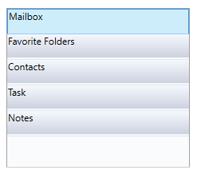

# Getting Started with WPF Navigation Pane (GroupBar)

## Assembly deployment

Refer to the [control dependencies](https://help.syncfusion.com/wpf/control-dependencies#groupbar) section to get the list of assemblies or NuGet package that needs to be added as a reference to use the control in any application.

You can find more details about installing the NuGet package in a WPF application in the following link:

[How to install nuget packages](https://help.syncfusion.com/wpf/nuget-packages)

## Create a simple application with GroupBar

You can create a WPF application with GroupBar control using the following steps:

## Create a project

Create a new WPF project in Visual Studio to display the GroupBar with functionalities.

## Add control through designer

The GroupBar control can be added to an application by dragging it from the toolbox to a designer view. The following assembly references will be added automatically.

* Syncfusion.Tools.WPF
* Syncfusion.Shared.WPF

## Add control manually in XAML

To add the control manually in XAML, follow the given steps:

1.	Add the following required assembly references to the project:
    * Syncfusion.Tools.WPF
    * Syncfusion.Shared.WPF
2.	Import Syncfusion WPF schema **http://schemas.syncfusion.com/wpf** in the XAML page.
3.	Declare the GroupBar control in the XAML page.



<Window xmlns="http://schemas.microsoft.com/winfx/2006/xaml/presentation"
		xmlns:x="http://schemas.microsoft.com/winfx/2006/xaml"
		xmlns:syncfusion="http://schemas.syncfusion.com/wpf" 
		x:Class="GroupBarSample.MainWindow"
		Title="GroupBar Sample" Height="350" Width="525">
	<Grid>
		<!--Adding GroupBar Control -->
		<syncfusion:GroupBar Name="groupBar"/>
	</Grid>
</Window>



## Add control manually in C\#

To add the control manually in C#, follow the given steps:
1.	Add the following required assembly references to the project:
    * Syncfusion.Tools.WPF
    * Syncfusion.Shared.WPF
2.	Import the GroupBar namespace **using Syncfusion.Windows.Tools.Controls;**.
3.	Create a GroupBar instance, and add it to the window.



using Syncfusion.Windows.Tools.Controls;
namespace GroupBarSample
{
	/// 

	/// Interaction logic for MainWindow.xaml
	/// 

	public partial class MainWindow : Window
	{
		public MainWindow()
		{
			InitializeComponent();
			//Creating an instance of GroupBar control
			GroupBar groupBar = new GroupBar();
			//Adding GroupBar as window content
			this.Content = groupBar;
		}
	}
}



## Add items using GroupBarItem

You can add the group bar items inside the GroupBar control using [GroupBarItem](https://help.syncfusion.com/cr/wpf/Syncfusion.Windows.Tools.Controls.GroupBarItem.html).



<!-- Adding GroupBar -->
<syncfusion:GroupBar Height="200" Width="230" Name="groupBar">
	<!-- Adding GroupBarItem -->
	<syncfusion:GroupBarItem Name="groupBarItem" Header="Mailbox"/>
	<syncfusion:GroupBarItem Name="groupBarItem1" Header="Favorite Folders"/>
	<syncfusion:GroupBarItem Name="groupBarItem2" Header="Contacts"/>
	<syncfusion:GroupBarItem Name="groupBarItem3" Header="Task"/>
	<syncfusion:GroupBarItem Name="groupBarItem4" Header="Notes"/>
</syncfusion:GroupBar>


GroupBar groupBar = new GroupBar();

//Instance for GroupBarItem
GroupBarItem groupBarItem1 = new GroupBarItem();
GroupBarItem groupBarItem2 = new GroupBarItem();
GroupBarItem groupBarItem3 = new GroupBarItem();
GroupBarItem groupBarItem4 = new GroupBarItem();
GroupBarItem groupBarItem5 = new GroupBarItem();

//Setting text for GroupBarItem
groupBarItem1.HeaderText = "Mailbox";
groupBarItem2.HeaderText = "Favorite Folders";
groupBarItem3.HeaderText = "Contacts";
groupBarItem4.HeaderText = "Task";
groupBarItem5.HeaderText = "Notes";

//Adding group bar items into group bar
groupBar.Items.Add(groupBarItem1);
groupBar.Items.Add(groupBarItem2);
groupBar.Items.Add(groupBarItem3);
groupBar.Items.Add(groupBarItem4);
groupBar.Items.Add(groupBarItem5);

this.Content = groupBar;



## Bind data

Items in a GroupBar can also be added by binding a collection of business objects using the [ItemsSource](https://docs.microsoft.com/en-us/dotnet/api/system.windows.controls.itemscontrol.itemssourceproperty?view=netframework-4.7.2) property.

* **Model.cs**



public class Model
{
	public string Header
	{
		get;
		set;
	}
	public string Content
	{
		get;
		set;
	}
	public bool IsSelected
	{
		get;
		set;
	}
}



* **ViewModel.cs**



public class ViewModel
{
	private ObservableCollection<Model> groupBarData;
	public ObservableCollection<Model> GroupData
	{
		get { return groupBarData; }
		set
		{
			groupBarData = value;
		}
	}
	public ViewModel()
	{
		GroupData = new ObservableCollection<Model>();
		populateGroupBar();
	}
	private void populateGroupBar()
	{
		GroupData.Add(new Model() { Header = "Mailbox", Content = "GroupBarItem1", IsSelected = true });
		GroupData.Add(new Model() { Header = "Favorite Folder", Content = "GroupBarItem2", IsSelected = false });
		GroupData.Add(new Model() { Header = "Contacts", Content = "GroupBarItem3", IsSelected = false });
		GroupData.Add(new Model() { Header = "Task", Content = "GroupBarItem4", IsSelected = false });
		GroupData.Add(new Model() { Header = "Notes", Content = "GroupBarItem5", IsSelected = false });
	}
}



* **MainWindow.Xaml**



<Window.DataContext>
	<local:ViewModel/>
</Window.DataContext>
<syncfusion:GroupBar Name="groupBar" ItemsSource="{Binding GroupData}" VisualMode="StackMode">
	<syncfusion:GroupBar.ItemContainerStyle>
		
	</syncfusion:GroupBar.ItemContainerStyle>
</syncfusion:GroupBar>




## Add content to GroupBar Item

You can add content to a GroupBar Item using a panel or a [GroupView](https://help.syncfusion.com/cr/wpf/Syncfusion.Windows.Tools.Controls.GroupView.html) control. 



<!-- Adding GroupBar -->
<syncfusion:GroupBar Height="200" Width="230" Name="groupBar" VisualMode="MultipleExpansion" >
	<!-- Adding GroupBarItem -->
	<syncfusion:GroupBarItem Name="groupBarItem" Header="Mailbox">
		<!-- Adding GroupView to GroupBarItem -->
		<syncfusion:GroupView Name="groupView">
			<!-- Adding GroupViewItem to GroupView -->
			<syncfusion:GroupViewItem Name="groupViewItem" ImageSource="Images\inbox.png" Text="Inbox"/>
			<syncfusion:GroupViewItem Name="groupViewItem1" ImageSource="Images\sent.png" Text="Sent Items"/>
			<syncfusion:GroupViewItem Name="groupViewItem2" ImageSource="Images\Notes.png" Text="Notes"/>
			<syncfusion:GroupViewItem Name="groupViewItem3" ImageSource="Images\trash.png" Text="Deleted Items"/>
		</syncfusion:GroupView>
	</syncfusion:GroupBarItem>
</<syncfusion:GroupBar>


//Create instances
GroupBar groupBar = new GroupBar();
GroupBarItem groupBarItem = new GroupBarItem();
GroupView groupView = new GroupView();
GroupViewItem item1 = new GroupViewItem();
GroupViewItem item2 = new GroupViewItem();
GroupViewItem item3 = new GroupViewItem();
GroupViewItem item4 = new GroupViewItem();

//Set header for groupbar item
groupBarItem.Header = "Mailbox";
item1.Text = "Inbox";
item2.Text = "Sent Items";
item3.Text = "Notes";
item4.Text = "Deleted Items";

groupView.Items.Add(item1);
groupView.Items.Add(item2);
groupView.Items.Add(item3);
groupView.Items.Add(item4);

groupBarItem.Content = groupView;
groupBar.Items.Add(groupBarItem);
this.Content = groupBar;



## Expand one or more items

You can expand and collapse any number of groupbar items by setting the [VisualMode](https://help.syncfusion.com/cr/wpf/Syncfusion.Windows.Tools.Controls.GroupBar.html#Syncfusion_Windows_Tools_Controls_GroupBar_VisualMode) to MultipleExpansion.



<!--Expanding more groupbar items -->
<syncfusion:GroupBar Height="200" Width="230" Name="groupBar" VisualMode="MultipleExpansion"/>


//Expanding more groupbar items
groupBar.VisualMode = Syncfusion.Windows.Tools.VisualMode.MultipleExpansion;



## Theme

GroupBar supports various built-in themes. Refer to the below links to apply themes for the GroupBar,

  * [Apply theme using SfSkinManager](https://help.syncfusion.com/wpf/themes/skin-manager)
	
  * [Create a custom theme using ThemeStudio](https://help.syncfusion.com/wpf/themes/theme-studio#creating-custom-theme)

  