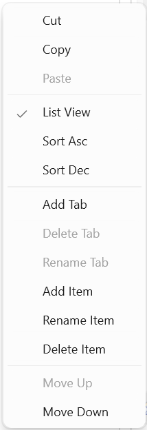
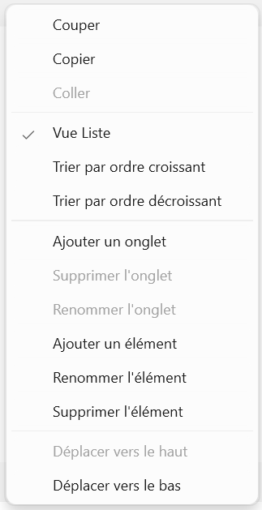
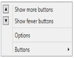

# Localization in WPF Navigation Pane (GroupBar)

Localization involves the customization of the application for a specific language. It translates string values according to the specific culture.  In the following table, the language is English and French

<table>
<tr>
<th>
Property</th><th>
Description</th></tr>
<tr>
<td>
Options </td><td>
Sets the string for the Options property Menu Item In GroupBar.</td></tr>
<tr>
<td colspan = "1">
Options(en-US)                                                                          Options de(fr-FR)</td></tr>
<tr>
<td>
GroupbarMItemCut,
GroupbarMItemCopy,
GroupbarMItemPaste,
GroupbarMItemListView,
GroupbarMItemSortAsc,
GroupbarMItemSortDsc,
GroupbarMItemAddTab,
GroupbarMItemDeleteTab,
GroupbarMItemRenameTab,
GroupbarMItemAddItem,
GroupbarMItemRenameItem,
GroupbarMItemDeleteItem,
GroupbarMItemMoveUp,
GroupbarMItemMoveDown</td><td>
Sets the string for the context menu item in GroupBar.</td></tr>
<tr>
<td colspan = "1">
{{ '' | markdownify}}

{{ '' | markdownify}}

{{ '_ContextMenu(en-US)  ContextMenu(en-US)_' | markdownify }}</td></tr>
<tr>
<td>
Show fewer buttons,
Show more buttonsButtons</td><td>
Sets the string for the Dropdown Menu Item in GroupBar.</td></tr>
<tr>
<td colspan = "1">
{{ '' | markdownify}}

{{ '' | markdownify}}

{{ '_Dropdown Menu Item(en-US)                                                             Dropdown Menu Item(fr-FR)_' | markdownify }}</td></tr>
</table>

