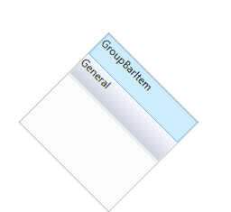

# Rotating the GroupBar in WPF Navigation Pane (GroupBar)

You can rotate the GroupBar in any direction by setting a suitable angle to the RotationAngle property. This dependency property sets the angle of displaying GroupBar. It returns the angle of rotation used for displaying the GroupBar. The default value is _0_.

Use the below code snippet to set this property.



<!-- Adding GroupBar -->
<syncfusion:GroupBar Height="200" Width="230" RotationAngle="45" Name="groupBar">
<!-- Adding GroupBarItem -->
<syncfusion:GroupBarItem Name="groupBarItem" Header="GroupBarItem"> 
 <!-- Adding content for groupbar item using panel --> 
 <StackPanel Orientation="Vertical">  
 <TextBlock Text="GroupBar Orientation" Margin="4,4,2,2"/> 
 <RadioButton IsChecked="True" Margin="4,2,2,2">Horizontal</RadioButton> 
 <RadioButton Margin="4,2,2,2">Vertical</RadioButton>  
 <TextBlock Text="GroupView Orientation" Margin="4,4,2,2"/>
 <RadioButton Margin="4,2,2,2">Horizontal</RadioButton>   
 <RadioButton IsChecked="True" Margin="4,2,2,2">Vertical</RadioButton> 
 </StackPanel></syncfusion:GroupBarItem><!-- Adding GroupBarItem -->
 <syncfusion:GroupBarItem Name="groupBarItem1" HeaderImageSource="Label.gif" Header="General">
 <!-- Adding content for GroupBar item using GroupView -->  
 <syncfusion:GroupView Name="groupView" IsListViewMode="True">   
 <syncfusion:GroupViewItem Text="List View"/>    
 <syncfusion:GroupViewItem Text="Show ContextMenu"/>   
 <syncfusion:GroupViewItem Text="Show ToolTip"/> 
 </syncfusion:GroupView></syncfusion:GroupBarItem>
 </syncfusion:GroupBar>
 


//Set the rotation angle
groupBar.RotationAngle = 45; 
 




Rotating the Content in the GroupBar


