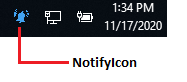
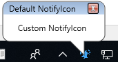

# Getting Started with WPF NotifyIcon

This section provides you an overview of working with [NotifyIcon](https://help.syncfusion.com/cr/wpf/Syncfusion.Windows.Tools.Controls.NotifyIcon.html) for WPF and provides a walk through to configure the NotifyIcon control in a real time scenario.

## Assembly deployment

Refer to the [control dependencies](https://help.syncfusion.com/wpf/control-dependencies#notifyicon) section to get the list of assemblies or NuGet package needs to be added as a reference to use the control in any application.

Further information on installing the NuGet package can be found in the following link:
[How to install nuget packages](https://help.syncfusion.com/wpf/visual-studio-integration/nuget-packages).

You can also use the [Syncfusion Reference Manager](https://help.syncfusion.com/wpf/visual-studio-integration/visual-studio-extensions/add-references) to refer to the NotifyIcon's dependent assemblies.

## Creating application with NotifyIcon control

In this walk through, you will create a WPF application that contains the NotifyIcon control.

## Creating project

Create a new WPF project to show the [NotifyIcon](https://help.syncfusion.com/cr/wpf/Syncfusion.Windows.Tools.Controls.NotifyIcon.html) control in Visual Studio.

## Adding control via designer

The `NotifyIcon` control can be added to the application by dragging it from Toolbox and dropping it in the designer. The required [assemblies](https://help.syncfusion.com/wpf/control-dependencies#notifyicon) will be added automatically.

## Adding control manually in XAML

To add the control manually in XAML page, follow the given steps:

1.Add the following required assembly references to the project,

* Syncfusion.Shared.WPF
* Syncfusion.Tools.WPF

2.Import Syncfusion.WPF schema **http://schemas.syncfusion.com/wpf** in the XAML page or Syncfusion.Windows.Tools.Controls namespace.

3.Declare `NotifyIcon` control in XAML page.





<Window
        xmlns="http://schemas.microsoft.com/winfx/2006/xaml/presentation"
        xmlns:x="http://schemas.microsoft.com/winfx/2006/xaml"
        xmlns:d="http://schemas.microsoft.com/expression/blend/2008"
        xmlns:mc="http://schemas.openxmlformats.org/markup-compatibility/2006"
        xmlns:local="clr-namespace:NotifyIcon_GettingStarted"
        xmlns:syncfusion="http://schemas.syncfusion.com/wpf" x:Class="NotifyIcon_GettingStarted.MainWindow"
        mc:Ignorable="d"
        Title="MainWindow" Height="450" Width="800">
    <Grid>
        <syncfusion:NotifyIcon Header="NotifyIcon" Height="100" Width="100"/>
    </Grid>
</Window>





## Adding control manually in C#

To add the control manually in C#, follow the given steps:

1.Add the following required assembly references to the project,

* Syncfusion.Shared.WPF
* Syncfusion.Tools.WPF

2.Import the `NotifyIcon` namespace **Syncfusion.Windows.Tools.Controls**.

3.Create the `NotifyIcon` control instance and add it to the page.





using Syncfusion.Windows.Tools.Controls;
using System.Windows;

namespace NotifyIcon_GettingStarted
{
    /// 

    /// Interaction logic for MainWindow.xaml
    /// 

    public partial class MainWindow : Window
    {
        public MainWindow()
        {
            InitializeComponent();
            NotifyIcon notifyIcon = new NotifyIcon();
            this.Content = notifyIcon;
        }
    }
}





## Show the notify icon

You can set the icon to the [NotifyIcon](https://help.syncfusion.com/cr/wpf/Syncfusion.Windows.Tools.Controls.NotifyIcon.html) control using the [Icon](https://help.syncfusion.com/cr/wpf/Syncfusion.Windows.Tools.Controls.NotifyIcon.html#Syncfusion_Windows_Tools_Controls_NotifyIcon_Icon) property and then display the notify icon by setting the [ShowInTaskBar](https://help.syncfusion.com/cr/wpf/Syncfusion.Windows.Tools.Controls.NotifyIcon.html#Syncfusion_Windows_Tools_Controls_NotifyIcon_ShowInTaskBar) property to `true`.





<syncfusion:NotifyIcon Name="notify" Header="NotifyIcon" Height="100" ShowInTaskBar="True" Width="100" Icon="images\notifyicon.png" />





## Text

You can use the [Text](https://help.syncfusion.com/cr/wpf/Syncfusion.Windows.Tools.Controls.NotifyIcon.html#Syncfusion_Windows_Tools_Controls_NotifyIcon_Text) property to add text to the `NotifyIcon` control. It will be shown on the notify icon while hovering.





<syncfusion:NotifyIcon Name="notify" Header="NotifyIcon" Height="100" ShowInTaskBar="True" Width="100" Icon="images\notifyicon.png" Text="Notify me" />





## Tooltip

You can show the tooltip for `NotifyIcon` control by using [ShowBalloonTip](https://help.syncfusion.com/cr/wpf/Syncfusion.Windows.Tools.Controls.NotifyIcon.html#Syncfusion_Windows_Tools_Controls_NotifyIcon_ShowBalloonTip_System_Int32_) method. You can also add title and text by using [BalloonTipTitle](https://help.syncfusion.com/cr/wpf/Syncfusion.Windows.Tools.Controls.NotifyIcon.html#Syncfusion_Windows_Tools_Controls_NotifyIcon_BalloonTipTitle) and [BalloonTipText](https://help.syncfusion.com/cr/wpf/Syncfusion.Windows.Tools.Controls.NotifyIcon.html#Syncfusion_Windows_Tools_Controls_NotifyIcon_BalloonTipText) properties. You can enable the title by setting the [BalloonTipHeaderVisibility](https://help.syncfusion.com/cr/wpf/Syncfusion.Windows.Tools.Controls.NotifyIcon.html#Syncfusion_Windows_Tools_Controls_NotifyIcon_BalloonTipHeaderVisibility) property to `true`.





<syncfusion:NotifyIcon Name="notify" Header="NotifyIcon" Height="80" ShowInTaskBar="True" Width="150" 
                       Icon="images\notifyicon.png" Text="Notify me"
                       BalloonTipTitle="Default NotifyIcon" BalloonTipText="Custom NotifyIcon" 
                       BalloonTipHeaderVisibility="Visible" />





//Show the balloontip.
notify.ShowBalloonTip(3000);





