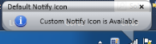

# Layout Related Features

This section illustrates the following Layout-related feature of NotifyIcon control.

## Setting VisualStyle for NotifyIcon

NotifyIcon supports different visual styles to enhance its look and feel. The visual style for the NotifyIcon is set by using the VisualStyle property.

### Property table

<table>
<tr>
<th>
Property</th><th>
Description</th></tr>
<tr>
<td>
VisualStyle</td><td>
Sets the visual style for the NotifyIcon control. The options provided are as follows.BlendOffice2003Office2007BlueOffice2007BlackOffice2007SilverShinyBlueShinyRedSyncOrangeVS2010MetroTransparent</td></tr>
</table>

The below code can be used to set various visual style.



//For Office2007Blue

SkinStorage.VisualStyle(notifyIcon, "Office2007Blue");

//For Blend

SkinStorage.VisualStyle(notifyIcon, Blend");

//For Office2007Silver

SkinStorage.VisualStyle(notifyIcon, "Office2007Silver");



NotifyIcon with "Office2007Blue" Visual Style
{:.caption}

NotifyIcon with "Blend" Visual Style
{:.caption}

NotifyIcon with "Office2007Silver" Visual Style
{:.caption}

NotifyIcon with "Metro" Visual Style
{:.caption}

NotifyIcon with "Transparent" Visual Style
{:.caption}

## Customizing the Header of the NotifyIcon

You can set the background and foreground for the BalloonTipHeader by using the HeaderBackground and HeaderForeground properties, respectively. Use the code below to set these properties.




<syncfusion:NotifyIcon Name="notifyIcon" BalloonTipText="Custom Notify 
Icon is Available"  BalloonTipTitle="Default NotifyIcon"  HeaderBackground="Blue" HeaderForeground="Red" 
ShowBalloonTipTime="1000" HideBalloonTipTime="1000"/>




notifyIcon.HeaderForeground = Brushes.Red;notifyIcon.HeaderBackground = Brushes.Blue;



HeaderForeground = "Red"; HeaderBackground = "Blue"
{:.caption}

