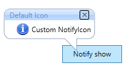
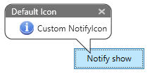
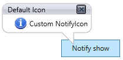
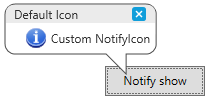
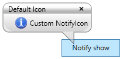
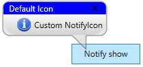

# Layout Related Features in WPF NotifyIcon

This section illustrates the following Layout-related feature of NotifyIcon control.

## Setting VisualStyle for NotifyIcon

The [NotifyIcon](https://help.syncfusion.com/cr/wpf/Syncfusion.Windows.Tools.Controls.NotifyIcon.html) control supports different visual styles to enhance its look and feel. The visual style for the NotifyIcon is set by using the [SetVisualStyle](https://help.syncfusion.com/cr/wpf/Syncfusion.Windows.Shared.SkinStorage.html#Syncfusion_Windows_Shared_SkinStorage_SetVisualStyle_System_Windows_DependencyObject_System_String_) property.

### Property table

<table>
<tr>
<th>
Property</th><th>
Description</th></tr>
<tr>
<td>
SetVisualStyle</td><td>
Sets the visual style for the NotifyIcon control. The options provided are as follows. Blend, Office2003, Office2007Blue, Office2007Black, Office2007Silver, ShinyBlue, ShinyRed, SyncOrange, VS2010, Metro and Transparent</td></tr>
</table>





<Button x:Name="button" Height="30" Width="100" Click="Button_Click" Content="Notify show">
</Button>

<syncfusion:NotifyIcon Name="notifyIcon" Header="NotifyIcon" BalloonTipTitle="Default NotifyIcon" syncfusion:SkinStorage.VisualStyle="Office2007Blue"
                               BalloonTipText="Custom NotifyIcon" BalloonTipIcon="Info"
                               ShowBalloonTipTime="1000" HideBalloonTipTime="1000" >
</syncfusion:NotifyIcon>





//For Office2007Blue
SkinStorage.SetVisualStyle(notifyIcon, "Office2007Blue");

//For Blend
SkinStorage.SetVisualStyle(notifyIcon, "Blend");

//For Office2007Silver
SkinStorage.SetVisualStyle(notifyIcon, "Office2007Silver");





**Office2007Blue**

**Blend**

**Office2007Silver**

**Metro**

**Transparent**

## Customizing the Header of the NotifyIcon

You can customize the background and foreground for the BalloonTipHeader by using the [HeaderBackground](https://help.syncfusion.com/cr/wpf/Syncfusion.Windows.Tools.Controls.NotifyIcon.html#Syncfusion_Windows_Tools_Controls_NotifyIcon_HeaderBackground) and [HeaderForeground](https://help.syncfusion.com/cr/wpf/Syncfusion.Windows.Tools.Controls.NotifyIcon.html#Syncfusion_Windows_Tools_Controls_NotifyIcon_HeaderForeground) properties.




<Button x:Name="button" Height="30" Width="100" Click="Button_Click" Content="Notify show">
</Button>

<syncfusion:NotifyIcon Name="notifyIcon" Header="NotifyIcon" BalloonTipTitle="Default NotifyIcon"
                       BalloonTipText="Custom NotifyIcon" BalloonTipIcon="Info"
                       ShowBalloonTipTime="1000" HideBalloonTipTime="1000"
                       HeaderBackground="Blue" HeaderForeground="White">
</syncfusion:NotifyIcon>





private void Button_Click(object sender, RoutedEventArgs e)
{
    notifyIcon.HeaderBackground = Brushes.Blue;
    notifyIcon.HeaderForeground = Brushes.White;
}




## Events

The [NotifyIcon](https://help.syncfusion.com/cr/wpf/Syncfusion.Windows.Tools.Controls.NotifyIcon.html) includes several pre-defined events to perform any required action as follows:

* BalloonTipOpening
* BalloonTipOpened
* BalloonTipHiding
* BalloonTipHidden
* CloseButtonClick
* Click

### BalloonTipOpening event

The [BalloonTipOpening](https://help.syncfusion.com/cr/wpf/Syncfusion.Windows.Tools.Controls.NotifyIcon.html#Syncfusion_Windows_Tools_Controls_NotifyIcon_BalloonTipOpening) event occurs before opening the balloon tip and action can be handled in the respective event handler.

The `CancelEventArgs` object contains the following property.

* Cancel : Canceling the action of the balloon tip show.





<syncfusion:NotifyIcon Name="notifyIcon" Header="NotifyIcon" BalloonTipOpening="NotifyIcon_BalloonTipOpening">
</syncfusion:NotifyIcon>





notifyIcon.BalloonTipOpening += NotifyIcon_BalloonTipOpening;

private void NotifyIcon_BalloonTipOpening(object sender, System.ComponentModel.CancelEventArgs e)
{
    //Cancel the balloontip action.
    e.Cancel = true;
}





### BalloonTipOpened event

The [BalloonTipOpened](https://help.syncfusion.com/cr/wpf/Syncfusion.Windows.Tools.Controls.NotifyIcon.html#Syncfusion_Windows_Tools_Controls_NotifyIcon_BalloonTipOpened) event occurs after the balloon tip is opened and action can be handled in the respective event handler.

The [DependencyPropertyChangedEventArgs](https://help.syncfusion.com/cr/wpf/Syncfusion.Windows.Tools.Controls.NotifyIcon.html#Syncfusion_Windows_Tools_Controls_NotifyIcon_OnBalloonTipHeaderVisibilityChanged_System_Windows_DependencyPropertyChangedEventArgs_) object contains the following properties:

* NewValue : gets an new value.
* OldValue : gets an old value.
* Property : Identify the value.





<syncfusion:NotifyIcon Name="notifyIcon" Header="NotifyIcon" BalloonTipOpened="NotifyIcon_BalloonTipOpened">
</syncfusion:NotifyIcon>





notifyIcon.BalloonTipOpened += NotifyIcon_BalloonTipOpened;

private void NotifyIcon_BalloonTipOpened(DependencyObject d, DependencyPropertyChangedEventArgs e)
{
    if(e.Property.Name == "IsOpen")
    {
        //Change the balloontip text.
        notifyIcon.BalloonTipText = "Welcome";
    }
}





### BalloonTipHiding event

The [BalloonTipHiding](https://help.syncfusion.com/cr/wpf/Syncfusion.Windows.Tools.Controls.NotifyIcon.html#Syncfusion_Windows_Tools_Controls_NotifyIcon_BalloonTipHiding) event occurs before hiding the balloon tip and action can be handled in the respective event handler.

The `CancelEventArgs` object contains the following property:

* Cancel : Canceling the hiding action of the balloon tip.





<syncfusion:NotifyIcon Name="notifyIcon" Header="NotifyIcon" BalloonTipHiding="NotifyIcon_BalloonTipHiding">
</syncfusion:NotifyIcon>





notifyIcon.BalloonTipHiding += NotifyIcon_BalloonTipHiding;

private void NotifyIcon_BalloonTipHiding(object sender, System.ComponentModel.CancelEventArgs e)
{
    //Cancel the hiding action.
    e.Cancel = true;            
}





### BalloonTipHidden event

The [BalloonTipHidden](https://help.syncfusion.com/cr/wpf/Syncfusion.Windows.Tools.Controls.NotifyIcon.html#Syncfusion_Windows_Tools_Controls_NotifyIcon_BalloonTipHidden) event occurs after hiding the balloon tip and action can be handled in the respective event handler.

The [DependencyPropertyChangedEventArgs](https://help.syncfusion.com/cr/wpf/Syncfusion.Windows.Tools.Controls.NotifyIcon.html#Syncfusion_Windows_Tools_Controls_NotifyIcon_OnBalloonTipHeaderVisibilityChanged_System_Windows_DependencyPropertyChangedEventArgs_) object contains the following properties:

* NewValue : gets an new value.
* OldValue : gets an old value.
* Property : Identify the value.





<syncfusion:NotifyIcon Name="notifyIcon" Header="NotifyIcon" BalloonTipHidden="NotifyIcon_BalloonTipHidden">
</syncfusion:NotifyIcon>





notifyIcon.BalloonTipHidden += NotifyIcon_BalloonTipHidden;

private void NotifyIcon_BalloonTipHidden(DependencyObject d, DependencyPropertyChangedEventArgs e)
{
    
}





### CloseButtonClick event

The [CloseButtonClick](https://help.syncfusion.com/cr/wpf/Syncfusion.Windows.Tools.Controls.NotifyIcon.html#Syncfusion_Windows_Tools_Controls_NotifyIcon_CloseButtonClick) event occurs while clicking the close button in the balloon tip.





<syncfusion:NotifyIcon Name="notifyIcon" Header="NotifyIcon" CloseButtonClick="NotifyIcon_CloseButtonClick">
</syncfusion:NotifyIcon>





notifyIcon.CloseButtonClick += NotifyIcon_CloseButtonClick;

private void NotifyIcon_CloseButtonClick(object sender, EventArgs e)
{
            
}





### Click event

The [Click](https://help.syncfusion.com/cr/wpf/Syncfusion.Windows.Tools.Controls.NotifyIcon.html#Syncfusion_Windows_Tools_Controls_NotifyIcon_Click) event occurs while clicking the icon inside the balloon tip.





<syncfusion:NotifyIcon Name="notifyIcon" Header="NotifyIcon" Click="NotifyIcon_Click">
</syncfusion:NotifyIcon>





notifyIcon.Click += NotifyIcon_Click;

private void NotifyIcon_Click(object sender, EventArgs e)
{

}




