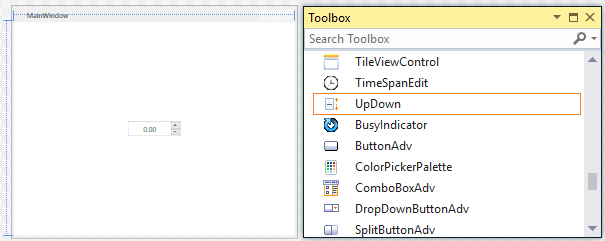
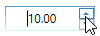

# Getting Started with WPF NumericUpdown (UpDown)

This section explains how to create WPF [NumericUpdown](https://www.syncfusion.com/wpf-controls/numericupdown) (UpDown) control and its structure.

## Structure of UpDown

The following are the elements of the UpDown control:

* **Text area** - It is the area where the numeric values are displayed. 
* **Increment button** - It is a repeat button that can be clicked to increment the current value of the UpDown control.
* **Decrement button** - It is a repeat button that can be clicked to decrement the current value of the UpDown control.

## Assembly deployment

Refer to the [control dependencies](https://help.syncfusion.com/wpf/control-dependencies#updown) section to get the list of assemblies or NuGet package that needs to be added as a reference to use the control in any application.

[Click_here](https://help.syncfusion.com/wpf/visual-studio-integration/nuget-packages) to find more details on how to install nuget packages in WPF application.

## Adding WPF UpDown control via designer

The [UpDown](https://help.syncfusion.com/cr/wpf/Syncfusion.Windows.Shared.UpDown.html) control can be added to an application by dragging it from the toolbox to design view. The following dependent assembly will be added automatically.

* Syncfusion.Shared.WPF

## Adding WPF UpDown control via XAML

In order to add the [UpDown](https://help.syncfusion.com/cr/wpf/Syncfusion.Windows.Shared.UpDown.html) control manually in XAML, do the below steps,

1) Create a new WPF project in Visual Studio.

2) Add the following required assembly reference to the project.

* Syncfusion.Shared.WPF

3) Import Syncfusion WPF schema http://schemas.syncfusion.com/wpf and declare the UpDown control in XAML page.





<Window x:Class="Application_New.MainWindow"
        xmlns="http://schemas.microsoft.com/winfx/2006/xaml/presentation"
        xmlns:x="http://schemas.microsoft.com/winfx/2006/xaml"
        xmlns:syncfusion="http://schemas.syncfusion.com/wpf"    
        Title="MainWindow" Height="350" Width="525">
    <Grid Name="grid">
        <syncfusion:UpDown Name="upDown" Width="100" Height="23"/>
    </Grid>
</Window>





## Adding WPF UpDown control via C#

In order to add the UpDown control manually in C#, do the below steps,

1) Create a new WPF application via Visual Studio.

2) Add the following required assembly reference to the project.

* Syncfusion.Shared.WPF

3) Import UpDown namespace **Syncfusion.Windows.Shared**.

3) Create an instance of UpDown control and add it to the main window.





UpDown updown = new UpDown();
updown.Width = 100;
updown.Height = 23;
grid.Children.Add(updown);





## Value

The [Value](https://help.syncfusion.com/cr/wpf/Syncfusion.Windows.Shared.UpDown.html#Syncfusion_Windows_Shared_UpDown_Value) property is used for set the value to UpDown control.





<syncfusion:UpDown Name="upDown" Height="23" Value="10" Width="85"/>





updown.Value = 10;





## Step Value

The [Step](https://help.syncfusion.com/cr/wpf/Syncfusion.Windows.Shared.UpDown.html#Syncfusion_Windows_Shared_UpDown_Step) property is used to specify the interval to increase or decrease the value while pressing the spin or repeat buttons in the UpDown control.





<syncfusion:UpDown Name="upDown" Height="25" Value="10" Step="5"  Width="90" />





updown.Value = 10;
updown.Step = 5;





## Number formatting

The number formatting of UpDown control can be customized by setting [UpDown.NumberFormatInfo](https://help.syncfusion.com/cr/wpf/Syncfusion.Windows.Shared.UpDown.html#Syncfusion_Windows_Shared_UpDown_NumberFormatInfo) property by specifying the culture-specific group separator, decimal separator, and the number of decimal digits. You can show the group separator by enable the [GroupSeparatorEnabled](https://help.syncfusion.com/cr/wpf/Syncfusion.Windows.Shared.UpDown.html#Syncfusion_Windows_Shared_UpDown_GroupSeperatorEnabled) property.





<Window x:Class="Application_New.MainWindow"
        xmlns="http://schemas.microsoft.com/winfx/2006/xaml/presentation"
        xmlns:x="http://schemas.microsoft.com/winfx/2006/xaml"
        xmlns:syncfusion="http://schemas.syncfusion.com/wpf"
        xmlns:globalization="clr-namespace:System.Globalization;assembly=mscorlib" 
        Title="MainWindow" Height="350" Width="525" >

<syncfusion:UpDown Name="upDown"  Height="25" Width="90" Value="100000" GroupSeperatorEnabled="True">
    <syncfusion:UpDown.NumberFormatInfo>
        <globalization:NumberFormatInfo NumberGroupSeparator="/" NumberDecimalDigits="3" NumberDecimalSeparator="*"/>
    </ syncfusion:UpDown.NumberFormatInfo>  
</ syncfusion:UpDown>





//Assign a value
updown.Value = 100000;

//Initialize numberformatinfo
NumberFormatInfo numberFormatInfo = new NumberFormatInfo();

// set the format of number and group
updown.GroupSeperatorEnabled = true;
updown.NumberFormatInfo = numberFormatInfo;
updown.NumberFormatInfo.NumberGroupSeparator = "/";
updown.NumberFormatInfo.NumberDecimalDigits = 3;
updown.NumberFormatInfo.NumberDecimalSeparator = "*";





For more number formatting in UpDown control, you can use the [Culture](https://help.syncfusion.com/cr/wpf/Syncfusion.Windows.Shared.UpDown.html#Syncfusion_Windows_Shared_UpDown_Culture) property. The `Culture` property is used to format the values based on the respective culture.





<syncfusion:UpDown Name="upDown"  Height="25" Width="90" Value="100000" Culture="bs-Latn" GroupSeperatorEnabled="True">
</syncfusion:UpDown>





CultureInfo cultureInfo = new CultureInfo("bs-Latn");
updown.Culture = cultureInfo;





## Theme

UpDown supports various built-in themes. Refer to the below links to apply themes for the UpDown,

  * [Apply theme using SfSkinManager](https://help.syncfusion.com/wpf/themes/skin-manager)
	
  * [Create a custom theme using ThemeStudio](https://help.syncfusion.com/wpf/themes/theme-studio#creating-custom-theme)

