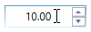

# Interaction in WPF NumericUpdown

This section explains about how to change the value by using mouse and keyboard in WPF [UpDown](https://help.syncfusion.com/cr/wpf/Syncfusion.Windows.Shared.UpDown.html) control.

## Keyboard and Mouse support

The `UpDown` control allows to increase or decrease the value by pressing <kbd>up-arrow</kbd> and <kbd>down-arrow</kbd> keys in keyboard or mouse wheel over the control. The [Step](https://help.syncfusion.com/cr/wpf/Syncfusion.Windows.Shared.UpDown.html#Syncfusion_Windows_Shared_UpDown_Step) property is used to specify the interval of increment or decrement.

### Increment or decrement value in mouse wheel 

You can increase or decrease the current value by scrolling over `UpDown` control. You can enable it by setting the [IsScrollingOnCircle](https://help.syncfusion.com/cr/wpf/Syncfusion.Windows.Shared.UpDown.html#Syncfusion_Windows_Shared_UpDown_IsScrollingOnCircle) property as `true`. You can disable the value changing on mouse scrolling by using the `IsScrollingOnCircle` property as `false`. The default value of `IsScrollingOnCircle` property is `true`. 





<syncfusion:UpDown Name="upDown" Width="100" Height="23" IsScrollingOnCircle="True" />





UpDown updown = new UpDown();
updown.Value = 10;
updown.IsScrollingOnCircle = true;
grid.Children.Add(updown);





## Step

The [Step](https://help.syncfusion.com/cr/wpf/Syncfusion.Windows.Shared.UpDown.html#Syncfusion_Windows_Shared_UpDown_Step) property is used to specify the interval to increase or decrease the value while pressing the spin buttons in the UpDown control. For example, the `Step` value is set to 5 so that the `UpDown` control value increases or decreases by 5 while pressing the spin buttons.

Another way,

You can also increase or decrease the present value of UpDown control by using <kbd>up-arrow</kbd> and <kbd>down-arrow</kbd> keys in keyboard.





<syncfusion:UpDown Name="upDown" Value="10" Width="100" Height="23" Step="5"/>





updown.Value = 10;
updown.Width = 100;
updown.Height = 23;
updown.Step = 5;





## Animation speed

When a value change in the UpDown control by using the repeated buttons, the transition from the current value to the new value is animated in UpDown control. The animation speed can be controlled by using [AnimationSpeed](https://help.syncfusion.com/cr/wpf/Syncfusion.Windows.Shared.UpDown.html#Syncfusion_Windows_Shared_UpDown_AnimationSpeed) property. 

N> Specifying whether its 0 to 1 seconds or milliseconds.





<syncfusion:UpDown Name="upDown" Value="10" AnimationSpeed="0.5" Width="100" Height="23"/>





updown.Value = 10;
updown.Width = 100;
updown.Height = 23;
updown.AnimationSpeed = 0.5;





## Range Adorner

You can show the adorner over UpDown control based on the minimum and maximum values by setting [EnableRangeAdorner](https://help.syncfusion.com/cr/wpf/Syncfusion.Windows.Shared.UpDown.html#Syncfusion_Windows_Shared_UpDown_EnableRangeAdorner) property to `true`. The default value is `false`. You can also change the background color of the range adorner using [RangeAdornerBackground](https://help.syncfusion.com/cr/wpf/Syncfusion.Windows.Shared.UpDown.html#Syncfusion_Windows_Shared_UpDown_RangeAdornerBackground) property.





<syncfusion:UpDown Name="upDown" Height="25" Width="90" Value="40" RangeAdornerBackground="Gray" EnableRangeAdorner="True" MinValue="0" MaxValue="100" />





updown.MinValue = 0;
updown.MaxValue = 100;
updown.EnableRangeAdorner = true;
updown.RangeAdornerBackground = Brushes.Gray;





