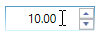
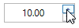
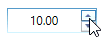

# Interaction in WPF NumericUpdown (UpDown)

This section explains about how to change the value by using mouse and keyboard in WPF [UpDown](https://help.syncfusion.com/cr/wpf/Syncfusion.Windows.Shared.UpDown.html) control.

## Keyboard and Mouse support

The `UpDown` control allows you to increase or decrease the value by pressing the <kbd>up-arrow</kbd> or <kbd>down-arrow</kbd> keys, or by using the mouse wheel over the control. The [Step](https://help.syncfusion.com/cr/wpf/Syncfusion.Windows.Shared.UpDown.html#Syncfusion_Windows_Shared_UpDown_Step) property specifies the increment or decrement interval.

### Increment or decrement value with the mouse wheel

You can increase or decrease the current value by scrolling over the `UpDown` control. To enable mouse-wheel scrolling, set the [IsScrollingOnCircle](https://help.syncfusion.com/cr/wpf/Syncfusion.Windows.Shared.UpDown.html#Syncfusion_Windows_Shared_UpDown_IsScrollingOnCircle) property to `true`. Set it to `false` to disable value changes on mouse scroll. The default value of `IsScrollingOnCircle` is `true`.





<syncfusion:UpDown Name="upDown" Width="100" Height="23" IsScrollingOnCircle="True" />





UpDown updown = new UpDown();
updown.Value = 10;
updown.IsScrollingOnCircle = true;
grid.Children.Add(updown);





## Step

The [Step](https://help.syncfusion.com/cr/wpf/Syncfusion.Windows.Shared.UpDown.html#Syncfusion_Windows_Shared_UpDown_Step) property is used to specify the interval applied to the value when the spin buttons are pressed. For example, if `Step` is set to `5`, the `UpDown` value increases or decreases by `5` each time a spin button is pressed. The default value of `Step` is `1`.

You can also increase or decrease the current value by pressing the <kbd>up-arrow</kbd> or <kbd>down-arrow</kbd> keys.





<syncfusion:UpDown Name="upDown" Value="10" Width="100" Height="23" Step="5"/>





updown.Value = 10;
updown.Width = 100;
updown.Height = 23;
updown.Step = 5;





## Animation speed

When the value changes via the repeat buttons, the transition from the current value to the new value is animated. The animation speed can be controlled by using the [AnimationSpeed](https://help.syncfusion.com/cr/wpf/Syncfusion.Windows.Shared.UpDown.html#Syncfusion_Windows_Shared_UpDown_AnimationSpeed) property. The value is expressed in seconds, in the range `0` to `1`.

N> A value of `0` disables the animation.





<syncfusion:UpDown Name="upDown" Value="10" AnimationSpeed="0.5" Width="100" Height="23"/>





updown.Value = 10;
updown.Width = 100;
updown.Height = 23;
updown.AnimationSpeed = 0.5;





## Range Adorner

You can show a visual adorner over the `UpDown` control that represents the minimum and maximum range by setting the [EnableRangeAdorner](https://help.syncfusion.com/cr/wpf/Syncfusion.Windows.Shared.UpDown.html#Syncfusion_Windows_Shared_UpDown_EnableRangeAdorner) property to `true`. The default value is `false`. You can also change the background color of the range adorner using the [RangeAdornerBackground](https://help.syncfusion.com/cr/wpf/Syncfusion.Windows.Shared.UpDown.html#Syncfusion_Windows_Shared_UpDown_RangeAdornerBackground) property.

N> Both `MinValue` and `MaxValue` must be set for the range adorner to be visible.





<syncfusion:UpDown Name="upDown" Height="25" Width="90" Value="40" RangeAdornerBackground="Gray" EnableRangeAdorner="True" MinValue="0" MaxValue="100" />





updown.MinValue = 0;
updown.MaxValue = 100;
updown.EnableRangeAdorner = true;
updown.RangeAdornerBackground = Brushes.Gray;





