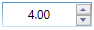

# Overview

The WPF [Updown](https://help.syncfusion.com/cr/wpf/Syncfusion.Windows.Shared.UpDown.html) control displays numeric values. The value can be edited by scrolling the values and by using the Increment and Decrement buttons of the UpDown control. It allows to define maximum and minimum values to which the user can increment/decrement the input’s value. Also can specify the interval, that will be applied to the value upon each increase/decrease.

## Features

**Value** - Provides different set of values. The values are Minimum and Maximum value.

**Null value** - Provides option to set the null value.

**Editing** - Provides option to change the value by up and down and also edit the text part.

**Culture** - Provides different culture support based on NumberDecimalSeparator in UpDown.

**Animation** - Provides animation support for speed of the UpDown control. 

**Keyboard and Mouse support** - Provide option to change the value by using keyboard and mouse.

**Appearance** - Provides support for several built-in skins and blendable support for customize the appearance.

