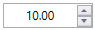
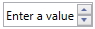

# Restriction in WPF NumericUpdown (UpDown)

This section explains about how to set the value and restrict the minimum and maximum value in WPF UpDown control.

## Value

The [Value](https://help.syncfusion.com/cr/wpf/Syncfusion.Windows.Shared.UpDown.html#Syncfusion_Windows_Shared_UpDown_Value) property is used for set the value to UpDown control.





<syncfusion:UpDown Name="upDown" Height="25" Width="90" Value="10" />





UpDown updown = new UpDown();
updown.Height = 25;
updown.Width = 90;
updown.Value = 10;
grid.Children.Add(updown);





### Value event

The UpDown control notifies the value changes through [ValueChanged](https://help.syncfusion.com/cr/wpf/Syncfusion.Windows.Shared.UpDown.html) and [ValueChanging](https://help.syncfusion.com/cr/wpf/Syncfusion.Windows.Shared.UpDown.html) events. You can use the `OldValue` and `NewValue` property to get the old and new value in `ValueChanged` event. In `ValueChanging` event, you can use the `Cancel` property in event argument to avoid the changes.





updown.ValueChanged += Up_ValueChanged;
updown.ValueChanging += Up_ValueChanging;

private void Up_ValueChanging(object sender, ValueChangingEventArgs e)
{
    // To cancel the changing value
    e.Cancel = true;            
}

private void Up_ValueChanged(DependencyObject d, DependencyPropertyChangedEventArgs e)
{
    // Get old and new value
    var newValue = e.NewValue;
    var oldValue = e.OldValue;
}





## Null value

The [UpDown](https://help.syncfusion.com/cr/wpf/Syncfusion.Windows.Shared.UpDown.html) control accepts null values. When the [Value](https://help.syncfusion.com/cr/wpf/Syncfusion.Windows.Shared.UpDown.html#Syncfusion_Windows_Shared_UpDown_Value) is set to null, the UpDown control will show zero value by default. You can change this to display some other numerical value using 
[NullValue](https://help.syncfusion.com/cr/wpf/Syncfusion.Windows.Shared.UpDown.html#Syncfusion_Windows_Shared_UpDown_NullValue) property. The [UseNullOption](https://help.syncfusion.com/cr/wpf/Syncfusion.Windows.Shared.UpDown.html#Syncfusion_Windows_Shared_UpDown_UseNullOption) property must be enabled to see the `NullValue` specified.





<syncfusion:UpDown Name="upDown" Height="25" Width="90" Value="{x:Null}" NullValue="2" UseNullOption="True" />





updown.UseNullOption = true;
updown.Value = null;
updown.NullValue = 2;





## Watermark

The [NullValueText](https://help.syncfusion.com/cr/wpf/Syncfusion.Windows.Shared.UpDown.html#Syncfusion_Windows_Shared_UpDown_NullValueText) property enables the `UpDown` control to show watermark text instead of numeric value when  [Value](https://help.syncfusion.com/cr/wpf/Syncfusion.Windows.Shared.UpDown.html#Syncfusion_Windows_Shared_UpDown_Value) is null. The [UseNullOption](https://help.syncfusion.com/cr/wpf/Syncfusion.Windows.Shared.UpDown.html#Syncfusion_Windows_Shared_UpDown_UseNullOption) property must be enabled to see the `NullValueText` specified.





<syncfusion:UpDown Name="upDown" Height="25" Width="90" Value="{x:Null}" NullValueText="Enter a value" UseNullOption="True" />





updown.Value = null;
updown.NullValueText = "Enter a value";





N> The `UseNullOption` property must be enabled if you want to see the `NullValue` or `NullValueText` in UpDown control. If both `NullValue` and `NullValueText` is specified, you will see only `NullValue` but not `NullValueText`.

## Minimum and Maximum value

The value of `UpDown` control can be restricted within maximum and minimum limit. The spin button helps to increase or decrease the value by using mouse interaction. Once the increase or decrease value reached the predefined maximized or minimized value, the value does not change.

Another way,

By using the keyboard, you can not enter the value above or below the predefined maximized or minimized value.

* **MaxValue** - The [MaxValue](https://help.syncfusion.com/cr/wpf/Syncfusion.Windows.Shared.UpDown.html#Syncfusion_Windows_Shared_UpDown_MaxValue) property is the maximum value that can be set for the `UpDown` control.

* **MinValue** - The [MinValue](https://help.syncfusion.com/cr/wpf/Syncfusion.Windows.Shared.UpDown.html#Syncfusion_Windows_Shared_UpDown_MinValue) property is the minimum value that can be set for the `UpDown` control.





<syncfusion:UpDown Name="upDown" Height="25" Width="90" MinValue="0" MaxValue="100" />





updown.MaxValue = 100;
updown.MinValue = 0;





### Minimum and Minimum validation

You can choose when to validate the maximum and minimum limit, while changing the values by using [MaxValidation](https://help.syncfusion.com/cr/wpf/Syncfusion.Windows.Shared.UpDown.html#Syncfusion_Windows_Shared_UpDown_MaxValidation) and [MinValidation](https://help.syncfusion.com/cr/wpf/Syncfusion.Windows.Shared.UpDown.html#Syncfusion_Windows_Shared_UpDown_MinValidation) property.

* **OnKeyPress** - On setting the [MaxValidation](https://help.syncfusion.com/cr/wpf/Syncfusion.Windows.Shared.UpDown.html#Syncfusion_Windows_Shared_UpDown_MaxValidation) or [MinValidation](https://help.syncfusion.com/cr/wpf/Syncfusion.Windows.Shared.UpDown.html#Syncfusion_Windows_Shared_UpDown_MinValidation) to OnKeyPress, then the value in the UpDown control is validated soon after a key is pressed. So, it is not possible to provide any invalid input at all.

* **OnLostFocus** - On setting the [MaxValidation](https://help.syncfusion.com/cr/wpf/Syncfusion.Windows.Shared.UpDown.html#Syncfusion_Windows_Shared_UpDown_MaxValidation) or [MinValidation](https://help.syncfusion.com/cr/wpf/Syncfusion.Windows.Shared.UpDown.html#Syncfusion_Windows_Shared_UpDown_MinValidation) to OnLostFocus, then the value in the UpDown control is validated when the UpDown control loses focus. That is, the `UpDown` will accept any value, validation will be happen only after control loose its keyboard focus. After validation, when the value of the UpDown control is greater than the MaxValue or lesser than the MinValue, the value will be changed automatically is set to MaxValue or MinValue respectively.

* **MaxValueOnExceedMaxDigit** - When you give input greater than specified maximum limit, `MaxValueOnExceedMaxDigit` property will decide either it should retain the old value or reset to maximum limit that is specified. For example, if `MaxValue` is set to 100 and you are trying to input 200. Value will changed to 100 when `MaxValueOnExceedMaxDigit` is enabled. When `MaxValueOnExceedMaxDigit` is false, 20 will be retained and last entered 0 will be ignored.

* **MinValueOnExceedMinDigit** - Similarly, When you give input lesser than specified minimum limit, `MinValueOnExceedMinDigit` property will decide either it should retain the old value or reset to minimum limit that is specified.





<syncfusion:UpDown Name="upDown" Height="25" Width="90" MinValueOnExceedMinDigit="True" MaxValueOnExceedMaxDigit="True" MaxValidation="OnKeyPress" MinValidation="OnKeyPress" MinValue="0" MaxValue="100" />





updown.MaxValidation = MaxValidation.OnKeyPress;
updown.MinValidation = MinValidation.OnKeyPress;
updown.MinValueOnExceedMinDigit = true;
updown.MaxValueOnExceedMaxDigit = true;





## AllowEdit

The [AllowEdit](https://help.syncfusion.com/cr/wpf/Syncfusion.Windows.Shared.UpDown.html#Syncfusion_Windows_Shared_UpDown_AllowEdit) property is used to restrict the editing in `UpDown` control by setting it's value to `False`. The default value is `True`.





<syncfusion:UpDown Name="upDown" Height="25" Width="90" AllowEdit="False" MinValue="0" MaxValue="100" />





updown.AllowEdit = false;





