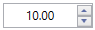
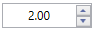
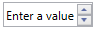
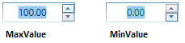

# Restriction in WPF UpDown

This section explains how to set the value and restrict the minimum and maximum value of the WPF `UpDown` control.

## Value

The [Value](https://help.syncfusion.com/cr/wpf/Syncfusion.Windows.Shared.UpDown.html#Syncfusion_Windows_Shared_UpDown_Value) property is used to set the value of the `UpDown` control. The default value is `0` (or `null` when `UseNullOption` is enabled).





<syncfusion:UpDown Name="upDown" Height="25" Width="90" Value="10" />





UpDown updown = new UpDown();
updown.Height = 25;
updown.Width = 90;
updown.Value = 10;
grid.Children.Add(updown);





### Value event

The `UpDown` control notifies value changes through the [ValueChanged](https://help.syncfusion.com/cr/wpf/Syncfusion.Windows.Shared.UpDown.html#Syncfusion_Windows_Shared_UpDown_ValueChanged) and [ValueChanging](https://help.syncfusion.com/cr/wpf/Syncfusion.Windows.Shared.UpDown.html#Syncfusion_Windows_Shared_UpDown_ValueChanging) events. Use the `OldValue` and `NewValue` properties of `ValueChanged` to read the new and old values. In the `ValueChanging` event, set the `Cancel` property on the event argument to prevent the change.



<syncfusion:UpDown Name="upDown"
                  ValueChanged="Up_ValueChanged"
                  ValueChanging="Up_ValueChanging"
                  Height="25" Width="90"/>







updown.ValueChanged += Up_ValueChanged;
updown.ValueChanging += Up_ValueChanging;

private void Up_ValueChanging(object sender, Syncfusion.Windows.Shared.ValueChangingEventArgs e)
{
    // Cancel the value change
    e.Cancel = true;
}

private void Up_ValueChanged(object sender, RoutedPropertyChangedEventArgs<object> e)
{
    // Get old and new value
    var newValue = e.NewValue;
    var oldValue = e.OldValue;
}





## Null value

The [UpDown](https://help.syncfusion.com/cr/wpf/Syncfusion.Windows.Shared.UpDown.html) control accepts null values. When the [Value](https://help.syncfusion.com/cr/wpf/Syncfusion.Windows.Shared.UpDown.html#Syncfusion_Windows_Shared_UpDown_Value) is set to null, the control shows `0` by default. To display a different numerical value when `Value` is null, set the [NullValue](https://help.syncfusion.com/cr/wpf/Syncfusion.Windows.Shared.UpDown.html#Syncfusion_Windows_Shared_UpDown_NullValue) property. The [UseNullOption](https://help.syncfusion.com/cr/wpf/Syncfusion.Windows.Shared.UpDown.html#Syncfusion_Windows_Shared_UpDown_UseNullOption) property must be enabled for `NullValue` to take effect.





<syncfusion:UpDown Name="upDown" Height="25" Width="90" Value="{x:Null}" NullValue="2" UseNullOption="True" />





updown.UseNullOption = true;
updown.Value = null;
updown.NullValue = 2;





## Watermark

The [NullValueText](https://help.syncfusion.com/cr/wpf/Syncfusion.Windows.Shared.UpDown.html#Syncfusion_Windows_Shared_UpDown_NullValueText) property enables the `UpDown` control to display watermark text instead of a numeric value when [Value](https://help.syncfusion.com/cr/wpf/Syncfusion.Windows.Shared.UpDown.html#Syncfusion_Windows_Shared_UpDown_Value) is null. The [UseNullOption](https://help.syncfusion.com/cr/wpf/Syncfusion.Windows.Shared.UpDown.html#Syncfusion_Windows_Shared_UpDown_UseNullOption) property must be enabled for `NullValueText` to take effect.





<syncfusion:UpDown Name="upDown" Height="25" Width="90" Value="{x:Null}" NullValueText="Enter a value" UseNullOption="True" />





updown.Value = null;
updown.NullValueText = "Enter a value";





N> The `UseNullOption` property must be enabled if you want to see the `NullValue` or `NullValueText` in UpDown control. If both `NullValue` and `NullValueText` is specified, you will see only `NullValue` but not `NullValueText`.

## Minimum and Maximum value

The value of the `UpDown` control can be restricted to a maximum and minimum limit. The spin button increments or decrements the value by mouse interaction; once the increment or decrement reaches the predefined maximum or minimum, the value stops changing.

Similarly, the keyboard does not allow you to enter a value above or below the predefined maximum or minimum.

* **MaxValue** - The [MaxValue](https://help.syncfusion.com/cr/wpf/Syncfusion.Windows.Shared.UpDown.html#Syncfusion_Windows_Shared_UpDown_MaxValue) property sets the maximum value the control accepts. The default value is `double.MaxValue`.
* **MinValue** - The [MinValue](https://help.syncfusion.com/cr/wpf/Syncfusion.Windows.Shared.UpDown.html#Syncfusion_Windows_Shared_UpDown_MinValue) property sets the minimum value the control accepts. The default value is `double.MinValue`.





<syncfusion:UpDown Name="upDown" Height="25" Width="90" MinValue="0" MaxValue="100" />





updown.MaxValue = 100;
updown.MinValue = 0;





### Minimum and Minimum validation

You can choose when to validate against the maximum and minimum limits while changing values by using the [MaxValidation](https://help.syncfusion.com/cr/wpf/Syncfusion.Windows.Shared.UpDown.html#Syncfusion_Windows_Shared_UpDown_MaxValidation) and [MinValidation](https://help.syncfusion.com/cr/wpf/Syncfusion.Windows.Shared.UpDown.html#Syncfusion_Windows_Shared_UpDown_MinValidation) properties. The accepted values are `OnKeyPress` and `OnLostFocus`.

* **OnKeyPress** - The value is validated as soon as a key is pressed, so an invalid input is not accepted at all.
* **OnLostFocus** - The value is accepted during editing but is validated when the control loses focus. If the value is greater than `MaxValue` or less than `MinValue`, it is automatically reset to the corresponding limit.

### MaxValueOnExceedMaxDigit

When you enter an input greater than the specified maximum, the [MaxValueOnExceedMaxDigit](https://help.syncfusion.com/cr/wpf/Syncfusion.Windows.Shared.UpDown.html#Syncfusion_Windows_Shared_UpDown_MaxValueOnExceedMaxDigit) property decides whether the entered value is reset to the maximum or retained as a partial value. For example, if `MaxValue` is `100` and you enter `200`, the value is reset to `100` when `MaxValueOnExceedMaxDigit` is `true`; when `false`, `20` is retained and the last digit (`0`) is ignored.

### MinValueOnExceedMinDigit

Similarly, when you enter an input less than the specified minimum, the [MinValueOnExceedMinDigit](https://help.syncfusion.com/cr/wpf/Syncfusion.Windows.Shared.UpDown.html#Syncfusion_Windows_Shared_UpDown_MinValueOnExceedMinDigit) property decides whether the entered value is reset to the minimum or retained as a partial value


<syncfusion:UpDown Name="upDown" Height="25" Width="90" MinValueOnExceedMinDigit="True" MaxValueOnExceedMaxDigit="True" MaxValidation="OnKeyPress" MinValidation="OnKeyPress" MinValue="0" MaxValue="100" />





updown.MaxValidation = MaxValidation.OnKeyPress;
updown.MinValidation = MinValidation.OnKeyPress;
updown.MinValueOnExceedMinDigit = true;
updown.MaxValueOnExceedMaxDigit = true;





## AllowEdit

The [AllowEdit](https://help.syncfusion.com/cr/wpf/Syncfusion.Windows.Shared.UpDown.html#Syncfusion_Windows_Shared_UpDown_AllowEdit) property is used to restrict the editing in `UpDown` control by setting it's value to `False`. The default value is `True`.





<syncfusion:UpDown Name="upDown" Height="25" Width="90" AllowEdit="False" MinValue="0" MaxValue="100" />





updown.AllowEdit = false;





