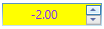
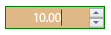

# Styles and Templates in WPF NumericUpdown (UpDown)

The background and foreground of the [UpDown](https://help.syncfusion.com/cr/wpf/Syncfusion.Windows.Shared.UpDown.html) control can be customized by editing its style or by using the properties exposed by the `UpDown` control.

## Positive color

The background and foreground for the positive value can be customized using the `Background` and `Foreground` properties of the UpDown control.





<syncfusion:UpDown Name="upDown" Background="MediumBlue" Foreground="White" Value="10" Height="23"  Width="100" />





UpDown updown = new UpDown();
updown.Height = 23;
updown.Width = 100;
updown.Value = 10;
updown.Background = Brushes.MediumBlue;
updown.Foreground = Brushes.White;
grid.Children.Add(updown);





## Negative color

The background and foreground for the negative value can be customized using the [NegativeBackground](https://help.syncfusion.com/cr/wpf/Syncfusion.Windows.Shared.UpDown.html#Syncfusion_Windows_Shared_UpDown_NegativeBackground) and [NegativeForeground](https://help.syncfusion.com/cr/wpf/Syncfusion.Windows.Shared.UpDown.html#Syncfusion_Windows_Shared_UpDown_NegativeForeground) properties of UpDown control. The `NegativeBackground` and `NegativeForeground` properties are enabled by setting the [EnableNegativeColors](https://help.syncfusion.com/cr/wpf/Syncfusion.Windows.Shared.UpDown.html#Syncfusion_Windows_Shared_UpDown_EnableNegativeColors) property is set to `True`.





<syncfusion:UpDown Name="upDown" EnableNegativeColors="True" NegativeBackground="Yellow" NegativeForeground="BlueViolet" Value="-2" Height="23"  Width="100" />





updown.Value = -2;
updown.EnableNegativeColors = true;
updown.NegativeBackground = Brushes.Yellow;
updown.NegativeForeground = Brushes.BlueViolet;





## Zero color

The color of zero value can be changed by using the [ZeroColor](https://help.syncfusion.com/cr/wpf/Syncfusion.Windows.Shared.UpDown.html#Syncfusion_Windows_Shared_UpDown_ZeroColor) property. The `ZeroColor` property can be enabled by setting the [ApplyZeroColor](https://help.syncfusion.com/cr/wpf/Syncfusion.Windows.Shared.UpDown.html#Syncfusion_Windows_Shared_UpDown_ApplyZeroColor) property is set to `True`.





<syncfusion:UpDown Name="upDown" ApplyZeroColor="True" ZeroColor="DarkViolet" Value="0" Height="23"  Width="100" />





updown.ApplyZeroColor = true;
updown.ZeroColor = Brushes.DarkViolet;





## Focused color

The background, foreground and border color for the UpDown control can be customized using the [FocusedBackground](https://help.syncfusion.com/cr/wpf/Syncfusion.Windows.Shared.UpDown.html#Syncfusion_Windows_Shared_UpDown_FocusedBackground), [FocusedBorderBrush](https://help.syncfusion.com/cr/wpf/Syncfusion.Windows.Shared.UpDown.html#Syncfusion_Windows_Shared_UpDown_FocusedBorderBrush) and [FocusedForeground](https://help.syncfusion.com/cr/wpf/Syncfusion.Windows.Shared.UpDown.html#Syncfusion_Windows_Shared_UpDown_FocusedForeground) properties when the control is focused. These properties will work only when value of `EnableFocusedColors` property is **True**. By default, the value of  [EnableFocusedColors](https://help.syncfusion.com/cr/wpf/Syncfusion.Windows.Shared.UpDown.html#Syncfusion_Windows_Shared_UpDown_EnableFocusedColors) property is **True**. 





<syncfusion:UpDown Name="upDown" EnableFocusedColors="True" FocusedBackground="BurlyWood" FocusedForeground="White" FocusedBorderBrush="Green" Value="10" Height="23"  Width="100" />





updown.Value = 10;
updown.EnableFocusedColors = true;
updown.FocusedBackground = Brushes.BurlyWood;
updown.FocusedForeground = Brushes.White;
updown.FocusedBorderBrush = Brushes.Green;





N> The positive, negative and zero value colors get default color of the control while focusing the Updown control.

## Theme

UpDown supports various built-in themes. Refer to the below links to apply themes for the UpDown,

  * [Apply theme using SfSkinManager](https://help.syncfusion.com/wpf/themes/skin-manager)
	
  * [Create a custom theme using ThemeStudio](https://help.syncfusion.com/wpf/themes/theme-studio#creating-custom-theme)

