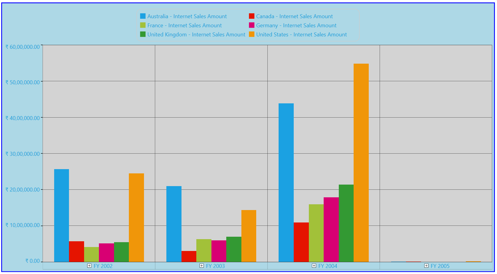

# Appearance in WPF Olap Chart

The OLAP chart supports customizing the appearance of charts. You can customize the chart style, legend style, border and background style, point label style, and label style of the primary and secondary axes.

## Chart style and legends

The OLAP chart provides options to set the chart type, chart color, chart legend position, chart legend, and legend check box visibility:

* **ChartType**: Sets the chart type for the OLAP chart control.
* **ColorModel.Palette**: Specifies the chart color for the OLAP chart control.
* **Legend.Visibility**: Specifies the visibility of the chart legend.
* **Legend.CheckBoxVisibility**: Specifies the visibility of the chart legend check box.
* **ChartDockPanel.SetDock**: Specifies the position of the chart legend.

The following code sample illustrates how to customize the chart style and legends.




 
// Set the Chart Type.
this.olapChart.ChartType = ChartTypes.Column;
// Set the Chart Series Color.
this.olapChart.ColorModel.Palette = ChartColorPalette.Colorful;
// Set the Chart Legend and Legend Check Box Visibility.
this.olapChart.Legend.Visibility = Visibility.Visible;
this.olapChart.Legend.Visibility = Visibility.Collapsed;
this.olapChart.Legend.CheckBoxVisibility = Visibility.Visible;
this.olapChart.Legend.CheckBoxVisibility = Visibility.Collapsed;
// Set the Chart Legend Position.
ChartDockPanel.SetDock(this.olapChart.Legend, ChartDock.Right);
ChartDockPanel.SetDock(this.olapChart.Legend, ChartDock.Left);
ChartDockPanel.SetDock(this.olapChart.Legend, ChartDock.Top);
ChartDockPanel.SetDock(this.olapChart.Legend, ChartDock.Bottom);
ChartDockPanel.SetDock(this.olapChart.Legend, ChartDock.Floating);




  
' Set the Chart Type.
Me.olapChart.ChartType = ChartTypes.Column
' Set the Chart Series Color.
Me.olapChart.ColorModel.Palette = ChartColorPalette.Colorful
' Set the Chart Legend and Legend Check Box Visibility.
Me.olapChart.Legend.Visibility = Visibility.Visible
Me.olapChart.Legend.Visibility = Visibility.Collapsed
Me.olapChart.Legend.CheckBoxVisibility = Visibility.Visible
Me.olapChart.Legend.CheckBoxVisibility = Visibility.Collapsed
' Set the Chart Legend Position.
ChartDockPanel.SetDock(Me.olapChart.Legend, ChartDock.Right)
ChartDockPanel.SetDock(Me.olapChart.Legend, ChartDock.Left)
ChartDockPanel.SetDock(Me.olapChart.Legend, ChartDock.Top)
ChartDockPanel.SetDock(Me.olapChart.Legend, ChartDock.Bottom)
ChartDockPanel.SetDock(Me.olapChart.Legend, ChartDock.Floating)





## Chart border and background style

The OLAP chart provides options to set the chart border and background style:

* **BorderThickness**: Sets the border thickness for the OLAP chart control.
* **BorderBrush**: Specifies the border color for the OLAP chart control.
* **Background**: Specifies the background color for the OLAP chart control.
* **GridBackground**: Specifies the interior background color for the OLAP chart control.

The following code sample illustrates how to customize the chart border and the background style.





// Set the Chart Border Style.
this.olapChart.BorderThickness = new Thickness(2);
this.olapChart.BorderBrush = Brushes.Blue;
// Set the Chart Background Style.
this.olapChart.Background = Brushes.LightBlue;
this.olapChart.GridBackground = Brushes.LightGray;




  
' Set the Chart Border Style.
Me.olapChart.BorderThickness = New Thickness(2)
Me.olapChart.BorderBrush = Brushes.Blue
' Set the Chart Background Style.
Me.olapChart.Background = Brushes.LightBlue
Me.olapChart.GridBackground = Brushes.LightGray




 

## Chart points labels

The OLAP chart supports customizing the labels and symbols of chart points. This is illustrated in the following code sample.




 
foreach (ChartSeries series in this.Series)
{
    series.AdornmentsInfo.Visible = true;
    ChartAdornmentInfo cai = series.AdornmentsInfo;
    // To display the x-axis label value.
    series.AdornmentsInfo.LabelContentPath = "DataPoint.X";
    // To display the y-axis label value.
    series.AdornmentsInfo.LabelContentPath = "DataPoint.Y";
    // To display the Series label value.
    series.AdornmentsInfo.LabelContentPath = "Series.Label";
}




  
For Each series As ChartSeries In Me.Series
    series.AdornmentsInfo.Visible = True
    Dim cai As ChartAdornmentInfo = series.AdornmentsInfo
    ' To display the x-axis label value.
    series.AdornmentsInfo.LabelContentPath = "DataPoint.X"
    ' To display the y-axis label value.
    series.AdornmentsInfo.LabelContentPath = "DataPoint.Y"
    ' To display the Series label value.
    series.AdornmentsInfo.LabelContentPath = "Series.Label"
Next series





## Chart axis labels

The OLAP chart supports customizing the labels of primary and secondary axes.

### Customizing the font style of the primary axis

Dynamically change the font family, font color, and font weight for labels of the primary axis:

* **PrimaryAxis.LabelFontFamily**: Specifies the font family for the label of the primary axis.
* **PrimaryAxis.LabelForeground**: Specifies the font color for the label of the primary axis.
* **PrimaryAxis.LabelFontWeight**: Specifies the font weight for the label of the primary axis.

The following code sample illustrates how to customize the font style of the primary axis.




 
// Set the Font Family.
this.olapChart.PrimaryAxis.LabelFontFamily = new FontFamily("Arial");
// Set the Font Color.
this.olapChart.PrimaryAxis.LabelForeground = Brushes.LightBlue;
// Set the Font Weight.
this.olapChart.PrimaryAxis.LabelFontWeight = FontWeights.Bold;




  
' Set the Font Family.
Me.olapChart.PrimaryAxis.LabelFontFamily = New FontFamily("Arial")
' Set the Font Color.
Me.olapChart.PrimaryAxis.LabelForeground = Brushes.LightBlue
' Set the Font Weight.
Me.olapChart.PrimaryAxis.LabelFontWeight = FontWeights.Bold




 
### Customizing the font style of the secondary axis

Dynamically change the font family, font color, and font weight for labels of the secondary axis.

* **SecondaryAxis.LabelFontFamily**: Specifies the font family for the label of the secondary axis.
* **SecondaryAxis.LabelForeground**: Specifies the font color for the label of the secondary axis.
* **SecondaryAxis.LabelFontWeight**: Specifies the font weight for the label of the secondary axis.

The following code sample illustrates how to customize the font style of the secondary axis.




 
// Set the Font Family.
this.olapChart.SecondaryAxis.LabelFontFamily = new FontFamily("Arial");
// Set the Foreground Color.
this.olapChart.SecondaryAxis.LabelForeground = Brushes.LightBlue;
// Set the Font Weight.
this.olapChart.SecondaryAxis.LabelFontWeight = FontWeights.Bold;




  
' Set the Font Family.
Me.olapChart.SecondaryAxis.LabelFontFamily = New FontFamily("Arial")
' Set the Foreground Color.
Me.olapChart.SecondaryAxis.LabelForeground = Brushes.LightBlue
' Set the Font Weight.
Me.olapChart.SecondaryAxis.LabelFontWeight = FontWeights.Bold





A sample demo is available at the following location.

{system drive}:\Users\&lt;User Name&gt;\AppData\Local\Syncfusion\EssentialStudio\&lt;Version Number&gt;\WPF\OlapChart.WPF\Samples\Chart Appearance\Appearance
