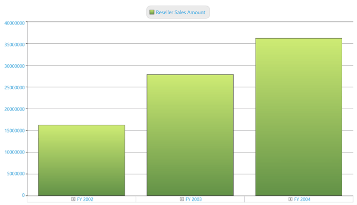
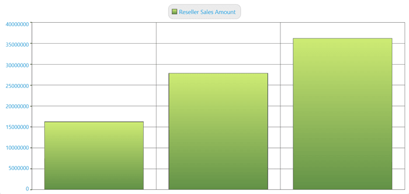

# Axes in WPF Olap Chart

An OLAP area contains two axes, the primary axis and secondary axis, in an OLAP chart control. Values or data in the chart are plotted against these axes.

## Grid lines customization

In general, for column type charts, the horizontal grid line belongs to the secondary axis. To disable the horizontal grid lines for these types of charts, you should use the `ShowGridLinesProperty` of the secondary axis.

The following illustration describes how the chart will look after the horizontal grid lines are disabled.

The following code sample describes how to disable the horizontal grid lines.





this.olapChart.Series[0].Area.SecondaryAxis.SetValue(ChartArea.ShowGridLinesProperty, false);





Me.olapChart.Series(0).Area.SecondaryAxis.SetValue(ChartArea.ShowGridLinesProperty, False)





N> For bar type charts, such as bar, stacking bar, and stacking 100 bar, you can disable the horizontal grid lines by using the `ShowGridLinesProperty` of the primary axis.

In general, for column type charts, the vertical grid line belongs to the primary axis. To disable the vertical grid lines for these types of charts, you should use the `ShowGridLinesProperty` of the primary axis.

The following illustration describes how the chart will look after the vertical grid lines are disabled.

The following code sample describes how to disable the vertical grid lines.





this.olapChart.Series[0].Area.PrimaryAxis.SetValue(ChartArea.ShowGridLinesProperty, false);





Me.olapChart.Series(0).Area.PrimaryAxis.SetValue(ChartArea.ShowGridLinesProperty, False)





N> For bar type charts such as bar, stacking bar, and stacking 100 bar, you can disable the vertical grid lines by using the `ShowGridLinesProperty` of the secondary axis.

## Format settings

To display the ‘%’ symbol in the secondary axis, you should set the secondary axis label format property. The following code sample describes the usage of ‘%’ in the secondary axis label.



<syncfusion:OlapChart.SecondaryAxis>
     <syncfusion:ChartAxis LabelFormat="00.00%" />
</syncfusion:OlapChart.SecondaryAxis>



To display the currency symbol in the secondary axis, you should set the secondary axis label format property. The following code sample describes the usage of currency in the secondary axis label.



<syncfusion:OlapChart.SecondaryAxis>
     <syncfusion:ChartAxis LabelFormat="C" />
</syncfusion:OlapChart.SecondaryAxis>



## Label font settings

The label font settings of the primary and secondary axes can be easily applied to an OLAP chart by specifying the label font properties, which are available under the primary and secondary axes of the OLAP chart.





<syncfusion:OlapChart.PrimaryAxis>
<syncfusion:ChartAxis LabelFormat="C"
      LabelFontFamily="Arial" 
      LabelFontSize="14" 
      LabelFontWeight="ExtraBold" 
      LabelForeground="DarkGray"  />
</syncfusion:OlapChart.PrimaryAxis>
<syncfusion:OlapChart.SecondaryAxis>
<syncfusion:ChartAxis LabelFormat="C"
      LabelFontFamily="Arial" 
      LabelFontSize="14" 
      LabelFontWeight="ExtraBold" 
      LabelForeground="DarkGray"  />
</syncfusion:OlapChart.SecondaryAxis>





this.olapChart.PrimaryAxis.LabelForeground = Brushes.DarkGray;
this.olapChart.PrimaryAxis.LabelFontFamily = new FontFamily("Arial");
this.olapChart.PrimaryAxis.LabelFontSize = 14d;
this.olapChart.PrimaryAxis.LabelFontWeight = FontWeights.ExtraBold;
this.olapChart.SecondaryAxis.LabelForeground = Brushes.DarkGray;
this.olapChart.SecondaryAxis.LabelFontFamily = new FontFamily("Arial");
this.olapChart.SecondaryAxis.LabelFontSize = 14d;
this.olapChart.SecondaryAxis.LabelFontWeight = FontWeights.ExtraBold;





Me.olapChart.PrimaryAxis.LabelForeground = Brushes.DarkGray
Me.olapChart.PrimaryAxis.LabelFontFamily = New FontFamily("Arial")
Me.olapChart.PrimaryAxis.LabelFontSize = 14R
Me.olapChart.PrimaryAxis.LabelFontWeight = FontWeights.ExtraBold
Me.olapChart.SecondaryAxis.LabelForeground = Brushes.DarkGray
Me.olapChart.SecondaryAxis.LabelFontFamily = New FontFamily("Arial")
Me.olapChart.SecondaryAxis.LabelFontSize = 14R
Me.olapChart.SecondaryAxis.LabelFontWeight = FontWeights.ExtraBold





## Primary axis label visibility

The primary axis label panel visibility can be toggled by setting the `PrimaryAxisLabelVisibility` property.





<syncfusion:OlapChart Name="olapChart" PrimaryAxisLabelVisibility="Collapsed" />





this.olapChart.PrimaryAxisLabelVisibility = System.Windows.Visibility.Collapsed;





Me.olapChart.PrimaryAxisLabelVisibility = System.Windows.Visibility.Collapsed





The following illustration shows how the OLAP chart will look before collapsing the primary axis label.

The following illustration shows how the OLAP chart will look after collapsing the primary axis label.

