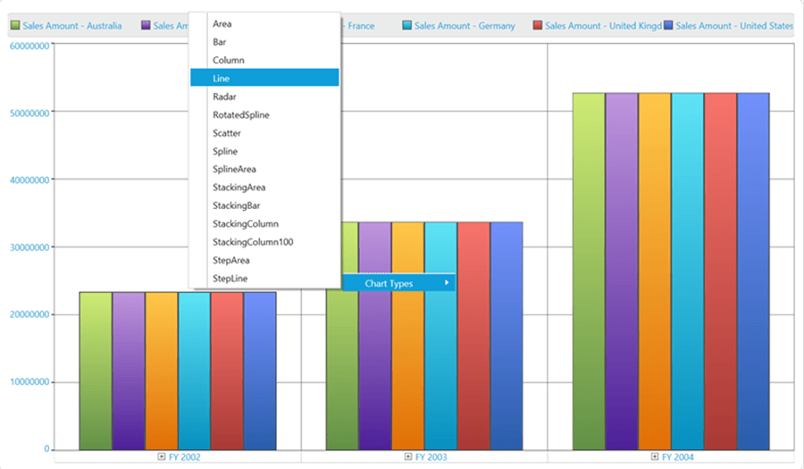

# Chart Type for Specific Series in WPF Olap Chart

The OLAP chart in WPF supports changing the chart type of each series using the context menu.

To change the chart type of a specific series, right-click the particular series. A context menu with the list of available chart type appears. From the list of chart types in the context menu, you can select the required chart type.

The following screenshot shows how a specific column chart series is changed to line chart series.

The following screenshot shows a column chart series changed to line chart.

