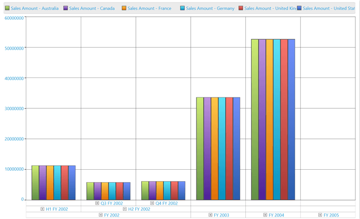

# Drill Operation in WPF Olap Chart

This is a basic feature of OLAP chart through which the amount of information can be limited, for a better view. It allows you to drill down to access the detailed level of data or drill up to see the summarized data by using the context menu present in the OLAP chart.

Drill up, also called roll up, navigates from more detailed data to less detailed data by climbing up a concept hierarchy for a dimension.

Drill down, also called roll down, is the reverse of drill up. It navigates from less detailed data to more detailed data by climbing down a concept hierarchy for a dimension.

While binding hierarchical dimensions (for example, the time dimension includes three levels namely year, quarter, and month), the chart allows you to visualize the data for different levels by using the collapsible labels. This is illustrated in the following screenshot.

A sample demo is available at the following location.

{system drive}:\Users\&lt;User Name&gt;\AppData\Local\Syncfusion\EssentialStudio\&lt;Version Number&gt;\WPF\OlapChart.WPF\Samples\Creating Reports\Reports In Code

## Drill position

Drill position allows users to drill only the current position of a selected member and it will exclude the drilled data of the selected member in other positions by using the MDX query. It can be enabled by setting the **"DrillType"** enumeration to **"DrillPosition"** in the OLAP report.





dataManager.CurrentReport.DrillType = DrillType.DrillPosition;




  
dataManager.CurrentReport.DrillType = DrillType.DrillPosition





A sample demo is available at the following location.

{system drive}:\Users\&lt;User Name&gt;\AppData\Local\Syncfusion\EssentialStudio\&lt;Version Number&gt;\WPF\OlapChart.WPF\Samples\Data Relation\Drill Types Demo
 
## Show/hide expanders
 
The visibility of expanders in the OLAP chart can be toggled by using the `ShowExpanders` property available in the OLAP report.




 
this.olapchart1.OlapDataManager.CurrentReport.ShowExpanders = false;




  
Me.olapchart1.OlapDataManager.CurrentReport.ShowExpanders = False





The following image shows an OLAP chart without expanders.

N> Since the `ShowExpanders` property interacts with the OlapDataManager, you need to assign this property before you call the DataBind() method in the OLAP chart.

