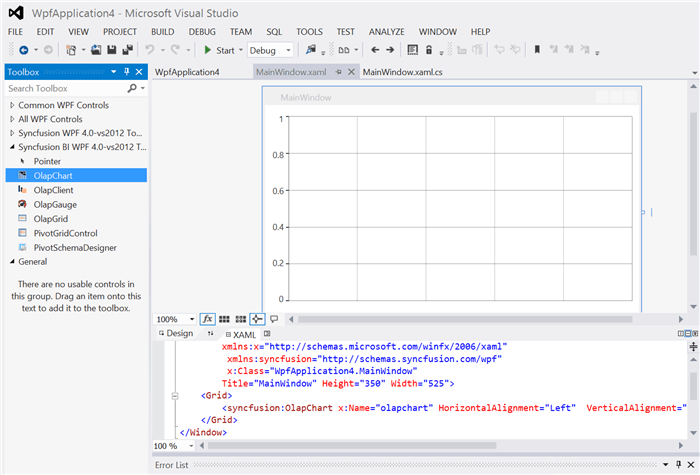
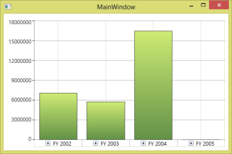

# Getting Started

>**Important**
Starting with v16.2.0.x, if you refer to Syncfusion assemblies from trial setup or from the NuGet feed, include a license key in your projects. Refer to this [link](https://help.syncfusion.com/common/essential-studio/licensing/license-key) to learn about registering Syncfusion license key in your WPF application to use the components.

This section covers the information required to create a simple OLAP chart bound to the OLAP data source.

## Through Visual Studio

Open the Visual Studio IDE and navigate to File > New > Project > WPF Application (inside Visual C# Templates) to create a new WPF application.

After the WPF application is created, go to View menu and select Toolbox option. Now, the toolbox will appear inside the Visual Studio IDE. From the Visual Studio Toolbox, drag the OLAP chart under the **Syncfusion BI WPF** tag. It will automatically add the required assemblies to the application.

Add a **Name** to the OLAP chart component for accessing it through code-behind as shown in the following code sample.


  
<Window
    xmlns="http://schemas.microsoft.com/winfx/2006/xaml/presentation"
    xmlns:x="http://schemas.microsoft.com/winfx/2006/xaml"
    xmlns:syncfusion="http://schemas.syncfusion.com/wpf" x:Class="SampleApplication.MainWindow"
    Title="MainWindow" Height="350" Width="525">
    <Grid>
        <syncfusion:OlapChart x:Name="olapChart" HorizontalAlignment="Left" VerticalAlignment="Top" Height="319" Width="517"/>
    </Grid>
</Window>
	


Include the following namespaces in the code-behind for using OlapReport and OlapDataManger in the application.

* Syncfusion.Olap.Reports
* Syncfusion.Olap.Manager
 



	
using Syncfusion.Olap.Manager;
using Syncfusion.Olap.Reports;
namespace SampleApplication
{
	public partial class MainWindow : SampleWindow
	{
		private string _connectionString;
		private OlapDataManager _olapDataManager;
		public MainWindow()
		{  
			InitializeComponent();
			_connectionString = " Enter a valid connection string ";
			//Connection string is passed to OlapDataManager as an argument
			_olapDataManager = new OlapDataManager(_connectionString);
			//A default OlapReport is set to OlapDataManager
			_olapDataManager.SetCurrentReport(CreateOlapReport());
			//Finally OlapChart gets the information from the OlapDataManager
			this.olapChart.OlapDataManager = _olapDataManager;
			this.olapChart.DataBind();
		}
            
		/// 

		/// Defining OlapReport with Dimension and Measure
		/// 

		private OlapReport CreateOlapReport()
		{
			OlapReport olapReport = new OlapReport();
			// Setting the Cube name
			olapReport.CurrentCubeName = "Adventure Works";
			DimensionElement dimensionElementColumn = new DimensionElement();
			// Specifying the name of the Dimension
			dimensionElementColumn.Name = "Customer";
			// Specifying the Hierarchy and Level name
			dimensionElementColumn.AddLevel("Customer Geography", "Country");
			MeasureElements measureElementColumn = new MeasureElements();
			//Specifying the Measure name
			measureElementColumn.Elements.Add(new MeasureElement { Name = "Internet Sales Amount" });
			DimensionElement dimensionElementRow = new DimensionElement();
			// Specifying the name of the Dimension
			dimensionElementRow.Name = "Date";
			// Specifying the Hierarchy and Level name
			dimensionElementRow.AddLevel("Fiscal", "Fiscal Year");
			///Adding Dimension in column axis
			olapReport.CategoricalElements.Add(dimensionElementColumn);
			///Adding Measure in column axis
			olapReport.CategoricalElements.Add(measureElementColumn);
			///Adding Dimension in row axis
			olapReport.SeriesElements.Add(dimensionElementRow);
			return olapReport;
		}
	}
}  
	
 


	
Imports Syncfusion.Olap.Manager
Imports Syncfusion.Olap.Reports
Namespace SampleApplication
	Partial Public Class MainWindow Inherits SampleWindow
		Private _connectionString As String
		Private _olapDataManager As OlapDataManager
		Public Sub New()
			InitializeComponent()
			_connectionString = "Enter a valid connection string"
			' Connection string is passed to OlapDataManager as an argument
			_olapDataManager = New OlapDataManager(_connectionString)
			' A default OlapReport is set to OlapDataManager
			_olapDataManager.SetCurrentReport(CreateOlapReport())
			' Finally OlapChart gets the information from the OlapDataManager 
			Me.olapChart.OlapDataManager = _olapDataManager
			Me.olapChart.DataBind()
		End Sub
        
		''' 

		''' Defining OlapReport with Dimension and Measure
		''' 

		Private Function CreateOlapReport() As OlapReport
			Dim olapReport As OlapReport = New OlapReport()
			' Setting the Cube name
			olapReport.CurrentCubeName = "Adventure Works"
			Dim dimensionElementColumn As DimensionElement = New DimensionElement()
			' Specifying the name of the Dimension
			dimensionElementColumn.Name = "Customer"
			' Specifying the Hierarchy and Level name
			dimensionElementColumn.AddLevel("Customer Geography", "Country")
			Dim measureElementColumn As MeasureElements = New MeasureElements()
			' Specifying the Measure name
			measureElementColumn.Elements.Add(New MeasureElement With {.Name = "Internet Sales Amount"})
			Dim dimensionElementRow As DimensionElement = New DimensionElement()
			' Specifying the name of the Dimension
			dimensionElementRow.Name = "Date"
			' Specifying the Hierarchy and Level name
			dimensionElementRow.AddLevel("Fiscal", "Fiscal Year")
			''' Adding Dimension in column axis
			olapReport.CategoricalElements.Add(dimensionElementColumn)
			''' Adding Measure in column axis
			olapReport.CategoricalElements.Add(measureElementColumn)
			''' Adding Dimension in row axis
			olapReport.SeriesElements.Add(dimensionElementRow)
			Return olapReport
		End Function
	End Class
End Namespace





Run the application. The following output will be generated.

   
## Through expression blend

Open Blend for Visual Studio and navigate to File > New project > WPF > WPF Application to create a new WPF application.

Select the **Project** tab available in the left-corner of the Blend IDE. Right-click the **References** and select **Add Reference**. Now, browse and add the following assemblies to the project.

* Syncfusion.Chart.WPF
* Syncfusion.Olap.Base
* Syncfusion.OlapChart.WPF
* Syncfusion.OlapChartConverter.WPF
* Syncfusion.OlapShared.WPF

N> You can also get the assemblies by browsing to the default assembly location:
{System Drive}:\Program Files (x86)\Syncfusion\Essential Studio\&lt;version number&gt;\precompiledassemblies\&lt;version number&gt;\&lt;framework version&gt;\

On adding the above assemblies, the OLAP chart control will be added under the **Assets** tab automatically. Now, choose the **Assets** tab and drag the OLAP chart to the designer.

Add a **Name** to the OLAP chart component for accessing it through the code-behind as shown in the following code sample.



<Window
    xmlns="http://schemas.microsoft.com/winfx/2006/xaml/presentation"
    xmlns:x="http://schemas.microsoft.com/winfx/2006/xaml"
    xmlns:syncfusion="http://schemas.syncfusion.com/wpf" x:Class="SampleApplication.MainWindow"
    Title="MainWindow" Height="350" Width="525">
    <Grid>
        <syncfusion:OlapChart x:Name="olapChart" HorizontalAlignment="Left" VerticalAlignment="Top" Height="319" Width="517"/>
    </Grid>
</Window>

  

Include the following namespace in the code-behind for using OlapReport and OlapDataManger in the application.

* Syncfusion.Olap.Reports
* Syncfusion.Olap.Manager





using Syncfusion.Olap.Manager;
using Syncfusion.Olap.Reports;
namespace SampleApplication
{
	public partial class MainWindow : SampleWindow
	{
		private string _connectionString;
		private OlapDataManager _olapDataManager;
		public MainWindow()
		{  
			InitializeComponent();
			_connectionString = " Enter a valid connection string ";
			//Connection string is passed to OlapDataManager as an argument
			_olapDataManager = new OlapDataManager(_connectionString);
			//A default OlapReport is set to OlapDataManager
			_olapDataManager.SetCurrentReport(CreateOlapReport());
			// Finally OlapChart gets the information from the OlapDataManager
			this.olapChart.OlapDataManager = _olapDataManager;
			this.olapChart.DataBind();
		}
            
		/// 

		/// Defining OlapReport with Dimension and Measure
		/// 

		private OlapReport CreateOlapReport()
		{
			OlapReport olapReport = new OlapReport();
			// Setting the Cube name
			olapReport.CurrentCubeName = "Adventure Works";
			DimensionElement dimensionElementColumn = new DimensionElement();
			// Specifying the name of the Dimension
			dimensionElementColumn.Name = "Customer";
			// Specifying the Hierarchy and Level name
			dimensionElementColumn.AddLevel("Customer Geography", "Country");
			MeasureElements measureElementColumn = new MeasureElements();
			//Specifying the Measure name
			measureElementColumn.Elements.Add(new MeasureElement { Name = "Internet Sales Amount" });
			DimensionElement dimensionElementRow = new DimensionElement();
			// Specifying the name of the Dimension
			dimensionElementRow.Name = "Date";
			// Specifying the Hierarchy and Level name
			dimensionElementRow.AddLevel("Fiscal", "Fiscal Year");
			///Adding Dimension in column axis
			olapReport.CategoricalElements.Add(dimensionElementColumn);
			///Adding Measure in column axis
			olapReport.CategoricalElements.Add(measureElementColumn);
			///Adding Dimension in row axis
			olapReport.SeriesElements.Add(dimensionElementRow);
			return olapReport;
		}
	}
}


   
   
	
Imports Syncfusion.Olap.Manager
Imports Syncfusion.Olap.Reports
Namespace SampleApplication
	Partial Public Class MainWindow Inherits SampleWindow
		Private _connectionString As String
		Private _olapDataManager As OlapDataManager
		Public Sub New()
			InitializeComponent()
			_connectionString = " Enter a valid connection string "
			' Connection string is passed to OlapDataManager as an argument
			_olapDataManager = New OlapDataManager(_connectionString)
			' A default OlapReport is set to OlapDataManager
			_olapDataManager.SetCurrentReport(CreateOlapReport())
			' Finally OlapChart gets the information from the OlapDataManager		
			Me.olapChart.OlapDataManager = _olapDataManager
			Me.olapChart.DataBind()
		End Sub
        
		''' 

		''' Defining OlapReport with Dimension and Measure
		''' 

		Private Function CreateOlapReport() As OlapReport
			 Dim olapReport As OlapReport = New OlapReport()
			' Setting the Cube name
			olapReport.CurrentCubeName = "Adventure Works"
			Dim dimensionElementColumn As DimensionElement = New DimensionElement()
			' Specifying the name of the Dimension
			 dimensionElementColumn.Name = "Customer"
			 ' Specifying the Hierarchy and Level name
			 dimensionElementColumn.AddLevel("Customer Geography", "Country")
			 Dim measureElementColumn As MeasureElements = New MeasureElements()
			 ' Specifying the Measure name
			 measureElementColumn.Elements.Add(New MeasureElement With {.Name = "Internet Sales Amount"})
			 Dim dimensionElementRow As DimensionElement = New DimensionElement()
			' Specifying the name of the Dimension
			dimensionElementRow.Name = "Date"
			' Specifying the Hierarchy and Level name
			 dimensionElementRow.AddLevel("Fiscal", "Fiscal Year")
			 ''' Adding Dimension in column axis
			 olapReport.CategoricalElements.Add(dimensionElementColumn)
			 ''' Adding Measure in column axis
			 olapReport.CategoricalElements.Add(measureElementColumn)
			 ''' Adding Dimension in row axis
			 olapReport.SeriesElements.Add(dimensionElementRow)
			 Return olapReport
		End Function
	End Class
End Namespace





Run the application. The following output will be generated.

## Through code-behind

Open the Visual Studio IDE and navigate to File > New > Project > WPF Application (inside Visual C# Templates) to create a new WPF application.

To add the dependency assemblies within the application, right-click **References** in the solution explorer and select **Add Reference**. Then, add the following Syncfusion assemblies manually to the project from the installed location.

* Syncfusion.Chart.WPF
* Syncfusion.Core
* Syncfusion.Olap.Base
* Syncfusion.OlapChart.WPF
* Syncfusion OlapChartConverter.WPF
* Syncfusion.OlapShared.WPF
* Syncfusion.Shared.WPF
* Syncfusion.Tools.WPF

N> You can also get the assemblies by browsing to the default assembly location
{System Drive}:\Program Files (x86)\Syncfusion\Essential Studio\&lt;version number&gt;\precompiledassemblies\&lt;version number&gt;\&lt;framework version&gt;\

Include the following namespaces in code-behind for using OlapChart, OlapReport, and OlapDataManger in the application.

* Syncfusion.Olap.Reports
* Syncfusion.Olap.Manager
* Syncfusion.Windows.Chart.Olap





using Syncfusion.Olap.Manager;
using Syncfusion.Olap.Reports;
using Syncfusion.Windows.Chart.Olap;
namespace SampleApplication
{
	public partial class MainWindow : SampleWindow
	{
		private string _connectionString;
		private OlapDataManager _olapDataManager;
		public MainWindow()
		{  
			InitializeComponent();
			OlapChart olapChart = new OlapChart();
			_connectionString = " Enter a valid connection string ";
			//Connection string is passed to OlapDataManager as an argument
			_olapDataManager = new OlapDataManager(_connectionString);
			//A default OlapReport is set to OlapDataManager
			_olapDataManager.SetCurrentReport(CreateOlapReport());
			// Finally OlapChart gets the information from the OlapDataManager
			olapChart.OlapDataManager = _olapDataManager;
			olapChart.DataBind();
			// OlapChart added to the Main Window Grid region
			chart.Children.Add(olapChart);
		}
            
		/// 

		/// Defining OlapReport with Dimension and Measure
		/// 

		private OlapReport CreateOlapReport()
		{
			OlapReport olapReport = new OlapReport();
			// Setting the Cube name
			olapReport.CurrentCubeName = "Adventure Works";
			DimensionElement dimensionElementColumn = new DimensionElement();
			// Specifying the name of the Dimension
			dimensionElementColumn.Name = "Customer";
			// Specifying the Hierarchy and Level name
			dimensionElementColumn.AddLevel("Customer Geography", "Country");
			MeasureElements measureElementColumn = new MeasureElements();
			//Specifying the Measure name
			measureElementColumn.Elements.Add(new MeasureElement { Name = "Internet Sales Amount" });
			DimensionElement dimensionElementRow = new DimensionElement();
			// Specifying the name of the Dimension
			dimensionElementRow.Name = "Date";
			// Specifying the Hierarchy and Level name
			dimensionElementRow.AddLevel("Fiscal", "Fiscal Year");
			///Adding Dimension in column axis
			olapReport.CategoricalElements.Add(dimensionElementColumn);
			///Adding Measure in column axis
			olapReport.CategoricalElements.Add(measureElementColumn);
			///Adding Dimension in row axis
			olapReport.SeriesElements.Add(dimensionElementRow);
			return olapReport;
		}
	}
}
					

   
    

Imports Syncfusion.Olap.Manager
Imports Syncfusion.Olap.Reports         
Imports Syncfusion.Windows.Chart.Olap
Namespace SampleApplication
	Partial Public Class MainWindow Inherits SampleWindow
		Private _connectionString As String
		Private _olapDataManager As OlapDataManager
		Public Sub New()
			InitializeComponent()
			Dim olapChart As New OlapChart()
			_connectionString = " Enter a valid connection string "
			' Connection string is passed to OlapDataManager as an argument
			_olapDataManager = New OlapDataManager(_connectionString)
			' A default OlapReport is set to OlapDataManager
			_olapDataManager.SetCurrentReport(CreateOlapReport())
			' Finally OlapChart gets the information from the OlapDataManager	
			olapChart.OlapDataManager = _olapDataManager
			olapChart.DataBind()
			// OlapChart added to the Main Window Grid region
			chart.Children.Add(olapChart)
		End Sub
        
		''' 

		''' Defining OlapReport with Dimension and Measure
		''' 

		Private Function CreateOlapReport() As OlapReport
			Dim olapReport As OlapReport = New OlapReport()
			' Setting the Cube name
			olapReport.CurrentCubeName = "Adventure Works"
			Dim dimensionElementColumn As DimensionElement = New DimensionElement()
			' Specifying the name of the Dimension
			dimensionElementColumn.Name = "Customer"
			' Specifying the Hierarchy and Level name
			dimensionElementColumn.AddLevel("Customer Geography", "Country")
			Dim measureElementColumn As MeasureElements = New MeasureElements()
			' Specifying the Measure name
			measureElementColumn.Elements.Add(New MeasureElement With {.Name = "Internet Sales Amount"})
			Dim dimensionElementRow As DimensionElement = New DimensionElement()
			' Specifying the name of the Dimension
			dimensionElementRow.Name = "Date"
			' Specifying the Hierarchy and Level name
			dimensionElementRow.AddLevel("Fiscal", "Fiscal Year")
			''' Adding Dimension in column axis
			olapReport.CategoricalElements.Add(dimensionElementColumn)
			''' Adding Measure in column axis
			olapReport.CategoricalElements.Add(measureElementColumn)
			''' Adding Dimension in row axis
			olapReport.SeriesElements.Add(dimensionElementRow)
			Return olapReport
		End Function
	End Class
End Namespace
	




Run the application. The following output will be generated.

## Design-time binding

Design-time binding support for OLAP chart allows you to reduce the time spent on creating and customizing the report. Normally, it takes 5 to 10 minutes for creating a report and in case of unfamiliar cubes it may extend further. But by using design-time support, you can create a report in a couple of minutes. The following section explains how to create a report during design-time.

First drag the OLAP chart control from the toolbox to the Visual Studio designer surface.

Right-click the OLAP chart available in the designer and go to **Configure data source > Create/Edit data source…** option in the context menu. Now, the **Data Source Properties** wizard opens.

From the **Data Source Properties** wizard, select the connection type. If you want to connect to SSAS, select **Use server name and database to connect to a server** and specify the necessary information to connect to the server. If you want to connect to an Offline cube, select **Use a connection string to connect to a server** and enter your connection string path.

If you want to test the connection, click the **Test Connection** button that is displayed on the bottom-left corner of the window. Click **Next** to proceed.

N> The Next button is enabled only when any one of the connection option is filled properly.

When the connection is valid, it displays the summary page of the **Data Source Properties** wizard. When you create a query for the first time, the MDX query text box in the summary page is empty. When you edit an existing query, it displays the current query in the text box.

For creating or editing a query, click the **Create/Edit** link that is displayed on the top-right side of the MDX query text box. This opens a **Query Designer** dialog. 

When you edit an existing query, it displays the required dimensions in the specific axis of the query designer and the preview of that query is displayed in the chart control.
   
N> It does not display any style/formatting applied to the chart. It only displays the result of the query.

Drag the dimensions to frame a new query. Then, click OK to save the query or click Cancel to revert the changes made during this session.

The summary page of the **Data Source Properties** wizard displays the resultant MDX query.

Click **Finish** and run the application.

