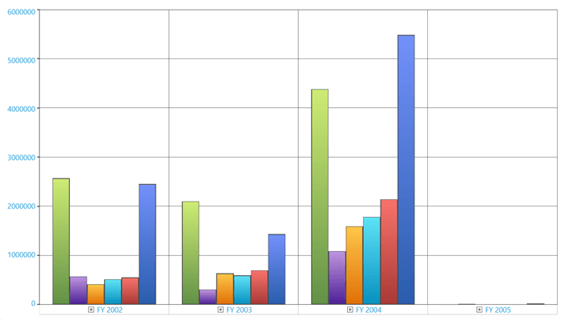
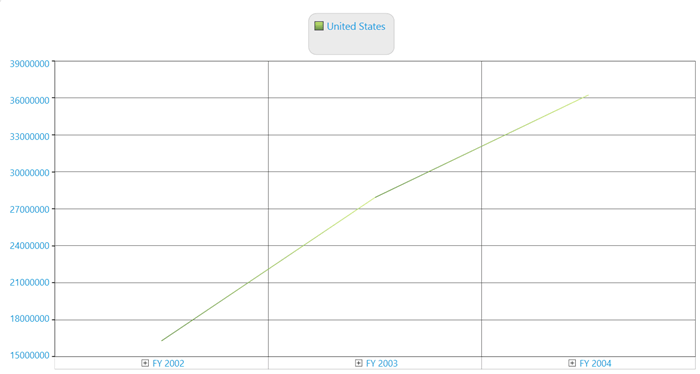
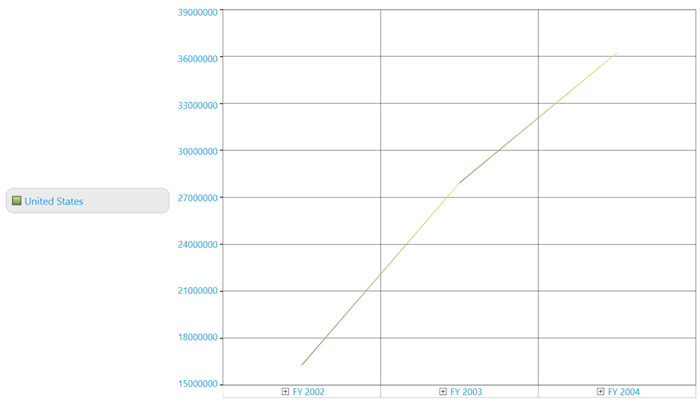
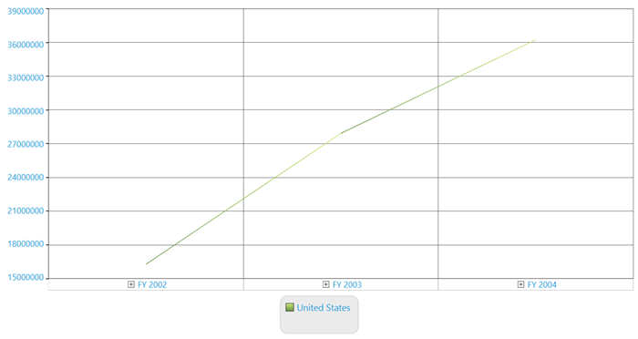

# Legend in WPF Olap Chart

Legends are used to display the name of data series. The chart legend can be added to an OLAP chart by adding the chart legend of the chart WPF, which is found under the Syncfusion.Windows.Chart namespace. The following code sample explains how to add a legend to an OLAP chart.





<syncfusion:OlapChart.Legend>
     <syncfusion:ChartLegend Background="Transparent"/>
</syncfusion:OlapChart.Legend>





this.olapChart.Legend = new ChartLegend();





Me.olapChart.Legend = New ChartLegend()





## Show/hide legend

The chart legend has a `Visibility` property using which you can show or hide the chart legend in the OLAP chart. The following code sample shows how you can collapse the visibility of the chart legend.





<syncfusion:OlapChart.Legend>
     <syncfusion:ChartLegend Visibility="Collapsed" />
</syncfusion:OlapChart.Legend>


 


this.olapChart.Legend.Visibility = System.Windows.Visibility.Collapsed;





Me.olapChart.Legend.Visibility = System.Windows.Visibility.Collapsed





## Visibility customization

The visibility of the legend check box can be toggled by using the `CheckBoxVisibility` property in the chart legend. The following code sample shows how to toggle the visibility of check box in the legend of the OLAP chart.





<syncfusion:OlapChart.Legend>
     <syncfusion:ChartLegend CheckBoxVisibility="Collapsed" />
</syncfusion:OlapChart.Legend>





this.olapChart.Legend.CheckBoxVisibility = System.Windows.Visibility.Collapsed;





Me.olapChart.Legend.CheckBoxVisibility = System.Windows.Visibility.Collapsed





The visibility of the legend icon can be toggled by using the `IconVisibility` property in the chart legend. The following code sample shows how to toggle the visibility of icons in the OLAP chart legend.




    
<syncfusion:OlapChart.Legend>
     <syncfusion:ChartLegend IconVisibility="Collapsed" />
</syncfusion:OlapChart.Legend>





this.olapChart.Legend.IconVisibility = System.Windows.Visibility.Collapsed;





Me.olapChart.Legend.IconVisibility = System.Windows.Visibility.Collapsed





## Dock position

The chart legend contains an enum property called ChartDock, which has the following values **Floating**, **Right**, **Left**, **Top**, and **Bottom**. You can choose the required docking position to dock the legend. The following code sample explains how to set the docking position for the OLAP chart legend.





ChartDockPanel.SetDock(this.olapChart.Legend, ChartDock.Right);





ChartDockPanel.SetDock(Me.olapChart.Legend, ChartDock.Right)





## Row/column setting

You can use the `RowsCount` and `ColumnsCount` property to create the rows or columns of the OLAP chart legend. The **RowsCount** and **ColumnsCount** will be used internally to create a grid layout control to place the legends. The following code sample shows how to set the number of rows or columns in an legend.





<syncfusion:OlapChart.Legend>
     <syncfusion:ChartLegend Background="Transparent" 
          RowsCount="2" ColumnsCount="2" />
</syncfusion:OlapChart.Legend>





this.olapChart.Legend.RowsCount = 2;
this.olapChart.Legend.ColumnsCount = 2;





Me.olapChart.Legend.RowsCount = 2
Me.olapChart.Legend.ColumnsCount = 2





N> The **RowsCount** and **ColumnsCount** are used to create the rows and columns in the grid layout control, which is used to place the legends. If you give extra row or column count than the legend availability, it will display empty spaces to fill the structure of the grid. The following illustration explains this in detail.

The following chart has only one legend, but the RowsCount and ColumnsCount are set as 2. Therefore, the resultant legend will appear as follows:

**Legend with RowsCount=2, ColumnsCount=2 and ChartDock.Top**

     
**Legend with RowsCount=2, ColumnsCount=2 and ChartDock.Right**

   
**Legend with RowsCount=2, ColumnsCount=2 and ChartDock.Left**

 
**Legend with RowsCount=2, ColumnsCount=2 and ChartDock.Bottom**

   
