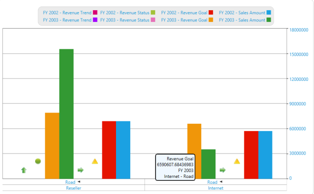

# Localization in WPF Olap Chart

Localization is the key feature for providing software solutions targeted at global users. The OLAP chart allows users to localize the control to a specific locale and supports "resx" based localization.

The following steps should be performed to localize the control.

* Translation.
* Resource file and file name conventions.
* Tag inclusion into the project file.
* Specifying the CurrentUICulture.

### Translation

The first step in localization is translating the strings that can be localized to the destination locale.

N> Localization key field should be same for all locales. Do not translate it.

### Resource file and file name conventions

After translating the strings that can be localized, perform the following in the application:

Right-click the project file to create a new folder in the project. Select Add > New Folder and rename the folder as "Resources".

N> The folder name should strictly be "Resources".

Now, right-click the resources folder to create a new resource file in the Visual Studio project. Navigate to Add > New Item.

Select "Resources File" from the list. Then, name the resource file as Syncfusion.OlapChart.WPF.ar-AE.resx and click Add.

N> The resource file name should strictly be in the format "Syncfusion.OlapChart.WPF.&lt;Culture Code&gt;.resx".
   
Copy and paste the translated locale to the resource file created in the earlier step.

### Specifying the CurrentUICulture

Now, you need to specify the CurrentUICulture of the application. You can specify the CurrentUICulture either from Application_Startup in App.xaml.cs or from the constructor in the main page. (If you are specifying the current culture on the main page, then make sure that it is assigned before the InitializeComponent method).


 
public MainWindow()
{
    //Set the current thread culture to load the localization resource file. 
    System.Threading.Thread.CurrentThread.CurrentUICulture = new System.Globalization.CultureInfo("ar-AE");
    InitializeComponent();
    if (System.Globalization.CultureInfo.CurrentUICulture.ToString() == "ar-AE")
        this.FlowDirection = System.Windows.FlowDirection.RightToLeft;
}



## RTL support

RTL support for OLAP chart is used to display the content from right to left by setting the `FlowDirection` property to "RightToLeft". The following code sample explains how to set this property.




	
<syncfusion:OlapChart x:Name="olapChart" FlowDirection="RightToLeft" HorizontalAlignment="Stretch" olapshared:DataSource.DataManagerName="localManager" olapshared:DataSource.ConnectionString="{Binding OlapConnectionString}" />




 
this.olapChart.FlowDirection = System.Windows.FlowDirection.RightToLeft;




  
Me.olapChart.FlowDirection = System.Windows.FlowDirection.RightToLeft




  

  
A sample demo is available at the following location.

{system drive}:\Users\&lt;User Name&gt;\AppData\Local\Syncfusion\EssentialStudio\&lt;Version Number&gt;\WPF\OlapChart.WPF\Samples\Localization

