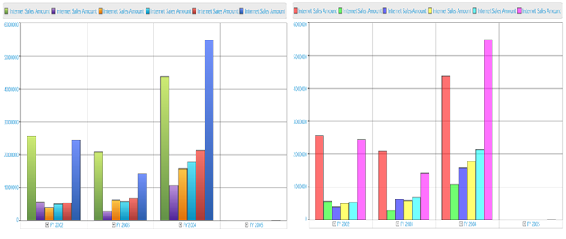
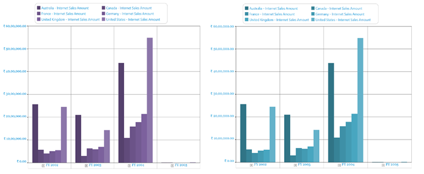

# Palette in WPF Olap Chart

The chart palette is a pre-defined collection of a set of colors that can be applied to a chart series. The OLAP chart supports 23 chart palettes, which is used to provide rich look for your business applications.

The following are the available palettes in the OLAP chart control:

* Default
* DefaultAlpha
* EarthTone
* Analog
* Colorful
* Nature
* Pastel
* Triad
* WarmCold
* Grayscale
* Office2007Blue
* Office2007Black 
* Office2007Silver
* Gradient
* Grayscale
* BlueScale
* MaroonRed
* GreenScale
* MixedViolet
* CoolBlueScale
* ChocolateOrange
* MixedFantasy
* Custom

The following code sample shows how to apply a palette to the OLAP chart.




 
this.olapChart.ColorModel.Palette = (Syncfusion.Windows.Chart.ChartColorPalette)Enum.Parse(typeof(Syncfusion.Windows.Chart.ChartColorPalette), "EarthTone");




  
Me.olapChart.ColorModel.Palette = CType(System.Enum.Parse(GetType(Syncfusion.Windows.Chart.ChartColorPalette), "EarthTone"), Syncfusion.Windows.Chart.ChartColorPalette)





The following image shows before and after applying the *EarthTone* palette.

## Custom palette

Custom palettes can be applied to the OLAP chart by setting the _“Interior”_ property with custom brush to each series in the OLAP chart.

A sample demo is available at the following location.

{system drive}:\Users\&lt;User Name&gt;\AppData\Local\Syncfusion\EssentialStudio\&lt;Version Number&gt;\WPF\OlapChart.WPF\Samples\Customization\Series Customization Demo

## Excel-like palette

Excel-like palettes are used to display the OLAP chart in business applications.

The following are the available types of Excel-like palettes:

**GrayScale, BlueScale**

**MaroonRed, GreenScale**

**MixedViolet, CoolBlueScale**

**ChocolateOrange, MixedFantasy**

The following code sample shows how to apply Excel-like palettes.

### Grayscale




 
this.olapChart.ColorModel.Palette = (Syncfusion.Windows.Chart.ChartColorPalette)Enum.Parse(typeof(Syncfusion.Windows.Chart.ChartColorPalette), "Grayscale");




  
Me.olapChart.ColorModel.Palette = CType(System.Enum.Parse(GetType(Syncfusion.Windows.Chart.ChartColorPalette), "Grayscale"), Syncfusion.Windows.Chart.ChartColorPalette)





### BlueScale




 
this.olapChart.ColorModel.Palette = (Syncfusion.Windows.Chart.ChartColorPalette)Enum.Parse(typeof(Syncfusion.Windows.Chart.ChartColorPalette), "BlueScale");




  
Me.olapChart.ColorModel.Palette = CType(System.Enum.Parse(GetType(Syncfusion.Windows.Chart.ChartColorPalette), "BlueScale"), Syncfusion.Windows.Chart.ChartColorPalette)


 


### MaroonRed




 
this.olapChart.ColorModel.Palette = (Syncfusion.Windows.Chart.ChartColorPalette)Enum.Parse(typeof(Syncfusion.Windows.Chart.ChartColorPalette), "MaroonRed");




  
Me.olapChart.ColorModel.Palette = CType(System.Enum.Parse(GetType(Syncfusion.Windows.Chart.ChartColorPalette), "MaroonRed"), Syncfusion.Windows.Chart.ChartColorPalette)





### GreenScale




 
this.olapChart.ColorModel.Palette = (Syncfusion.Windows.Chart.ChartColorPalette)Enum.Parse(typeof(Syncfusion.Windows.Chart.ChartColorPalette), "GreenScale");




  
Me.olapChart.ColorModel.Palette = CType(System.Enum.Parse(GetType(Syncfusion.Windows.Chart.ChartColorPalette), "GreenScale"), Syncfusion.Windows.Chart.ChartColorPalette)





### MixedViolet




 
this.olapChart.ColorModel.Palette = (Syncfusion.Windows.Chart.ChartColorPalette)Enum.Parse(typeof(Syncfusion.Windows.Chart.ChartColorPalette), "MixedViolet");




  
Me.olapChart.ColorModel.Palette = CType(System.Enum.Parse(GetType(Syncfusion.Windows.Chart.ChartColorPalette), "MixedViolet"), Syncfusion.Windows.Chart.ChartColorPalette)





### CoolBlueScale




 
this.olapChart.ColorModel.Palette = (Syncfusion.Windows.Chart.ChartColorPalette)Enum.Parse(typeof(Syncfusion.Windows.Chart.ChartColorPalette), "CoolBlueScale");




  
Me.olapChart.ColorModel.Palette = CType(System.Enum.Parse(GetType(Syncfusion.Windows.Chart.ChartColorPalette), "CoolBlueScale"), Syncfusion.Windows.Chart.ChartColorPalette)




 
### ChocolateOrange




 
this.olapChart.ColorModel.Palette = (Syncfusion.Windows.Chart.ChartColorPalette)Enum.Parse(typeof(Syncfusion.Windows.Chart.ChartColorPalette), "ChocolateOrange");




  
Me.olapChart.ColorModel.Palette = CType(System.Enum.Parse(GetType(Syncfusion.Windows.Chart.ChartColorPalette), "ChocolateOrange"), Syncfusion.Windows.Chart.ChartColorPalette)





### MixedFantasy




 
this.olapChart.ColorModel.Palette = (Syncfusion.Windows.Chart.ChartColorPalette)Enum.Parse(typeof(Syncfusion.Windows.Chart.ChartColorPalette), "MixedFantasy");




  
Me.olapChart.ColorModel.Palette = CType(System.Enum.Parse(GetType(Syncfusion.Windows.Chart.ChartColorPalette), "MixedFantasy"), Syncfusion.Windows.Chart.ChartColorPalette)




