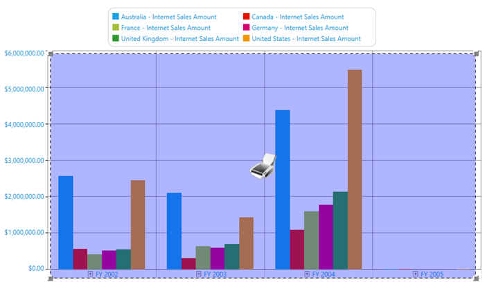

# Printing OLAP Chart

The OLAP chart can be printed in black, color, or white modes. It supports the cropping feature used to print a particular part of the chart.

The following image illustrates printing a cropped image.

A sample demo is available at the following location.

{system drive}:\Users\&lt;User Name&gt;\AppData\Local\Syncfusion\EssentialStudio\&lt;Version Number&gt;\WPF\OlapChart.WPF\Samples\Printing\Printing Chart Demo