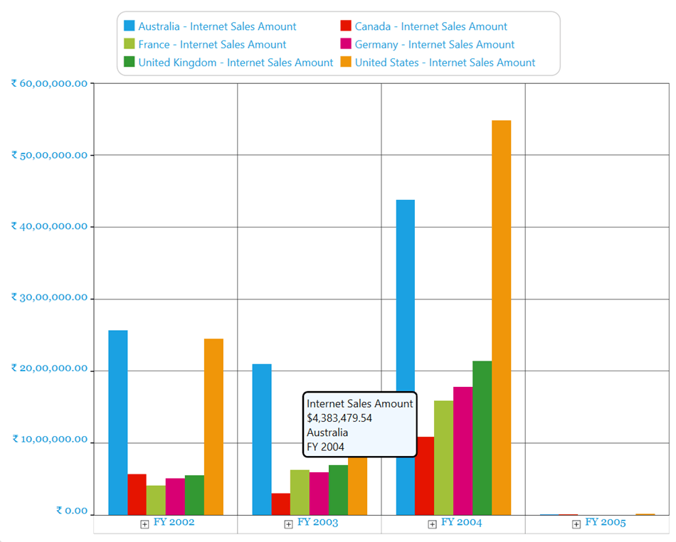

# Tooltip in WPF Olap Chart

The OLAP chart provides the series information such as measure, primary x-axis and y-axis values, and series name through the series tooltip, when the mouse pointer is moved over chart points.

The following code sample shows how to disable the series tooltip using the `ShowToolTip` property.




 
this.olapChart.Series[0].ShowToolTip = false;




  
Me.olapChart.Series(0).ShowToolTip = False




  

  
The following code sample shows how to enable the series tooltip using the `ShowToolTip` property.




 
this.olapChart.Series[0].ShowToolTip = true;




  
Me.olapChart.Series(0).ShowToolTip = True




  

