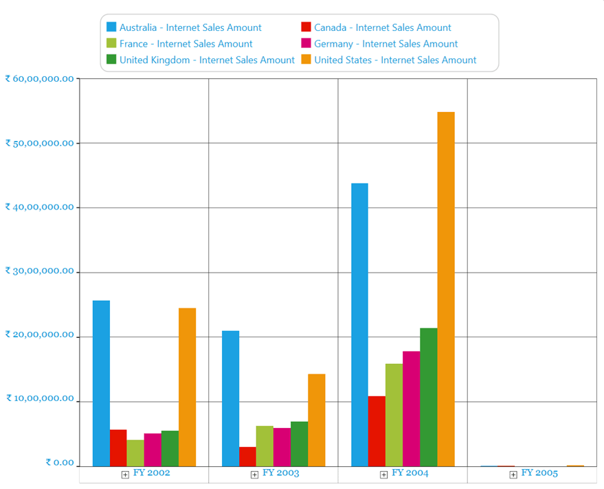
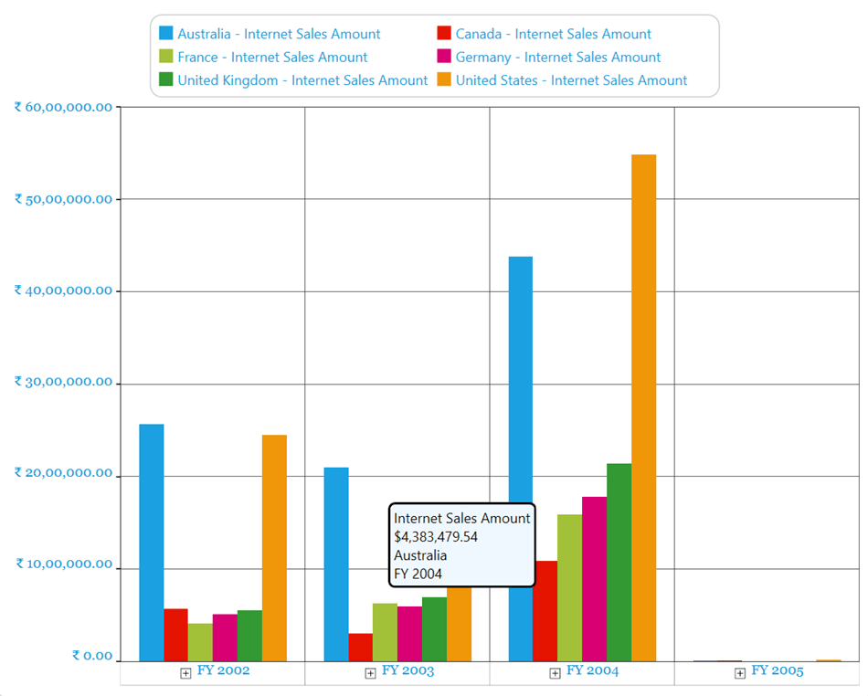

# Tooltip in WPF Olap Chart

The WPF OLAP Chart provides series information, such as measure values, primary x-axis and y-axis values, and the series name, through series tooltips when the mouse pointer is moved over chart points.

The following code sample shows how to disable the series tooltip using the `ShowToolTip` property.




 
this.olapChart.Series[0].ShowToolTip = false;




  
Me.olapChart.Series(0).ShowToolTip = False




  

  
The following code sample shows how to enable the series tooltip using the `ShowToolTip` property.




 
this.olapChart.Series[0].ShowToolTip = true;




  
Me.olapChart.Series(0).ShowToolTip = True




  

