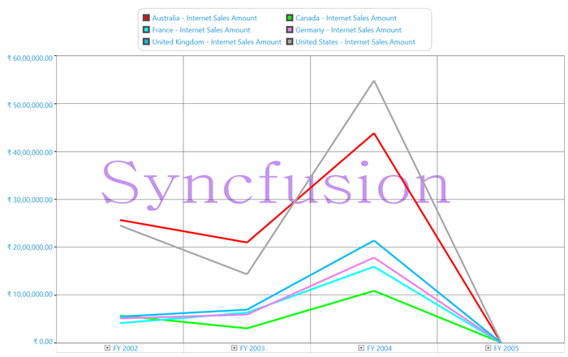
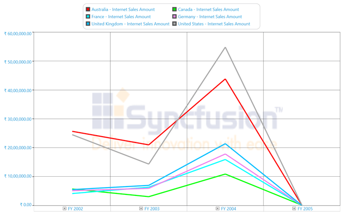

# Watermark in WPF Olap Chart

The OLAP chart for WPF supports the watermark feature, which is used to display text, images, or both as a watermark within the chart area.

There are many customization options available for the watermark content. The content can be aligned both horizontally and vertically, and its font style can be modified. The interior of the content can be customized, and the opacity can also be adjusted.

The following screenshot shows text used as a watermark

The following screenshot shows the image as a watermark.

A sample demo is available at the following location.

{system drive}:\Users\&lt;User Name&gt;\AppData\Local\Syncfusion\EssentialStudio\&lt;Version Number&gt;\WPF\OlapChart.WPF\Samples\Chart Appearance\Watermark Demo

