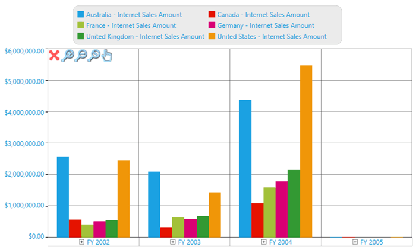

# Zooming and Scrolling in WPF Olap Chart

The WPF OLAP Chart allows you to zoom in to a narrower range within that.

In zooming mode, a zooming toolkit is displayed at the top-left corner of the WPF OLAP Chart. Using the buttons in the zooming toolkit, ChartSeries can be zoomed in, zoomed out, reset, or closed

The visibility of the zooming toolkit or individual buttons in the toolkit can be controlled by using the following properties:

_Property_

* **ZoomInButtonVisibility**: Gets or sets the zoom in button visibility.
* **ZoomOutButtonVisibility**: Gets or sets the zoom out button visibility.
* **ZoomCloseButtonVisibility**: Gets or sets the zoom close button visibility.
* **ZoomResetButtonVisibility**: Gets or sets the zoom reset button visibility.

The following code sample illustrates the above settings.





<syncfusion:OlapChart Name="olapChart" 
    syncfusion:ChartZoomingToolkit.ZoomInButtonVisibility="{Binding IsChecked, 
          ElementName=cbxZoomIn, Converter={StaticResource boolToVisibilityConverter}}"
    syncfusion:ChartZoomingToolkit.ZoomOutButtonVisibility="{Binding IsChecked, 
          ElementName=cbxZoomOut, Converter={StaticResource boolToVisibilityConverter }}"
    syncfusion:ChartZoomingToolkit.ZoomCloseButtonVisibility="{Binding IsChecked, 
          ElementName=cbxZoomClose, Converter={StaticResource boolToVisibilityConverter }}"
    syncfusion:ChartZoomingToolkit.ZoomResetButtonVisibility="{Binding IsChecked, 
          ElementName=cbxZoomReset, Converter={StaticResource boolToVisibilityConverter }}">
</syncfusion:OlapChart>




 
ChartZoomingToolkit.SetZoomInButtonVisibility(olapChart, Visibility.Collapsed);
ChartZoomingToolkit.SetZoomOutButtonVisibility(olapChart, Visibility.Hidden);
ChartZoomingToolkit.SetZoomResetButtonVisibility(olapChart, Visibility.Collapsed);
ChartZoomingToolkit.SetZoomingToolkitVisibility(olapChart, Visibility.Visible);




  
ChartZoomingToolkit.SetZoomInButtonVisibility(olapChart, Visibility.Collapsed)
ChartZoomingToolkit.SetZoomOutButtonVisibility(olapChart, Visibility.Hidden)
ChartZoomingToolkit.SetZoomResetButtonVisibility(olapChart, Visibility.Collapsed)
ChartZoomingToolkit.SetZoomingToolkitVisibility(olapChart, Visibility.Visible)





A sample demo is available at the following location.

{system drive}:\Users\&lt;User Name&gt;\AppData\Local\Syncfusion\EssentialStudio\&lt;Version Number&gt;\WPF\OlapChart.WPF\Samples\Zooming and Scrolling\Zooming and Scrolling Demo
