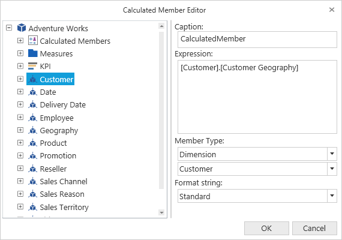

# Calculated Members in WPF OlapClient

This feature allows users to define measures and members using the calculated member editor. The calculated member editor can be opened just by clicking the respective icon available in the OLAP client toolbar. The icon will be visible only by setting the `IsCalculatedMembersEnabled` property to true.





<CheckBox Name="chk_CalcMember  ToolTip="Enable/Disable Calculated Members" Content="Enable Calculated Members" 
          IsChecked="{Binding ElementName=olapClient1, Path=IsCalculatedMembersEnabled}"/>



  

this.olapClient1.IsCalculatedMembersEnabled = true; 

 



Me.olapClient1.IsCalculatedMembersEnabled = True 





A sample demo is available at the following location.

{system drive}:\Users\&lt;User Name&gt;\AppData\Local\Syncfusion\EssentialStudio\&lt;Version Number&gt;\WPF\OlapClient.WPF\Samples\Product Showcase\CalculatedMembers

