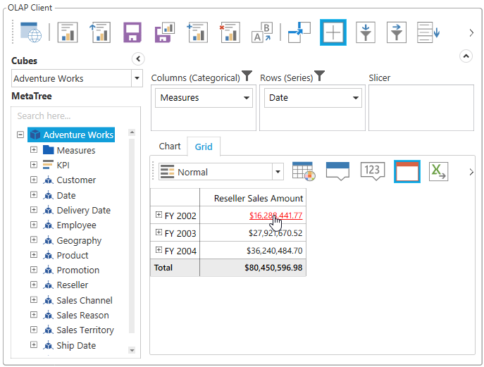
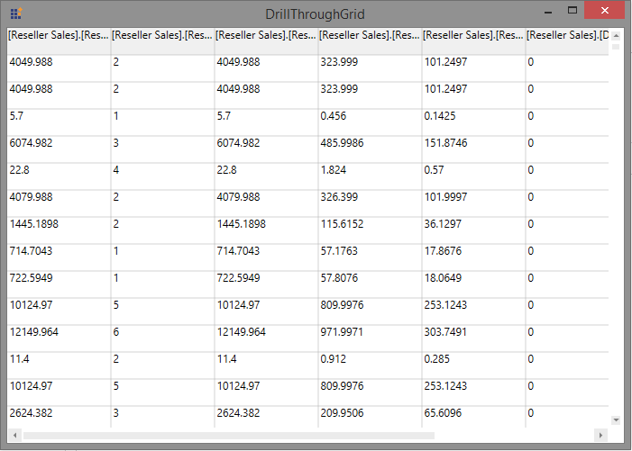

# Drill-Through with WPF OLAP Client

Drill-through retrieves raw data that are used to create a specified cell in a cube. You can enable or disable the drill-through action using the `EnableDrillThrough` property.

The following code sample explains how to enable the drill-through option in your application.



 

this.olapClient1.DisplayMode = Syncfusion.Windows.Client.Olap.DisplayModes.GridOnly;
this.olapClient1.OlapGrid.ValueCellStyle.IsHyperlinkCell = true;
this.olapClient1.OlapGrid.EnableDrillThrough = true;
this.olapClient1.OlapGrid.LinkClick += new Syncfusion.Windows.Grid.Olap.LinkLabelClickEventHander(OlapGrid_LinkClick);
void OlapGrid_LinkClick(object sender, Syncfusion.Windows.Grid.Olap.LinkLabelEventArgs e)
{
    DataTable DrillThroughData = e.DrillThroughData;
}


 
 

Me.olapClient1.DisplayMode = Syncfusion.Windows.Client.Olap.DisplayModes.GridOnly
Me.olapClient1.OlapGrid.ValueCellStyle.IsHyperlinkCell = True
Me.olapClient1.OlapGrid.EnableDrillThrough = True
Me.olapClient1.OlapGrid.LinkClick += New Syncfusion.Windows.Grid.Olap.LinkLabelClickEventHander(OlapGrid_LinkClick)
Private Sub OlapGrid_LinkClick(sender As Object, e As Syncfusion.Windows.Grid.Olap.LinkLabelEventArgs)
    Dim DrillThroughData As DataTable = e.DrillThroughData
End Sub





Hyperlink Cell Click
{:.caption}

Attribute Hierarchy Selector
{:.caption}

Grid with drill-through information
{:.caption}

A sample demo is available at the following location.

{system drive}:\Users\&lt;User Name&gt;\AppData\Local\Syncfusion\EssentialStudio\&lt;Version Number&gt;\WPF\OlapClient.WPF\Samples\Product Showcase\Drill Through

