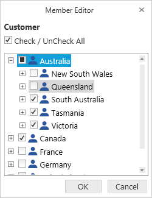
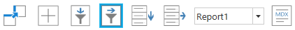
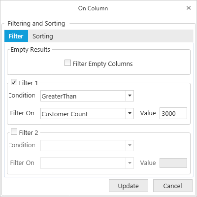

# Filtering in WPF Olap Client

## Filtering by member

After clicking the split button of a dimension, the member editor dialog opens through which members are filtered by checking and unchecking the check boxes corresponding to members. By clicking OK, the OLAP report gets updated and refreshes the OLAP grid and OLAP chart controls based on the selected members in the member editor dialog. The Cancel button is used for canceling the selection.

The above filter illustrates that the members "France" and "Germany" along with "New South Wales" and "Queensland" are filtered from the grid and chart views.

## Filtering by value

The filter tab in the filtering and sorting dialog box provides the options to specify custom filters on the multidimensional data. It enables users to filter the rows and columns of the selected measure.

* **Column filter**: Column filter checks each and every row of a column against the filter condition. The column will be included in the result set only if all the rows of that column satisfy the condition; otherwise, the column will be filtered.

* **Row filter**: Row filter checks each and every column of a row against the filter condition. The row will be included in the result set only if all the columns of that row satisfy the condition; otherwise, the row will be filtered.

Filtering and Sorting dialog for rows/columns can be opened by clicking the corresponding icon in the toolbar.

Filtering by row
{:.caption}

Filtering by column
{:.caption}

The following screenshot displays the filter tab in Filtering and Sorting dialog.

The options in the filtering tab are as follows:

**Filter empty rows/columns**: Filters the empty rows or columns appeared in the result set.

**Filter 1 and Filter 2**: You can apply two filter expressions to a report at the same time. The options in the filter group box are as follows:

* **Condition**: You can choose any one condition required to appear in the filter expression.
* **Filter on**: You can choose any one measure element from the list, on which you want to apply the filter.
* **Value**: Enter the conditional value for the expression.

You can toggle the visibility of the filter and sort buttons in the OLAP client toolbar by using the `ShowFilterSortButtons` property.



  

this.olapClient1.ShowFilterSortButtons = false;

 

 

Me.olapClient1.ShowFilterSortButtons = False


 


## Subset filter

Subset filter is used to filter the number of records in the result set. The subset filter gets a numeric number as input and restricts the number of records within that count. You can specify the subset filter for both the row and column.

Users can toggle the visibility of subset filter by using the `ShowSubsetFilters` property.



  

    this.olapClient1.ShowSubsetFilters = false;

 

 

    Me.olapClient1.ShowSubsetFilters = False




