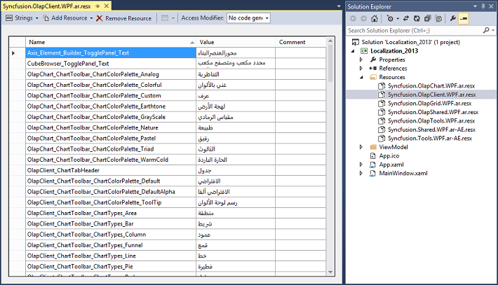
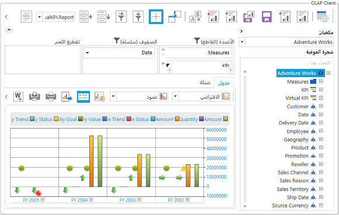

# Localization in WPF Olap Client

Localization deals with customizing data and resources for specific culture or language. The built-in localization and globalization mechanism in WPF allows you to localize any string resource used by the OLAP client control.

You can create and place the resource files in a separate location in the user application. Then, you can access the culture specific resources from the current application assembly.

For this, first create a resource file for our OLAP client control and translate the strings to your culture. Basically, the OLAP client contains control assemblies such as OlapChart.WPF and OlapGrid.WPF and Tools assemblies such as OlapShared.WPF and OlapTools.WPF within it. So, it is mandatory to localize the necessary strings available in those assemblies. Once it is translated, you might use the resources in your projects by setting the corresponding culture in your application.

Refer to the following code sample.





public MainWindow()
{
    System.Threading.Thread.CurrentThread.CurrentUICulture = new System.Globalization.CultureInfo("ar-AE");
    InitializeComponent();
}
    




Public Sub New()
    System.Threading.Thread.CurrentThread.CurrentUICulture = New System.Globalization.CultureInfo("ar-AE")
    InitializeComponent()
End Sub
    

 

 
## RTL support

RTL support for OLAP client is used to display the content from right to left by setting the `FlowDirection` property to "RightToLeft". The following code sample explains how to set this property.



 

<syncfusion:OlapClient x:Name="olapClient1" FlowDirection="RightToLeft" HorizontalAlignment="Stretch" VerticalAlignment="Stretch" OlapDataManager="{Binding ClientDataManager}" />



 

this.olapClient1.FlowDirection = System.Windows.FlowDirection.RightToLeft;
  


 

Me.olapClient1.FlowDirection = System.Windows.FlowDirection.RightToLeft;





A sample demo is available at the following location.

{system drive}:\Users\&lt;User Name&gt;\AppData\Local\Syncfusion\EssentialStudio\&lt;Version Number&gt;\WPF\OlapClient.WPF\Samples\Localization\Localization

