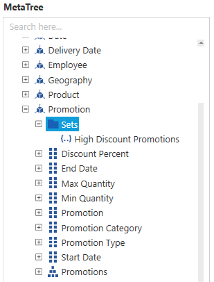

# Named Set in WPF Olap Client

The OLAP client supports the binding of OLAP data with named set records pre-defined in the cube. A named set is a collection of tuples and members, which can be defined and saved as a part of the cube definition. Named set records reside inside the sets folder, which is under a dimension element. These elements can be dragged to categories/series/slicer axis of the axis element builder. To easily work with a lengthy, complex, or commonly used expression, use Multidimensional Expressions (MDX) that allows you to define a named set.

The cube dimension browser displays the dimensions, measures, and KPIs along with named sets from the selected cube inside a tree on the left. To visualize these members, you can drag the members to the axis element builder.

