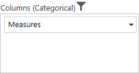
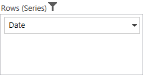
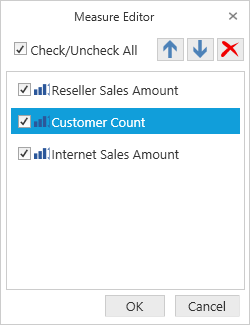
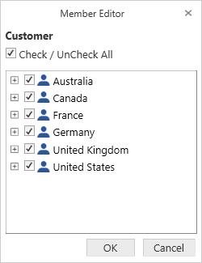
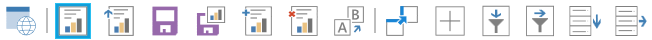
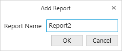
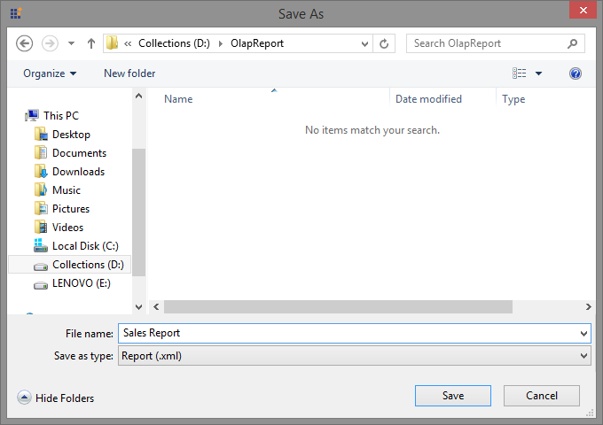
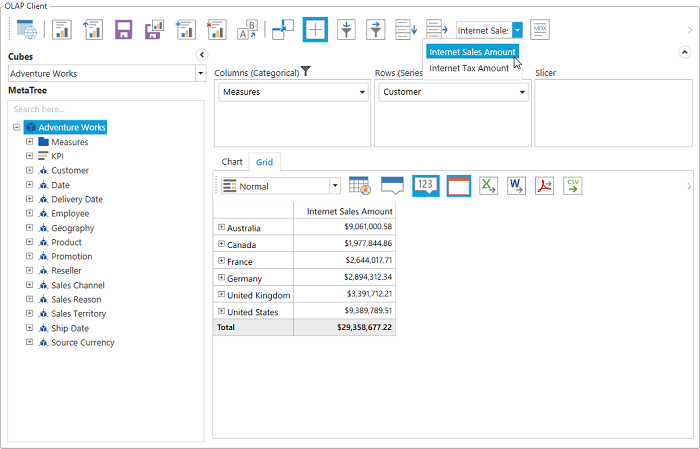

# Elements in WPF OLAP Client

## Cube Selector

The cube selector allows you to select any one of the cubes available in the connected database. This can be achieved with a drop-down list displaying the list of cube names. On selecting a cube from the drop-down list, the corresponding cube element gets loaded.

## Cube dimension browser

The cube dimension browser is a tree view-like structure that organizes the cube elements such as dimensions, hierarchies, and measures from the selected cube into independent logical groups.

### Types of nodes in the cube dimension browser

* **Display folder**: A folder that contains a set of similar elements.
* **Measure**: Quantity available for analysis.
* **Dimension**: A name given to parts of the cube that categorize data.
* **Attribute hierarchy**: Level of attributes down the hierarchy.
* **User-defined hierarchy**: Members of a dimension in a hierarchical structure.
* **Level**: Denotes a specific level in the category.
* **Named Set**: A collection of tuples and members that can be defined and saved as a part of a cube definition.
 
### Attribute hierarchy

Attribute hierarchy contains the following levels:

* A leaf level contains distinct attribute members and each member of the leaf level is known as a leaf member.
* Intermediate levels exist if the attribute hierarchy is a parent-child hierarchy.
 
### User-defined hierarchy

A user-defined hierarchy organizes the members of a dimension into a hierarchical structure and provides the navigation paths in a cube. For example, take a dimension table that supports three attributes such as year, quarter, and month. These attributes are used to construct a user-defined hierarchy, named calendar, in the time dimension that relates to all levels.

### Differentiating user-defined hierarchies and attribute hierarchies

* A user-defined hierarchy contains more than one level, whereas an attribute hierarchy contains only one level.
* A user-defined hierarchy provides a navigation path between the levels taken from the attribute hierarchies of the same dimension.

### Symbolic representation of the nodes in cube dimension browser

<table>
<tr>
<th>
Icon</th><th>
Name</th><th>
Node type</th><th>
Is Draggable</th></tr>
<tr>
<td> 

{{ '' | markdownify }}

</td><td>
Display Folder</td><td>
Display Folder</td><td>
False</td></tr>
<tr>
<td>

{{ '' | markdownify }}

</td><td>
Measure</td><td>
Measure</td><td>
True</td></tr>
<tr>
<td>
{{ '' | markdownify }}

</td><td>
Dimension</td><td>
Dimension</td><td>
True</td></tr>
<tr>
<td>
{{ '' | markdownify }}

</td><td>
User Defined Hierarchy</td><td>
Hierarchy</td><td>
True</td></tr>
<tr>
<td>
{{ '' | markdownify }}

</td><td>
Attribute Hierarchy</td><td>
Hierarchy</td><td>
True</td></tr>
<tr>
<td>

{{ '' | markdownify }}

 

{{ '' | markdownify }}

 

{{ '' | markdownify }}

</td><td>
Levels (in order)</td><td>
Level Element</td><td>
True</td></tr>
<tr>
<td>
{{ '' | markdownify }}

</td><td>
Named Set</td><td>
Named Set</td><td>
True</td></tr>
</table> 
 
## Axis element builder

The axis element builder allows you to build elements in the axes of OLAP client. This supports three axes: categorical, series, and slicer. Based on the construction of the axes, the OLAP grid and OLAP chart will display the resultant data.

### Categorical (column)

The categorical axis defines one or more elements that are displayed along the chart’s y-axis as labels in the columns of the grid. If more than one dimension is present on the categorical axis, then the chart/grid will stack each dimension. The stacking order of dimensions is based on the order that they appear on the categorical axis.

  
### Series (row)

The series axis defines one or more dimensions that are displayed along the chart’s x-axis as labels and in the rows of the grid. If more than one dimension is present on the series axis, then the chart or grid will stack each dimension. The stacking order of dimensions is based on the order that they appear on the series axis.
  

  
### Slicer

The slicer axis is used as a filter to narrow the focus of the multidimensional data displayed in the chart or grid. It allows you to analyze a member of the dimension in depth. To display the member’s data in the slicer, the corresponding member must not be present on both the categorical axis and series axis.

  
### Adding elements to an axis

The measure, dimension, hierarchy, level, and named set elements can be dragged from the cube dimension browser and dropped into the axis element builder at the desired position by using the drag-and-drop operation.
  
### Removing elements from an axis

To remove measures, dimensions, hierarchy, levels, and named set elements from the axis element builder, hover over the element and click the delete icon. You can also use the context menu to remove an element by right-clicking on it.

 
   

   
### Rearrange elements in an axis

Rearranging can be done using Move Up/Move Down options visible when hovering over an element.

  
## Elements editor

### Measure editor

Measure editor is a dialog that displays the collection of measures in the current report. It can be opened by clicking the split button at the right corner of the measure node in the axis element builder.

  
### Member editor

Member editor is a dialog that displays the members of the current hierarchy in a tree view structure. It can be opened by clicking the split button at the right corner of the member node in the axis element builder.

  
The Check All and Uncheck All options in the dialog allows you to select and deselect the entire nodes for filtering.

## Toolbar

The options available in the toolbar are:

* **Connect to server**: Connects the data source with OLAP client through the offline cube, online server, or connection string.
* **New report**: Creates a new report list and clears the existing report collection to provide a new platform for new deployment based on the existing cube elements.
* **Load report**: Picks a saved report collection from the database and loads it by clearing the existing collection of reports.
* **Save report**: Stores the report collection at that instant in the local system.
* **SaveAs report**: Store a copy of the report collection with a new name in the local system.
* **Add report**: Adds a new report to the existing list of reports.
* **Remove report**: Removes the current report from the report list. You cannot remove the report, if the report list contains only one report in it.
* **Rename report**: Changes the name of the current report.
* **Toggle axis**: Interchanges the items between categorical and series axes.
* **Show expander**: Displays an expander option for the grid and chart to perform drill-down operations.
* **Filter/sort column**: Filters or sorts the data in the OLAP report with respect to the column.
* **Filter/sort row**: Filters or sorts the data in the OLAP report with respect to the row.
* **Report list**: Holds all reports of the current session of the OLAP client control and displays them in a drop-down list. You can select a report from the drop-down list.
* **MDX query**: Displays the executed MDX query to retrieve the data at that instant.

## Report manipulation

### New report

This option helps users create a new report collection with a single report by clearing the existing report collection. By clicking the new report icon on the toolbar, the new report dialog opens, prompting you for a name for the report.

After giving the required name, click OK. The report collection gets loaded with only one empty report having the entered name. By clicking Cancel, the new report creation gets canceled.

### Add report

This option allows users to add a report to the existing report collection. By clicking the add report icon on the toolbar, the add report dialog opens prompting you for a name for the report.

After giving an appropriate name in the respective column, click OK. A report with the entered name is added to the collection. By clicking Cancel, the report creation gets canceled.

### Remove report

This option removes the current or active report from the report collection. This option works only if the report collection has more than one report.

### Rename report

This option allows users to rename the current or active report. By clicking the rename icon on the toolbar, the rename report dialog opens, prompting users for a new name.

After providing an appropriate name, click OK. The active report is refreshed with the new name. By clicking Cancel, the operation gets canceled.

### Save report

This option saves the report in the local system. By clicking the save report icon, the SaveAs report dialog opens prompting you for a name with which the report needs to be stored.

After providing an appropriate name, click **Save**. The report will be saved in the selected system location.

### Load report

This option loads a report from the local system. Click the load report icon on the toolbar to load a report into the OLAP client.

### Report list

The report list drop-down contains the names of all the reports in the report collection.

Select the required report from the report list. The selected report will be set as an active report and loaded.

## OLAP grid and OLAP chart

The [OLAP grid](http://help.syncfusion.com/wpf/olapgrid/overview/) and [OLAP chart](http://help.syncfusion.com/wpf/olapchart/overview) controls will be rendered with respect to the operations done in the axis element builder.