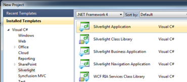
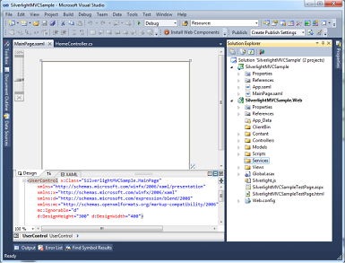
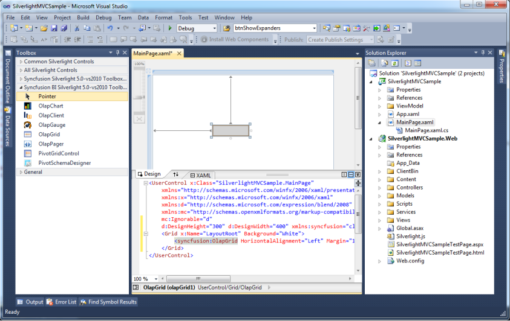

# Host BI Silverlight component in ASP.NET MVC Web Project

The following steps explain how to add the Silverlight components in MVC project:

1. Open Visual Studio IDE.
2. Go to FileNewProject and create a new Silverlight application. 

   A dialog window opens as shown below: 

   

3. Select _Silverlight Application_ from the New Project dialog window and click OK.

   The New Silverlight Application dialog opens as shown in the following screenshot:

   

   The Solution Explorer window shows the Silverlight application with MVC project.

   

4. Double-click to open the Main.xaml which is found under the Silverlight project in Solution Explorer as shown below:

   

5. 	Drag and drop the OlapGrid from the toolbox to the MainPage.xaml. 

   

6. Add the following two assemblies as references to the web project:
   * Syncfusion.Olap.Base
   * Syncfusion.OlapSilverlight.BaseWrapper

7. Add a WCF Service to the web project by right-clicking the Project   Add New Item  WCF Service. 
8. Name the service as OlapManager and delete the IOlapManager.cs file as the service has to be inherited with the IOlapDataProvider.

   

9. Inherit the newly added WCF service with the IOlapDataProvider and explicitly implement the IOlapDataProvider.
10. The connection to the database is done with the help of the WCF service. The service has to be created and instantiated as described in the below code snippet.

 
     The WCF Service has to implement the IOlapDataProvider interface. To implement this interface, you require the OlapDataProvider, which can be instantiated by passing the connection string.

     The interface can be implemented as shown in the following code snippet:

    ~~~csharp

		public class OlapManager : IOlapDataProvider

		{

		        Syncfusion.OlapSilverlight.Manager.OlapDataProvider dataManager;

		        /// 

		        /// Initializes a new instance of the <see cref="OlapManager"/> class.

		        /// 

		        public OlapManager()

		        {

		            string connectionString = "DataSource=localhost;Initial Catalog=Adventure Works DW";

		            // Instantiating the OlapDataProvider with connection string.

		            dataManager = new OlapDataProvider(connectionString);

		        }

		         #region IOlapDataProvider Members

		         /// 

		        /// Executing the CellSet by passing OlapReport.

		        /// 

		        /// <param name="report">The report.</param>

		        /// <returns> The CellSet </returns>

		        public Syncfusion.OlapSilverlight.Data.CellSet ExecuteOlapReport(Syncfusion.OlapSilverlight.Reports.OlapReport report)

		        {

		            Syncfusion.OlapSilverlight.Data.CellSet cellSet = this.dataManager.ExecuteOlapReport(report);

		            // Closing the provider connection.

		            this.dataManager.DataProvider.CloseConnection();

		            return cellSet;

		        }

		         /// 

		        /// Executing the CellSet by passing MDX Query.

		        /// 

		        /// <param name="mdxQuery">The MDX query.</param>

		        /// <returns> The CellSet </returns>

		        public Syncfusion.OlapSilverlight.Data.CellSet ExecuteMdxQuery(string mdxQuery)

		        {

		            Syncfusion.OlapSilverlight.Data.CellSet cellSet = this.dataManager.ExecuteMdxQuery(mdxQuery);

		            // Closing the provider connection.

		            this.dataManager.DataProvider.CloseConnection();

		            return cellSet;

		        }

		        public MemberCollection GetChildMembers(string memberUniqueName, string cubeName)

		        {

		            throw new NotImplementedException();

		        }

		         public CubeSchema GetCubeSchema(string cubeName)

		        {

		            throw new NotImplementedException();

		        }

		         public CubeInfoCollection GetCubes()

		        {

		            throw new NotImplementedException();

		        }

		         public MemberCollection GetLevelMembers(string levelUniqueName, string cubeName)

		        {

		            throw new NotImplementedException();

		        }

		         #endregion

		} 
		
    ~~~

    ~~~vbnet

		 Public Class OlapManager

		       Implements IOlapDataProvider

		            Private dataManager As Syncfusion.OlapSilverlight.Manager.OlapDataProvider

		             ''' 

		            ''' Initializes a new instance of the <see cref="OlapManager"/> class.

		            ''' 

		            Public Sub New()

		                  Dim connectionString As String = "DataSource=localhost;Initial Catalog=Adventure Works DW"

		                  ' Instantiating the OlapDataProvider with connection string

		                  dataManager = New OlapDataProvider(connectionString)

		            End Sub

		             #Region "IOlapDataProvider Members"

		             ''' 

		            ''' Executing the CellSet by passing OlapReport

		            ''' 

		            ''' <param name="report">The report.</param>

		            ''' <returns></returns>

		            Public Function ExecuteOlapReport(ByVal report As Syncfusion.OlapSilverlight.Reports.OlapReport) As Syncfusion.OlapSilverlight.Data.CellSet

		                  Dim cellSet As Syncfusion.OlapSilverlight.Data.CellSet = Me.dataManager.ExecuteOlapReport(report)

		                  ' Closing the provider connection

		                  Me.dataManager.DataProvider.CloseConnection()

		                  Return cellSet

		            End Function

		             ''' 

		            ''' Executing the CellSet by passing MDX Query

		            ''' 

		            ''' <param name="mdxQuery">The MDX query.</param>

		            ''' <returns> The CellSet </returns>

		            Public Function ExecuteMdxQuery(ByVal mdxQuery As String) As Syncfusion.OlapSilverlight.Data.CellSet

		                  Dim cellSet As Syncfusion.OlapSilverlight.Data.CellSet = Me.dataManager.ExecuteMdxQuery(mdxQuery)

		                  'Closing the provider connection.

		                  Me.dataManager.DataProvider.CloseConnection()

		                  Return cellSet

		            End Function

		            Public Function GetChildMembers(ByVal memberUniqueName As String, ByVal cubeName As String) As MemberCollection

		                  Throw New NotImplementedException()

		            End Function

		            Public Function GetCubeSchema(ByVal cubeName As String) As CubeSchema

		                  Throw New NotImplementedException()

		            End Function

		            Public Function GetCubes() As CubeInfoCollection

		                  Throw New NotImplementedException()

		            End Function

		            Public Function GetLevelMembers(ByVal levelUniqueName As String, ByVal cubeName As String) As MemberCollection

		                  Throw New NotImplementedException()

		            End Function

		            #End Region

		 End Class 

    ~~~

11. Include the custom binding and the service endpoint address in the Web.Config file under the ServiceModel section.

    ~~~xaml

			      <!--Binding-->

			      <bindings>

			        <customBinding>

			          <binding name="binaryHttpBinding">

			            <binaryMessageEncoding/>

			            <httpTransport maxReceivedMessageSize="2147483647"/>

			          </binding>
			        </customBinding>

			      </bindings> 

			      <!—Endpoint Address-->

			      <services>

			        <service name="SilverlightApplication1.Web.OlapManager" >

			          <endpoint address="binary" binding="customBinding" bindingConfiguration="binaryHttpBinding" contract="Syncfusion.OlapSilverlight.Manager.IOlapDataProvider">
			          </endpoint>

			        </service>

			      </services> 

    ~~~

12. Add the System.ServiceModel assembly as a reference for the Silverlight project.
13. Add the following namespace in MainPage.xaml.cs:
    * System.ServiceModel
    * System.ServiceModel.Channels
    * Syncfusion.OlapSilverlight.Reports
    * Syncfusion.Silverlight.Grid
    * Syncfusion.OlapSilverlight.Manager
    * Syncfusion.OlapSilverlight.Engine

14. Instantiate the service from MainPage.xaml.cs which is in the Silverlight Project.
15. Declare the IOlapDataProvider for service instantiation.

    ~~~csharp

				 // Declaring the IOlapDataProvider for service instantiation.
				 IOlapDataProvider DataProvider = null; 

    ~~~

    ~~~vbnet

				'Declaring the IOlapDataProvider for service instantiation.

				Dim DataProvider As IOlapDataProvider = Nothing 

    ~~~

16. Specify the custom binding and instantiate the DataProvider from the ChannelFactory.   

    ~~~csharp

				private void InitializeConnection()
				{

				      System.ServiceModel.Channels.Binding customBinding = new CustomBinding(new BinaryMessageEncodingBindingElement(), new HttpTransportBindingElement { MaxReceivedMessageSize = 2147483647 });

				            EndpointAddress address = new EndpointAddress(new Uri(App.Current.Host.Source + "../../../../OlapManager.svc/binary"));

				     ChannelFactory<IOlapDataProvider> clientChannel = new ChannelFactory<IOlapDataProvider>(customBinding, address);
				     DataProvider = clientChannel.CreateChannel();
				} 

    ~~~

    ~~~vbnet
				Private Sub InitializeConnection()

				                  Dim customBinding As System.ServiceModel.Channels.Binding = New CustomBinding(New BinaryMessageEncodingBindingElement(), New HttpTransportBindingElement With {.MaxReceivedMessageSize = 2147483647})

				                  Dim address As EndpointAddress = New EndpointAddress(New Uri(App.Current.Host.Source & "../../../../OlapManager.svc/binary"))

				                  Dim clientChannel As ChannelFactory(Of IOlapDataProvider) = New ChannelFactory(Of IOlapDataProvider)(customBinding, address)

				                  DataProvider = clientChannel.CreateChannel()

				End Sub 

    ~~~

17. Create the Report.

     For creating reports there is a report object called OlapReport. The OlapReport object contains CategoricalItems, SeriesItems, SlicerItems, and FilterItems.

     The OlapReport is associated with the OlapDataManager as the current report property. When a report is set to the current report, an event triggers and the control renders based on the current report that is set. 

18. Bind the data to OlapGridData. 

    ~~~csharp

		private void MainPage_Loaded(object sender, RoutedEventArgs e)
		{
		    // Initialize the service connection.
		    this.InitializeConnection();
		    // Instantiating the OlapDataManager.
		    OlapDataManager m_OlapDataManager =new OlapDataManager();
		    // Specifying the DataProvider for OlapDataManager.
		    m_OlapDataManager.DataProvider = this.DataProvider;
		    // Set current report for OlapDataManager.
		    m_OlapDataManager.SetCurrentReport(CreateOlapReport());
		    // Specifying the OlapDataManager for OlapGrid.
		    this.olapGrid1.OlapDataManager = m_OlapDataManager;
		    // Data Binding.
		    this.olapGrid1.DataBind();
		} 

    ~~~

    ~~~vbnet
   
		Private Sub MainPage_Loaded(ByVal sender As Object, ByVal e As RoutedEventArgs)

		      'Initialize the service connection.

		      Me.InitializeConnection()

		      'Instantiating the OlapDataManager.

		      Dim m_OlapDataManager As OlapDataManager = New OlapDataManager()

		      'Specifying the DataProvider for OlapDataManager.

		      m_OlapDataManager.DataProvider = Me.DataProvider

		      'Set current report for OlapDataManager.

		      m_OlapDataManager.SetCurrentReport(CreateOlapReport())

		      ' Specifying the OlapDataManager for OlapGrid.

		      Me.olapGrid1.OlapDataManager = m_OlapDataManager

		      ' Data Binding.

		      Me.olapGrid1.DataBind()

		End Sub 

    ~~~

     [Click here for Sample Report](http://help.syncfusion.com/UG/Business%20Intelligence/OLAP%20Grid/Silverlight/documents/731olapreportwithsimpledimensionsandmeasure.htm)

     

   

