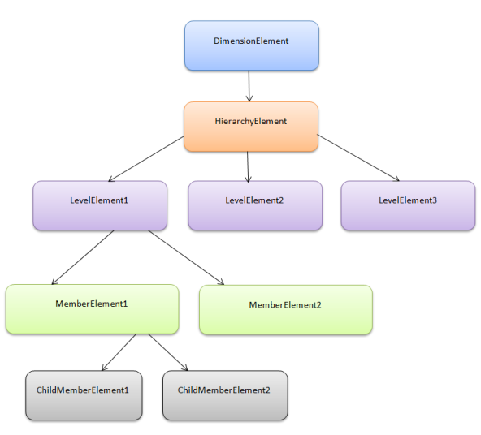

# OlapReport in WPF OLAP Common

The OLAP report is an object that contains information about the cube element that has to be included for processing along its axis position and filter and sorting constraints. The OLAP report has categorized the elements based on their characteristics as follows:

* Dimension element
* Hierarchy element
* Level element
* Member elements
* Measure element
* KPI element
* NamedSet element
* Sort element
* Calculated member
* Subset element
* Summary element

These elements are used to get the cube element information from users. You can create an instance of this element and add the required information about the element to pick that specific element from the database for processing.

These elements are come under the following four elements group, which are based on the axis position and filtering constraints.

* Categorical elements: Contains elements that have to come under categorical axis.
* Series elements: Contains elements that have to come under series axis.
* Slicer elements: Contains elements that have to come under slicer elements.
* Filter elements: Contains elements that are subjected to the filter.

All the elements are internally maintained as items.

## Properties

* **CalculatedMembers**: Sets and gets the calculated members of the OLAP report.
* **CategoricalElements**: Contains elements that are said to be in categorical axis. You can add an element and get the collection of elements that comes under the categorical axis.
* **CurrentCubeName**: Sets or gets the current cube name of the report.
* **FilterElements**: Contains elements that are subjected to filter constraints and a filter expression along the measure on which the filter expression is built.
* **Name**: Sets or gets the report name.
* **SeriesElements**: Contains elements that are said to be in series axis. You can add an element and get the collection of elements that comes under the categorical axis.
* **ShowEmptyColumnData**: Shows/hides the empty column in the result set.
* **ShowEmptyRowData**: Shows/hides the empty row in the result set.
* **ShowExpanders**: Shows/hides the expander buttons in the OLAP control.
* **SliceElements**: Contains the element that are said to be in slicer axis. You can add an element and get the collection of elements that comes under the categorical axis.
* **TogglePivot**: Swaps the elements in the column axis and row axis.
* **Tag**: Holds the backup information of the OLAP report.

Architecture of Items
{:.caption}

## Elements of OLAP report

### Dimension element

A simple [dimension](https://docs.microsoft.com/en-us/dotnet/api/microsoft.analysisservices.dimension?redirectedfrom=MSDN&view=sqlserver-2016) object is composed of basic information such as name, hierarchy, level, and members. You can create a dimension element by specifying its name and providing the hierarchy and level name.

The dimension element contains the hierarchical details and information about each included level elements in that hierarchy. A hierarchy can have any number of level elements and the level elements can have any number of members and the member elements can have any number of child members.

### Hierarchy element

Each element of a dimension can be summarized using a [hierarchy](http://en.wikipedia.org/wiki/Hierarchy). The hierarchy is a series of parent-child relationship, where a parent member represents the consolidation of members which are its children. Parent members can be further aggregated as the children of another parent.

For example, May 2005 can be summarized into Second Quarter 2005 which in turn would be summarized in the year 2005.

### Level element

Level element is the child of hierarchy element which contains a set of members, each of which has the same rank within a hierarchy.

### Member element

Member element represents a member of level in a cube, the children of a member of level.

### Member properties

Member properties cover the basic information about each member in each tuple. This basic information includes the member name, parent level, the number of children, and so on. The member properties are available for all members at a given level.

The following code illustrates the creation of different types of dimensions.

### Creating simple dimension element





DimensionElement dimensionElementColumn = new DimensionElement();

// Specifying the Name for Column Dimension Element

dimensionElementColumn.Name = "Customer";

// Specifying the Hierarchy and Level Element Name

dimensionElementColumn.AddLevel("Customer Geography", "Country");





Dim dimensionElementRow As DimensionElement = New DimensionElement()

'Specifying the Name for Row Dimension Element

dimensionElementRow.Name = "Date"

' Specifying the Hierarchy and Level Element Name

dimensionElementRow.AddLevel("Fiscal", "Fiscal Year")




### Creating sliced dimension




DimensionElement dimensionElementSlicer = new DimensionElement();

// Specifying the dimension Name

dimensionElementSlicer.Name = "Product";

// Adding the Level Name along with the Hierarchy Name

dimensionElementSlicer.AddLevel("Product Categories", "Category");

// Adding the Member Element           dimensionElementSlicer.Hierarchy.LevelElements["Category"].Add("Bikes");          dimensionElementSlicer.Hierarchy.LevelElements["Category"].IncludeAvailableMembers = true;





Dim dimensionElementSlicer As DimensionElement = New DimensionElement()

' Specifying the dimension Name

dimensionElementSlicer.Name = "Product"

' Adding the Level Name along with the Hierarchy Name

dimensionElementSlicer.AddLevel("Product Categories", "Category")

' Adding the Member Element

dimensionElementSlicer.Hierarchy.LevelElements("Category").Add("Bikes")

dimensionElementSlicer.Hierarchy.LevelElements("Category").IncludeAvailableMembers = True




## Measure element

In a cube, a measure is a set of values that are based on a column in the cube's [fact table](https://www.microsoft.com/en-us/download/details.aspx?id=51958) and are usually numeric. The measures are the central values of a cube that are analyzed. That is, measures are the numeric data of primary interest to users browsing a cube. You can select measures depend on the types of users request. Some common measures are sales, costs, expenditures, and production count.

You can create a measure element by specifying its name. The following code illustrates the creation of a measure element.




MeasureElements measureElementColumn = new MeasureElements();

//Specifying the Measure Elements

measureElementColumn.Elements.Add(new MeasureElement { Name = "Internet Sales Amount" });





Dim measureElementColumn As MeasureElements = New MeasureElements()

'Specifying the Measure Elements

measureElementColumn.Elements.Add(New MeasureElement With {.Name = "Internet Sales Amount"})




## Key Performance Indicator (KPI) element

KPI is a collection of calculations that are associated with a measure group in a cube used to evaluate business success. Typically, these calculations are a combination of Multidimensional Expressions (MDX) or calculated members. The KPIs also have an additional metadata that provides information about how client applications should display the results of the KPI's calculations.

The different types of KPI indicators are:

* KPI goal
* KPI status
* KPI trend
* KPI value

You can create a KPI element by specifying its name and giving details of the indicator that are included in the element.




KpiElements kpiElement = new KpiElements();

// Specifying the KPI Element name and configuring its Indicators

kpiElement.Elements.Add(new KpiElement { Name = "Internet Revenue",  

ShowKPIGoal = true, ShowKPIStatus = true, ShowKPIValue = true, 

ShowKPITrend = true });





Dim kpiElement As KpiElements = New KpiElements()

' Specifying the KPI Element name and configuring its Indicators

kpiElement.Elements.Add(New KpiElement With {.Name =  

"Internet Revenue", .ShowKPIGoal = True, .ShowKPIStatus = True, 

 .ShowKPIValue = True, .ShowKPITrend = True})




## NamedSet element

A named set is a collection of tuples and members, which can be defined and saved as a part of the cube definition. Named set records reside inside the sets folder, which is under a dimension element. These elements can be dragged to categories/series/slicer axis of the axes element builder. To work with a lengthy, complex, or commonly used expression easier, Multidimensional Expressions (MDX) allows you to define a named set.

The following code describes the creation of a named set element.




NamedSetElement dimensionElementRow = new NamedSetElement();

// Specifying the dimension name

dimensionElementRow.Name = "Negative Margin Products";





Dim dimensionElementRow As NamedSetElement = New NamedSetElement()

' Specifying the dimension name

dimensionElementRow.Name = "Negative Margin Products"




## Sort element

The result set can be sorted by using the SortElement. You can create sort elements and add it to the OLAP report. There are four types of sorting orders. They are:

* ASC: Sort the elements in ascending order.
* BASC: Sort the elements in ascending order by breaking the hierarchy.
* DESC: Sort the elements in descending order.
* BDESC: Sort the elements in descending order by breaking the hierarchy.

The following report illustrates the creation of sort element.




SortElement sortElement = new SortElement(AxisPosition.Categorical, SortOrder.BDESC, true);

sortElement.Element.UniqueName = "[Measures].[Internet Sales Amount]";





Dim sortElement As SortElement = New SortElement(AxisPosition.Categorical, SortOrder.BDESC, True)

sortElement.Element.UniqueName = "[Measures].[Internet Sales Amount]"




## Calculated member

Calculated members are the customized measures or dimension members created with the cube. The values are calculated at runtime. It is a user defined element. The two types of calculated members are as follows:

1. Calculated measure: Creates a calculated member from a measure element.
2. Calculated dimension: Creates a calculated member from a dimension.

**Calculated member to be defined in OLAP report requires the following definitions**

* Name: Name of the calculated member.
* Expression: Expression to form the calculated member.
* Measure/dimension element: You should add a measure or dimension element from which the calculated member should be created.

The following steps explain how to create and add a calculated member in an OLAP report.

1. Create a dimension measure or dimension element from which the calculated member has to be created.
2. Create a calculated member by giving the name and expression.
3. Add the created dimension element to the calculated member.
4. After defining the calculated member, add that member to the calculated member collection in the OLAP report.
5. Add the newly created calculated members in the categorical or series axis of the OLAP report.

The following code snippet describes the creation and addition of a calculated member in the OLAP report.

### Calculated measure




MeasureElement measureElement = new MeasureElement();

measureElement.Name = "Order Quantity";

CalculatedMember calculatedMeasure = new CalculatedMember();

calculatedMeasure.Name = "Oder on Discount"; 

calculatedMeasure1.Expression = "[Measures].[Order Quantity] + ([Measures].[Order Quantity] * 0.10)";

calculatedMeasure1.AddElement(measureElement);

olapReport.CalculatedMembers.Add(calculatedMeasure);





Private measureElement As MeasureElement = New MeasureElement()

measureElement.Name = " Order Quantity "

Dim calculatedMeasure As CalculatedMember = New CalculatedMember()

calculatedMeasure.Name = " Order on Discount "

calculatedMeasure1.Expression = "[Measures].[Order Quantity] + ([Measures].[Order Quantity] *0.10)"

calculatedMeasure1.AddElement(measureElement)

olapReport.CalculatedMembers.Add(calculatedMeasure)




### Calculated dimension




DimensionElement internalDimension = new DimensionElement();

internalDimension.Name = "Product";

internalDimension.AddLevel("Product Categories", "Category");

// Calculated Dimension

CalculatedMember calculateDimension = new CalculatedMember();

calculateDimension.Name = "Bikes & Components";

calculateDimension.Expression = "([Product].[Product Categories].

[Category].[Bikes] + [Product].[Product Categories].[Category].

[Components] )";

calculateDimension.AddElement(internalDimension);

olapReport.CalculatedMembers.Add(calculateDimension)





Dim internalDimension As DimensionElement = New DimensionElement()

internalDimension.Name = "Product"

internalDimension.AddLevel("Product Categories", "Category")

' Calculated Dimension

Dim calculateDimension As CalculatedMember = New CalculatedMember()

calculateDimension.Expression = "Bikes & Components"

calculateDimension.Expression = "([Product].[Product Categories].

[Category].[Bikes] + [Product].[Product Categories].[Category].

[Components] )"

calculateDimension.AddElement(internalDimension)

olapReport.CalculatedMembers.Add(calculateDimension)




## Subset element

Subset elements are used to filter the result set by their count. It filters the number of records and number of fields in the result set.

The following codes illustrate the creation of a subset element.




SubsetElement subSetElementColumn = new SubsetElement(5);
subSetElementColumn.Name = "Top 5 Elements";
SubsetElement subSetElementRow = new SubsetElement(3);
subSetElementRow.Name = "Top 3 Elements";

olapReport.CategoricalElements.SubSetElement = subSetElementColumn;

olapReport.SeriesElements.SubSetElement = subSetElementRow;




Dim subSetElementColumn As SubsetElement = New SubsetElement(5)

subSetElementColumn.Name = "Top 5 Elements"

Dim subSetElementRow As SubsetElement = New SubsetElement(3)

subSetElementRow.Name = "Top 3 Elements"

olapReport.CategoricalElements.SubSetElement = subSetElementColumn

olapReport.SeriesElements.SubSetElement = subSetElementRow




## Filtering slicer elements by range

This feature enables you to specify a range for filter elements in the slicer field. You have to specify the start and end values to set the range. Multiple ranges can be added to filter elements in the slicer field.

### Class table

<table>
<tr>
<th>
Name </th><th>
Description </th></tr>
<tr>
<td>
SlicerRangeFiltersInfo</td><td>
Used to filter values from one range to another. Unique name of the member element for start and end values need to be specified. The name of the member element can also be specified for start and end values when customer builds the unique name*.</td></tr>
</table>

* Name of the member element can be specified only when name is formed with dimension name, hierarchy name, and level name.

### Constructor 

<table>
<tr>
<th>
Syntax</th><th>
Description </th><th>
Parameter </th></tr>
<tr>
<td>
SlicerRangeFiltersInfo(string startValueUniqueName, string endValueUniqueName)</td><td>
Initializes SlicerRangeFiltersInfo with unique name as star and end values.  </td><td>
Unique name for start and end value.</td></tr>
<tr>
<td>
SlicerRangeFiltersInfo(string dimensionName, string hierarchyName, string levelName, string startValueName, string endValueName</td><td>
Initializes SlicerRangeFiltersInfo with name of dimension, hierarchy, level, star value, and end value.</td><td>
Name for dimension, hierarchy, level, start value, and end value.</td></tr>
</table>

### Properties

Following table consists of SlicerRangeFiltersInfo class’s property.

* **DimensionName**: Specifies the dimension name.
* **HierarchyName**: Specifies the hierarchy name.
* **LevelName**: Specifies the level name.
* **StartValue**: Specifies the unique name or name of the member element.
* **EndValue**: Specifies the unique name or name of the member element.

* Name of the member element can be specified only when the name is formed with dimension name, hierarchy name, and level name.

### Adding a range for filter elements in the slicer field

There are two methods to add a range for filter elements in the slicer field.

In the first method, you can specify the unique name for start and end values. The following code illustrates this:  




olapReport.SlicerRangeFilters.Add(new SlicerRangeFiltersInfo("[TimeFlat].[201010100031]", "[TimeFlat].[201010100037]"));





olapReport.SlicerRangeFilters.Add(New SlicerRangeFiltersInfo ("[TimeFlat].[201010100031]", "[TimeFlat].[201010100037]"))




In the second method, you can specify the member name along with dimension name, hierarchy name and level name. Entering the unique name for start and end value is not mandatory.  The following code illustrates this: 




olapReport.SlicerRangeFilters.Add(new SlicerRangeFiltersInfo { DimensionName = "TimeFlat", HierarchyName = "TimeFlat", LevelName = "TimeId", StartValue = "201010100031", EndValue = "201010100037" });





olapReport.SlicerRangeFilters.Add(New SlicerRangeFiltersInfo With {.DimensionName = "TimeFlat", .HierarchyName = "TimeFlat", .LevelName = "TimeId", .StartValue = "201010100031", .EndValue = "201010100037"})




## Creating the OLAP report

To create a report:

1. Instantiate a new object for the OLAP report.
2. Create the required elements like dimension element and measure element.
3. Add the created element in the desired axis (column or categorical, row or series, and filter or slicer) elements.
4. Then, bind the created report to the OlapDataManager using the SetCurrentReport() method or assign the report to OlapDataManager’s current report property.

### Sample reports for OLAP data

This section gives you the code snippet to generate different types of report for OlapDataManager.

### Simple report




OlapReport olapReport = new OlapReport();

olapReport.Name = "Customer Report";
olapReport.CurrentCubeName = "Adventure Works";

DimensionElement dimensionElementColumn = new DimensionElement();
//Specifying the Name for the Dimension Element
dimensionElementColumn.Name = "Customer";
dimensionElementColumn.HierarchyName = "Customer Geography";
dimensionElementColumn.AddLevel("Customer Geography", "Country");

MeasureElements measureElementColumn = new MeasureElements();
measureElementColumn.Elements.Add(new MeasureElement { Name = "Internet Sales Amount" });

DimensionElement dimensionElementRow = new DimensionElement();
//Specifying the Dimension Name
dimensionElementRow.Name = "Date";
dimensionElementRow.AddLevel("Fiscal", "Fiscal Year");

/// Adding Column Members
olapReport.CategoricalElements.Add(dimensionElementColumn);
///Adding Measure Element
olapReport.CategoricalElements.Add(measureElementColumn);
///Adding Row Members
olapReport.SeriesElements.Add(dimensionElementRow);





Dim olapReport As OlapReport = New OlapReport()

olapReport.Name = "Customer Report"
olapReport.CurrentCubeName = "Adventure Works"

Dim dimensionElementColumn As DimensionElement = New DimensionElement()
'Specifying the Name for the Dimension Element
dimensionElementColumn.Name = "Customer"
dimensionElementColumn.HierarchyName = "Customer Geography"
dimensionElementColumn.AddLevel("Customer Geography", "Country")

Dim measureElementColumn As MeasureElements = New MeasureElements()
measureElementColumn.Elements.Add(New MeasureElement With {.Name = "Internet Sales Amount"})

Dim dimensionElementRow As DimensionElement = New DimensionElement()
'Specifying the Dimension Name
dimensionElementRow.Name = "Date"
dimensionElementRow.AddLevel("Fiscal", "Fiscal Year")

''' Adding Column Members
olapReport.CategoricalElements.Add(dimensionElementColumn)
'''Adding Measure Element
olapReport.CategoricalElements.Add(measureElementColumn)
'''Adding Row Members
olapReport.SeriesElements.Add(dimensionElementRow)




### Report with slicing operation




OlapReport olapReport = new OlapReport();

olapReport.Name = "Customer Report";
olapReport.CurrentCubeName = "Adventure Works";

DimensionElement dimensionElementColumn = new DimensionElement();

//Specifying the dimension Name
dimensionElementColumn.Name = "Customer";

//Adding the Level Name along with the Hierarchy Name
dimensionElementColumn.AddLevel("Customer Geography", "Country");

DimensionElement dimensionElementRow = new DimensionElement();

//Specifying the dimension Name
dimensionElementRow.Name = "Date";

//Adding the Level Name along with the Hierarchy Name
dimensionElementRow.AddLevel("Fiscal", "Fiscal Year");

DimensionElement dimensionElementSlicer = new DimensionElement();

dimensionElementSlicer.Name = "Sales Channel";
dimensionElementSlicer.AddLevel("Sales Channel", "Sales Channel");

MeasureElements measureElementRow = new MeasureElements();
measureElementRow.Elements.Add(new MeasureElement { Name = "Internet Sales Amount" });

olapReport.CategoricalElements.Add(dimensionElementColumn);
olapReport.SeriesElements.Add(dimensionElementRow);
olapReport.SlicerElements.Add(dimensionElementSlicer);
olapReport.SeriesElements.Add(measureElementRow);





Dim olapReport As OlapReport = New OlapReport()

olapReport.Name = "Customer Report"

olapReport.CurrentCubeName = "Adventure Works"

Dim dimensionElementColumn As DimensionElement = New DimensionElement()

'Specifying the dimension Name

dimensionElementColumn.Name = "Customer"

'Adding the Level Name along with the Hierarchy Name

dimensionElementColumn.AddLevel("Customer Geography", "Country")

Dim dimensionElementRow As DimensionElement = New DimensionElement()

'Specifying the dimension Name

dimensionElementRow.Name = "Date"

'Adding the Level Name along with the Hierarchy Name

dimensionElementRow.AddLevel("Fiscal", "Fiscal Year")

Dim dimensionElementSlicer As DimensionElement = New DimensionElement()

dimensionElementSlicer.Name = "Sales Channel"

dimensionElementSlicer.AddLevel("Sales Channel", "Sales Channel")

Dim measureElementRow As MeasureElements = New MeasureElements()

measureElementRow.Elements.Add(New MeasureElement { Name = "Internet Sales Amount" });

measureElementRow.Elements.Add(New MeasureElement With {.Name = "Internet Sales Amount"})

olapReport.CategoricalElements.Add(dimensionElementColumn)

olapReport.SeriesElements.Add(dimensionElementRow)

olapReport.SlicerElements.Add(dimensionElementSlicer)

olapReport.SeriesElements.Add(measureElementRow)




### Report with dicing operation




OlapReport olapReport = new OlapReport();
olapReport.Name = "Customer Report";
olapReport.CurrentCubeName = "Adventure Works";
DimensionElement dimensionElementColumn = new DimensionElement();
//Specifying the Name for the Dimension Element
dimensionElementColumn.Name = "Customer";
//Specifying the Hierarchy Name
dimensionElementColumn.HierarchyName = "Customer Geography";
dimensionElementColumn.AddLevel("Customer Geography", "Country");

MeasureElements measureElementColumn = new MeasureElements();
measureElementColumn.Elements.Add(new MeasureElement { Name = "Internet Sales Amount" });

DimensionElement dimensionElementRow = new DimensionElement();
//Specifying the Dimension Name
dimensionElementRow.Name = "Date";
dimensionElementRow.HierarchyName = "Fiscal";
dimensionElementRow.AddLevel("Fiscal", "Fiscal Year");

//Specifying Excluded column elements
DimensionElement excludedColumnElement = new DimensionElement();
excludedColumnElement.Name = "Customer";
excludedColumnElement.HierarchyName = "Customer Geography";
excludedColumnElement.AddLevel("Customer Geography", "Country");
excludedColumnElement.Hierarchy.LevelElements["Country"].Add("Canada");
excludedColumnElement.Hierarchy.LevelElements["Country"].Add("France");
excludedColumnElement.Hierarchy.LevelElements["Country"].Add("United Kingdom");
excludedColumnElement.Hierarchy.LevelElements["Country"].Add("United States");

//Spefifying the Excluded row elements
DimensionElement excludedRowElement = new DimensionElement();
excludedRowElement.Name = "Date";
excludedRowElement.AddLevel("Fiscal", "Fiscal Year");
excludedRowElement.AddLevel("Fiscal", "Month");
excludedRowElement.AddLevel("Fiscal", "Fiscal Quarter");
excludedRowElement.AddLevel("Fiscal", "Fiscal Semester");
excludedRowElement.Hierarchy.LevelElements["Fiscal Year"].Add("FY 2002");
excludedRowElement.Hierarchy.LevelElements["Fiscal Year"].Add("FY 2004");
excludedRowElement.Hierarchy.LevelElements["Fiscal Year"].Add("FY 2005");
excludedRowElement.Hierarchy.LevelElements["Fiscal Semester"].Add("H2 FY 2003");
excludedRowElement.Hierarchy.LevelElements["Month"].Add("August 2002");
excludedRowElement.Hierarchy.LevelElements["Month"].Add("September 2002");
excludedRowElement.Hierarchy.LevelElements["Fiscal Quarter"].Add("Q2 FY 2003");
excludedRowElement.Hierarchy.LevelElements["Fiscal Quarter"].Add("Q2 FY 2003");

///Adding Column Members
olapReport.CategoricalElements.Add(dimensionElementColumn,excludedColumnElement);
///Adding Measure Element
olapReport.CategoricalElements.Add(measureElementColumn);
///Adding Row Members
olapReport.SeriesElements.Add(dimensionElementRow,excludedRowElement);





Dim olapReport As OlapReport = New OlapReport()

olapReport.Name = "Customer Report"

olapReport.CurrentCubeName = "Adventure Works"

Dim dimensionElementColumn As DimensionElement = New DimensionElement()

'Specifying the Name for the Dimension Element

dimensionElementColumn.Name = "Customer"

'Specifying the Hierarchy Name

dimensionElementColumn.HierarchyName = "Customer Geography"

dimensionElementColumn.AddLevel("Customer Geography", "Country")

Dim measureElementColumn As MeasureElements = New MeasureElements()

measureElementColumn.Elements.Add(New MeasureElement { Name = "Internet Sales Amount" });

measureElementColumn.Elements.Add(New MeasureElement With {.Name = "Internet Sales Amount"})

Dim dimensionElementRow As DimensionElement = New DimensionElement()

'Specifying the Dimension Name

dimensionElementRow.Name = "Date"

dimensionElementRow.HierarchyName = "Fiscal"

dimensionElementRow.AddLevel("Fiscal", "Fiscal Year")

'Specifying Excluded column elements

Dim excludedColumnElement As DimensionElement = New DimensionElement()

excludedColumnElement.Name = "Customer"

excludedColumnElement.HierarchyName = "Customer Geography"

excludedColumnElement.AddLevel("Customer Geography", "Country")

excludedColumnElement.Hierarchy.LevelElements("Country").Add("Canada")

excludedColumnElement.Hierarchy.LevelElements("Country").Add("France")

excludedColumnElement.Hierarchy.LevelElements("Country").Add("United Kingdom")

excludedColumnElement.Hierarchy.LevelElements("Country").Add("United States")

'Spefifying the Excluded row elements

Dim excludedRowElement As DimensionElement = New DimensionElement()

excludedRowElement.Name = "Date"

excludedRowElement.AddLevel("Fiscal", "Fiscal Year")

excludedRowElement.AddLevel("Fiscal", "Month")

excludedRowElement.AddLevel("Fiscal", "Fiscal Quarter")

excludedRowElement.AddLevel("Fiscal", "Fiscal Semester")

excludedRowElement.Hierarchy.LevelElements("Fiscal Year").Add("FY 2002")

excludedRowElement.Hierarchy.LevelElements("Fiscal Year").Add("FY 2004")

excludedRowElement.Hierarchy.LevelElements("Fiscal Year").Add("FY 2005")

excludedRowElement.Hierarchy.LevelElements("Fiscal Semester").Add("H2 FY 2003")

excludedRowElement.Hierarchy.LevelElements("Month").Add("August 2002")

excludedRowElement.Hierarchy.LevelElements("Month").Add("September 2002")

excludedRowElement.Hierarchy.LevelElements("Fiscal Quarter").Add("Q2 FY 2003")

excludedRowElement.Hierarchy.LevelElements("Fiscal Quarter").Add("Q2 FY 2003")

'''Adding Column Members

olapReport.CategoricalElements.Add(dimensionElementColumn,excludedColumnElement)

'''Adding Measure Element

olapReport.CategoricalElements.Add(measureElementColumn)

'''Adding Row Members

olapReport.SeriesElements.Add(dimensionElementRow,excludedRowElement)




### Ordered report




OlapReport olapReport = new OlapReport();
olapReport.Name = "Customer Report";
olapReport.CurrentCubeName = "Adventure Works";
DimensionElement dimensionElementColumn = new DimensionElement();

//Specifying the Name for the Dimension Element
dimensionElementColumn.Name = "Customer";
//Specifying the Hierarchy Name
dimensionElementColumn.HierarchyName = "Customer Geography";
dimensionElementColumn.AddLevel("Customer Geography", "Country");

//Creating Measure Elements
MeasureElements measureElementColumn = new MeasureElements();
measureElementColumn.Elements.Add(new MeasureElement { Name = "Internet Sales Amount" });
DimensionElement dimensionElementRow = new DimensionElement();

//Specifying the Dimension Name
dimensionElementRow.Name = "Date";
dimensionElementRow.AddLevel("Fiscal", "Fiscal Year");

SortElement sortElement = new SortElement(AxisPosition.Categorical, SortOrder.BDESC, true);
sortElement.Element.UniqueName = "[Measures].[Internet Sales Amount]";

///Adding Column Members
olapReport.CategoricalElements.Add(dimensionElementColumn);
///Adding Measure Element
olapReport.CategoricalElements.Add(measureElementColumn);
//Adding Sort Element
olapReport.CategoricalElements.Add(sortElement);
///Adding Row Members
olapReport.SeriesElements.Add(dimensionElementRow);





Dim olapReport As OlapReport = New OlapReport()

olapReport.Name = "Customer Report"

olapReport.CurrentCubeName = "Adventure Works"

Dim dimensionElementColumn As DimensionElement = New DimensionElement()

'Specifying the Name for the Dimension Element

dimensionElementColumn.Name = "Customer"

'Specifying the Hierarchy Name

dimensionElementColumn.HierarchyName = "Customer Geography"

dimensionElementColumn.AddLevel("Customer Geography", "Country")

'Creating Measure Elements

Dim measureElementColumn As MeasureElements = New MeasureElements()

measureElementColumn.Elements.Add(New MeasureElement With {.Name = "Internet Sales Amount"})

Dim dimensionElementRow As DimensionElement = New DimensionElement()

'Specifying the Dimension Name

dimensionElementRow.Name = "Date"

dimensionElementRow.AddLevel("Fiscal", "Fiscal Year")

Dim sortElement As SortElement = New SortElement(AxisPosition.Categorical, SortOrder.BDESC, True)

sortElement.Element.UniqueName = "[Measures].[Internet Sales Amount]"

'''Adding Column Members

olapReport.CategoricalElements.Add(dimensionElementColumn)

'''Adding Measure Element

olapReport.CategoricalElements.Add(measureElementColumn)

'Adding Sort Element

olapReport.CategoricalElements.Add(sortElement)

'''Adding Row Members

olapReport.SeriesElements.Add(dimensionElementRow)




### Report with filter





OlapReport olapReport = new OlapReport();

olapReport.Name = "Customer Report";
olapReport.CurrentCubeName = "Adventure Works";

DimensionElement dimensionElementColumn = new DimensionElement();
//Specifying the Name for the Dimension Element
dimensionElementColumn.Name = "Customer";
dimensionElementColumn.AddLevel("Customer Geography", "Country");

//Creating Measure Element
MeasureElements measureElementColumn = new MeasureElements();
measureElementColumn.Elements.Add(new MeasureElement { Name =                                        "Internet Sales Amount" });

DimensionElement dimensionElementRow = new DimensionElement();
//Specifying the Dimension Name
dimensionElementRow.Name = "Date";
dimensionElementRow.AddLevel("Fiscal", "Fiscal Year");

FilterElement filterElement = new FilterElement(AxisPosition.Categorical);
filterElement.Elements.Add(measureElementColumn);
filterElement.Elements.Add(dimensionElementColumn);
filterElement.FilterCase = FilterCase.GreaterThan;
filterElement.FilterValue.Add(new MeasureElement { Name = 

                                  "Internet Sales Amount", Visible = true });
filterElement.FilterValue.Add(new FilterValue { Filter_Value = 2700000.00 });
filterElement.IsFilterCondition = true;
/// Adding Column Members
olapReport.CategoricalElements.Add(new Item { ElementValue = 

dimensionElementColumn });
olapReport.CategoricalElements.IsFilterOrSortOn = true;
olapReport.FilterElements.Add(new Item { ElementValue = filterElement });

olapReport.SeriesElements.Add(dimensionElementRow);





Dim olapReport As OlapReport = New OlapReport()

olapReport.Name = "Customer Report"

olapReport.CurrentCubeName = "Adventure Works"

Dim dimensionElementColumn As DimensionElement = New DimensionElement()

'Specifying the Name for the Dimension Element

dimensionElementColumn.Name = "Customer"

dimensionElementColumn.AddLevel("Customer Geography", "Country")

'Creating Measure Element

Dim measureElementColumn As MeasureElements = New MeasureElements()

measureElementColumn.Elements.Add(New MeasureElement With {.Name = "Internet Sales Amount"})

Dim dimensionElementRow As DimensionElement = New DimensionElement()

'Specifying the Dimension Name

dimensionElementRow.Name = "Date"

dimensionElementRow.AddLevel("Fiscal", "Fiscal Year")

Dim filterElement As FilterElement = New FilterElement(AxisPosition.Categorical)

filterElement.Elements.Add(measureElementColumn)

filterElement.Elements.Add(dimensionElementColumn)

filterElement.FilterCase = FilterCase.GreaterThan

filterElement.FilterValue.Add(New MeasureElement With {.Name = "Internet Sales Amount", .Visible = True})

filterElement.FilterValue.Add(New FilterValue With {.Filter_Value = 2700000.00})

filterElement.IsFilterCondition = True

olapReport.CategoricalElements.Add(New Item With {.ElementValue = dimensionElementColumn})

olapReport.CategoricalElements.IsFilterOrSortOn = True

olapReport.FilterElements.Add(New Item With {.ElementValue = filterElement})




### Report with subset




OlapReport olapReport = new OlapReport();
olapReport.Name = "Customer Report"; olapReport.CurrentCubeName = "Adventure Works";
DimensionElement dimensionElementColumn = new DimensionElement();
//Specifying the Name for the Dimension Element
dimensionElementColumn.Name = "Customer";
//Specifying the Hierarchy Name
dimensionElementColumn.HierarchyName = "Customer Geography";
dimensionElementColumn.AddLevel("Customer Geography", "Country");

MeasureElements measureElementColumn = new MeasureElements();
measureElementColumn.Elements.Add(new MeasureElement { Name = "Internet Sales Amount" });

DimensionElement dimensionElementRow = new DimensionElement();
//Specifying the Dimension Name
dimensionElementRow.Name = "Date";
dimensionElementRow.AddLevel("Fiscal", "Fiscal Year");

//Specifying the SubsetElement
//Specify the start index and end index to retrieve the records.
SubsetElement subSetElementColumn = new SubsetElement(5);
subSetElementColumn.Name = "Top 5 Elements";

SubsetElement subSetElementRow = new SubsetElement(3);
subSetElementRow.Name = "Top 3 Elements";

///Adding Column Members
olapReport.CategoricalElements.Add(dimensionElementColumn);
///Adding Measure Element
olapReport.CategoricalElements.Add(measureElementColumn);
olapReport.CategoricalElements.SubSetElement = subSetElementColumn;
///Adding Row Members
olapReport.SeriesElements.Add(dimensionElementRow);
olapReport.SeriesElements.SubSetElement = subSetElementRow;





Dim olapReport As OlapReport = New OlapReport()

olapReport.Name = "Customer Report"

olapReport.CurrentCubeName = "Adventure Works"

Dim dimensionElementColumn As DimensionElement = New DimensionElement()

'Specifying the Name for the Dimension Element

dimensionElementColumn.Name = "Customer"

dimensionElementColumn.AddLevel("Customer Geography", "Country")

'Creating Measure Element

Dim olapReport As OlapReport = New OlapReport()

olapReport.CurrentCubeName = "Adventure Works"

Dim dimensionElementColumn As DimensionElement = New DimensionElement()

'Specifying the Name for the Dimension Element

dimensionElementColumn.Name = "Customer"

'Specifying the Hierarchy Name

dimensionElementColumn.HierarchyName = "Customer Geography"

dimensionElementColumn.AddLevel("Customer Geography", "Country")

Dim measureElementColumn As MeasureElements = New MeasureElements()

measureElementColumn.Elements.Add(New MeasureElement With {.Name = "Internet Sales Amount"})

Dim dimensionElementRow As DimensionElement = New DimensionElement()

'Specifying the Dimension Name

dimensionElementRow.Name = "Date"

dimensionElementRow.AddLevel("Fiscal", "Fiscal Year")

'Specifying the SubsetElement

'Specify the start index and end index to retrieve the records.

Dim subSetElementColumn As SubsetElement = New SubsetElement(5)

subSetElementColumn.Name = "Top 5 Elements"

Dim subSetElementRow As SubsetElement = New SubsetElement(3)

subSetElementRow.Name = "Top 3 Elements"

'''Adding Column Members

olapReport.CategoricalElements.Add(dimensionElementColumn)

'''Adding Measure Element

olapReport.CategoricalElements.Add(measureElementColumn)

olapReport.CategoricalElements.SubSetElement = subSetElementColumn

'''Adding Row Members

olapReport.SeriesElements.Add(dimensionElementRow)

olapReport.SeriesElements.SubSetElement = subSetElementRow




### Drill down report




OlapReport olapReport = new OlapReport();
olapReport.Name = "Customer Report";
olapReport.CurrentCubeName = "Adventure Works";
DimensionElement dimensionElementColumn = new DimensionElement();
//Specifying the Name for the Dimension Element
dimensionElementColumn.Name = "Customer";
//Specifying the Hierarchy Name
dimensionElementColumn.HierarchyName = "Customer Geography";
dimensionElementColumn.AddLevel("Customer Geography", "Country");

MeasureElements measureElementColumn = new MeasureElements();
measureElementColumn.Elements.Add(new MeasureElement { Name = 

                                 "Internet Sales Amount" });

DimensionElement dimensionElementRow = new DimensionElement();
//Specifying the Dimension Name
dimensionElementRow.Name = "Date";
dimensionElementRow.HierarchyName = "Fiscal";
dimensionElementRow.AddLevel("Fiscal", "Fiscal Year");
dimensionElementRow.Hierarchy.LevelElements["Fiscal Year"].Add("FY 2002");
dimensionElementRow.Hierarchy.LevelElements["Fiscal Year"].

                             MemberElements[0].ShowChildMembers = true;
dimensionElementRow.Hierarchy.LevelElements["Fiscal Year"].

                             MemberElements[0].Add("H1 FY 2002");
dimensionElementRow.Hierarchy.LevelElements["Fiscal Year"].

      MemberElements[0].ChildMemberElements[0].ShowChildMembers = true;
dimensionElementRow.Hierarchy.LevelElements["Fiscal Year"].

MemberElements[0].ChildMemberElements[0].Add("Q1 FY 2002");
dimensionElementRow.Hierarchy.LevelElements["Fiscal Year"].

MemberElements[0].ChildMemberElements[0].

ChildMemberElements[0].ShowChildMembers = true;
dimensionElementRow.Hierarchy.LevelElements["Fiscal Year"].

MemberElements[0].ChildMemberElements[0].

ChildMemberElements[0].Add("July 2001");
dimensionElementRow.Hierarchy.LevelElements["Fiscal Year"].

MemberElements[0].ChildMemberElements[0].

ChildMemberElements[0].ChildMemberElements[0].ShowChildMembers = true;





Dim olapReport As OlapReport = New OlapReport()

olapReport.Name = "Customer Report"

olapReport.CurrentCubeName = "Adventure Works"

Dim dimensionElementColumn As DimensionElement = New DimensionElement()

'Specifying the Name for the Dimension Element

dimensionElementColumn.Name = "Customer"

dimensionElementColumn.AddLevel("Customer Geography", "Country")

'Creating Measure Element

Dim olapReport As OlapReport = New OlapReport()

olapReport.CurrentCubeName = "Adventure Works"

Dim dimensionElementColumn As DimensionElement = New DimensionElement()

'Specifying the Name for the Dimension Element

dimensionElementColumn.Name = "Customer"

'Specifying the Hierarchy Name

dimensionElementColumn.HierarchyName = "Customer Geography"

Dim olapReport As OlapReport = New OlapReport()

olapReport.CurrentCubeName = "Adventure Works"

Dim dimensionElementColumn As DimensionElement = New DimensionElement()

'Specifying the Name for the Dimension Element

dimensionElementColumn.Name = "Customer"

'Specifying the Hierarchy Name

dimensionElementColumn.HierarchyName = "Customer Geography"

dimensionElementColumn.AddLevel("Customer Geography", "Country")

Dim measureElementColumn As MeasureElements = New MeasureElements()

measureElementColumn.Elements.Add(New MeasureElement With {.Name = "Internet Sales Amount"})

Dim dimensionElementRow As DimensionElement = New DimensionElement()

'Specifying the Dimension Name

dimensionElementRow.Name = "Date"

dimensionElementRow.HierarchyName = "Fiscal"

dimensionElementRow.AddLevel("Fiscal", "Fiscal Year")

dimensionElementRow.Hierarchy.LevelElements("Fiscal Year").Add("FY 2002")

dimensionElementRow.Hierarchy.LevelElements("Fiscal Year"). MemberElements(0).ShowChildMembers = True

dimensionElementRow.Hierarchy.LevelElements("Fiscal Year"). MemberElements(0).Add("H1 FY 2002")

dimensionElementRow.Hierarchy.LevelElements("Fiscal Year"). MemberElements(0).ChildMemberElements(0).ShowChildMembers = True

dimensionElementRow.Hierarchy.LevelElements("Fiscal Year"). MemberElements(0).ChildMemberElements(0).Add("Q1 FY 2002")

dimensionElementRow.Hierarchy.LevelElements("Fiscal Year"). MemberElements(0).ChildMemberElements(0). ChildMemberElements(0).ShowChildMembers = True

dimensionElementRow.Hierarchy.LevelElements("Fiscal Year"). MemberElements(0).ChildMemberElements(0). ChildMemberElements(0).Add("July 2001")

dimensionElementRow.Hierarchy.LevelElements("Fiscal Year"). MemberElements(0).ChildMemberElements(0). ChildMemberElements(0).ChildMemberElements(0).ShowChildMembers = True




### Drill down report




OlapReport olapReport = new OlapReport();
olapReport.Name = "Customer Report";
olapReport.CurrentCubeName = "Adventure Works";
DimensionElement dimensionElementColumn = new DimensionElement();
//Specifying the Name for the Dimension Element
dimensionElementColumn.Name = "Customer";
//Specifying the Hierarchy Name
dimensionElementColumn.HierarchyName = "Customer Geography";
dimensionElementColumn.AddLevel("Customer Geography", "Country");

MeasureElements measureElementColumn = new MeasureElements();
measureElementColumn.Elements.Add(new MeasureElement { Name = 

                                 "Internet Sales Amount" });

DimensionElement dimensionElementRow = new DimensionElement();
//Specifying the Dimension Name
dimensionElementRow.Name = "Date";
dimensionElementRow.HierarchyName = "Fiscal";
dimensionElementRow.AddLevel("Fiscal", "Fiscal Year");
dimensionElementRow.Hierarchy.LevelElements["Fiscal Year"].Add("FY 2002");
dimensionElementRow.Hierarchy.LevelElements["Fiscal Year"].

                             MemberElements[0].ShowChildMembers = true;
dimensionElementRow.Hierarchy.LevelElements["Fiscal Year"].

                             MemberElements[0].Add("H1 FY 2002");
dimensionElementRow.Hierarchy.LevelElements["Fiscal Year"].

      MemberElements[0].ChildMemberElements[0].ShowChildMembers = true;
dimensionElementRow.Hierarchy.LevelElements["Fiscal Year"].

MemberElements[0].ChildMemberElements[0].Add("Q1 FY 2002");
dimensionElementRow.Hierarchy.LevelElements["Fiscal Year"].

MemberElements[0].ChildMemberElements[0].

ChildMemberElements[0].ShowChildMembers = true;
dimensionElementRow.Hierarchy.LevelElements["Fiscal Year"].

MemberElements[0].ChildMemberElements[0].

ChildMemberElements[0].Add("July 2001");
dimensionElementRow.Hierarchy.LevelElements["Fiscal Year"].

MemberElements[0].ChildMemberElements[0].

ChildMemberElements[0].ChildMemberElements[0].ShowChildMembers = true;





Dim olapReport As OlapReport = New OlapReport()

olapReport.Name = "Customer Report"

olapReport.CurrentCubeName = "Adventure Works"

Dim dimensionElementColumn As DimensionElement = New DimensionElement()

'Specifying the Name for the Dimension Element

dimensionElementColumn.Name = "Customer"

dimensionElementColumn.AddLevel("Customer Geography", "Country")

'Creating Measure Element

Dim olapReport As OlapReport = New OlapReport()

olapReport.CurrentCubeName = "Adventure Works"

Dim dimensionElementColumn As DimensionElement = New DimensionElement()

'Specifying the Name for the Dimension Element

dimensionElementColumn.Name = "Customer"

'Specifying the Hierarchy Name

dimensionElementColumn.HierarchyName = "Customer Geography"

Dim olapReport As OlapReport = New OlapReport()

olapReport.CurrentCubeName = "Adventure Works"

Dim dimensionElementColumn As DimensionElement = New DimensionElement()

'Specifying the Name for the Dimension Element

dimensionElementColumn.Name = "Customer"

'Specifying the Hierarchy Name

dimensionElementColumn.HierarchyName = "Customer Geography"

dimensionElementColumn.AddLevel("Customer Geography", "Country")

Dim measureElementColumn As MeasureElements = New MeasureElements()

measureElementColumn.Elements.Add(New MeasureElement With {.Name = "Internet Sales Amount"})

Dim dimensionElementRow As DimensionElement = New DimensionElement()

'Specifying the Dimension Name

dimensionElementRow.Name = "Date"

dimensionElementRow.HierarchyName = "Fiscal"

dimensionElementRow.AddLevel("Fiscal", "Fiscal Year")

dimensionElementRow.Hierarchy.LevelElements("Fiscal Year").Add("FY 2002")

dimensionElementRow.Hierarchy.LevelElements("Fiscal Year"). MemberElements(0).ShowChildMembers = True

dimensionElementRow.Hierarchy.LevelElements("Fiscal Year"). MemberElements(0).Add("H1 FY 2002")

dimensionElementRow.Hierarchy.LevelElements("Fiscal Year"). MemberElements(0).ChildMemberElements(0).ShowChildMembers = True

dimensionElementRow.Hierarchy.LevelElements("Fiscal Year"). MemberElements(0).ChildMemberElements(0).Add("Q1 FY 2002")

dimensionElementRow.Hierarchy.LevelElements("Fiscal Year"). MemberElements(0).ChildMemberElements(0). ChildMemberElements(0).ShowChildMembers = True

dimensionElementRow.Hierarchy.LevelElements("Fiscal Year"). MemberElements(0).ChildMemberElements(0). ChildMemberElements(0).Add("July 2001")

dimensionElementRow.Hierarchy.LevelElements("Fiscal Year"). MemberElements(0).ChildMemberElements(0). ChildMemberElements(0).ChildMemberElements(0).ShowChildMembers = True




### Report with top count filter




OlapReport olapReport = new OlapReport();
olapReport.Name = "Customer Report";
olapReport.CurrentCubeName = "Adventure Works";

DimensionElement dimensionElementColumn = new DimensionElement();
//Specifying the Name for the Dimension Element
dimensionElementColumn.Name = "Customer";
dimensionElementColumn.AddLevel("Customer Geography", "Country");

//Creating Measure Element
MeasureElements measureElementColumn = new MeasureElements();
measureElementColumn.Elements.Add(new MeasureElement { Name = 

                                                "Internet Sales Amount" });

DimensionElement dimensionElementRow = new DimensionElement();
//Specifying the Dimension Name
dimensionElementRow.Name = "Date";
dimensionElementRow.AddLevel("Fiscal", "Fiscal Year");

//Filter the top 5 elements of "Internet Sales Amount".
TopCountElement topCountElement = new 

TopCountElement(AxisPosition.Categorical, 5);
topCountElement.MeasureName = "Internet Sales Amount";

/// Adding Column Members
olapReport.CategoricalElements.Add(dimensionElementColumn);
///Adding Measure Element
olapReport.CategoricalElements.Add(measureElementColumn);
///Adding Measure Element
olapReport.CategoricalElements.Add(topCountElement);
///Adding Row Members
olapReport.SeriesElements.Add(dimensionElementRow);





Dim olapReport As OlapReport = New OlapReport()

olapReport.Name = "Customer Report"

olapReport.CurrentCubeName = "Adventure Works"

Dim dimensionElementColumn As DimensionElement = New DimensionElement()

'Specifying the Name for the Dimension Element

dimensionElementColumn.Name = "Customer"

dimensionElementColumn.AddLevel("Customer Geography", "Country")

'Creating Measure Element

Dim measureElementColumn As MeasureElements = New MeasureElements()

measureElementColumn.Elements.Add(New MeasureElement With {.Name = "Internet Sales Amount"})

Dim dimensionElementRow As DimensionElement = New DimensionElement()

'Specifying the Dimension Name

dimensionElementRow.Name = "Date"

dimensionElementRow.AddLevel("Fiscal", "Fiscal Year")

'Filter the top 5 elements of "Internet Sales Amount".

Dim topCountElement As TopCountElement = New TopCountElement(AxisPosition.Categorical, 5)

topCountElement.MeasureName = "Internet Sales Amount"

''' Adding Column Members

olapReport.CategoricalElements.Add(dimensionElementColumn)

'''Adding Measure Element

olapReport.CategoricalElements.Add(measureElementColumn)

'''Adding Measure Element

olapReport.CategoricalElements.Add(topCountElement)

'''Adding Row Members

olapReport.SeriesElements.Add(dimensionElementRow)




### Report with named set




OlapReport olapReport = new OlapReport();
olapReport.Name = "Customer Report";
olapReport.CurrentCubeName = "Adventure Works";

DimensionElement dimensionElementColumn = new DimensionElement();
//Specifying the dimension Name
dimensionElementColumn.Name = "Customer";
//Specifying the Hierarchy Name
dimensionElementColumn.HierarchyName = "Customer Geography";
dimensionElementColumn.AddLevel("Customer Geography", "Country");

MeasureElements measureElementColumn = new MeasureElements();
//Specifying the measure elements
measureElementColumn.Elements.Add(new MeasureElement { Name = "Internet Sales Amount" });

//Specifying the NamedSet Element
NamedSetElement dimensionElementRow = new NamedSetElement();
//Specifying the dimension name
dimensionElementRow.Name = "Core Product Group";

///Adding the Column members
olapReport.CategoricalElements.Add(dimensionElementColumn);
///Adding the Measure elements
olapReport.CategoricalElements.Add(measureElementColumn);
///Adding the Row members
olapReport.SeriesElements.Add(dimensionElementRow);





Dim olapReport As OlapReport = New OlapReport()

olapReport.Name = "Customer Report" 

olapReport.CurrentCubeName = "Adventure Works"

Dim dimensionElementColumn As DimensionElement = New DimensionElement()

'Specifying the dimension Name

dimensionElementColumn.Name = "Customer"

'Specifying the Hierarchy Name

dimensionElementColumn.HierarchyName = "Customer Geography"

dimensionElementColumn.AddLevel("Customer Geography", "Country")

Dim measureElementColumn As MeasureElements = New MeasureElements()

'Specifying the measure elements

measureElementColumn.Elements.Add(New MeasureElement With {.Name = 

                                       "Internet Sales Amount"})

'Specifying the NamedSet Element

Dim dimensionElementRow As NamedSetElement = New NamedSetElement()

'Specifying the dimension name

dimensionElementRow.Name = "Core Product Group"

'''Adding the Column members

olapReport.CategoricalElements.Add(dimensionElementColumn)

'''Adding the Measure elements

olapReport.CategoricalElements.Add(measureElementColumn)

'''Adding the Row members

olapReport.SeriesElements.Add(dimensionElementRow)




### Report with calculated member




olapReport.CurrentCubeName = "Adventure Works";

DimensionElement dimensionElementColumn = new DimensionElement();
//Specifying the Name for the Dimension Element
dimensionElementColumn.Name = "Customer";
dimensionElementColumn.HierarchyName = "Customer Geography";
dimensionElementColumn.AddLevel("Customer Geography", "Country");

DimensionElement internalDimension = new DimensionElement();
internalDimension.Name = "Product";
internalDimension.AddLevel("Product Categories", "Category");

//// Calculated Measure
CalculatedMember calculatedMeasure1 = new CalculatedMember();
calculatedMeasure1.Name = "Oder on Discount";
calculatedMeasure1.Expression = "[Measures].[Order Quantity] + ([Measures].[Order Quantity] * 0.10)";
calculatedMeasure1.AddElement(new MeasureElement { Name = "Order Quantity" }); 

//// Calculated Measure
CalculatedMember calculatedMeasure2 = new CalculatedMember();
calculatedMeasure2.Name = "Sales Range";
calculatedMeasure2.AddElement(new MeasureElement { Name = "Sales Amount" });
calculatedMeasure2.Expression = "IIF([Measures].[Sales Amount]>200000,\"High\",\"Low\")";

// Calculated Dimension
CalculatedMember calculateDimension = new CalculatedMember();
calculateDimension.Name = "Bikes & Components";
calculateDimension.Expression = "([Product].[Product Categories].[Category].[Bikes] + [Product].[Product Categories].[Category].[Components] )";
calculateDimension.AddElement(internalDimension);

MeasureElements measureElementColumn = new MeasureElements();
measureElementColumn.Elements.Add(new MeasureElement { Name = "Sales Amount" });
measureElementColumn.Elements.Add(new MeasureElement { Name = "Order Quantity" });

DimensionElement dimensionElementRow = new DimensionElement();
//Specifying the Dimension Name
dimensionElementRow.Name = "Date";
dimensionElementRow.AddLevel("Fiscal", "Fiscal Year");

//// Adding Calculated members in calculated member collection
olapReport.CalculatedMembers.Add(calculatedMeasure1);
olapReport.CalculatedMembers.Add(calculateDimension);
olapReport.CalculatedMembers.Add(calculatedMeasure2);

/// Adding Column Members
olapReport.CategoricalElements.Add(dimensionElementColumn);
olapReport.CategoricalElements.Add(calculateDimension);
///Adding Measure Element
olapReport.CategoricalElements.Add(measureElementColumn);
olapReport.CategoricalElements.Add(calculatedMeasure1);
olapReport.CategoricalElements.Add(calculatedMeasure2);

///Adding Row Members
olapReport.SeriesElements.Add(dimensionElementRow);





Dim dimensionElementColumn As DimensionElement = New DimensionElement()

'Specifying the Name for the Dimension Element

dimensionElementColumn.Name = "Customer"

dimensionElementColumn.HierarchyName = "Customer Geography"

dimensionElementColumn.AddLevel("Customer Geography", "Country")

Dim internalDimension As DimensionElement = New DimensionElement()

internalDimension.Name = "Product"

internalDimension.AddLevel("Product Categories", "Category")

'// Calculated Measure

Dim calculatedMeasure1 As CalculatedMember = New CalculatedMember()

calculatedMeasure1.Name = "Oder on Discount"

calculatedMeasure1.Expression = "[Measures].[Order Quantity] + ([Measures].[Order Quantity] * 0.10)"

calculatedMeasure1.AddElement(New MeasureElement With {.Name = "Order Quantity"})

'// Calculated Measure

Dim calculatedMeasure2 As CalculatedMember = New CalculatedMember()

calculatedMeasure2.Name = "Sales Range"

calculatedMeasure2.AddElement(New MeasureElement With {.Name = "Sales Amount"})

calculatedMeasure2.Expression = "IIF([Measures].[Sales Amount]>200000,""High"",""Low"")"

' Calculated Dimension

Dim calculateDimension As CalculatedMember = New CalculatedMember()

calculateDimension.Name = "Bikes & Components"

calculateDimension.Expression = "([Product].[Product Categories].[Category].[Bikes] + [Product].[Product Categories].[Category].[Components] )"

calculateDimension.AddElement(internalDimension)

Dim measureElementColumn As MeasureElements = New MeasureElements()

measureElementColumn.Elements.Add(New MeasureElement With {.Name = "Sales Amount"})

measureElementColumn.Elements.Add(New MeasureElement With {.Name = "Order Quantity"})

Dim dimensionElementRow As DimensionElement = New DimensionElement()

'Specifying the Dimension Name

dimensionElementRow.Name = "Date"

dimensionElementRow.AddLevel("Fiscal", "Fiscal Year")

'// Adding Calculated members in calculated member collection

olapReport.CalculatedMembers.Add(calculatedMeasure1)

olapReport.CalculatedMembers.Add(calculateDimension)

olapReport.CalculatedMembers.Add(calculatedMeasure2)

''' Adding Column Members

olapReport.CategoricalElements.Add(dimensionElementColumn)

olapReport.CategoricalElements.Add(calculateDimension)

'''Adding Measure Element

olapReport.CategoricalElements.Add(measureElementColumn)

olapReport.CategoricalElements.Add(calculatedMeasure1)

olapReport.CategoricalElements.Add(calculatedMeasure2)

'''Adding Row Members

olapReport.SeriesElements.Add(dimensionElementRow)




### Report with KPI element




OlapReport olapReport = new OlapReport();
olapReport.Name = "Products Sales Report";
olapReport.CurrentCubeName = "Adventure Works";

DimensionElement dimensionElementColumn = new DimensionElement();
// Specifying the name for Dimension Element for Column
dimensionElementColumn.Name = "Product";
dimensionElementColumn.AddLevel("Product Categories", "Category");
dimensionElementColumn.Hierarchy.LevelElements["Category"].Add(this.productName);
dimensionElementColumn.Hierarchy.LevelElements["Category"].IncludeAvailableMembers = true;

MeasureElements measureElementColumn = new MeasureElements();
// Specifying the name for Measure Element
measureElementColumn.Elements.Add(new MeasureElement { Name = "Gross Profit" });

DimensionElement dimensionElementRow = new DimensionElement();
// Specifying the Name for Row Dimension Element
dimensionElementRow.Name = "Date";
dimensionElementRow.AddLevel("Fiscal", "Fiscal Year");

KpiElements kpiElement = new KpiElements();
kpiElement.Elements.Add(new KpiElement { Name = "Revenue", ShowKPIStatus = true, ShowKPIGoal = false, ShowKPITrend = true, ShowKPIValue = true });

// Adding Column Members
olapReport.CategoricalElements.Add(dimensionElementColumn);
olapReport.CategoricalElements.Add(kpiElement);
// Adding Measure Elements
olapReport.CategoricalElements.Add(measureElementColumn);
// Adding Row Members
olapReport.SeriesElements.Add(dimensionElementRow);





Dim olapReport As OlapReport = New OlapReport()

olapReport.Name = "Products Sales Report"

olapReport.CurrentCubeName = "Adventure Works"

Dim dimensionElementColumn As DimensionElement = New DimensionElement()

' Specifying the name for Dimension Element for Column

dimensionElementColumn.Name = "Product"

dimensionElementColumn.AddLevel("Product Categories", "Category")

dimensionElementColumn.Hierarchy.LevelElements("Category").Add(Me.productName)

dimensionElementColumn.Hierarchy.LevelElements("Category").IncludeAvailableMembers = True

Dim measureElementColumn As MeasureElements = New MeasureElements()

' Specifying the name for Measure Element

measureElementColumn.Elements.Add(New MeasureElement With {.Name = "Gross Profit"})

Dim dimensionElementRow As DimensionElement = New DimensionElement()

' Specifying the Name for Row Dimension Element

dimensionElementRow.Name = "Date"

dimensionElementRow.AddLevel("Fiscal", "Fiscal Year")

Dim kpiElement As KpiElements = New KpiElements()

kpiElement.Elements.Add(New KpiElement With {.Name = "Revenue", .ShowKPIStatus = True, .ShowKPIGoal = False, .ShowKPITrend = True, .ShowKPIValue = True})

' Adding Column Members

olapReport.CategoricalElements.Add(dimensionElementColumn)

olapReport.CategoricalElements.Add(kpiElement)

' Adding Measure Elements

olapReport.CategoricalElements.Add(measureElementColumn)

' Adding Row Members

olapReport.SeriesElements.Add(dimensionElementRow)




### Report with member properties




OlapReport olapReport = new OlapReport();
olapReport.Name = "Employee Sales Report";
// Specifying the current cube name
olapReport.CurrentCubeName = "Adventure Works";

MeasureElements measureElementColumn = new MeasureElements();
// Specifying the Name for the Measure Element
measureElementColumn.Elements.Add(new MeasureElement { Name = 

                                                   "Sales Amount Quota" });

DimensionElement dimensionElementRow = new DimensionElement();
// Specifying the Dimension Name
dimensionElementRow.Name = "Employee";
// Specifying the Hierarchy and level name for the Dimension Element
dimensionElementRow.AddLevel("Employees", "Employee Level 02");
dimensionElementRow.Hierarchy.LevelElements["Employee Level 02"].

                                    IncludeAvailableMembers = true;

// Adding the Member properties to the Dimension Element
dimensionElementRow.MemberProperties.Add(new MemberProperty("Title", 

                                       "[Employee].[Employees].[Title]"));
dimensionElementRow.MemberProperties.Add(new MemberProperty("Phone", 

                                       "[Employee].[Employees].[Phone]"));
dimensionElementRow.MemberProperties.Add(new MemberProperty("Email Address", 

                                    "[Employee].[Employees].[Email Address]"));

DimensionElement dimensionElementColumn = new DimensionElement();
// Specifying the Dimension Name
dimensionElementColumn.Name = "Product";
// Specifying the Hierarchy and level name for the Dimension Element
dimensionElementColumn.AddLevel("Product Categories", "Category");
dimensionElementColumn.MemberProperties.Add(new MemberProperty("Dealer Price", "[Product].[Product Categories].[Dealer Price]"));
dimensionElementColumn.MemberProperties.Add(new MemberProperty("Standard Cost", "[Product].[Product Categories].[Standard Cost]"));

// Adding Row Members
olapReport.SeriesElements.Add(dimensionElementRow);

///Adding Column Members
olapReport.CategoricalElements.Add(measureElementColumn);





Dim olapReport As OlapReport = New OlapReport()

olapReport.Name = "Employee Sales Report"

' Specifying the current cube name

olapReport.CurrentCubeName = "Adventure Works"

Dim measureElementColumn As MeasureElements = New MeasureElements()

' Specifying the Name for the Measure Element

measureElementColumn.Elements.Add(New MeasureElement With {.Name = "Sales Amount Quota"})

Dim dimensionElementRow As DimensionElement = New DimensionElement()

' Specifying the Dimension Name

dimensionElementRow.Name = "Employee"

' Specifying the Hierarchy and level name for the Dimension Element

dimensionElementRow.AddLevel("Employees", "Employee Level 02")

dimensionElementRow.Hierarchy.LevelElements("Employee Level 02"). IncludeAvailableMembers = True

' Adding the Member properties to the Dimension Element

dimensionElementRow.MemberProperties.Add(New MemberProperty("Title", "[Employee].[Employees].[Title]"))

dimensionElementRow.MemberProperties.Add(New MemberProperty("Phone", "[Employee].[Employees].[Phone]"))

dimensionElementRow.MemberProperties.Add(New MemberProperty("Email Address", "[Employee].[Employees].[Email Address]"))

Dim dimensionElementColumn As DimensionElement = New DimensionElement()

' Specifying the Dimension Name

dimensionElementColumn.Name = "Product"

' Specifying the Hierarchy and level name for the Dimension Element

dimensionElementColumn.AddLevel("Product Categories", "Category")

dimensionElementColumn.MemberProperties.Add(New MemberProperty("Dealer Price", "[Product].[Product Categories].[Dealer Price]"))

dimensionElementColumn.MemberProperties.Add(New MemberProperty("Standard Cost", "[Product].[Product Categories].[Standard Cost]"))

' Adding Row Members

olapReport.SeriesElements.Add(dimensionElementRow)

'''Adding Column Members

olapReport.CategoricalElements.Add(measureElementColumn)



