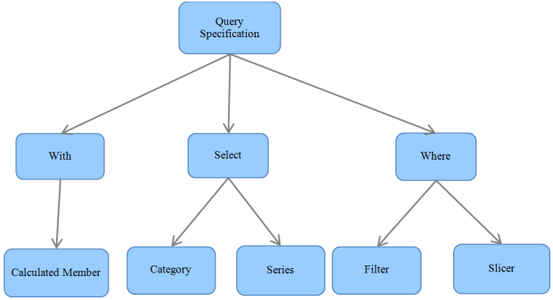

# QueryBuilderEngine in WPF OLAP Common

This class generates the query from the MDXQuerySpecification by invoking the GenerateQueryEx() static method of QueryBuilderEngineVersion3, the inner class of QueryBuilderEngine class.

## MDX query specification

MDXQuerySpecification is the base for query creation. The MDXQuerySpecification categorizes the element into three clauses as follows:

* With
* Select
* Where

The elements in the given report are iterated and stored according to the specification.

* The calculated member element in the given report will be added under the With clause.
* The categorical and series items in the given report’s categorical elements and series element will come under the Select category.
* The slicer and filter items will come under the Where category.

Based on the current report, the TogglePivot value and axis position of each item will be assigned before it is stored in the appropriate clauses.

 MDXQuerySpecification
 {:.caption}

After creating the query specification, the GenerateQueryEx() method of QueryBuilderEngine is called by passing the created MDXQuerySpecification to generate the query.

## Steps in query generation

To generate a query:

1. Get the query specification and iterate through the items in each category (With, Select and Where) of specification and separately store the column elements, row elements, filter elements, and slice elements.
2. The filter, slicer, and sort elements are moved to the appropriate axis based on their axis property.
3. Once the initial level categorizing of elements is completed, it starts creating a query string by writing using the With or Select category.
4. Now, it starts writing the query by checking each and every property.

By invoking the BuildAxisElements() method, the building query for the column axis elements and row axis elements are done.

### The helper methods for the BuildAxisElements() are:

* BuildAxisItems.
* BuildDimensionElement.
* If no level is specified, the GetDefaultLevel() method will be called else the BuildHierarchyElement() will be called.
* BuildLevelElements.
* If the level member count is greater than zero, the BuildMemberElement() will be called else the GetDefaultLevel() method will be called.

The BuildAxisElements() will build the query for the column element when you pass the column items and will generate the query for the row elements when the row items is passed as an argument. The BuildAxisElements() method will return a Boolean value which represents whether the KPI element is existing in the given item list or not. Based on that return, the value of the KPI Element axis is fixed.

Upto this, the select section of the query was built. Now, the from section starts by invoking the BuildFilterCondition() method.

### The helper method for the BuildFilterCondition() is given below:

1. The BuildFilterElements() method iterates through the elements and appends the parent details and child member details in the query based on the axis either in a row or a column.
2. Now, it comes to the Where section, by invoking the BuildSlicerElements() method.
3. Then, the BuildSlicerItem is invoked. This method checks whether the given item is dimension or measure or KPI or NamedSet or level and based on this, the appropriate query part will be appended with the query.

Finally, the cell properties will append with the created query and the query string will be returned to the OlapDataManager. By using the newly generated query, the OlapDataManager invokes the ExecuteCellSet of DataProvide, which will return the CellSet.

This CellSet can be used to create the PivotEngine, which will give the input to the controls.

