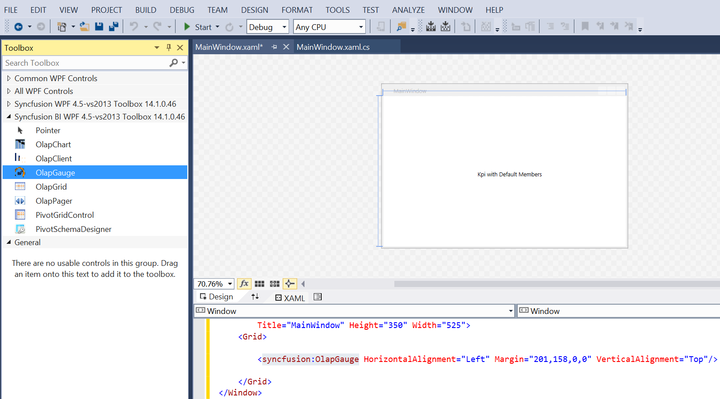
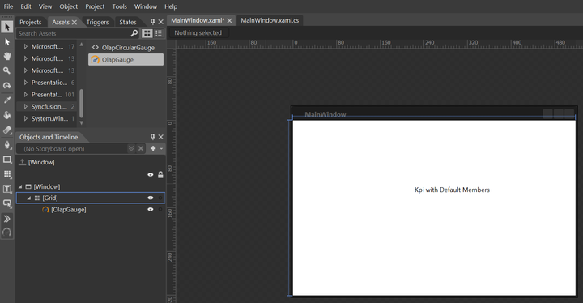

# Getting Started

>**Important**
Starting with v16.2.0.x, if you refer to Syncfusion assemblies from trial setup or from the NuGet feed, include a license key in your projects. Refer to this [link](https://help.syncfusion.com/common/essential-studio/licensing/license-key) to learn about registering Syncfusion license key in your WPF application to use the components.

This section covers the information required to create a simple OLAP gauge control bound to the OLAP data source.

## Control initialization

The OLAP gauge control can be initialized and added to an application through the following ways:

* Through Visual Studio
* Through Expression Blend
* Through code-behind

### Adding control through Visual Studio

1. Open Visual Studio IDE and go to File > New > Project > WPF Application inside the Visual C# Templates to create a new WPF application.

2. Select the toolbox option from the view menu. It will appear inside the Visual Studio IDE. 

3. From the toolbox, select the OLAP gauge control under “Syncfusion BI WPF” group, and then drag it to the designer section of the MainPage.xaml file.

4. Then, name the added OLAP gauge control as “OlapGauge1” in MainPage.xaml to refer it in code-behind as follows:





<syncfusion:OlapGauge x:Name="OlapGauge1"/>





#### OLAP report and OLAP data manager declaration

Include the following namespaces in the code-behind for using the OlapReport and OlapDataManger in the application.

* Syncfusion.Olap.Reports
* Syncfusion.Olap.Manager





using Syncfusion.Olap.Manager;
using Syncfusion.Olap.Reports;
using System.Windows;

namespace OlapGaugeApp
{
    /// 

    /// Interaction logic for MainWindow.xaml
    /// 

    public partial class MainWindow : Window
    {
        public MainWindow()
        {
            InitializeComponent();
            var olapDataManager = new OlapDataManager("Data Source=http://bi.syncfusion.com/olap/msmdpump.dll; Initial Catalog=Adventure Works DW 2008 SE;");
            olapDataManager.SetCurrentReport(CreateOlapReport());
            this.OlapGauge1.OlapDataManager = olapDataManager;
        }

        /// 

        /// Defining OlapReport with Dimension and Measure
        /// 

        private OlapReport CreateOlapReport()
        {
            OlapReport report = new OlapReport();
            report.CurrentCubeName = "Adventure Works";

            KpiElements kpiElement = new KpiElements();
            kpiElement.Elements.Add(new KpiElement { Name = "Revenue", ShowKPIGoal = true, ShowKPIStatus = true, ShowKPIValue = true, ShowKPITrend = true });

            DimensionElement dimensionElement1 = new DimensionElement();
            DimensionElement dimensionElement2 = new DimensionElement();
            DimensionElement dimensionElement3 = new DimensionElement();

            dimensionElement1.Name = "Date";
            dimensionElement1.AddLevel("Fiscal Year", "Fiscal Year");

            dimensionElement2.Name = "Sales Channel";
            dimensionElement2.AddLevel("Sales Channel", "Sales Channel");
            dimensionElement2.Hierarchy.LevelElements["Sales Channel"].Add("Reseller");
            dimensionElement2.Hierarchy.LevelElements["Sales Channel"].IncludeAvailableMembers = true;

            dimensionElement3.Name = "Product";
            dimensionElement3.AddLevel("Product Model Lines", "Product Line");
            dimensionElement3.Hierarchy.LevelElements["Product Line"].Add("Road");
            dimensionElement3.Hierarchy.LevelElements["Product Line"].IncludeAvailableMembers = true;

            report.CategoricalElements.Add(new Item { ElementValue = dimensionElement2 });
            report.CategoricalElements.Add(new Item { ElementValue = dimensionElement1 });
            report.CategoricalElements.Add(new Item { ElementValue = kpiElement });
            report.SeriesElements.Add(new Item { ElementValue = dimensionElement3 });
            return report;
        }
    }
}





Imports Syncfusion.Olap.Manager
Imports Syncfusion.Olap.Reports
Imports System.Windows

Namespace OlapGaugeApp
	''' 

	''' Interaction logic for MainWindow.xaml
	''' 

	Partial Public Class MainWindow
		Inherits Window
		Public Sub New()
			InitializeComponent()
			Dim olapDataManager = New OlapDataManager("Data Source=http://bi.syncfusion.com/olap/msmdpump.dll; Initial Catalog=Adventure Works DW 2008 SE;")
			olapDataManager.SetCurrentReport(CreateOlapReport())
			Me.OlapGauge1.OlapDataManager = olapDataManager
		End Sub

		''' 

		''' Defining OlapReport with Dimension and Measure
		''' 

		Private Function CreateOlapReport() As OlapReport
			Dim report As New OlapReport()
			report.CurrentCubeName = "Adventure Works"

			Dim kpiElement As New KpiElements()
			kpiElement.Elements.Add(New KpiElement With {.Name = "Revenue", .ShowKPIGoal = True, .ShowKPIStatus = True, .ShowKPIValue = True, .ShowKPITrend = True})

			Dim dimensionElement1 As New DimensionElement()
			Dim dimensionElement2 As New DimensionElement()
			Dim dimensionElement3 As New DimensionElement()

			dimensionElement1.Name = "Date"
			dimensionElement1.AddLevel("Fiscal Year", "Fiscal Year")

			dimensionElement2.Name = "Sales Channel"
			dimensionElement2.AddLevel("Sales Channel", "Sales Channel")
			dimensionElement2.Hierarchy.LevelElements("Sales Channel").Add("Reseller")
			dimensionElement2.Hierarchy.LevelElements("Sales Channel").IncludeAvailableMembers = True

			dimensionElement3.Name = "Product"
			dimensionElement3.AddLevel("Product Model Lines", "Product Line")
			dimensionElement3.Hierarchy.LevelElements("Product Line").Add("Road")
			dimensionElement3.Hierarchy.LevelElements("Product Line").IncludeAvailableMembers = True

			report.CategoricalElements.Add(New Item With {.ElementValue = dimensionElement2})
			report.CategoricalElements.Add(New Item With {.ElementValue = dimensionElement1})
			report.CategoricalElements.Add(New Item With {.ElementValue = kpiElement})
			report.SeriesElements.Add(New Item With {.ElementValue = dimensionElement3})
			Return report
		End Function
	End Class
End Namespace





### Adding control through Expression Blend

1. Open Blend for Visual Studio IDE and navigate to File > New project > WPF > WPF Application to create a new WPF application.

2. Select the **Project** tab available in the left corner of the Blend IDE and right-click **References** to select **Add Reference**. 

3. Then, browse the following assemblies and add it to the project.

* Syncfusion.Gauge.WPF
* Syncfusion.Core
* Syncfusion.Olap.Base
* Syncfusion.OlapGauge.WPF
* Syncfusion.OlapShared.WPF
* Syncfusion.Shared.WPF

N> You can find these libraries under the following location:

{Installed Drive}:\Program Files (x86)\Syncfusion\Essential Studio\&lt;version number&gt;\precompiledassemblies\&lt;version number&gt;\&lt;framework version&gt;\

On adding the above assemblies, the OLAP gauge control will be added under the **Assets** tab automatically.

4. Now, choose the **Assets** tab and drag the OLAP gauge control to the designer.

5. Then, name the added OLAP gauge control as "OlapGauge1" in MainPage.xaml to refer it in code-behind as follows:





<syncfusion:OlapGauge x:Name="OlapGauge1"/>





To add the OlapReport and OlapDataManger in the application, refer to the [OlapReport and OlapDataManager declaration](#olapreport-and-olapdatamanager-declaration) section.

### Adding control through code-behind

1. Open Visual Studio IDE and navigate to File > New > Project > WPF Application inside the Visual C# Templates to create a new WPF application.

2. To add the dependency assemblies within the application, right-click the **References** and select **Add Reference**.

3. Add the following Syncfusion assemblies manually to the project from the installed location.

* Syncfusion.Gauge.WPF
* Syncfusion.Core
* Syncfusion.Olap.Base
* Syncfusion.OlapGauge.WPF
* Syncfusion.OlapShared.WPF
* Syncfusion.Shared.WPF

N> You can find these libraries under the following location:

{Installed Drive}:\Program Files (x86)\Syncfusion\Essential Studio\&lt;version number&gt;\precompiledassemblies\&lt;version number&gt;\&lt;framework version&gt;

4. Then, name the grid in MainWindow.xaml as "RootGrid" as specified below.





<Grid x:Name="RootGrid"/>





5. Include the following namespaces in code-behind for using OlapGauge, OlapReport, and OlapDataManger in the application.

* Syncfusion.Olap.Reports
* Syncfusion.Olap.Manager
* Syncfusion.Windows.Gauge.Olap





using System.Windows;
using Syncfusion.Olap.Manager;
using Syncfusion.Olap.Reports;
using Syncfusion.Windows.Gauge.Olap;

namespace OlapGaugeApp
{
    /// 

    /// Interaction logic for MainWindow.xaml
    /// 

    public partial class MainWindow : Window
    {
        public MainWindow()
        {
            InitializeComponent();
            var olapGauge = new OlapGauge();
            var olapDataManager = new OlapDataManager("Data Source=http://bi.syncfusion.com/olap/msmdpump.dll; Initial Catalog=Adventure Works DW 2008 SE;");
            olapDataManager.SetCurrentReport(CreateOlapReport());
            olapGauge.OlapDataManager = olapDataManager;
            this.RootGrid.Children.Add(olapGauge);
        }

        /// 

        /// Defining OlapReport with Dimension and Measure
        /// 

        private OlapReport CreateOlapReport()
        {
            OlapReport report = new OlapReport();
            report.CurrentCubeName = "Adventure Works";

            KpiElements kpiElement = new KpiElements();
            kpiElement.Elements.Add(new KpiElement { Name = "Revenue", ShowKPIGoal = true, ShowKPIStatus = true, ShowKPIValue = true, ShowKPITrend = true });

            DimensionElement dimensionElement1 = new DimensionElement();
            DimensionElement dimensionElement2 = new DimensionElement();
            DimensionElement dimensionElement3 = new DimensionElement();

            dimensionElement1.Name = "Date";
            dimensionElement1.AddLevel("Fiscal Year", "Fiscal Year");

            dimensionElement2.Name = "Sales Channel";
            dimensionElement2.AddLevel("Sales Channel", "Sales Channel");
            dimensionElement2.Hierarchy.LevelElements["Sales Channel"].Add("Reseller");
            dimensionElement2.Hierarchy.LevelElements["Sales Channel"].IncludeAvailableMembers = true;

            dimensionElement3.Name = "Product";
            dimensionElement3.AddLevel("Product Model Lines", "Product Line");
            dimensionElement3.Hierarchy.LevelElements["Product Line"].Add("Road");
            dimensionElement3.Hierarchy.LevelElements["Product Line"].IncludeAvailableMembers = true;

            report.CategoricalElements.Add(new Item { ElementValue = dimensionElement2 });
            report.CategoricalElements.Add(new Item { ElementValue = dimensionElement1 });
            report.CategoricalElements.Add(new Item { ElementValue = kpiElement });
            report.SeriesElements.Add(new Item { ElementValue = dimensionElement3 });
            return report;
        }
    }
}





Imports System.Windows
Imports Syncfusion.Olap.Manager
Imports Syncfusion.Olap.Reports
Imports Syncfusion.Windows.Gauge.Olap

Namespace OlapGaugeApp
	''' 

	''' Interaction logic for MainWindow.xaml
	''' 

	Partial Public Class MainWindow
		Inherits Window
		Public Sub New()
			InitializeComponent()
			Dim olapGauge = New OlapGauge()
			Dim olapDataManager = New OlapDataManager("Data Source=http://bi.syncfusion.com/olap/msmdpump.dll; Initial Catalog=Adventure Works DW 2008 SE;")
			olapDataManager.SetCurrentReport(CreateOlapReport())
			olapGauge.OlapDataManager = olapDataManager
			Me.RootGrid.Children.Add(olapGauge)
		End Sub

		''' 

		''' Defining OlapReport with Dimension and Measure
		''' 

		Private Function CreateOlapReport() As OlapReport
			Dim report As New OlapReport()
			report.CurrentCubeName = "Adventure Works"

			Dim kpiElement As New KpiElements()
			kpiElement.Elements.Add(New KpiElement With {.Name = "Revenue", .ShowKPIGoal = True, .ShowKPIStatus = True, .ShowKPIValue = True, .ShowKPITrend = True})

			Dim dimensionElement1 As New DimensionElement()
			Dim dimensionElement2 As New DimensionElement()
			Dim dimensionElement3 As New DimensionElement()

			dimensionElement1.Name = "Date"
			dimensionElement1.AddLevel("Fiscal Year", "Fiscal Year")

			dimensionElement2.Name = "Sales Channel"
			dimensionElement2.AddLevel("Sales Channel", "Sales Channel")
			dimensionElement2.Hierarchy.LevelElements("Sales Channel").Add("Reseller")
			dimensionElement2.Hierarchy.LevelElements("Sales Channel").IncludeAvailableMembers = True

			dimensionElement3.Name = "Product"
			dimensionElement3.AddLevel("Product Model Lines", "Product Line")
			dimensionElement3.Hierarchy.LevelElements("Product Line").Add("Road")
			dimensionElement3.Hierarchy.LevelElements("Product Line").IncludeAvailableMembers = True

			report.CategoricalElements.Add(New Item With {.ElementValue = dimensionElement2})
			report.CategoricalElements.Add(New Item With {.ElementValue = dimensionElement1})
			report.CategoricalElements.Add(New Item With {.ElementValue = kpiElement})
			report.SeriesElements.Add(New Item With {.ElementValue = dimensionElement3})
			Return report
		End Function
	End Class
End Namespace





Finally, run the application. The OLAP gauge control is rendered as follows.

