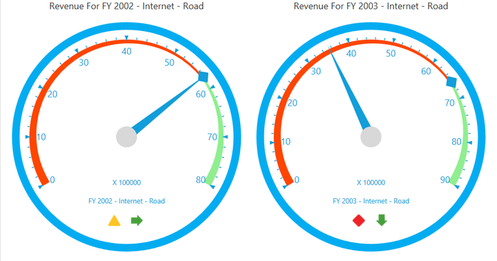

# KPI in WPF Olap Gauge

The OLAP gauge supports displaying Key Performance Indicators (KPI) from the OLAP cube. KPI value is represented with the help of _Pointers_ and KPI goal is represented with the help of _Markers_. The KPI status and KPI trend values are represented through user friendly images such as traffic light, road signs, and standard arrow in the OLAP gauge of WPF. Each gauge represents a member against one KPI combination.

A sample demo is available at the following location.

{system drive}:\Users\\{User Name}\AppData\Local\Syncfusion\EssentialStudio\\{Version Number}\WPF\OlapGauge.WPF\Samples\Product ShowCase\KPI\
