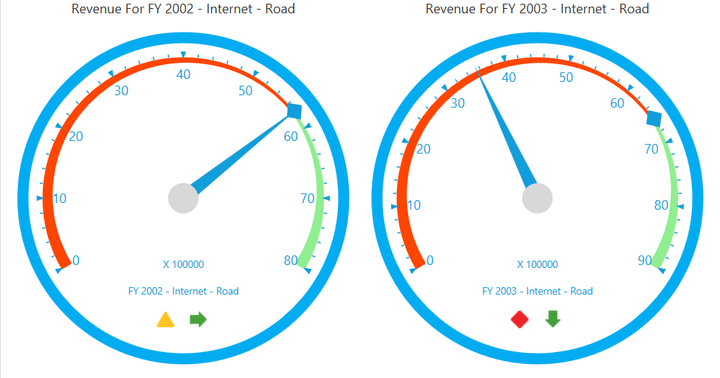

# KPI in WPF OLAP Gauge

The OLAP gauge supports displaying Key Performance Indicators (KPIs) from an OLAP cube. The KPI value is represented using pointers, while the KPI goal is represented using markers. The KPI status and trend values are represented in the WPF OLAP Gauge using user-friendly images, such as traffic lights, road signs, and standard arrows. Each gauge represents a member associated with a single KPI combination.

A sample demo is available at the following location.

{system drive}:\Users\\{User Name}\AppData\Local\Syncfusion\EssentialStudio\\{Version Number}\WPF\OlapGauge.WPF\Samples\Product ShowCase\KPI\
